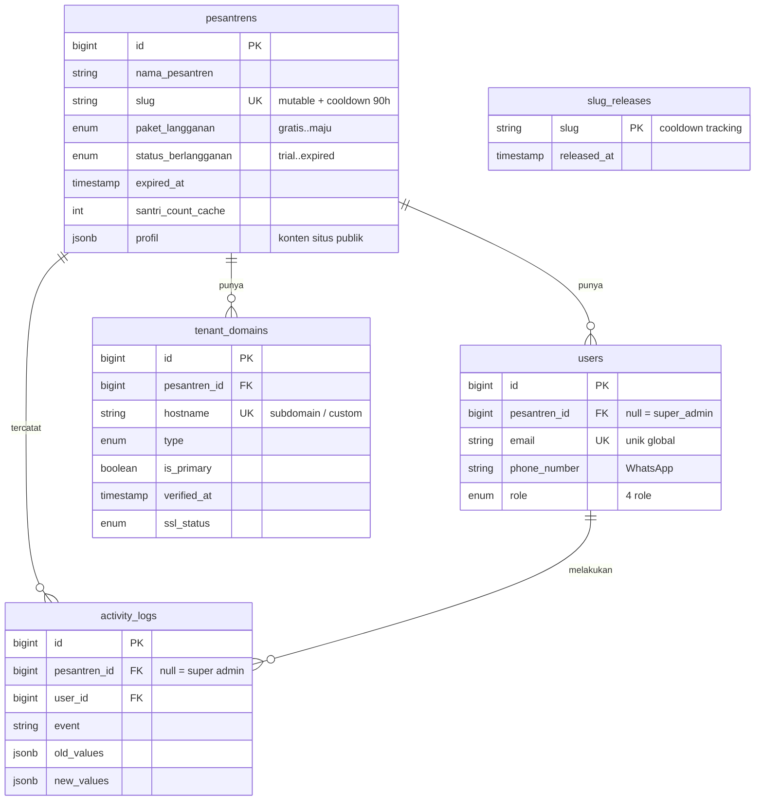

# PRODUCT REQUIREMENTS DOCUMENT (PRD)

**Project:** Walisantri.com (v1.0) — B2B Multi-Tenant SaaS (Hybrid: single-DB sekarang, schema/DB-per-tenant ready)
**Stack:** Laravel 13.11.1 (PHP 8.3+), Filament v5.6.3, Livewire v3, TailwindCSS, PostgreSQL 17, Redis, Cloudflare R2
**Dev/Deploy:** Laravel Herd (macOS) · GitHub Actions → VPS via SSH (deploy host-langsung, tanpa kontainer)
**Interface:** Mobile-first (Wali Santri), desktop-optimized (Admin/Ustadz)
**Last Updated:** Juni 2026 — v4.5

**Changelog v4.5:** Modul **Akademik Formal** — entitas baru `mata_pelajaran` (kelas + ustadz pengampu tetap, master data `admin_pesantren`) dan `nilai_akademik` (nilai tunggal per santri/mapel/periode, input `admin_pesantren` + `ustadz` pengampu, unique `(santri_id, mata_pelajaran_id, tahun_ajaran, periode)`); halaman **Rapor Akademik** agregasi nilai per santri dengan ekspor PDF (reuse `barryvdh/laravel-dompdf`). Grup navigasi Filament **Akademik** baru — menggabungkan Mata Pelajaran, Nilai Akademik, Rapor Akademik dengan 3 resource Tahfidz yang dipindah dari grup Kesantrian (selaras nama modul §3.2 & §5.1). Tersedia di semua paket termasuk Gratis (gate `access-modul-akademik` sudah ada sejak v4.x). Closes gap landing page yang sejak awal menjanjikan modul ini (lihat §22 — "akademik formal" kini bukan lagi item ditunda).

**Changelog v4.4:** Modul **SPP** (Sumbangan Pembinaan Pendidikan) — tagihan bulanan manual per santri, rekening bank pesantren disimpan di `profil` jsonb, konfirmasi transfer oleh wali (upload foto bukti → status `menunggu_konfirmasi`), verifikasi & tandai lunas oleh admin, notifikasi tunggakan di dashboard wali; tabel `tagihan_spp` + `pembayaran_spp` (tenant/). Modul **Prestasi Santri** — CRUD prestasi (judul, kategori, tingkat, posisi, tanggal, penyelenggara, sertifikat) dengan enum `TingkatPrestasi` (internal/kabupaten/provinsi/nasional/internasional); tabel `prestasi_santri` (tenant/); tampil di portal wali pada halaman detail santri. **Demo Request / Waiting List** — halaman `/demo` di landing page (form waiting list: nama pesantren, kontak, email, HP, jumlah santri, kota, catatan); tabel `demo_requests` (central/); `DemoRequestResource` di Filament hanya `super_admin` (list, view, tandai dihubungi). Grup navigasi **Keuangan** baru di panel Filament.

**Changelog v4.3:** `kelas` & `kamar` diangkat menjadi entitas master (tabel `kelas`, `kamar` per-tenant; kolom string di `santri` migrasi ke FK) · Resource Filament CRUD Kelas & Kamar hanya `admin_pesantren` · grup navigasi "Santri" berisi Santri, Kelas, Kamar · aturan bisnis baru: ustadz hanya bisa membimbing **maks 20 santri aktif** (validasi di form + query scope) · kebijakan **harga tahunan: bayar 10 bulan, aktif 12 bulan** (enum `DurasiLangganan` + `BillingCalculatorService`) · portal wali sudah selesai MVP: dashboard (sapaan + daftar santri + pengumuman), statistik tahfidz, statistik kesehatan, detail mutaba'ah harian per santri · billing upgrade flow selesai (pilih paket, invoice, konfirmasi admin).

**Changelog v4.2:** Super Admin dikonsolidasikan ke `app.walisantri.com/admin` — `dash.walisantri.com` & `DashPanelProvider` dihapus · satu panel Filament untuk semua role (`admin`, `admin_pesantren`, `ustadz`), visibilitas menu dikontrol `canAccess()`/`canView()` per role · widget Dashboard Central (SystemStatsWidget, ExpiringTenantsWidget, TenantListWidget) pindah ke admin panel dengan `canView()` hanya `super_admin` · IP-whitelist Nginx dialihkan ke path `/admin` di `app` · route `/admin/login` (Filament bawaan) dihapus — semua role wajib lewat `/login` terpusat (branded, `?tenant={slug}`) via `FilamentAuthenticate` middleware.

**Changelog v4.1:** Model deploy difinalkan ke **host-langsung** (bukan kontainer) demi efisiensi resource VPS 4GB — Coolify & Docker ditolak (overhead idle) · **§6.6 baru** observability ringan no-Coolify (`LOG_CHANNEL=daily` + Sentry, UptimeRobot, GoAccess on-demand, htop/ncdu, Laravel Pulse opsional) · Docker Compose dicatat di §22 sebagai keputusan tertunda dengan pemicu eksplisit.

**Changelog v4.0:** Login terpusat di `app.walisantri.com` (tenant di-resolve dari akun) · subdomain `{slug}.walisantri.com` jadi **website profil publik** (slug mutable) · custom domain di roadmap · hybrid tenancy · **PostgreSQL 17** (RLS native + pgvector untuk AI) · Cloudflare R2 · CI/CD GitHub Actions. *(v3.0: Filament v5, path-based routing, Dashboard Central. v2.0: row-level security, RBAC 4 role, modul Tahfidz & Kesantrian.)*

---

# Product Vision Statement

**Visi:** Menjadi standar digitalisasi pesantren Indonesia — platform pengasuhan & akademik terlengkap, terjangkau, dan dipercaya oleh setiap lembaga, dari rintisan hingga besar.

**Tagline:** Memberi setiap pesantren — berapapun ukurannya — kemampuan membuktikan kualitas pengasuhannya secara transparan, terukur, dan real-time.

| Pilar | Maksud | Implikasi Produk |
|---|---|---|
| Terlengkap | Satu platform: akademik, pengasuhan, kesehatan, inventaris, komunikasi | Tidak perlu sistem lain di samping Walisantri |
| Terjangkau | Mulai Rp 150.000/bulan | Paket Rintisan fungsional penuh, bukan fitur terpotong |
| Dipercaya | Data aman, terisolasi per lembaga, akuntabel | Isolasi tenant & audit log = fondasi, bukan fitur tambahan |

**Filter keputusan fitur** (jika >1 jawaban "tidak" → antrian rendah/ditolak): (1) Meningkatkan kredibilitas/akuntabilitas pesantren? (2) Bisa dirasakan paket Rintisan? (3) Mendekatkan ke posisi standar digitalisasi pesantren?

---

# 1. Architectural Foundation & Tenant Isolation

## 1.1 Row-Level Multi-Tenancy

Setiap tabel operasional wajib punya kolom `pesantren_id` (FK). Trait `Multitenantable` menyuntik `WHERE pesantren_id = auth()->user()->pesantren_id` otomatis pada SELECT/UPDATE/DELETE — kecuali `super_admin`. Model pakai PHP 8.3 Attributes:

```php
#[Table('santri')]
#[Fillable(['pesantren_id', 'wali_santri_id', 'uuid', 'nis', 'nama_lengkap', 'kelas_id', 'kamar_id', 'status_aktif'])]
class Santri extends Model {
    use Multitenantable, HasUuids, SoftDeletes;
    public function uniqueIds(): array { return ['uuid']; } // batasi HasUuids hanya ke kolom uuid
}
```

> **PostgreSQL RLS (lapisan kedua):** selain Global Scope di aplikasi, PostgreSQL Row-Level Security dapat menegakkan isolasi di level database — `ENABLE ROW LEVEL SECURITY` + policy `pesantren_id = current_setting('app.current_pesantren')::bigint`. Konteks tenant di-set per request via `SET app.current_pesantren` (dari sesi login di `app`, lihat §1.3–1.4). Defense-in-depth: jika scope aplikasi bocor, DB tetap memblokir. Aktifkan setelah trait stabil; Super Admin pakai role `BYPASSRLS`.

## 1.2 Hybrid Tenancy Strategy

- **DB Central** (`walisantri_central`, koneksi `central`): tabel `pesantrens`, `users`, `tenant_domains`, `activity_logs` — untuk autentikasi, lookup tenant dari akun, dan resolusi host publik.
- **DB Tenant** (koneksi `tenant`; saat ini single shared DB, roadmap schema-per-tenant): semua data operasional.
- `Multitenantable` Global Scope (+ RLS opsional) tetap aktif sebagai lapisan keamanan kedua selama single DB.
- Migrasi dipisah: `database/migrations/central/` & `database/migrations/tenant/`.
- `tenancy.mode` di `.env`: `single_database` (default MVP) atau `per_schema` (roadmap — schema-per-tenant native PostgreSQL via `SET search_path`).

## 1.3 Host Model, Login Terpusat & Resolusi Tenant

Empat jenis host dengan peran berbeda:

| Host | Sifat | Fungsi |
|---|---|---|
| `walisantri.com` | Publik | Landing + `/register` |
| `{slug}.walisantri.com` | Publik, tanpa auth (cacheable) | **Website profil pesantren** — subdomain **mutable** |
| `app.walisantri.com` | Terautentikasi | Login tunggal semua role → panel admin/ustadz/super_admin & portal wali |

**Login terpusat:** Semua role login di `app.walisantri.com` (satu host tetap). Tenant **di-resolve dari akun**, bukan dari host: lookup `users` by email → ambil `pesantren_id` → set konteks tenant (`app()->instance('current_pesantren', …)` + `SET app.current_pesantren` untuk RLS). Sejalan dengan model multi-tenancy native Filament v5 (satu panel, tenant dari user).

**Pintu masuk & branding wali:** Wali santri masuk **dari situs profil pesantren** — tombol "Portal Wali Santri" di `{slug}.walisantri.com` mengarah ke `app.walisantri.com/login?tenant={slug}`. Halaman login membaca `tenant` dari query dan **dirender penuh ber-brand pesantren** (logo, nama, warna) sehingga terasa seperti gerbang pesantren itu, bukan platform generik — meski host auth tetap `app`. Ini memberi keterikatan brand tanpa menduplikasi mekanisme auth atau mengikat sesi ke subdomain yang bisa berubah. **Magic Link WhatsApp (§4.3) tetap jalur utama wali** (klik langsung masuk read-only); form login adalah jalur sekunder bagi wali yang menyetel password. Tombol login admin/ustadz juga memakai `?tenant={slug}` agar branding konsisten.

> **Email unik global (keputusan sadar):** karena tenant di-resolve dari email, satu email tidak bisa dipakai di dua pesantren. Untuk MVP ini diterima — kasus wali dengan anak di pesantren berbeda memakai email sama tidak didukung. "Multi-Anak Logic" (§4.1) tetap jalan selama anak-anak di pesantren yang sama.

**Dua mode TenantResolver:**
- *Host publik* (`{slug}.walisantri.com` / custom domain): `PublicTenantResolver` cocokkan `$request->getHost()` ke tabel `tenant_domains` → `pesantren_id`. Read-only, hanya untuk render situs profil — **tidak pernah** mengakses data operasional santri.
- *App* (`app.walisantri.com`): konteks tenant dari sesi login. Host tidak dipakai untuk resolusi.

## 1.4 Website Profil Pesantren

Tiap pesantren **otomatis** mendapat situs profil publik di `{slug}.walisantri.com` segera setelah registrasi. MVP: template minimal (logo, deskripsi, alamat, kontak, galeri, feed pengumuman publik), dikelola dari panel admin. CMS/page-builder penuh = post-v1.0. Pemisahan ketat: situs publik tidak boleh membaca data santri.

**Slug rules:** huruf kecil/angka/tanda hubung, 3–30 char, tidak diawali/diakhiri hubung. Validasi real-time via `GET /check-slug/{slug}`. **Mutable** — bisa diubah kapanpun dari panel admin (aman karena tidak ada auth/magic-link yang bergantung pada subdomain; identitas kanonik = `pesantrens.id`). Tiap perubahan kena validasi reserved/format + dicatat audit (`pesantren.slug_changed`). Slug lama masuk **cooldown 90 hari** sebelum bisa diklaim tenant lain (cegah pembajakan brand). Reserved (Rule `SlugNotReserved`): `www app api admin central dash mail billing status docs blog support panel dashboard static cdn`.

**Custom domain (roadmap, add-on Maju):** pesantren pakai domain sendiri (mis. `www.pesantrenfulan.sch.id`). Butuh verifikasi kepemilikan DNS (CNAME/TXT) + SSL otomatis per domain (di luar wildcard `*.walisantri.com`). **Default: Cloudflare for SaaS / Custom Hostnames** (gratis ≤100 hostname, lalu berbayar per hostname; cert otomatis, ops paling ringan). **Fallback: Caddy on-demand TLS** (gratis penuh, untuk volume besar; wajib endpoint "ask" agar cert hanya terbit untuk hostname terverifikasi di `tenant_domains`). Subdomain bawaan tetap pakai wildcard cert yang sudah ada.

## 1.5 Infrastruktur Wildcard

Subdomain profil baru aktif otomatis tanpa sentuh DNS/config:
- Wildcard SSL `*.walisantri.com` via Certbot + Cloudflare DNS-01.
- Satu A record Cloudflare `* → IP VPS`; `app` sebagai host tetap.
- Satu server block `server_name *.walisantri.com` (Nginx; atau Caddy bila custom domain diaktifkan).

## 1.6 Routing System

| Host | Path | Pengguna |
|---|---|---|
| `walisantri.com` | `/` · `/register` · `/check-slug/{slug}` | Landing · onboarding · API cek slug (JSON) |
| `{slug}.walisantri.com` (+ custom domain) | `/` · `/pengumuman` · … | Website profil publik (read-only, tanpa auth) |
| `app.walisantri.com` | `/login` · `/admin` | Login tunggal · panel Filament (Super Admin, Admin Pesantren, Ustadz) — menu per role via `canAccess()` |
| `app.walisantri.com` | `/wali/dashboard` · `/report/{uuid}` · `/billing` | Portal wali · Magic Link read-only · billing |

## 1.7 Pola Penambahan Modul

Kontrak resmi untuk menambah modul baru — ubah pola tersirat jadi checklist eksplisit agar konsistensi terjaga lintas sesi/waktu:

1. **Tabel tenant** dengan kolom `pesantren_id` (FK) wajib + kolom domain modul.
2. **Trait `Multitenantable`** pada model (Global Scope + auto-assign `pesantren_id` saat `creating`).
3. **Composite index** `(pesantren_id, [entity_id], [tanggal])` sesuai pola query; unique constraint per-tenant bila relevan.
4. **Migrasi** di `database/migrations/tenant/` (atau `central/` bila entitas lintas-tenant). Index bernama eksplisit (batas 63 char).
5. **Gate** `access-modul-{x}` di `AppServiceProvider` + satu baris di matriks tiering (§5.1) bila modul berbayar/terkunci paket.
6. **Resource Filament** di grup navigasi yang sesuai (§7), dengan `canView()`/policy mengikuti Gate.
7. **RLS policy** per tabel (bila RLS aktif) — pola sama: `pesantren_id = current_setting('app.current_pesantren')`.
8. **Test isolasi tenant** di `tests/TenantIsolation/` + unit test business logic; wajib lulus sebelum deploy.
9. **Event audit** `{modul}.{aksi}` di `activity_logs` bila modul mengubah data sensitif.
10. **Enum yang bisa tumbuh** (kategori yang mungkin bertambah/berbeda antar-pesantren) → buat tabel referensi `master_{x}` per-tenant, **bukan** CHECK constraint hardcoded. Enum tetap (mis. `A/B/C/D`) boleh hardcoded.

> *Pola ini mulus untuk modul **per-santri** (mengikuti bentuk `santri` + modul tahfidz/kesantrian). Modul yang **bukan per-santri** (keuangan, SDM, akademik formal) menyimpang dari pola dan memicu keputusan di §22 "Batas yang Diketahui".*

---

# 2. Actors, RBAC & Login Flow

**Satu pintu login:** `app.walisantri.com/login` — semua role. Tenant di-resolve dari akun (email unik global, §1.3).

Setelah autentikasi, middleware baca `role` → redirect:

| Role | Redirect | Akses |
|---|---|---|
| `super_admin` | `app.../admin` | Kelola semua tenant, billing, kuota (lintas tenant via `withoutGlobalScope` / role `BYPASSRLS`) |
| `admin_pesantren` | `app.../admin` | Kontrol penuh data lembaga, user, impor, pemetaan kelas/kamar, profil publik, billing |
| `ustadz` | `app.../admin` | Input presensi, mutaba'ah, tahfidz, rekam medis santri binaan |
| `wali_santri` | `app.../wali/dashboard` | Portal read-only perkembangan santri |

---

# 3. Core Database Schema

PostgreSQL 17, FK constraints ketat, composite index `(pesantren_id, [entity_id], [tanggal])`. Tipe enum diimplementasikan sebagai `CHECK` constraint via Laravel migration (atau native `CREATE TYPE` bila perlu).

## 3.0 ERD

ERD dipecah dua sesuai batas hybrid-tenancy. Atribut diringkas ke kolom kunci (PK/FK/UK + pembeda); daftar kolom/index/constraint lengkap ada di §3.1–3.2. FK `santri` (`pesantren_id`, `wali_santri_id`, `pembimbing_ustadz_id`) menunjuk tabel di DB Central — FK fisik di MVP single-DB, jadi referensi logis (enforce aplikasi) saat pindah ke schema-per-tenant.

**DB Central:**



**DB Tenant:**

```mermaid
erDiagram
  kelas ||--o{ santri : masuk
  kamar ||--o{ santri : tinggal
  santri ||--o{ tahfidz_progress : setoran
  santri ||--o{ tahfidz_ujian : ujian
  santri ||--o{ tahfidz_rapor : rapor
  kelas ||--o{ mata_pelajaran : memuat
  mata_pelajaran ||--o{ nilai_akademik : dinilai
  santri ||--o{ nilai_akademik : memperoleh
  santri ||--o{ kesantrian_mutabaah : amalan
  santri ||--o{ kesantrian_karakter_rapor : karakter
  santri ||--o{ kesantrian_kesehatan : medis
  santri ||--o{ kesantrian_inventaris : barang
  santri ||--o{ tagihan_spp : tagihan
  santri ||--o{ prestasi_santri : prestasi
  tagihan_spp ||--o{ pembayaran_spp : bayar
  kelas {
    bigint id PK
    bigint pesantren_id FK
    string nama_kelas UK "unik per pesantren"
  }
  kamar {
    bigint id PK
    bigint pesantren_id FK
    string nama_kamar UK "unik per pesantren"
  }
  santri {
    bigint id PK
    bigint pesantren_id FK "ke central"
    bigint wali_santri_id FK "ke users"
    bigint pembimbing_ustadz_id FK "ke users"
    bigint kelas_id FK "ke kelas"
    bigint kamar_id FK "ke kamar"
    uuid uuid UK "token Magic Link"
    string nis "unik per pesantren"
    string nama_lengkap
    boolean status_aktif
    timestamp deleted_at "SoftDeletes"
  }
  tahfidz_progress {
    bigint santri_id FK
    bigint ustadz_id FK
    date tanggal
    enum tipe_setoran "Sabaq/Sabqi/Manzil"
    enum nilai_kelancaran "Mumtaz..Maqbul"
  }
  tahfidz_ujian {
    bigint santri_id FK
    bigint penguji_id FK
    date tanggal_ujian
    enum target_juz
    enum status_kelulusan "Lulus/Mengulang"
  }
  tahfidz_rapor {
    bigint santri_id FK
    string tahun_ajaran
    enum periode "Bulanan/Semester"
    enum nilai_tilawah "A/B/C/D"
  }
  mata_pelajaran {
    bigint id PK
    bigint pesantren_id FK
    bigint kelas_id FK "ke kelas"
    bigint ustadz_id FK "ke users — pengampu tetap"
    string nama_mapel
  }
  nilai_akademik {
    bigint id PK
    bigint pesantren_id FK
    bigint santri_id FK
    bigint mata_pelajaran_id FK
    string tahun_ajaran
    enum periode "Bulanan/Semester_Ganjil/Semester_Genap"
    smallint nilai "0-100"
  }
  kesantrian_mutabaah {
    bigint santri_id FK
    date tanggal
    smallint jamaah_5_waktu
    boolean is_rawatib
    enum status_udzur "Tidak/Sakit/Haid.."
  }
  kesantrian_karakter_rapor {
    bigint santri_id FK
    date tanggal_input
    enum adab "7 kolom A/B/C/D"
    enum kepribadian "9 kolom A/B/C/D"
    text log_kasus_khusus
  }
  kesantrian_kesehatan {
    bigint santri_id FK
    date tanggal_periksa
    enum kategori_keluhan
    enum status_pemulihan "auto-udzur"
  }
  kesantrian_inventaris {
    bigint santri_id FK
    string kode_unik_fisik UK
    smallint kuota_regulasi_maksimal
    enum kondisi_barang "Baik/Rusak/Hilang"
  }
  tagihan_spp {
    bigint id PK
    bigint pesantren_id FK
    bigint santri_id FK
    tinyint bulan "1–12"
    smallint tahun
    int nominal "rupiah"
    date jatuh_tempo
    enum status "belum_bayar/menunggu_konfirmasi/lunas"
    string bukti_transfer "path file"
    timestamp dikonfirmasi_wali_at
  }
  pembayaran_spp {
    bigint id PK
    bigint pesantren_id FK
    bigint tagihan_spp_id FK
    int jumlah
    date tanggal_bayar
    string metode_bayar "tunai/transfer_bank/lainnya"
    bigint dicatat_oleh "FK logis ke users"
  }
  prestasi_santri {
    bigint id PK
    bigint pesantren_id FK
    bigint santri_id FK
    string judul
    string kategori
    enum tingkat "internal..internasional"
    string posisi
    date tanggal
    string penyelenggara
    string dokumen "path sertifikat"
  }
  master_pengumuman {
    bigint id PK
    bigint pesantren_id FK "scoped, bukan per-santri"
    string judul_maklumat
    text isi_maklumat
    enum target_audience "admin/wali/semua — filter visibilitas (panel & situs publik)"
  }
```



## 3.1 DB Central

**`pesantrens`** — `id` PK · `nama_pesantren` · `slug` (unique, **mutable** + cooldown 90 hari, sumber subdomain default) · `paket_langganan` enum(`gratis`/`rintisan`/`berkembang`/`maju`) · `max_santri_kuota` int · `status_berlangganan` enum(`trial`/`active`/`suspended`/`expired`) · `expired_at` ts null · `santri_count_cache` int default 0 · `onboarding_completed_steps` jsonb null · `profil` jsonb null (konten situs publik: deskripsi, alamat, kontak, galeri) · timestamps. *Index: `(status_berlangganan, expired_at)`.*

**`users`** — `id` PK · `pesantren_id` FK null (null = Super Admin) · `name` · `email` unique (global) · `phone_number` null (WhatsApp) · `password` · `role` enum(`super_admin`/`admin_pesantren`/`ustadz`/`wali_santri`) · `remember_token` · timestamps. *Index: `(pesantren_id, role)`.*

**`tenant_domains`** — `id` PK · `pesantren_id` FK · `hostname` unique (mis. `al-hidayah.walisantri.com` atau `www.pesantrenfulan.sch.id`) · `type` enum(`subdomain`/`custom`) · `is_primary` bool · `verified_at` ts null · `ssl_status` enum(`pending`/`active`/`failed`) · timestamps. *Sumber kebenaran resolusi host publik (`PublicTenantResolver`). MVP: baris `type=subdomain` diisi otomatis saat registrasi/ubah slug; baris `custom` tidur sampai fitur custom domain aktif.* · `slug_releases` (cooldown): `slug` · `released_at` — cek di validasi sebelum slug bisa diklaim ulang.

**`demo_requests`** — `id` PK · `nama_pesantren` · `nama_kontak` · `email` · `no_hp` · `jumlah_santri` null · `kota` null · `catatan` text null · `contacted_at` ts null (diisi admin saat pesantren dihubungi) · timestamps. *Tabel central, diisi dari halaman `/demo` di landing page; dikelola `DemoRequestResource` hanya `super_admin`.*

## 3.2 DB Tenant

**`kelas`** — `id` PK · `pesantren_id` FK cascadeOnDelete · `nama_kelas` string · timestamps. *Unique: `(pesantren_id, nama_kelas)`.* Hanya `admin_pesantren` yang bisa CRUD.

**`kamar`** — `id` PK · `pesantren_id` FK cascadeOnDelete · `nama_kamar` string · timestamps. *Unique: `(pesantren_id, nama_kamar)`.* Hanya `admin_pesantren` yang bisa CRUD.

**`santri`** — `id` PK · `pesantren_id` FK cascadeOnDelete · `wali_santri_id` FK→users restrictOnDelete · `pembimbing_ustadz_id` FK→users restrictOnDelete · `kelas_id` FK→kelas nullOnDelete · `kamar_id` FK→kamar nullOnDelete · `uuid` unique (token Magic Link) · `nis` (unique per pesantren) · `nama_lengkap` · `status_aktif` bool default true · `deleted_at` (SoftDeletes) · timestamps. *Index: `(pesantren_id, status_aktif)`, `(pesantren_id, kamar_id)`, `(pesantren_id, kelas_id)`; Unique: `(pesantren_id, nis)`.* Kolom `kelas`/`kamar` string dihapus (migrasi ke FK di v4.3).

### Modul Akademik & Tahfidz

**`tahfidz_progress`** — FK `pesantren_id`/`santri_id`/`ustadz_id` · `tanggal` · `tipe_setoran` enum(`Sabaq`/`Sabqi`/`Manzil`) · `nama_surah` · `ayat_mulai`/`ayat_selesai` smallint · `nilai_kelancaran` enum(`Mumtaz`/`Jayyid Jiddan`/`Jayyid`/`Maqbul`) · `catatan_evaluasi` text null. *Index: `(pesantren_id, santri_id, tanggal)`.*

**`tahfidz_ujian`** — `penguji_id` FK→users · `tanggal_ujian` · `target_juz` enum(1/3/5/10/15/20/25/30) · `status_kelulusan` enum(`Lulus`/`Mengulang`) · `catatan_ujian` text null.

**`tahfidz_rapor`** — `tahun_ajaran` (`"2026/2027"`) · `periode` enum(`Bulanan`/`Semester_Ganjil`/`Semester_Genap`) · `nilai_hafalan` (auto) · `nilai_tilawah`/`makhraj`/`tajwid` enum A/B/C/D · `rekomendasi_pembimbing` text. *Unique: `(santri_id, tahun_ajaran, periode)`.*

**`mata_pelajaran`** — `id` PK · `pesantren_id` FK cascadeOnDelete · `kelas_id` FK→kelas cascadeOnDelete · `ustadz_id` FK→users cascadeOnDelete null (pengampu tetap — satu mapel = satu ustadz, bukan pivot many-to-many) · `nama_mapel` string(100) · timestamps. *Unique: `(pesantren_id, kelas_id, nama_mapel)`; Index: `(pesantren_id, kelas_id)`.* Master data, hanya `admin_pesantren` yang bisa CRUD (pola sama `kelas`/`kamar`).

**`nilai_akademik`** — `id` PK · `pesantren_id` FK cascadeOnDelete · `santri_id` FK→santri cascadeOnDelete · `mata_pelajaran_id` FK→mata_pelajaran cascadeOnDelete · `tahun_ajaran` string(10) (`"2026/2027"`) · `periode` enum(`Bulanan`/`Semester_Ganjil`/`Semester_Genap`) · `nilai` smallint (0-100, nilai tunggal — bukan komponen berbobot tugas/UTS/UAS, mengikuti kesederhanaan `tahfidz_rapor`) · `catatan` text null · timestamps. *Unique: `(santri_id, mata_pelajaran_id, tahun_ajaran, periode)`; Index: `(pesantren_id, santri_id, tahun_ajaran, periode)`.* Input oleh `admin_pesantren` + `ustadz` (ustadz dibatasi hanya mapel yang ia ampu, via `mata_pelajaran.ustadz_id`). **Rapor Akademik** dihitung on-the-fly (agregasi rata-rata per mapel/periode) — tidak ada tabel `rapor_akademik` tersimpan, ekspor PDF via halaman Filament khusus.

### Modul Kesantrian & Logistik

**`kesantrian_mutabaah`** — `tanggal` · `jamaah_5_waktu` smallint default 5 · `is_rawatib`/`is_shalat_malam`/`is_dhuha`/`is_tilawah_1juz`/`is_infak`/`is_puasa` bool default false · `status_udzur` enum(`Tidak`/`Sakit`/`Haid`/`Izin_Pulang`/`Tugas_Pondok`). *Unique: `(santri_id, tanggal)`; Index: `(pesantren_id, santri_id, tanggal)`.*

**`kesantrian_karakter_rapor`** — 7 kolom Adab (`adab_ustadz`/`adab_tamu`/`adab_asrama`/`adab_kelas`/`adab_sholat`/`adab_quran`/`adab_minum`) + 9 kolom Kepribadian, semua enum A/B/C/D default B · `log_kasus_khusus` text null. *Index eksplisit `idx_karakter_ps_tgl` pada `(pesantren_id, santri_id, tanggal_input)` — nama eksplisit wajib (batas identifier PostgreSQL 63 char).*

**`kesantrian_kesehatan`** — `tanggal_periksa` · `berat_badan`/`tinggi_badan` float null · `kategori_keluhan` enum(`Demam`/`Batuk_Pilek`/`Sakit_Perut`/`Pusing`/`Kulit_Gatal`/`Luka_Fisik`/`Lainnya`) · `detail_keluhan_teks` text null · `tindakan_dan_obat` text · `status_pemulihan` enum(`Rawat_Mandiri`/`Istirahat_Total`/`Rujukan_Luar`). *Observer: `Istirahat_Total`/`Rujukan_Luar` → auto-set `status_udzur = Sakit` di mutaba'ah harian.*

**`kesantrian_inventaris`** — `nama_barang_umum` · `kode_unik_fisik` unique (`[Inisial]-[Barang]-[Nomor]`, mis. `FZ-SRG-01`) · `kuota_regulasi_maksimal` smallint · `kondisi_barang` enum(`Baik`/`Layak_Rusak`/`Hilang`) · `tanggal_sidak_terakhir` date null.

**`master_pengumuman`** — `judul_maklumat` · `isi_maklumat` text · `target_audience` enum(`admin`/`wali`/`semua`, default `semua`) — kontrol visibilitas: filter feed dashboard wali & **feed pengumuman publik** di `{slug}.walisantri.com` (§1.4) hanya menampilkan `wali`/`semua`, menyembunyikan pengumuman ber-target `admin` dari situs publik · timestamps. *Index: `(pesantren_id, created_at)`.*

### Modul Keuangan

**`tagihan_spp`** — FK `pesantren_id`/`santri_id` · `bulan` tinyint (1–12) · `tahun` smallint · `nominal` int (rupiah) · `jatuh_tempo` date null · `keterangan` string default `'SPP Bulanan'` · `status` enum(`belum_bayar`/`menunggu_konfirmasi`/`lunas`) default `belum_bayar` · `bukti_transfer` string null (path file foto) · `dikonfirmasi_wali_at` ts null. *Unique: `(pesantren_id, santri_id, bulan, tahun)` (nama pendek: `tagihan_spp_unik_per_bulan`); Index: `(pesantren_id, bulan, tahun)`, `(pesantren_id, santri_id)`.* Akses: hanya `admin_pesantren` + `super_admin` via Filament; wali baca-saja via portal `/wali/spp`.

**`pembayaran_spp`** — FK `pesantren_id`/`tagihan_spp_id` · `jumlah` int · `tanggal_bayar` date · `metode_bayar` string default `'tunai'` (`tunai`/`transfer_bank`/`lainnya`) · `catatan` text null · `dicatat_oleh` bigint null (FK logis ke `users.id` central — tidak di-enforce FK fisik). *Index: `(pesantren_id, tagihan_spp_id)`.*

**Alur konfirmasi transfer:** Wali tap "Saya Sudah Transfer" di `/wali/spp` → upload foto bukti → status tagihan berubah ke `menunggu_konfirmasi` + `dikonfirmasi_wali_at` diisi. Admin Filament lihat badge `!` pada aksi "Tandai Lunas" bila ada bukti masuk → review foto (ImageEntry di Infolist) → konfirmasi → status jadi `lunas` + insert baris `pembayaran_spp`.

**Rekening Bank Pesantren:** disimpan di `pesantrens.profil` jsonb sebagai array `rekening` (key: `nama_bank`, `nomor_rekening`, `atas_nama`). Dikelola via Repeater di `PesantrenSettingsPage`. Tampil di `/wali/spp` agar wali tahu ke mana mentransfer.

### Modul Prestasi

**`prestasi_santri`** — FK `pesantren_id`/`santri_id` · `judul` string · `kategori` string (bebas teks, mis. "Hafalan Qur'an", "Olahraga", "Sains") · `tingkat` enum(`internal`/`kabupaten`/`provinsi`/`nasional`/`internasional`) · `posisi` string null (mis. "Juara 1") · `tanggal` date · `penyelenggara` string null · `keterangan` text null · `dokumen` string null (path sertifikat/piagam). *Index: `(pesantren_id, santri_id)`, `(pesantren_id, tingkat)`.*

---

# 4. System Flows & Automation

## 4.1 Onboarding & Registrasi

Via `walisantri.com/register`. Sistem otomatis: (1) validasi slug (format, unik, reserved, cooldown) real-time; (2) buat baris `pesantrens` di central; (3) buat baris `tenant_domains` (`type=subdomain`, `{slug}.walisantri.com`); (4) **aktifkan situs profil publik** di subdomain itu (template minimal); (5) buat user pertama role `admin_pesantren`; (6) aktifkan trial 14 hari; (7) redirect ke `app.walisantri.com/admin`.

> **Zero-Self Registration:** Santri/Ustadz/Wali tidak bisa daftar mandiri. **Multi-Anak Logic:** jika nomor WhatsApp wali sudah terdaftar, santri baru dikaitkan ke `wali_santri_id` yang ada.

## 4.2 Grid Input Massal

UI Grid/Table Livewire untuk input mutaba'ah massal per kamar dalam satu layar — filter visual per `kamar`, toggle amalan kolektif untuk efisiensi mobile.

## 4.3 Magic Link (Passwordless, On-Demand)

Wali akses portal tanpa password. Dipicu **manual** oleh Admin/Ustadz (bukan scheduler):
1. Buka data santri di Filament → aksi **Kirim Magic Link ke Wali**.
2. Dispatch job `KirimNotifikasiWhatsapp` ke queue `whatsapp-notif`, payload URL `app.walisantri.com/report/{santri:uuid}` (host tetap — kebal perubahan subdomain).
3. Middleware `VerifyMagicToken` tangkap UUID → cocokkan ke `santri` → auto-login read-only.
4. Semua request non-GET dari sesi Magic Link → abort 403.
5. Tanpa expiry; berlaku selama UUID tidak di-regenerate manual oleh Admin.

> Konteks umum: rapor baru, santri masuk `Rujukan_Luar`, pengumuman penting.

## 4.4 Queue Routing Terpusat (Laravel 13)

```php
// AppServiceProvider::boot() — cek class_exists() sebelum daftar
Queue::route(KirimNotifikasiWhatsapp::class, connection: 'redis', queue: 'whatsapp-notif');
Queue::route(ProsesImporSantri::class, connection: 'redis', queue: 'bulk-import');
Queue::route(KalkulasiRaporTahfidz::class, connection: 'redis', queue: 'rapor-calc');
```

## 4.5 Cache Strategy

Cache 30 menit per santri untuk dashboard wali: `Cache::touch("dashboard_wali:{$santriUuid}", now()->addMinutes(30))`. Super Admin dashboard pakai `santri_count_cache` di `pesantrens` (di-update Observer), bukan `COUNT()` realtime.

## 4.6 Dashboard Central Super Admin (`app.walisantri.com/admin`)

Panel Filament yang sama dengan Admin/Ustadz; menu ditampilkan via `canAccess()`/`canView()` per role. Widget super admin: **SuperAdminStatsOverview** (pesantren aktif/trial, total santri, akan expired, bermasalah) · **SystemStatsWidget** (total user/ustadz/wali) · **ExpiringTenantsWidget** (tabel pesantren expired ≤7 hari) · **TenantListWidget** (tabel semua pesantren + aksi Suspend/Aktifkan). Semua `canView()` hanya `super_admin`, query `withoutGlobalScope('pesantren')`, angka agregat dari `santri_count_cache`.

---

# 5. Business Logic & Feature Lock

## 5.1 Tiering & Gate

Matriks fitur — paket di kolom, fitur/kuota/modul di baris (✓ = termasuk, — = tidak, teks = detail):

| Fitur | Gratis | Rintisan | Berkembang | Maju |
|---|---|---|---|---|
| **Harga / bulan** | Rp 0 | Rp 150.000 | Rp 450.000 | Rp 750.000 |
| **Kuota santri** | ≤ 10 | ≤ 100 | ≤ 500 | ≤ 1.000 |
| Website profil publik | ✓ | ✓ | ✓ | ✓ |
| Portal Wali + Magic Link | ✓ | ✓ | ✓ | ✓ |
| Pengumuman | ✓ | ✓ | ✓ | ✓ |
| Audit log | ✓ | ✓ | ✓ | ✓ |
| Modul Akademik & Tahfidz | ✓ | ✓ | ✓ | ✓ |
| Mutaba'ah harian | ✓ | ✓ | ✓ | ✓ |
| Karakter Rapor | ✓ | ✓ | ✓ | ✓ |
| Export Excel/PDF | — | ✓ | ✓ + rekam medis | ✓ semua |
| Modul SPP (tagihan bulanan) | — | ✓ | ✓ | ✓ |
| Modul Prestasi Santri | ✓ | ✓ | ✓ | ✓ |
| Modul Kesehatan | — | — | ✓ | ✓ |
| Modul Inventaris | — | — | — | ✓ |
| Fitur AI *(post v1.0)* | — | — | — | ✓ |
| Custom domain *(roadmap, add-on)* | — | — | — | ✓ (add-on) |
| Kuota custom (> 1.000, add-on per +100) | — | — | — | ✓ |

**Gate (di `AppServiceProvider`):** `access-modul-akademik` (semua) · `access-modul-prestasi` (semua) · `access-modul-spp` (Rintisan+) · `access-modul-kesehatan` (Berkembang+) · `access-modul-inventaris` (Maju) · `access-modul-ai` (Maju) · `access-billing` (Admin & Super Admin).

> *Gratis = funnel akuisisi: core akademik + kesantrian penuh dengan kuota 10 santri, tanpa export/modul lanjutan/custom domain. Cukup untuk membuktikan nilai produk, mendorong upgrade saat pesantren tumbuh.*

## 5.2 Kebijakan Harga Tahunan

Diskon berlangganan tahunan via enum `DurasiLangganan`:

| Durasi | Bulan Bayar | Bulan Aktif | Keterangan |
|---|---|---|---|
| Bulanan | 1 | 1 | Tanpa diskon |
| 12 Bulan | 10 | 12 | Bayar 10, gratis 2 bulan |

Kalkulasi di `BillingCalculatorService` pakai `bulanBayar()` (bukan `value`) untuk total harga, dan `totalBulan()` untuk menambah `expired_at`. UI billing menampilkan "Durasi bayar: X bulan · Gratis: +Y bulan · Total aktif: Z bulan."

## 5.3 Formula Kuota Custom Maju (`BillingCalculatorService`)

Add-on di atas paket Maju (> 1.000 santri): `X = CEIL((N - 1000) / 100)` · `Total = Rp 750.000 + (X × Rp 100.000)` · `Kuota = 1000 + (X × 100)`.
Contoh: 1.200 santri → X=2 → kuota 1.200 → Rp 950.000/bulan.

## 5.4 Aturan Pembimbing Ustadz

Satu ustadz hanya dapat membimbing **maks 20 santri aktif** (`status_aktif = true`). Validasi dilakukan di dua lapisan:
- **Form Filament:** dropdown ustadz pembimbing menampilkan kuota `(X/20)` per ustadz; validasi mencegah simpan jika ustadz sudah mencapai 20.
- **Query scope Santri:** ustadz hanya melihat santri yang dia bimbing (`getEloquentQuery` filter `pembimbing_ustadz_id`); hanya `admin_pesantren` yang bisa create/edit santri.

> *Aturan ini diterapkan di lapisan aplikasi (bukan DB constraint) agar fleksibel bila limit perlu disesuaikan per pesantren di masa depan.*

## 5.5 Middleware

- **`CheckTenantQuota`:** saat simpan `Santri`, `COUNT` santri aktif; jika `≥ max_santri_kuota` → batalkan, HTTP 422.
- **`SaaSLifecycleLock`:**

| Status | Admin/Ustadz | Wali Santri |
|---|---|---|
| Trial (14 hari) | Akses penuh + banner sisa hari | Normal |
| Active | Akses penuh | Akses penuh |
| Expired | Redirect `/billing`, input diblokir | Read-only 7 hari + banner, lalu suspended |
| Suspended | Diblokir total | Diblokir total |
| Subdomain not found | 404 bertema Walisantri | 404 bertema Walisantri |

---

# 6. Infrastruktur Production

## 6.1 Stack Server

VPS Debian 12 (~1GB RAM) · Nginx wildcard vhost `*.walisantri.com` · PHP 8.4-FPM · PostgreSQL 17 · Redis (≤512MB, Supervisor queue worker) · Let's Encrypt wildcard (Certbot + Cloudflare DNS-01) · Cloudflare Free (WAF/DDoS/wildcard A record) · Cloudflare R2 (zero egress) · UptimeRobot Free.

**Model deploy: host-langsung (bukan kontainer).** Nginx/PHP-FPM/PostgreSQL/Redis berjalan langsung di host — dipilih demi efisiensi resource di VPS ~1GB (Coolify & Docker ditolak karena overhead idle). Environment dijaga reproducible lewat PHP 8.4 di server (Herd lokal pin `^8.3` sesuai `composer.json`, kompatibel) + `setup-server.sh` idempotent yang di-version-control (infra-as-script). Pemicu pindah ke Docker Compose dicatat di §22.

## 6.2 Cloudflare R2

Dua bucket: **`walisantri-storage`** (file app — `exports/{pesantren_id}/`, `imports/{pesantren_id}/`) · **`walisantri-backup`** (DB harian — `daily/` 7h, `weekly/` 30h, `monthly/` 12bln, rotasi via Object Lifecycle Rules). Laravel disk `r2`: driver `s3`, `use_path_style_endpoint: true`, endpoint `https://<ACCOUNT_ID>.r2.cloudflarestorage.com`.

## 6.3 PostgreSQL 17 — Penyesuaian

- Driver: `pgsql` (paket `doctrine/dbal` bila perlu alter kolom). Auth via `scram-sha-256` di `pg_hba.conf` (default modern).
- Tidak ada `unsigned` integer di PostgreSQL — kolom unsigned Laravel dipetakan ke signed `bigint`/`integer`; gunakan `bigInteger()`/`unsignedBigInteger()` (Laravel tetap buat signed). Cukup untuk skala proyek.
- JSON pakai tipe `jsonb` (indexable, lebih efisien dari `json`).
- Enum lewat `CHECK` constraint (default Laravel) agar mudah di-`ALTER` tanpa migrasi tipe native.
- RLS opsional sebagai lapisan isolasi kedua (lihat §1.1) — aktifkan per tabel tenant setelah trait stabil.
- Backup: `pg_dump -Fc` (custom format) → gzip → R2. Restore via `pg_restore`. Aktifkan ekstensi `pgcrypto`/`uuid-ossp` bila dibutuhkan, dan `vector` untuk fitur AI (§20).

## 6.4 CI/CD (GitHub Actions)

Push `main` → job `test`: checkout, setup PHP 8.4, `composer install`, jalankan `php artisan test` terhadap service container PostgreSQL 17 (`walisantri_test`) → job `deploy` (hanya jalan bila `test` sukses): SSH ke VPS (`git pull`, `composer install --no-dev`, `npm ci && npm run build`) → `migrate --force`, `config/route/view:cache`, `queue:restart`. Secrets: `VPS_HOST`, `VPS_USER`, `VPS_SSH_KEY`. Workflow aktif di `.github/workflows/deploy.yml`, sudah diverifikasi sukses end-to-end. Branch flow → §18.

## 6.5 Keamanan Super Admin Panel

`app.walisantri.com/admin` di-IP-whitelist di Nginx untuk membatasi akses fisik ke panel:

```nginx
location /admin { allow 182.x.x.x; deny all; }
```

## 6.6 Observability & Logging (ringan)

Tanpa Prometheus/Grafana/agen-exporter — disesuaikan skala solo-dev & VPS ~1GB. Host-langsung memberi akses proses & file log secara langsung, jadi tooling host-native sudah cukup tanpa lapisan yang memakan RAM:

> **Status implementasi (2026-06-07):** baru `LOG_CHANNEL` aplikasi yang aktif. Sentry, UptimeRobot, GoAccess, dan Laravel Pulse **belum dipasang** — masih rencana, belum ada paket/konfigurasi terkait di `composer.json`.

- **Log aplikasi:** `LOG_CHANNEL=daily` (rotasi harian, retensi terbatas). Rencana: error/eksepsi app diteruskan ke **Sentry** (free tier) untuk alerting & stack trace.
- **Uptime:** rencana pakai **UptimeRobot** Free (lihat §6.1) — ping `app`/situs profil, alert ke WhatsApp/email.
- **Trafik & akses:** rencana pakai **GoAccess** *on-demand* di log Nginx (`goaccess access.log …`) — laporan trafik tanpa daemon berjalan terus-menerus.
- **Resource host:** `htop` (CPU/RAM/proses) + `ncdu` (disk) untuk inspeksi langsung di host — sudah tersedia bawaan Debian.
- **In-app (opsional):** rencana **Laravel Pulse** — dashboard request lambat, queue, & slow query di dalam aplikasi tanpa stack eksternal; nyalakan hanya bila RAM lega.

---

# 7. Filament Panel Structure

Navigasi `app.walisantri.com/admin`:

```
Dashboard                        ← semua role
── Santri (group) ──
  Santri Users · Kelas AcademicCap [admin_pesantren] · Kamar Home [admin_pesantren]
  Prestasi Santri Trophy ← admin_pesantren + ustadz
──
── Akademik (group) ──
  Mata Pelajaran (1) RectangleStack [admin_pesantren] · Nilai Akademik (2) PencilSquare · Rapor Akademik (3) DocumentChartBar [PDF]
  Setoran Tahfidz (4) BookOpen · Ujian Tahfidz (5) AcademicCap · Rapor Tahfidz (6) DocumentText
──
── Kesantrian (group) ──
  Mutaba'ah Harian (1) ClipboardDocumentList · Karakter Rapor (2) Star
  Kesehatan (3) Heart [Berkembang+] · Inventaris (4) ArchiveBox [Maju]
──
── Keuangan (group) ──
  Tagihan SPP Banknotes [admin_pesantren only, Rintisan+]
──
Pengumuman SpeakerWave · Pengguna UserGroup [Admin+SuperAdmin] · Pesantren BuildingOffice2 [SuperAdmin only]
Demo Request [super_admin only] ← masuk di bawah Pesantren
```

> Kelas & Kamar hanya tampil untuk `admin_pesantren` (bukan ustadz). Ustadz hanya melihat data santri binaannya di semua menu Kesantrian. TagihanSpp hanya `admin_pesantren` + `super_admin` (bukan ustadz).

**Filament v5 notes:** Form/Infolist/Table di file terpisah · `Section` dari `Filament\Schemas\Components\Section` · `$navigationGroup` bertipe `string|UnitEnum|null` (bukan `?string`), `use UnitEnum;` wajib.

---

# 8. Portal Wali Santri

Blade + TailwindCSS murni (tanpa Flux UI), mobile-first. Akses via Magic Link (§4.3, jalur utama — klik langsung masuk read-only) atau login ber-brand `app.walisantri.com/login?tenant={slug}` yang dicapai dari tombol "Portal Wali Santri" di situs profil pesantren (§1.3).

**Fitur MVP (selesai v4.4):**
- **Dashboard:** sapaan + daftar santri + pengumuman pondok terkini; alert jika ada santri dalam kondisi Rujukan_Luar/Istirahat_Total; setoran tahfidz terakhir & ringkasan amalan per santri; banner notifikasi tunggakan SPP (orange, tap ke halaman SPP).
- **Statistik Tahfidz:** grafik perkembangan hafalan, riwayat setoran, nilai kelancaran.
- **Statistik Kesehatan:** tren berat/tinggi badan, riwayat rekam medis.
- **Detail Mutaba'ah Harian:** tabel amalan harian per santri dengan filter tanggal.
- **Detail Santri:** termasuk seksi Prestasi (daftar prestasi dengan badge medal tingkat).
- **Halaman SPP (`/wali/spp`):** ringkasan tunggakan per santri (status, nominal, jatuh tempo); info rekening bank pesantren; tombol "Saya Sudah Transfer" → form upload foto bukti → status berubah ke `menunggu_konfirmasi`. Ditambahkan sebagai tab di bottom nav wali.

**Fitur roadmap (post v1.0):**
- Kalender Amalan Harian (warna: hijau lengkap / kuning sebagian / abu udzur / merah alpa) — tampilan kalender interaktif.
- Rapor Tahfidz & Karakter PDF siap cetak.
- Daftar Inventaris santri.
- Export laporan perkembangan.

---

# 9. Keamanan Aplikasi

## 9.1 Password Reset

**Admin & Ustadz (email):** klik Lupa Password di Filament → email link reset (token 60 menit, single-use) → set password baru. *(Dev: Mailpit via Herd; prod: SMTP Relay, `.env MAIL_*`.)*

**Wali Santri (WhatsApp OTP):** klik Lupa Password di `app.walisantri.com/login`, masukkan nomor → cek `users` role `wali_santri` → dispatch OTP 6 digit ke queue `whatsapp-notif`, simpan Redis `otp:{phone_number}` TTL 10 menit → validasi OTP + password baru, hapus cache. *Rate limit: max 3 OTP/nomor/jam (`RateLimiter`).*

## 9.2 Rate Limit & Brute Force

| Endpoint | Limit | Lockout |
|---|---|---|
| `app.../login` | 5/menit/IP | Blokir 15 menit |
| `app.../admin` | IP whitelist Nginx | Ditolak di server |
| `/check-slug/{slug}` | 30/menit/IP | HTTP 429 |
| `/wali/reset-otp` | 3/jam/nomor | HTTP 429 |

## 9.3 Custom Error Pages (`resources/views/errors/`)

`404` subdomain/halaman tidak ada · `403` Magic Link coba non-GET · `422` kuota penuh (pesan upgrade) · `429` rate limit (countdown) · `503` maintenance (estimasi).

---

# 10. Audit Log & Activity Tracking

## 10.1 `activity_logs` (DB Central, append-only)

`id` PK · `pesantren_id` FK null (null = aksi Super Admin) · `user_id` FK→users · `event` · `auditable_type` · `auditable_id` · `old_values`/`new_values` jsonb null · `ip_address`/`user_agent` null · `created_at`. Tidak ada UPDATE/DELETE (via Observer). Ditampilkan sebagai tab Riwayat Aktivitas di detail Santri/User/Pesantren.

## 10.2 Event Diaudit

`santri.created` · `santri.deleted` · `santri.uuid_regenerated` · `user.role_changed` · `user.password_reset` · `pesantren.suspended` · `pesantren.activated` · `pesantren.paket_changed` · `pesantren.slug_changed` · `magic_link.sent` · `export.generated`.

## 10.3 Retention

Log operasional 2 tahun · log billing/paket 5 tahun · purge otomatis via Scheduler tiap tanggal 1.

---

# 11. Scheduled Tasks (Laravel Scheduler)

Didefinisikan via `Schedule` di `AppServiceProvider`. Notifikasi WhatsApp ke wali **tidak** dijadwalkan — selalu manual via Filament.

| Job | Jadwal | Keterangan |
|---|---|---|
| `CheckExpiredTenants` | Harian 00.01 | Update `status_berlangganan` lewat `expired_at` |
| `WarnExpiringTenants` | Harian 09.00 | Email peringatan admin 7 & 3 hari sebelum expired |
| `PurgeAuditLogs` | Tanggal 1 | Hapus log sesuai retention |
| `DatabaseBackup` | Harian 02.00 | `pg_dump -Fc` → gzip → R2 `walisantri-backup/daily/` |
| `WarmDashboardCache` | Tiap 25 menit | Pre-generate cache dashboard wali (santri aktif) |
| `PruneStaleCache` | Harian 03.00 | Hapus cache Redis santri non-aktif |

> `CheckExpiredTenants` & `WarnExpiringTenants` hanya query DB central, tidak melewati koneksi tenant — tidak boleh terpengaruh `SaaSLifecycleLock`.

---

# 12. Notifikasi WhatsApp

On-demand penuh — tidak ada pengiriman terjadwal otomatis. Gateway Fonnte/Waba (`.env WHATSAPP_GATEWAY_*`), via job `KirimNotifikasiWhatsapp` di queue `whatsapp-notif` (Redis). Pengiriman per-santri = dispatch langsung dari aksi Filament; massal per kamar = loop + delay antar job; retry max 3× exponential backoff, gagal permanen → `failed_jobs`.

| Trigger | Aktor | Konten |
|---|---|---|
| Magic Link per santri / massal per kamar | Admin/Ustadz | Link portal + nama santri |
| Rapor baru | Admin/Ustadz | Notif rapor + Magic Link |
| Santri `Rujukan_Luar` | Ustadz | Kondisi santri + Magic Link rekam medis |
| Pengumuman penting | Admin | Isi maklumat + link |
| Reset OTP | System | OTP 6 digit |

---

# 13. Kebijakan Data & Retensi

## 13.1 Retensi per Status Tenant

| Status | Data | Tindakan |
|---|---|---|
| Trial expired tanpa bayar | Tersimpan | 30 hari grace → suspended |
| Suspended ≤ 90 hari | Tersimpan, tak bisa diakses | Admin bisa reaktivasi kapanpun |
| Suspended > 90 hari | Dijadwalkan hapus | Email peringatan 30 hari sebelum hapus |
| Hapus permanen | Dihapus | Termasuk file R2 |

## 13.2 Data Sensitif Anak

Rekam medis & karakter hanya untuk pesantren + wali terkait, tidak pernah lintas tenant (dijamin `pesantren_id` + Global Scope + RLS). Audit log mencatat akses/perubahan. Backup R2 enkripsi at-rest otomatis.

## 13.3 Hak Penghapusan

Admin ajukan penghapusan permanen ke Super Admin via email → diproses ≤7 hari kerja → data dihapus dari DB & R2.

---

# 14. Onboarding UX & Empty State

**Setup checklist** (status di `onboarding_completed_steps` jsonb, di-update Observer): (1) profil pesantren (alamat, logo); (2) ustadz pertama; (3) santri pertama / import massal; (4) Magic Link wali pertama; (5) pengumuman perdana (opsional).

**Empty state:** Santri kosong → "tambah santri / import" · Tahfidz → "mulai input setoran" · Mutaba'ah → "gunakan Grid Input per kamar" · Portal Wali santri baru → "data sedang dipersiapkan, cek besok".

---

# 15. Export Data

| Modul | Format | Aktor | Catatan |
|---|---|---|---|
| Rekap Mutaba'ah Bulanan | Excel | Admin/Ustadz | Per santri/kamar, filter bulan |
| Rapor Tahfidz / Karakter | PDF | Admin/Ustadz | Layout siap cetak per santri |
| Data Santri | Excel | Admin | Semua santri aktif (arsip) |
| Rekam Medis Periode | Excel | Admin | Filter tanggal, Berkembang+ |
| Rekap Inventaris | Excel | Admin | Status barang seluruh santri |

**Alur:** klik Export + filter → dispatch job `ExportData` ke queue `bulk-import` → generate di server, simpan R2 `exports/{pesantren_id}/` → notif Filament + link download → file auto-hapus 24 jam (lifecycle rule). PDF: Laravel-DomPDF; Excel: Laravel Excel (Maatwebsite) — keduanya tambah ke `composer.json`.

---

# 16. Upgrade & Downgrade Paket

**Upgrade:** Admin ajukan di `/billing` → Super Admin verifikasi bayar, update `paket_langganan` & `max_santri_kuota` di panel admin → Gate otomatis update, modul baru langsung aktif tanpa logout.

**Downgrade:** Maju→Berkembang kunci Inventaris & AI · Berkembang→Rintisan kunci Kesehatan · Rintisan→Gratis kunci export (kuota turun ke 10) · santri aktif > kuota baru → downgrade diblokir (nonaktifkan santri dulu). Data modul terkunci tidak dihapus — pulih saat upgrade kembali.

---

# 17. Testing Strategy

Pendekatan **Unit Test**, fokus lapisan kritis: isolasi tenant, business logic middleware, service layer. Jalan lokal sebelum push + otomatis di GitHub Actions sebelum deploy. Deploy hanya jalan jika `php artisan test` sukses (job `test` di `deploy.yml`, terhadap PostgreSQL — `paratest`/`--parallel` tidak dipakai karena migrasi bergantung fitur khusus Postgres yang tidak aman dijalankan paralel pada DB bersama). Target coverage tidak per-persentase; wajib: semua test `TenantIsolation/` & `Middleware/` lulus 100%.

**Prioritas wajib sebelum go-live:**
- *Tenant isolation:* santri/tahfidz/mutaba'ah/kesehatan/inventaris terisolasi per `pesantren_id`; Super Admin bisa lintas tenant via `withoutGlobalScope`; wali hanya akses anaknya. (Bila RLS aktif, tambahkan test policy di level DB.)
- *Middleware:* `CheckTenantQuota` (422 saat penuh) · `SaaSLifecycleLock` (redirect/blokir) · `VerifyMagicToken` (read-only UUID valid, 404 invalid, 403 non-GET) · `PublicTenantResolver` (resolve host ke `tenant_domains`, 404 invalid) · resolusi tenant dari akun saat login (email → `pesantren_id`).
- *Service & rules:* `BillingCalculatorService` (formula kuota custom Maju) · `SlugNotReserved` · `ValidTenantSlug` (format/panjang/unik) · `OnboardPesantren` (buat pesantren+admin+trial 14 hari).
- *Model & observer:* `HasUuids` isi `uuid` saja · `SoftDeletes` Santri · Observer Kesehatan auto-udzur · Multi-Anak Logic.

**Konfigurasi:** unit test pakai PostgreSQL ephemeral (mis. service container `postgres` di GitHub Actions) atau SQLite in-memory untuk test yang tidak bergantung fitur PostgreSQL; `CACHE_DRIVER=array`, `QUEUE_CONNECTION=sync`. Test isolasi tenant & RLS **wajib** pakai PostgreSQL (bukan SQLite) agar policy ikut teruji.

```
tests/Unit/{Services,Rules,Models,Middleware,Observers}/...
tests/TenantIsolation/DataIsolationTest.php   ← wajib lulus sebelum go-live (PostgreSQL)
```

---

# 18. Staging Environment

> ⚠️ **Status (2026-06-07): belum dibuat.** Tabel di bawah adalah desain target/roadmap — saat ini hanya ada satu environment (production), deploy langsung dari push ke `main`. Belum ada domain `staging.*`, DB staging, branch `develop`, maupun kredensial WhatsApp/email terpisah.

| Komponen | Production | Staging (target, belum dibuat) |
|---|---|---|
| Domain | `walisantri.com` / `*.walisantri.com` | `staging.walisantri.com` |
| VPS / DB / R2 | ~1GB · `walisantri_db` · `walisantri-storage` | 2GB · `walisantri_staging` · `walisantri-staging` |
| WhatsApp / Mail | Token prod / SMTP Relay | Token staging / Mailtrap |
| `APP_DEBUG` / Deploy | `false` / push `main` | `true` / push `develop` |

> ⚠️ Staging **wajib** kredensial WhatsApp & email terpisah — tanpa ini testing mengirim pesan nyata ke wali sungguhan.

**Branch flow:** `feature/*` (Herd lokal, tanpa deploy) → `develop` (auto-deploy staging) → `main` (auto-deploy production).

---

# 19. Disaster Recovery

**Target restore:** app crash <5 menit (Supervisor restart) · deploy rusak <15 menit (`git checkout`) · data terhapus <1 jam (restore R2) · VPS mati <4 jam (provisioning baru + restore).

**Runbook 1 — Rollback deploy:**
```bash
cd /var/www/walisantri && git log --oneline -5 && git checkout {commit_hash}
composer install --no-dev --optimize-autoloader
php artisan config:cache && php artisan route:cache && php artisan view:cache && php artisan queue:restart
```

**Runbook 2 — Restore DB dari R2** (`bash /opt/scripts/restore-db.sh [tanggal]`): cari backup di `walisantri-backup/daily/` → download `.dump.gz` → `php artisan down` → `gunzip` lalu `pg_restore --clean --if-exists -d walisantri_db` → `php artisan migrate --force` → clear cache → `php artisan up` → hapus `/tmp`. *Verifikasi manual sebelum umumkan normal.*

**Runbook 3 — VPS mati total (~1 jam):** (1) provisioning VPS Debian 12 (~1GB RAM), catat IP; (2) update A record Cloudflare `*` & `@`; (3) jalankan `setup-server.sh` (Nginx, PHP 8.4, PostgreSQL 17, Redis, Certbot, Supervisor); (4) clone repo, `.env.production`, `composer install`, `npm build`, `key:generate`; (5) `restore-db.sh` backup terakhir; (6) verifikasi login semua role + queue. Simpan `EMERGENCY.md` di GitHub, Google Drive, & Notes HP.

**Verifikasi backup bulanan (~30 menit):** `restore-db.sh` ke DB staging → cek jumlah pesantren/santri/record → catat di `BACKUP_LOG.md` → hapus DB staging.

**Eskalasi:** down <30mnt → restart via SSH · down >30mnt → Runbook 3 + info mitra · data korup → Runbook 2 + maintenance mode · breach → suspend semua tenant + ganti credential.

---

# 20. Fitur AI (Post v1.0)

Opsional, setelah MVP. Hanya paket Maju. Laravel 13 AI SDK (first-party). **Ringkasan Perkembangan Santri:** narasi otomatis dari mutaba'ah + tahfidz via `Ai::text()->generate()`. **Deteksi Pola Ketidakhadiran:** embeddings disimpan & dicari via ekstensi **pgvector** (`CREATE EXTENSION vector`; kolom `vector`, index HNSW/IVFFlat) untuk anomali pola udzur sebagai early warning — native di PostgreSQL, tanpa datastore vektor terpisah.

---

# 21. Model Bisnis & Bagi Hasil

**Anggaran operasional/bulan (MVP):** VPS Rp 250rb · WhatsApp Gateway Rp 150rb · Email Rp 60rb · Domain & SSL Rp 30rb · R2 Rp 0–15rb · Pemasaran Rp 350rb → **Total Rp 840–855rb**.

**Bagi hasil 50:50:** Faza (Developer — full-stack, server, keamanan, maintenance) · Mitra Bisnis (Marketing — penetrasi pasar, presentasi, support, feedback lapangan).

**Simulasi (ilustratif):** 5 Gratis (Rp 0, funnel) + 4 Rintisan (4 × 150rb = 600rb) + 3 Berkembang (3 × 450rb = 1.350rb) + 2 Maju (2 × 750rb = 1.500rb) = **Gross Rp 3.450rb** − operasional 840rb = **Net Rp 2.610rb** → masing-masing Rp 1.305rb.

---

# 22. Catatan Implementasi Aktual

**Versi:** Laravel 13.11.1 · Filament v5.6.3 · PHP 8.3 (Herd, dev) / PHP 8.4-FPM (VPS produksi — `composer.json` tetap `^8.3`, kompatibel) · PostgreSQL 17 · R2 (belum dikonfigurasi, lihat §6.2) · SSL Wildcard DNS-01 · deploy GitHub Actions (terverifikasi sukses 2026-06-07) · subdomain aktif kembali. PRD ini adalah v4.4 (file: `docs/walisantri-prd-v4.md`).

**Perubahan v4.0:** **login terpusat di `app.walisantri.com`** (tenant di-resolve dari akun, bukan host) — memutus ketergantungan auth pada subdomain · **subdomain `{slug}.walisantri.com` jadi website profil publik**, otomatis aktif saat registrasi · **slug mutable** (cooldown 90 hari) menggantikan immutable · tabel `tenant_domains` sbg sumber resolusi host publik · **custom domain** di roadmap (Cloudflare for SaaS gratis ≤100 hostname, fallback Caddy on-demand TLS) · `dash.walisantri.com` ganti rencana `central.walisantri.com` · **DB pindah ke PostgreSQL 17** (sebelumnya rencana MySQL) — alasan: RLS native, pgvector untuk AI, schema-per-tenant untuk DB-per-tenant · R2 (zero egress) · CI/CD otomatis · hybrid tenancy.

**Bug & fix:** `HasUuids` isi `id` jika tak di-override → `uniqueIds(): ['uuid']` · `$navigationGroup` `?string` error → `string|UnitEnum|null` · index name >63 char (batas PostgreSQL) → nama eksplisit pendek · ingat PostgreSQL tak punya unsigned int (kolom unsigned → signed bigint).

**Di-skip (post v1.0):** Observer Kesehatan→auto-udzur · Excel Importer massal · WhatsApp Gateway + Queue Job · Feature test isolasi & middleware · PostgreSQL RLS policy per tabel · zero-downtime deploy · migrasi schema-per-tenant (setelah >50 tenant) · Kalender Amalan Harian interaktif (warna) · Rapor PDF siap cetak · Export laporan portal wali.

**Batas yang Diketahui (keputusan sadar yang ditunda, dengan pemicu peninjauan):**

| Batas | Kondisi sekarang | Pemicu tinjau ulang |
|---|---|---|
| `users` mencampur staf & wali (dibedakan `role`) | Hemat untuk MVP; atribut staf vs wali belum dipisah | Saat **modul SDM/kepegawaian** masuk (gaji, jadwal mengajar, sertifikasi) → pertimbangkan pecah ke tabel profil `staff`/`wali` |
| `kelas` & `kamar` sudah jadi entitas master (v4.3) | Tabel `kelas` + `kamar` per-tenant, santri FK ke keduanya | Saat butuh atribut lebih lanjut per-kelas/kamar (kapasitas, PJ, jadwal) → tambah kolom ke tabel yang sudah ada |
| Sebagian enum di-hardcode (CHECK constraint) | Aman untuk nilai tetap (`A/B/C/D`, `tipe_setoran`) | Saat pesantren minta **menambah kategori** (mis. `kategori_keluhan`, jenis amalan) → migrasi ke tabel `master_{x}` per-tenant |
| Sebagian besar entitas tenant menggantung ke `santri` | Pola per-santri konsisten & teruji; SPP & **akademik formal** (`mata_pelajaran` — akar `kelas`, bukan `santri`, v4.5) sudah jadi contoh nyata "modul bukan-per-santri" yang ikut §1.7 | Saat modul bukan-per-santri lain masuk (mis. aset pondok, kepegawaian) → ikuti pola yang sama: entitas baru dengan akar selain `santri`, ikuti §1.7 |
| Email unik global | Wali tak bisa pakai email sama di dua pesantren | Bila kasus ini sering → pertimbangkan identitas wali lintas-tenant (kompleks; kemungkinan tetap ditolak) |
| Deploy host-langsung (tanpa Docker) | Ramping & cocok skala MVP solo-dev di VPS ~1GB; environment dijaga via PHP 8.4 di server + `setup-server.sh` idempotent | Saat (a) butuh service berat di-install native (mis. Meilisearch, runtime AI), (b) pindah multi-server / DB-per-tenant, atau (c) ada dev kedua (parity environment baru terbayar) → pindah ke **Docker Compose** (tanpa Coolify) |

> *Filosofi: batas-batas ini **sengaja** dipilih demi kesederhanaan MVP solo-dev. Yang penting bukan menghindarinya, tapi menamainya sekarang agar saat pemicunya datang, ia ditangani sebagai keputusan terencana — bukan kejutan.*

---

# 23. Instruction for Claude AI Development

1. Laravel 13 (PHP 8.3+) + Filament v5. Migrasi sesuai §3, FK + composite index wajib, SoftDeletes pada `Santri`, pisahkan ke `migrations/central/` & `migrations/tenant/`. DB driver `pgsql`.
2. Trait `Multitenantable`: Global Scope + auto-assign `pesantren_id` saat `creating`. Override `uniqueIds()` pada model `HasUuids` agar hanya isi `uuid`.
3. Filament v5: Form/Infolist/Table di file terpisah. `Section` dari `Filament\Schemas\Components\Section`. `$navigationGroup` bertipe `string|UnitEnum|null`.
4. Middleware `CheckTenantQuota`, `SaaSLifecycleLock`, `VerifyMagicToken`, `PublicTenantResolver` sesuai §1 & §5. Daftar alias di `bootstrap/app.php`.
5. Queue Routing terpusat di `AppServiceProvider` via `Queue::route()`, cek `class_exists()` dulu.
6. Portal Wali: Blade + TailwindCSS murni, mobile-first. Akses via login terpusat `app.walisantri.com/login` (tenant dari akun) atau Magic Link via `VerifyMagicToken`. URL Magic Link pakai host tetap `app.walisantri.com/report/{uuid}`.
7. Dashboard Central: Filament Widgets di `app.walisantri.com/admin` (panel yang sama, menu difilter `canAccess()`/`canView()` per role), `canView()` hanya `super_admin`. Stats dari `santri_count_cache`, bukan `COUNT()` realtime.
8. Login terpusat di `app.walisantri.com`: resolve tenant dari akun (email unik global → `pesantren_id`), inject `current_pesantren` (+ `SET app.current_pesantren` bila RLS aktif). Host publik (`{slug}.walisantri.com`/custom domain): `PublicTenantResolver` cocokkan `getHost()` ke `tenant_domains` → `pesantren_id` (read-only, hanya situs profil). Slug **mutable** + cooldown 90 hari (tabel `slug_releases`); reserved via `SlugNotReserved`; tiap ubah → audit `pesantren.slug_changed`.
9. File storage R2 via disk `r2` (`s3`, `use_path_style_endpoint: true`). Backup PostgreSQL harian via cron + AWS CLI ke `walisantri-backup`. Lifecycle rules di Cloudflare untuk rotasi.
10. PostgreSQL 17: driver `pgsql`, auth `scram-sha-256`, JSON pakai `jsonb`, enum via `CHECK` constraint, ingat tak ada unsigned int. Backup `pg_dump -Fc`, restore `pg_restore`. Ekstensi `vector` untuk AI (§20), RLS opsional untuk isolasi tenant (§1.1).
11. Unit test isolasi tenant (`tests/TenantIsolation/DataIsolationTest.php`) wajib lulus sebelum deploy — pakai PostgreSQL (bukan SQLite) agar RLS/policy teruji. Seluruh suite (`Unit`, `Feature`, `TenantIsolation`) dijalankan terhadap PostgreSQL di CI (lihat §6.4); Deploy GitHub Actions hanya jika `php artisan test` sukses.
12. Staging: `.env` terpisah dengan `WHATSAPP_GATEWAY_TOKEN` & `MAIL_*` berbeda dari production. Jangan pernah pakai token production di staging.

---

*Confidential — Internal Document | Walisantri.com v4.4 | Juni 2026*
