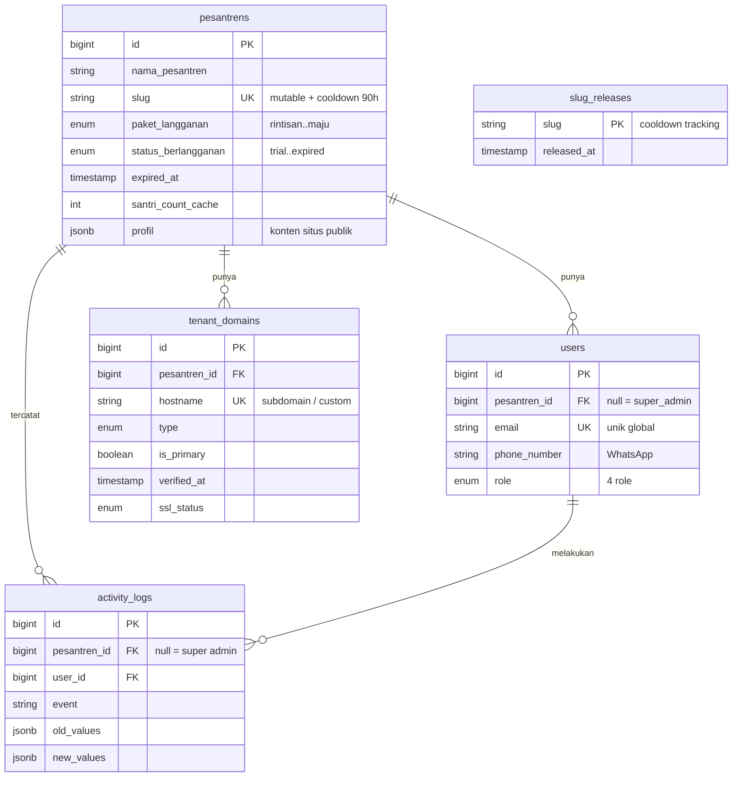

# PRODUCT REQUIREMENTS DOCUMENT (PRD)

**Project:** Walisantri.com (v1.0) — B2B Multi-Tenant SaaS (Hybrid: single-DB sekarang, schema/DB-per-tenant ready)
**Stack:** Laravel 13.11.1 (PHP 8.3+), Filament v5.6.3, Livewire v3, TailwindCSS, PostgreSQL 17, Redis, Cloudflare R2
**Dev/Deploy:** Laravel Herd (macOS) · GitHub Actions → VPS via SSH (deploy host-langsung, tanpa kontainer)
**Interface:** Mobile-first (Wali Santri), desktop-optimized (Admin/Ustadz)
**Last Updated:** Agustus 2026 — v4.50

**Changelog v4.50:** **Paket harga pindah ke halaman sendiri, `/harga` — dan seksi harga di landing dicabut habis, bukan diringkas.** Seksi `#harga` yang memuat empat kartu, toggle siklus, dan catatan kakinya sudah menjadi bagian terpanjang di landing, padahal hal-hal yang paling sering ditanyakan calon pelanggan (cara bayar, opsi durasi, apa yang terjadi saat langganan habis, add-on kuota) tidak punya ruang di sana sama sekali. Kini `/harga` memuat kartu lengkap + toggle, tabel perbandingan paket, seksi add-on kuota Maju, dan FAQ khusus biaya. Rutenya didaftarkan di grup `$baseDomain` (`HargaController`, nama rute `harga`) — berbeda dari `/` dan `/panduan`, pathnya tidak bertabrakan saat `base_domain == app_domain`, jadi tidak perlu pagar `$sameDomain`.

**Landing tidak lagi menyebut satu pun paket.** Rilis ini sempat memasang ringkasan (nama paket + kuota + tombol "Lihat Detail Harga") sebagai jalan tengah; itu dicabut atas keputusan pemilik produk — harga hanya punya satu tempat, dan nama paket tanpa angka justru lebih membingungkan daripada tidak ada sama sekali. Yang tersisa di landing cuma angka "mulai Rp …" di jawaban FAQ "Berapa biaya Walisantri?", dan itu pun turunan `BillingSetting` (dulu `Rp 150.000` mati). `LandingController` karena itu tidak lagi mengirim `paketList`, hanya `hargaTerendah`.

**Entri "Cara Kerja" dihapus dari nav.** Bar situs kini empat entri: Fitur · Harga · FAQ · Panduan (+ Demo bila gerbangnya terbuka). Seksinya sendiri **tetap ada** di landing dengan judul "Mulai dalam 3 Langkah Mudah" — yang dicabut menunya, bukan isinya, dan `id="cara-kerja"` dipertahankan supaya tautan dalam yang sudah tersebar tidak mati.

**Angkanya tetap satu sumber, dan sumber itu sekarang punya nama: `PaketHargaService`.** `LandingController::paketList()` dulu method privat; begitu dua halaman memajang angka yang sama, salinan kedua tinggal menunggu waktu untuk menyimpang. Service ini membungkus `BillingCalculatorService` dan melayani keduanya (`kartu()`, `konteksSiklus()`, `hargaTerendah()`, `addOnMaju()`). Aturan v4.41 tidak berubah: nol angka rupiah ditulis di Blade. Contoh add-on pun dihitung lewat `paketMaju()`, bukan diketik — `HargaPageTest` menggeser `harga_maju_per_100_santri` ke nilai tidak lazim lalu memeriksa tarif **dan** contohnya sekaligus.

⚠️ **`walisantri.com/#harga` kini anchor mati** — seksinya tidak ada lagi, jadi tautan itu mendarat di puncak landing tanpa error. Tautan semacam ini sudah tersebar di materi promosi dan percakapan WhatsApp; konsekuensinya diterima sadar (pembaca tetap sampai di landing dan menemukan "Harga" di nav), tapi materi promosi yang masih memakainya sebaiknya diarahkan ulang ke `/harga`. Yang berubah di partial: entri "Harga" di `partials/situs-nav` dan `situs-footer` kini `route('harga')` — bukan `$anchorBase.'#harga'` — sehingga dari `/panduan` ia membuka halaman sungguhan alih-alih melompat ke anchor di landing. Anchor yang tersisa (`#fitur`, `#faq`) tetap memakai `$anchorBase`.

⛔ **Kalimat FAQ durasi sempat menuliskan "0 bulan gratis".** Jawaban "Durasi apa saja yang bisa dipilih?" mula-mula menginterpolasi `$bonusEnam`/`$bonusTahunan` begitu saja; dengan `bonus_bulan_tahunan` disetel 0 ia berbunyi "durasi 12 bulan mendapat 0 bulan gratis" — klaim yang salah, bukan sekadar angka yang kebetulan nol. Kalimatnya kini dirakit bercabang di `@php`. Yang menangkapnya bukan pembacaan ulang, melainkan `test_klaim_bonus_tahunan_hilang_saat_bonus_dinolkan` yang ikut pindah dari `LandingPageTest` — bukti bahwa memindahkan tes bersama markup yang dijaganya lebih murah daripada menulis ulang asersinya.

**Gaya `<details>` naik ke `resources/css/app.css`.** Dua halaman kini memakai akordeon yang sama; keempat barisnya tidak boleh hidup sebagai `<style>` kembar. Selector pemilih siklus **tidak** ikut — ia terikat pada id yang cuma ada di `/harga`, jadi tetap inline bersama komentar jebakannya (kedua `<input type="radio" sr-only>` wajib jadi saudara langsung isi seksinya, kalau dibungkus ulang selector siblingnya putus dan satu siklus tidak pernah tampil). Halaman ini tetap nol JavaScript, sama seperti landing.

**Tesnya ikut pindah, bukan disalin.** `tests/Feature/HargaPageTest.php` (13 kasus) mengambil alih seluruh asersi kartu harga dari `LandingPageTest` — termasuk pagar `assertDontSee('kontrak')` (v4.46) dan `assertDontSee('trial')` (v4.45) yang kini menjaga halaman tempat janji itu paling mudah menyelinap kembali — lalu menambahkan gerbang `registration_open`/`demo_open` (lubang yang pernah nyata di `/panduan`), add-on, dan satu kasus yang memastikan tabel perbandingan tidak punya sel "tidak termasuk" mana pun: kelima Gate dihapus di v4.20, jadi mencoret modul per paket berarti menjanjikan penguncian yang tidak ditegakkan kode mana pun. `LandingPageTest` gantinya menjaga jalan keluarnya (nav & footer tetap menautkan `/harga`), "mulai Rp …" di jawaban FAQ yang kini turunan `BillingSetting`, dan dua bentuk sisa yang paling mudah tertinggal saat mencabut seksi sebesar itu: selector siklus sebagai CSS mati, dan potongan kartu (`Paling Populer`, `Setara pada kuota`, `id="harga"`) yang lolos karena dihapus separuh.

**Angka versi PRD diseragamkan lagi** — header v4.49 tapi §22 dan footer masih v4.48. Pola yang sama pernah terjadi di v4.47 dan v4.21. Ketiganya kini v4.50.

**Changelog v4.49:** **Kartu "Setoran Tahfidz" di portal wali dipotong dari 10 baris jadi 5 (§8).** Beranda wali mobile-first berlebar `max-w-lg`; daftar 10 setoran mendorong kartu Kesehatan, SPP, Uang Saku, dan Pengumuman jauh ke bawah lipatan — padahal yang dicari sekilas cuma setoran terakhir. Sepuluh terakhir tidak hilang, cuma pindah satu ketukan ke halaman Statistik Tahfidz yang sejak awal memang sudah menyediakannya; header kartu kini menuliskan "5 terakhir" dan kakinya memunculkan tautan "Lihat 10 setoran terakhir →" **hanya saat daftar penuh**, supaya wali dengan 3 setoran tidak diberi janji palsu. Batasnya diubah di satu tempat (`SantriDetailPresenter::detail()`), jadi berlaku seragam di beranda, detail santri, laporan magic link, dan preview admin. Ekspor PDF sengaja tetap 10 — di kertas ruang bukan barang langka.

**Changelog v4.48:** **§1.8 Fase 1 dibangun — portal wali, login, dan magic link kini dilayani di `{slug}.walisantri.com`.** Wali tidak lagi melihat merek platform di titik sentuh hariannya. Panel staf tetap di `app.walisantri.com` (Filament hanya menerima satu domain, dan pengurus memang sudah tahu vendornya).

⭐ **Pilihan cookie ber-scope host ternyata berbiaya nol, bukan berbiaya sedang.** v4.44 menghitungnya sebagai prasyarat yang "memutus semua sesi aktif" — itu benar untuk opsi cookie berbagi. Untuk opsi yang dipilih, `SESSION_DOMAIN=null` yang sudah berlaku hari ini **sudah** menghasilkan cookie host-only: tidak ada konfigurasi sesi yang disentuh, tidak ada jendela sepi, tidak ada sesi terputus. Konsekuensi yang diniatkan: staf di host platform dan wali di host tenant kini punya sesi terpisah. Efek sampingnya, kelas bug corong pendaftaran lewat sandbox (⛔ di §1.8) **tidak pernah lahir** — dan itu dijaga tes yang memeriksa atribut `Domain` pada cookie, bukan lewat "buka /register lalu lihat", karena test client Laravel berbagi sesi lintas host dan tidak menirukan aturan cookie browser.

⛔ **Bug corong pendaftaran ternyata BISA muncul — dan langsung dilaporkan dari lingkungan lokal.** §1.8 menulis bahwa cookie ber-scope host membuat kelas masalah ini "tidak pernah lahir". Itu benar hanya selama `SESSION_DOMAIN` tidak disetel — dan `.env` lokal menyetel `.walisantri.test`, sehingga sesi demo terlihat di apex: pengunjung yang habis mencoba `/coba` tidak bisa membuka `/register` maupun `/login`, keduanya memantulkannya kembali ke portal demo.

Pelajarannya bukan "lokal salah konfigurasi", melainkan **jaminannya tidak boleh bergantung pada satu variabel env**. Karena itu resep §1.8 tetap dikerjakan, meski cookie-nya sudah ber-scope host: (1) sesi magic link **tidak dihitung sebagai sudah login** di `/register` dan `/login`, dan `store()` mengakhiri sesi demo sebelum tenant baru dibuat — pendaftar tidak boleh mendaftar sambil masih "login" sebagai wali pesantren contoh; (2) pintu keluarnya eksplisit: tombolnya berbunyi **"Keluar dari demo"** khusus tenant sandbox (wali sungguhan, yang juga masuk lewat magic link, tetap melihat "Keluar" biasa), dan keluar dari sandbox mengantar kembali ke **landing**, bukan ke form login pesantren contoh yang jadi jalan buntu. Dikunci dua tes yang justru memanfaatkan sifat test client Laravel yang berbagi sesi lintas host — ia menirukan lingkungan cookie-berbagi dengan tepat.

⛔ **Cacat lama yang baru terlihat begitu lokal disamakan dengan production: pendaftar mendarat di panel sebagai TAMU.** `/register` hidup di apex, panel staf di host app, dan cookie sesi ber-scope host — sehingga `Auth::login()` di akhir pendaftaran menghasilkan sesi yang tidak pernah terbaca di `/admin`. Terverifikasi dengan mendaftarkan tenant sungguhan: `POST walisantri.test/register` → 302 ke `app.../admin` → 302 lagi ke `/login`. **Ini bukan akibat §1.8**: production sudah host-only sejak awal, jadi setiap pesantren yang mendaftar selama ini harus mengetik ulang kata sandinya begitu sampai di panel — bertentangan dengan salinan "Akun aktif seketika" di halaman pendaftaran dan langkah (8) §4.1. Yang menyembunyikannya adalah `.env` lokal yang dulu menyetel `SESSION_DOMAIN=.walisantri.test`; begitu disamakan dengan production, cacatnya langsung muncul.

Ditutup dengan **serah-terima sesi sekali pakai** (`SerahTerimaSesiController`, rute `auth.serah-terima` di host app, middleware `signed` + throttle). Tiga lapis pengaman karena ini jalan masuk tanpa kata sandi: token acak 64 karakter yang **tidak membawa identitas apa pun** (pemetaan token → user hidup di cache, jadi bocornya URL tidak membocorkan siapa pun), **sekali pakai** (`Cache::pull` menghapusnya saat ditukar, sehingga tautan di riwayat browser tidak jadi pintu masuk permanen), dan **berumur 5 menit** di dua tempat sekaligus (tanda tangan URL dan entri cache). Satu-satunya yang mencetak token adalah `RegisterController::store()`. Dikunci empat tes, dan tes pendaftaran lama diperkuat: dulu ia berhenti di "dialihkan ke /admin", sekarang ia mengikuti tautannya sampai panel benar-benar terbuka.

⚠️ **Dan cacat kembarannya di pintu login, dilaporkan langsung sesudahnya: "tidak bisa login akun wali".** Sejak Fase 1 ada **dua** pintu login — host platform untuk staf, host pesantren untuk wali — sementara kredensialnya sah di keduanya (email unik global). Implementasi awal v4.48 **memantulkan** pengguna ke pintu satunya: wali yang login di `app.walisantri.com` mengetik kredensial yang benar, lalu disodori form login yang tampak sama tanpa penjelasan apa pun. Dari sisi pengguna itu bukan "salah pintu", melainkan "login gagal".

Diganti **serah-terima**, bukan pantulan: token dicetak setelah kata sandi terbukti benar, lalu sesinya dipindahkan ke host rumah pengguna — wali ke portal pesantrennya, staf ke panel. Berlaku **dua arah** (staf yang login di host tenant juga diantar ke panel), memakai mekanisme yang sama dengan serah-terima pendaftaran, dan rutenya kini terdaftar di kedua grup host. `SerahTerimaSesiController::rumah()` jadi satu-satunya tempat yang memutuskan "host rumah" sebuah akun.

**Tautan login di halaman profil ikut dibereskan.** Dua tautan "Masuk Portal Wali Santri" di profil pesantren (tombol header + CTA) dibangun `route('login').'?tenant='.$slug` — keduanya menunjuk **app.walisantri.com**. Artinya wali yang sedang berdiri di halaman ber-merek pesantrennya dilempar ke domain vendor tepat di titik paling terlihat: kebocoran merek yang §1.8 ada untuk menutupnya, dan sesudah Fase 1 tidak perlu lagi karena host pesantren melayani `/login` sendiri. Diganti `$pesantren->url('/login')`; parameter `?tenant=` ikut gugur karena brandingnya kini diturunkan dari host. Dikunci tes yang memeriksa tautannya **dan** memastikan host platform tidak muncul di halaman itu.

**Pencarian global di topbar panel ditukar tautan profil pesantren.** Ditanyakan "apa fungsinya" — jawabannya: pencarian global Filament, dan ia **berfungsi** (terverifikasi dengan sesi admin sungguhan: santri dicari lewat `nama_lengkap`, pengguna lewat `name`, kelas/kamar/mapel lewat namanya). Tapi ia tidak pernah dikurasi: dari **23 resource** yang ikut terindeks lewat `$recordTitleAttribute`, lima dicari lewat kolom yang tak berarti bagi manusia — `NilaiAkademik` & `SantriEkskul` lewat **id**, `Presensi` & `Mutaba'ah` lewat **tanggal**, `PresensiJamPelajaran` lewat **jam ke** — sehingga mengetik angka atau tanggal memunculkan hasil sampah.

Keputusan pemilik produk: **diganti**, bukan dirapikan. `->globalSearch(false)` plus render hook **`GLOBAL_SEARCH_AFTER`** yang menampilkan tautan ke profil publik pesantren admin itu sendiri (`Pesantren::url('/')`, ikon rantai, buka di tab baru). ⚠️ Hook-nya bukan `TOPBAR_END`: hook itu dirender di **luar** `.fi-topbar-end` sehingga isinya selalu terlempar paling kanan, melewati lonceng notifikasi dan menu pengguna. `GLOBAL_SEARCH_AFTER` tetap dirender meski pencarian globalnya dimatikan, dan posisinya persis sebelum lonceng. Merender kosong untuk super admin — ia tidak terikat satu pesantren. ⚠️ **Konsekuensi yang harus diniatkan:** admin kehilangan jalan pintas mencari santri dan kini harus lewat menu Santri lalu filter; kalau keluhan itu muncul, jalan tengahnya mengembalikan pencarian **dengan** daftar resource yang dikurasi, bukan mengembalikannya apa adanya.

**Topbar panel diselesaikan: tautan profil + tombol Bantuan.** Ikon tautan profil diganti ikon "buka di tab baru" dan dipindah ke **kanan teks** — ia keterangan atas perilaku tautannya, bukan lambang tujuannya. Di sebelahnya, sebelum lonceng notifikasi, ditambahkan **tombol Bantuan** (ikon chat) yang membuka WhatsApp ke tim dengan pesan pembuka terisi otomatis berisi nama pengirim dan pesantrennya — pertanyaan pertama tim dukungan selalu "ini dari pesantren mana". Urutan akhirnya: profil → bantuan → lonceng → menu pengguna, ditentukan urutan pendaftaran hook.

Nomornya **tidak di-hardcode**: disimpan sebagai setelan platform di `platform_branding_settings` (`wa_dukungan`) dan disunting super admin lewat halaman yang labelnya melebar dari "Logo & Favicon" jadi **"Merek & Kontak"** — slug halamannya sengaja tidak diubah supaya tautan lama tidak mati (pola v4.41). Tombolnya **merender kosong saat nomor belum diisi**; lebih baik tidak ada daripada ada tapi menuju tautan rusak. Perapian format nomor hidup di `PlatformBrandingSetting::waDukungan()`, bukan di validasi form: super admin boleh mengetik `0812-3456-7890` atau `+62 812 3456 7890` dan keduanya menghasilkan `6281234567890`. Dikunci empat tes.

⚠️ **Konsekuensi lingkungan pengembangan:** `.env` lokal wajib **tidak** menyetel `SESSION_DOMAIN` (sama seperti `.env.example` dan production). Menyetelnya ke `.walisantri.test` membuat lokal berhenti mewakili production di dua kelas bug sekaligus — corong pendaftaran lewat sandbox, dan cacat serah-terima ini.

**Empat jebakan yang hanya muncul saat kodenya ditulis — semuanya sudah ditutup, dan semuanya akan terulang kalau tidak dicatat:**

1. **Parameter domain ikut jadi argumen controller.** `Route::domain('{slug}.…')` mengirim `{slug}` sebagai argumen **pertama** ke setiap controller, sehingga `PresensiController::show(int $santriId)` menerima string slug. Ditutup dengan `$request->route()->forgetParameter('slug')` di middleware `tenant.host` — 17 controller wali tidak perlu menumbuhkan parameter yang tidak mereka pedulikan.
2. **`route('wali.*')` mati di konteks tanpa host tenant.** Preview admin (`admin.preview.wali`) merender view wali di host platform. `URL::defaults(['slug' => …])` karena itu dipasang di **dua** tempat: `tenant.host` (untuk host tenant) dan `ResolveTenantFromAccount` (untuk konteks panel). Biaya 38 call site yang v4.44 hitung akhirnya **nol** — tidak satu pun `route('wali.*')` disentuh.
3. **`redirectGuestsTo` tidak bisa membaca hasil resolusi host.** Middleware `auth` punya prioritas lebih tinggi dan berjalan lebih dulu dari middleware grup, jadi atribut `public_pesantren` masih kosong saat callback-nya dipanggil. Host-nya di-resolve ulang di dalam callback. Tanpa ini, wali yang membuka portal tanpa sesi terlempar ke pintu platform — lalu login di sana membuat sesi di host yang salah dan ia dipantulkan lagi.
4. **Pintu keluar hilang saat langganan berakhir.** `SaaSLifecycleLock` mengizinkan logout lewat nama rute `logout` dan path `wali/logout`; di host tenant namanya `wali.logout` dan path-nya `/logout` — tidak satu pun cocok, sehingga wali pesantren yang tersuspensi terkunci 423 **tanpa cara keluar dari sesinya**.

**Pintu kanonik permanen berjalan seperti dirancang, plus satu pagar yang tidak ada di rancangan.** `app.walisantri.com/report/{uuid}` kini murni pengalih (tanpa `magic.token` — autentikasi harus terjadi di host tujuan, kalau tidak sesinya lahir di host yang salah). Tujuannya dihitung dari tenant santri, jadi penggantian slug tidak mematikan tautan lama. Ditambahkan: tautan yang dibuka di host pesantren **lain** dialihkan ke host yang benar sebelum sesi apa pun dibuat (efek samping yang §1.8 minta dipertimbangkan), dan pagar anti-loop bila tenant tidak punya baris `tenant_domains` — di production semuanya punya (18/18, diperiksa saat rilis), pagar ini untuk data rusak.

**Sumber kebenaran host disatukan** di `Pesantren::hostname()` dan `Pesantren::url()`, dipakai `Santri::linkWali()` dan `User::urlPortalWali()`. Aman dari konteks tanpa request (job queue) karena tidak pernah menyentuh host request. Efek berantai yang diinginkan: `/coba` kini mengarah ke `demo.walisantri.com` — sandbox jadi etalase white-label yang hidup.

**Yang TIDAK berubah:** panel staf, `password.*`, verifikasi email, ekspor, dan preview admin tetap di host platform. Cakupan white-label yang tidak tertutup perpindahan host (pengirim WhatsApp & email yang masih global, jejak merek di permukaan wali & PDF) tetap terbuka sebagai keputusan produk.

**Langkah 0 rilis ini: utang `real_ip` ditutup lebih dulu** (§6.1) — Fase 1 melipatgandakan host, dan seluruh rate limiter sebelumnya mengunci per edge Cloudflare.

**Changelog v4.47:** **Tiga pekerjaan rumah dari audit pasca-v4.46: dokumen yang bertentangan dengan produk, pengukuran `real_ip` di production, dan mode gelap portal wali.**

**`docs/faq-walisantri.md` diaudit utuh — enam jawaban salah, bukan dua.** Dokumen ini tidak dirender aplikasi, tapi dipakai menjawab calon pelanggan, dan tidak pernah dibandingkan dengan landing sejak v4.41. Yang diperbaiki: (1) klaim data "dikunci sistem di dua lapis — di aplikasi **dan di database**" padahal RLS tercatat di-skip dan middleware-nya masih menulis *"aktifkan saat RLS ready"* — ini klaim sekelas yang dicabut dari landing di v4.41; (2) "Setiap **akses** tercatat di log aktivitas" padahal yang tercatat perubahan data, bukan pembacaan halaman; (3) "Catatan aktivitas ini **tidak bisa dihapus**" padahal `PurgeAuditLogs` memangkasnya (2 tahun; 5 tahun untuk peristiwa billing); (4) janji **trial 14 hari** yang sudah dicabut dari pemasaran di v4.45; (5) janji **"tanpa ikatan kontrak jangka panjang"** yang dicabut di v4.46; (6) "wali lupa kata sandi → kode lewat WhatsApp" padahal wali **tidak punya kata sandi sama sekali** (`ResetPasswordController` menolak mereka dengan penjelasan) dan OTP WhatsApp tidak pernah dibangun — integrasi WhatsApp-nya sendiri sengaja dimatikan (§12.1). Salinan penggantinya dicocokkan ke halaman production yang sedang tayang, bukan ke ingatan.

**Angka versi PRD diseragamkan lagi.** Header v4.46 tapi §22 menulis "PRD ini v4.40" dan footer v4.40 — pola yang persis sama pernah terjadi di v4.21 (header v4.21 / §22 v4.20 / footer v4.17). Ketiganya kini satu angka, dan sebaran tes di §17 ikut diperbarui (658 → 694).

**Mode gelap masuk ke portal wali, memakai pilihan yang sama dengan halaman publik.** `partials/tema` dipasang di layout wali sehingga pilihan pembaca **terbawa** dari landing ke portal, bukan dua setelan terpisah; tombolnya di header, dan tetap tampil di mode preview (admin/ustadz melihat tampilan wali). Palet `app.css` membalik sendiri seluruh 774 pemakaian kelas warna di 20 view, jadi yang dikerjakan hanya mengunci permukaan yang **tidak boleh** ikut membalik — aturan yang sama seperti v4.46: header teal, kartu identitas santri, kartu saldo uang saku, dan spanduk mode preview (indigo). Tombol dan lencana kecil sengaja dibiarkan membalik. PDF wali tidak disentuh (dompdf tidak pernah punya kelas `dark`). **Panel admin Filament juga tidak disentuh** — ia sudah punya mode gelap bawaan dengan penyimpan preferensi sendiri; menyatukan kuncinya dengan `tema` masih terbuka. `partials/tema-tombol` kini menerima `$kelasWarna` yang **mengganti** warna bawaan: menumpuk warna lewat `$kelasTambahan` tidak bisa diandalkan karena dua utilitas di layer yang sama dimenangkan urutan di berkas CSS, bukan urutan penulisan di atribut.

**Landing production menampilkan CTA berbeda dari lokal — datanya, bukan kodenya.** Dilaporkan sebagai "tombolnya beda": lokal *"Lihat Portal Wali"*, production *"Lihat Fitur Lengkap"*. Penyebabnya `SandboxDemo::waliUrl()` mengembalikan `NULL` di production karena **tenant ber-slug `demo` belum pernah dibuat di sana** — dan itu bukan kegagalan, melainkan jadwal: fitur sandbox baru rilis hari yang sama, sementara datanya hanya disemai job mingguan `sandbox:segarkan` (Senin 04.00 WIB). Scheduler-nya sendiri sehat (`schedule:run` ada di crontab user **`fazaweb`**, bukan root — sempat terbaca "tidak ada" karena hanya crontab root yang diperiksa).

**Konsekuensinya diperbaiki di langkah deploy, bukan ditunggu.** `deploy.yml` kini memanggil `php artisan sandbox:segarkan` setelah `php artisan up` — server yang belum punya tenant demo tidak lagi menunggu sampai seminggu dengan tombol yang diam-diam jatuh ke tautan cadangan. Dijalankan setelah situs dibuka kembali supaya penyemaian tidak memperpanjang masa pemeliharaan, dan digerbangi `|| echo WARN` supaya kegagalan penyemaian demo tidak pernah menggagalkan deploy.

**Selain itu, kedua environment terverifikasi setara.** Diff HTML ternormalisasi untuk landing, `/panduan`, dan `/register` hanya menyisakan aset Vite, skrip analitik (memang khusus production), dan token CSRF. `platform_settings`, `billing_settings`, dan branding identik.

**Harga di dokumen diselaraskan ke daftar yang berlaku (159/349/599/999, naik 16 Agustus 2026).** Yang diperbarui hanya pernyataan keadaan **sekarang** — Product Vision, tabel §5.1, formula §5.3 berikut contohnya, ringkasan §22, simulasi §21, FAQ, dan materi promosi. **Changelog historis sengaja tidak disentuh**: v4.6 tetap mencatat penurunan 450k → 350k, dan contoh angka di changelog v4.46 tetap memakai 150k karena itulah harga yang berlaku saat ia ditulis. Tabel milestone §21 diberi peringatan, bukan dihitung ulang — memilih bauran dan target adalah keputusan pemilik produk, bukan turunan aritmetika.

**Temuan `real_ip` di production: paparan nyata, belum diperbaiki.** Rinciannya di **§6.1** — ringkasnya, seluruh rate limiter hari ini mengunci per edge Cloudflare, bukan per pengunjung. Perbaikannya menunggu keputusan karena origin masih terbuka langsung, sehingga pilihan yang salah justru membuat pembatasnya bisa dipalsukan.

**Changelog v4.46:** **Seksi #harga landing kini menawarkan dua siklus — bulanan dan tahunan — lengkap dengan bonus yang didapat.** Ini membalik keputusan v4.41 yang menulis seksi itu "tanpa toggle"; alasan penolakannya waktu itu teknis, bukan produk (landing nol JavaScript), dan alasan itu ternyata tidak mengikat. Toggle-nya dibangun **tetap tanpa JavaScript**: dua `<input type="radio">` ber-`sr-only` menjadi saudara langsung `<section id="harga">`, lalu CSS di `<head>` (`#siklus-tahunan:checked ~ * .harga-bulanan { display: none }`) menyembunyikan harga yang tidak dipilih — pola sibling selector yang sama dengan FAQ `<details>` di halaman yang sama. Karena input-nya `sr-only`, fokus keyboard dipinjamkan ke label lewat `:focus-visible`.

**Harga tahunan adalah turunan, bukan angka kedua.** `LandingController` menghitungnya dari harga bulanan × `DurasiLangganan::DuabelasBulan->bulanBayar()`, harga coret dari `totalBulan()`, dan nominal hemat dari `bonusBulan()` — jadi mengubah `harga_*` atau `bonus_bulan_tahunan` di `BillingSettingsPage` menggeser ketiga angka itu sekaligus, dan tidak ada tabel harga tahunan terpisah yang bisa diam-diam menyimpang (alasan yang sama dengan §5.2 dan v4.41). Bila bonus tahunan disetel **0**, harga coret dan klaim "N bulan gratis" hilang sendirinya alih-alih merosot jadi "0 bulan gratis"; dua tes baru di `LandingPageTest` mengunci keduanya. Catatan kaki tetap menyebut durasi 6 bulan — bonusnya setelan terpisah (`bonus_bulan_enam`), jadi mematikan bonus tahunan tidak boleh ikut menghapusnya.

**Angka yang ditonjolkan di kartu adalah tarif per santri, bukan harga paket.** Keputusan pemilik produk: Rp 150.000/bulan terbaca mahal, Rp 1.500/santri/bulan terbaca murah, padahal keduanya angka yang sama. Harga paket **tidak** dihapus — ia tetap tertulis di baris bawahnya ("Rp 150.000/bulan per pesantren"), karena itulah yang benar-benar ditagih. Siklus tahunan memakai pasangannya, tarif per santri **per tahun** (Rp 15.000 pada Rintisan).

⚠️ **Tarif per santri itu setara, bukan cara penagihan — dan bedanya nyata.** Pembaginya kuota paket, bukan jumlah santri yang sesungguhnya, jadi pesantren berisi 60 santri di paket Rintisan membayar Rp 2.500/santri, bukan Rp 1.500. Karena itu setiap kartu wajib menutup angkanya dengan "Setara pada kuota N santri; tagihannya per paket" — tanpa kalimat itu, angka ini masuk kategori klaim yang dicabut v4.41, bukan sekadar penyederhanaan. Sistem juga tidak punya penagihan per santri di mana pun (`BillingCalculatorService` hanya mengenal harga paket + add-on blok 100 di Maju, §5.3), jadi janji itu tidak boleh menguat jadi "bayar per santri". Pembaginya sendiri ikut `BillingSetting` (`kuota_*`) dan dibulatkan ke rupiah terdekat; `LandingPageTest::test_tarif_per_santri_ikut_kuota_bukan_pembagi_tetap` menggeser kuotanya untuk memastikan pembaginya bukan angka mati.

**Catatan kaki #harga: "tanpa kontrak jangka panjang" dicabut, "harga dapat berubah sewaktu-waktu" masuk.** Keputusan pemilik produk. Yang dicabut sebenarnya benar (tidak ada ikatan kontrak), tapi ia menjanjikan sesuatu yang tidak ingin dipegang; yang masuk menutup celah sebaliknya — angka di kartu tidak boleh terbaca sebagai tarif terkunci selamanya. Dijaga `LandingPageTest::test_catatan_harga_menyebut_bisa_berubah_tanpa_janji_bebas_kontrak` dengan pola `assertDontSee` yang sama seperti v4.41 dan v4.45. ⚠️ **`docs/faq-walisantri.md:77` masih menulis "Tidak ada ikatan kontrak jangka panjang untuk paket bulanan"** — dokumen itu sengaja tidak ikut disunting di rilis ini, jadi kalau isinya dipakai untuk menjawab calon pelanggan, ia berselisih dengan landing. Lihat juga §5.6.

⚠️ **Landing memajang harga, tidak menjual durasi.** Durasi 3 bulan sengaja tidak ditampilkan (bonusnya nol — tidak ada yang bisa ditawarkan), dan memilih siklus di landing tidak membuat order apa pun: CTA-nya tetap ke `/register`. Pemilihan durasi yang sesungguhnya tetap di `UpgradePage` (§16.1), dan mekaniknya tetap §5.2.

**Mode gelap dipasang di seluruh halaman publik, dengan tombolnya di nav.** Landing, `/panduan`, `/demo`, `/register`, `/login`, dan halaman kata sandi memakai satu palet dan satu pilihan. Defaultnya ikut setelan perangkat; pembaca boleh menimpanya lewat tombol di nav, dan pilihannya diingat lintas halaman (`localStorage`).

**Yang dibalik paletnya, bukan markup-nya — ini keputusan yang menentukan biaya perawatan seterusnya.** Halaman publik memakai >300 utilitas warna; menempelkan `dark:` satu per satu berarti setiap salinan copy baru harus ingat melakukannya, dan yang lupa akan tampil belang. Karena di Tailwind v4 `bg-white` menjadi `background-color: var(--color-white)`, `resources/css/app.css` cukup menimpa **variabel paletnya** di `:root.dark` — skalanya dibalik (gray-900 jadi paling terang, white jadi paling gelap), sehingga pasangan seperti `bg-teal-700 text-white` tetap kontras: ia menjadi teal terang dengan teks gelap. Varian `dark:` tetap tersedia (`@custom-variant dark` berbasis kelas) dan dipakai **hanya untuk pengecualian**.

⚠️ **Pengecualiannya adalah permukaan yang memang disengaja lebih gelap dari halaman**, dan ini yang paling mudah terlewat saat menambah seksi baru: seksi `#presensi`, CTA penutup, sidebar mockup dashboard, bodi HP mockup, serta latar penuh `/login` dan halaman kata sandi. Dibalik apa adanya, semuanya berubah jadi slab terang menyilaukan di mode gelap; keenamnya karena itu dikunci dengan `dark:` eksplisit. **Aturannya:** warna yang menggambarkan *benda* atau *panel kontras* tidak ikut membalik, warna yang menggambarkan *permukaan situs* ikut.

**Landing tidak lagi nol JavaScript — dan hanya ini alasannya.** Skripnya ~30 baris tanpa pustaka, wajib sinkron di `<head>` (`partials/tema`): kelasnya harus terpasang sebelum halaman dilukis, kalau tidak pembaca bermode gelap kena kedip putih tiap membuka halaman. Setelan perangkat yang berubah saat halaman terbuka hanya diikuti selama pembaca belum pernah memilih sendiri. Logikanya diuji terpisah di luar test suite PHP (DOM tiruan, tujuh kasus: default ikut perangkat, tombol menyimpan pilihan, pilihan manual tidak ditimpa perangkat); yang dijaga `LandingPageTest` adalah bagian yang bisa hilang diam-diam saat menyunting `<head>` — skrip dan tombolnya ikut ter-render. `/panduan` yang tadinya memakai `prefers-color-scheme` ikut pindah ke kelas yang sama, dan penimpa `.site-chrome` di sana **dihapus** — paletnya sudah membalik sendiri, penimpa itu justru akan membuat nav berbeda dari landing. Pembungkus `<div class="site-chrome">`-nya sendiri ikut dicabut belakangan; lihat catatan nav di bawah.

**Suite SQLite lokal bisa dipercaya lagi: cast tanggal presensi diberi format eksplisit.** Sembilan tes + satu error di modul Presensi/Rapor merah secara lokal tapi hijau di CI, dan itu berlangsung cukup lama sampai dianggap "kegagalan bawaan". Penyebabnya satu: cast `'date'` polos menyerialkan nilai sebagai `Y-m-d H:i:s`. Postgres memotong jamnya karena kolomnya memang `DATE`; SQLite tidak punya tipe tanggal sungguhan sehingga menyimpan `2026-09-07 00:00:00` apa adanya — lalu `whereIn('tanggal', …)`, pencarian baris `(pesantren_id, tanggal)`, dan `assertDatabaseHas` sama-sama meleset. Gejalanya menyebar (rekap menghitung 0, persentase 75 alih-alih 100, "Hari Efektif" hilang dari Rapor, izin yang disetujui gagal menimpa presensi manual, unique constraint hari libur dilanggar) padahal akarnya cuma imbuhan `00:00:00` itu.

Diperbaiki dengan menulis formatnya: `'date:Y-m-d'` di `Presensi::tanggal`, `PresensiHariLibur::tanggal`, dan `PresensiIzin::tanggal_mulai`/`tanggal_selesai`. Postgres tidak terpengaruh (kolomnya sudah `DATE`), SQLite ikut menyimpan tanggal murni. Hasilnya **692/692 lulus di PostgreSQL dan 679 lulus + 13 dilewati di SQLite, nol gagal di keduanya**. ⚠️ Ini **tidak** membatalkan anjuran di `phpunit.pgsql.xml`: SQLite masih longgar soal CHECK constraint dan tipe kolom, jadi `--configuration=phpunit.pgsql.xml` tetap wajib sebelum push. Yang berubah, suite lokal tidak lagi punya kegagalan permanen yang menutupi regresi baru.

**Nav punya menu untuk layar HP, dan `/panduan` header-nya benar-benar menempel.** Dua cacat yang dilaporkan setelah nav dijadikan partial bersama.

**(1) Menu utama tidak terjangkau di HP.** Keenam tautan nav hidup di `hidden md:flex` — di bawah 768px mereka hilang **tanpa pengganti**, jadi pengunjung HP tidak punya jalan ke seksi Harga atau FAQ, dan pembaca `/panduan` tidak punya jalan kembali ke landing sama sekali. Sekarang ada panel menu: checkbox `sr-only` + `peer-checked`, tanpa JavaScript untuk buka/tutupnya (pola yang sama dengan pemilih siklus harga dan drawer daftar isi). Skrip 4 baris hanya untuk menutup panel setelah tautan diketuk — tanpa itu panel tetap menutupi seksi yang baru dituju. **Bar HP berisi logo · ☾ · Daftar · ☰**; hanya "Masuk" yang pindah ke dalam panel. Tombol mode gelap sengaja **tetap di bar** (permintaan pemilik produk) — ia satu ketukan, bukan dua. Konsekuensinya bar butuh 340px, jadi di bawah 360px tulisan merek "Walisantri.com" disembunyikan dan menyisakan logonya saja (turun ke 230px); `min-w-0` + `truncate` jadi jaring terakhir supaya sisa kesempitan berakhir sebagai teks terpotong, bukan halaman yang bisa digeser ke samping. Angka-angka itu diukur dari halaman yang dirender, bukan ditaksir. Daftar tautannya dirakit sekali di satu array lalu dipakai bar desktop dan panel HP, supaya keduanya tidak bisa berbeda isi — termasuk saat gerbang demo ditutup.

**(2) Header `/panduan` tidak menempel — penyebabnya pembungkus, bukan CSS sticky-nya.** `@include`-nya dibungkus `<div class="site-chrome">`, dan **elemen `position: sticky` terkurung di blok induknya**: pembungkus yang tingginya persis setinggi nav membuat nav tidak punya ruang untuk menempel, jadi ia langsung tergulir hilang. Gejalanya justru muncul di tempat lain — sidebar daftar isi menempel di `top: var(--nav-h)`, di ruang yang kini kosong, sehingga terlihat mengambang. Pembungkusnya dicabut (penimpa yang dulu membenarkannya sudah hilang saat mode gelap masuk), dan `PanduanPageTest` mengunci agar nav tetap jadi elemen tampak pertama di `<body>`.

⚠️ **`--nav-h` di `/panduan` sekarang diukur, bukan ditebak.** Angka statis di CSS (57px/69px) ternyata meleset 8px begitu nav mendapat tombol ☰ — tinggi nav itu milik partial bersama dan bisa berubah tanpa `/panduan` tahu. Skrip di akhir `<body>` menyetel `--nav-h` dari `nav.offsetHeight` saat muat dan saat layar diubah ukurannya; nilai CSS-nya tinggal cadangan bila JavaScript mati. Terverifikasi di tiga lebar (485/700/1280px): nav menempel di `top: 0`, sidebar dan bar daftar isi tepat di bawahnya tanpa celah.

⚠️ **Jebakan Blade yang memakan waktu di rilis ini:** menulis `@include` sebagai teks biasa di dalam komentar **CSS** membuat Blade tetap mengompilasinya (`$__env->make(, …)` → `ParseError`, halaman 500). Di dalam komentar Blade `{{-- --}}` aman; di dalam `<style>` tidak.

**`/panduan` disatukan tampilannya dengan landing.** Halaman itu selama ini berdiri sendiri: palet krem-serif, dan header/footer versinya sendiri. Sekarang paletnya memakai warna landing (putih + teal Tailwind) dan nav/footer-nya **partial yang sama** — `partials/situs-nav` & `partials/situs-footer`, dipakai landing maupun panduan, sehingga tidak ada lagi dua salinan yang bisa menyimpang. Identitas dokumennya (serif untuk judul, sidebar daftar isi) sengaja dipertahankan; yang disamakan warna dan chrome-nya, bukan tipografinya.

**Rutenya pindah dari `Route::view` ke `PanduanController` — dan itu memperbaiki lubang, bukan sekadar rapi-rapi.** Nav bersama ikut gerbang `registration_open`/`demo_open`, dan gerbang itu butuh controller. Sebelumnya /panduan menautkan `/demo` dan `/register` tanpa gerbang apa pun: menutup pendaftaran menyisakan pintu yang masih terbuka di halaman ini. `PanduanPageTest` (4 kasus) menjaganya, termasuk memastikan anchor nav (`#harga`, `#faq`) absolut ke landing — kalau relatif ia menggantung di /panduan dan tidak membawa pembaca ke mana pun.

⚠️ **Tiga jebakan teknis yang harus diingat sebelum menyunting `panduan.blade.php`.** (1) Tailwind kini ikut dimuat di sana demi partial bersama, dan **preflight-nya** mematikan penanda daftar serta garis bawah tautan — dokumen ini penuh `<li>`, jadi keduanya dikembalikan di blok "Preflight" dan jangan dihapus. (2) Utilitas Tailwind hidup di `@layer` sehingga **selalu kalah** dari aturan tak berlapis di `<style>` halaman itu, berapa pun specificity-nya; karena itu `a` dan `p` polos dibatasi jadi `:where(.page) a` / `:where(.page) p` — tanpa itu tautan abu-abu di nav bersama berubah teal. `:where()` dipakai supaya specificity-nya tetap 0,0,1 dan `.backlink`/`.doc-lede` tetap menang. (3) Nav landing **sticky**, sementara sidebar panduan juga menempel di atas; tinggi nav dicatat di variabel `--nav-h` dan dipakai menggeser sidebar, drawer, scrim, serta `scroll-margin-top` anchor.

**Mode gelap /panduan dipertahankan** (keputusan pemilik produk) padahal landing tidak punya — dokumen ini panjang dan sering dibaca di HP. Paletnya diselaraskan ke teal yang sama, dan karena nav/footer bersama itu terang-saja, warnanya ditimpa **hanya di dalam `.site-chrome`** di halaman ini. Konsekuensinya: menambah warna baru di nav bersama berarti menambah penimpanya di sini juga, kalau tidak nav-nya belang saat mode gelap.

**Satu cacat lama ikut ditutup:** checkbox pengendali drawer daftar isi (`#nav-toggle`) hanya disembunyikan di dalam `@media (max-width:900px)`, jadi di layar desktop kotak centangnya benar-benar tampil menggantung di pojok kiri atas halaman. Terverifikasi ada sebelum rilis ini (tangkapan layar `git stash`), bukan efek samping penyatuan tampilan.

**Changelog v4.45:** **Trial dicabut dari corong akuisisi — pemasarannya, bukan mekaniknya.** Keputusan pemilik produk. Tiga CTA landing yang menjual masa trial ("Coba Gratis 14 Hari" ×2, "Mulai Trial") kini berbunyi **"Daftar Sekarang"**, dan seluruh salinan pendukungnya ikut dicabut: subjudul Harga, langkah 1 Cara Kerja, dua butir FAQ, paragraf CTA penutup, dan subjudul `/register`. Dua FAQ diganti **pertanyaannya**, bukan hanya jawabannya — "Apakah Walisantri gratis?" mengandaikan jawaban "gratis dulu" yang justru sedang dicabut, dan "Apa yang terjadi setelah masa trial habis?" menjadi "…kalau masa langganan berakhir?" (isi jawabannya berlaku untuk kedua kasus).

⚠️ **Mekanik trial tidak disentuh, dan ini yang paling mudah salah dibaca di sesi berikutnya.** `OnboardPesantren` tetap mengaktifkan trial Rintisan sepanjang `BillingSetting::trial_days`, lifecycle trial → grace 7 hari → suspended tetap berlaku, dan email sambutan masih menyebutnya. Pendaftar tetap mendapat trial — ia hanya tidak lagi dijanjikan sebelum mendaftar. `$trialDays` dilepas dari `LandingController` dan `RegisterController` semata karena tidak ada lagi view yang memakainya. Rinciannya di **§4.1**.

`LandingPageTest::test_lama_trial_mengikuti_billing_setting` diganti `test_landing_tidak_menjanjikan_trial`, dan `RegisterControllerTest` mendapat pasangannya. Yang dijaga membalik arah: dulu memastikan lama trial ikut `BillingSetting` (bukan angka mati di Blade), sekarang memastikan janji itu tidak kembali lewat penyuntingan copy berikutnya — pola `assertDontSee` yang sama dengan empat klaim yang dicabut v4.41. **Keputusan model masuk (trial/freemium/demo-led) tetap terbuka** — rilis ini berhenti menjual dengan trial, tapi tidak memilih penggantinya.

**Changelog v4.44:** **§1.8 diperiksa ulang terhadap kode dan production — satu klaim prasyarat gugur, satu asumsi infrastruktur terbalik, tiga lubang ditutup, cakupan white-label diberi batas.** Tidak ada perubahan kode; §1.8 tetap rancangan. Dua prasyarat yang v4.43 hanya duga-duga kini **diukur langsung ke production (16 Agustus 2026)**, dan keduanya meleset — satu ke arah lebih buruk, satu ke arah lebih baik.

**Klaim `SESSION_DOMAIN` gugur — terverifikasi TIDAK disetel di production.** v4.43 mencentang cookie sesi sebagai prasyarat Fase 1 yang *sudah* terpenuhi. Buktinya tidak pernah ada di repo (`.env.example:44` justru `SESSION_DOMAIN=null`), dan pengukuran langsung memastikannya: `walisantri.com`, `app.walisantri.com`, dan `demo.walisantri.com` sama-sama mengirim `Set-Cookie: walisantri-session=…; path=/; secure; httponly; samesite=lax` — **tanpa atribut `Domain=`**, artinya cookie host-only. Prasyarat ini **belum terpenuhi**, dan mengisinya tidak gratis: mengganti scope cookie **memutus semua sesi aktif** sekaligus. Harus dijadwalkan, bukan disisipkan di deploy rutin. Umur sesi `Max-Age=7200` (2 jam) menahan dampaknya tetap kecil.

**Pagar tenant dipindah dari login ke setiap request.** v4.43 menulis aturannya sebagai *"login di host tenant hanya menerima akun tenant itu"*. Justru karena cookie dibagi lintas subdomain, kasus yang bocor bukan login: sesi yang **sudah** ada ikut terbawa. Admin pesantren B yang login di `app.` lalu mengetuk `pesantren-a.walisantri.com/wali/...` datang membawa sesi aktif tanpa pernah menyentuh form login. Cek di `WaliLoginController` tidak pernah jalan di jalur itu.

**Model cookie Fase 1 naik jadi keputusan arsitektur terbuka, bukan detail yang sudah diputus.** Cookie `.walisantri.com` dipilih v4.43 karena gratis, tapi konsekuensinya: seluruh halaman ber-cookie jadi **satu origin dengan konten yang dikelola tenant sendiri** (deskripsi, galeri, dan nanti CMS artikel/kegiatan §1.4). Satu XSS di profil satu pesantren = pencurian sesi seluruh platform. Hari ini risikonya nol karena profil publik tanpa auth; setelah Fase 1 tidak lagi. Alternatif host-scoped cookie sejak Fase 1 menutup kelas serangan itu **dan** menyamakan jalur Fase 2 — lapisan auth yang §1.8 sendiri sebut "butuh tes sendiri, bukan tempat coba-coba" tidak lagi ditunda ke fase yang berhadapan dengan domain pelanggan.

**Dan cookie berbagi mematikan corong pendaftaran lewat sandbox — ini bukan hipotesis, jalurnya sudah ada di kode.** `VerifyMagicToken` menjalankan `Auth::login()` sungguhan, jadi pengunjung yang klik `/coba` **benar-benar login** sebagai wali tenant demo. Dengan cookie `.walisantri.com`, sesi itu ikut berlaku di apex — tempat form pendaftaran hidup — sehingga `RegisterController::showForm()` baris 26 melihat `Auth::check()` true, memanggil `redirectAuthenticated()` (baris 82, role `wali_santri`), melempar ke `wali.dashboard`, lalu `BlockMagicLinkSession` memantulkannya ke halaman santri demo. **Form pendaftaran tidak pernah bisa dibuka**, dan `store()` dijaga cek yang sama di baris 39 sehingga submit pun tertelan. Sandbox dibangun untuk konversi, lalu memblokir tombol konversinya. Hari ini aman **hanya karena** cookie masih host-only — bug ini akan **diciptakan** oleh perubahan `SESSION_DOMAIN`, bukan ditemukan.

**Cakupan white-label diberi batas eksplisit — host saja tidak menutup janjinya.** `WhatsAppGatewaySetting` adalah tabel key-value **global tanpa `pesantren_id`**: token Fonnte satu untuk seluruh platform, jadi magic link sampai ke wali dari nomor WA platform. `MAIL_FROM_ADDRESS/NAME` juga global. Ditambah sisa merek di permukaan wali: `wali/layouts/app.blade.php:13` dan footer *"Dicetak via Walisantri.com"* di PDF yang diunduh wali (`wali/pdf/laporan.blade.php:136`). Argumen "titik sentuh harian" yang melahirkan §1.8 berlaku satu lapis lebih dalam dari host.

**Asumsi infrastruktur Fase 2 terbalik: trafik production SUDAH lewat proxy Cloudflare.** Dugaan awal (wildcard cert lewat DNS-01 ⇒ A record DNS-only) salah. Pengukuran 16 Agustus 2026: `walisantri.com` dan `app.walisantri.com` sama-sama resolve ke IP anycast Cloudflare (`104.21.90.16`, `172.67.151.3`), response membawa `server: cloudflare` + `cf-ray`. Artinya prasyarat terberat Fase 2 sudah berdiri — Cloudflare for SaaS jadi langkah yang **lebih kecil** dari yang ditulis v4.43, bukan lebih besar. Tapi konsekuensinya berpindah dari "nanti" ke "sekarang": **`TrustProxies` tidak dikonfigurasi sama sekali** di `bootstrap/app.php`, sementara seluruh rate limiter dikunci per IP (`register`, `demo`, `check-slug`, login, magic link, reset password). Kalau Nginx di VPS tidak menegakkan `set_real_ip_from` untuk rentang Cloudflare, maka `$request->ip()` **hari ini** sudah berisi IP edge Cloudflare, bukan IP pengunjung — limiter jadi ember bersama dan `activity_logs` mencatat IP yang salah. Satu perintah di VPS menuntaskannya: `grep -rn real_ip /etc/nginx/`.

**Dua sinkronisasi kecil:** daftar reserved slug §1.4 usang sejak v4.42 (kode menambah `demo, sandbox, coba, contoh`), dan `SandboxDemo::waliUrl()` ikut berubah host begitu `linkWali()` jadi per-tenant.

**Keputusan produk terbuka kini tiga**, bukan satu: perilaku host tenant saat langganan berakhir (sejak v4.43), cakupan white-label di WhatsApp/email, dan model cookie Fase 1.

**Changelog v4.43:** **Host per-tenant & white-label — spesifikasi dua fase, nol kode.** Seksi baru **§1.8 — Host Per-Tenant & White-Label**, disusun dalam dua fase. ⚠️ Ditulis eksplisit sebagai **rancangan, bukan status**, karena dokumen ini sudah dua kali jatuh ke kesalahan yang sama (§8 dan §15 sempat mendeskripsikan halaman presensi wali sebagai fitur yang ada, dikoreksi v4.40). Yang benar-benar ada hari ini hanya kolomnya — `tenant_domains.type/verified_at/ssl_status`; `grep "'custom'"` di seluruh `app/` mengembalikan nol hasil.

**Cakupannya diperluas, dan itu perubahan keputusan yang sebenarnya.** Sampai v4.42, custom domain tersirat hanya menyangkut halaman profil. Itu terlalu sempit untuk add-on berbayar: wali membuka halaman profil paling banyak sekali, sementara titik sentuh hariannya adalah portal. Custom domain yang berhenti di halaman profil membiarkan merek platform muncul persis di tempat yang paling sering dilihat — janji white-label yang tidak ditepati. Cakupan barunya mencakup **login wali, portal wali, dan Magic Link**.

**Yang membuat itu terjangkau:** seluruh permukaan yang dilihat wali (`/login`, `/wali/*`, `/report/{uuid}`) adalah route Laravel biasa dengan view Blade — **bukan Filament**. Panel staf sebaliknya terikat `->domain()` yang hanya menerima satu nilai, jadi ia **tetap** di `app.walisantri.com`. Itu bukan kompromi yang merusak tujuan: pengurus menandatangani kontraknya dan sudah tahu vendornya; yang dijanjikan white-label adalah komunitas, bukan staf.

**Dipecah dua fase, dan pemecahannya bukan sekadar pentahapan pekerjaan.** **Fase 1** memindahkan permukaan wali ke `{slug}.walisantri.com` — di sana tiga dari empat prasyarat **sudah terpenuhi gratis**: wildcard cert `*.walisantri.com` berlaku sampai 2041, wildcard A record sudah ada (§1.5), dan `SESSION_DOMAIN=.walisantri.com` sudah berbagi cookie ke seluruh subdomain *(⚠️ klaim ketiga **gugur di v4.44** — diukur ke production 16 Agu 2026, `SESSION_DOMAIN` ternyata tidak disetel)*. Artinya seluruh kesulitan arsitekturnya (routing per-host, `linkWali()` per-tenant, 38 call site `route('wali.*')`) dibuktikan lebih dulu di keluarga host yang kita kuasai penuh. **Fase 2** tinggal menambahkan TLS Cloudflare for SaaS + verifikasi kepemilikan. Efek sampingnya: peningkatan branding jadi **gratis untuk semua pesantren**, bukan hanya pembeli add-on.

**Pintu kanonik permanen adalah kunci yang membuat Fase 1 aman.** `app.walisantri.com/report/{uuid}` tetap ada selamanya dan hanya mengalihkan ke host tenant saat ini — tujuannya dihitung dari **tenant milik santri**, bukan dari URL. Ini menjaga jaminan §1.4 (*slug mutable itu aman*) tetap utuh meski portal wali kini tinggal di subdomain: tanpa mekanisme itu, mengganti slug akan mematikan seluruh magic link yang sudah dibagikan, karena `PesantrenObserver` **menimpa** hostname alih-alih menambah baris. Yang memungkinkannya: `VerifyMagicToken` mencari uuid secara global, tidak terikat host.

**Cloudflare for SaaS ditetapkan sebagai jalur TLS** (keputusan pemilik produk); Caddy on-demand TLS turun jadi cadangan. Gratis ≤100 hostname lalu berbayar per hostname — sejalan dengan posisinya sebagai add-on paket Maju.

**Empat jebakan dinamai di depan, bukan ditemukan belakangan:** (1) magic link lama (`app.walisantri.com/report/{uuid}`) sudah tersimpan di HP ribuan wali dan **wajib dilayani selamanya**; (2) hostname dengan `verified_at` NULL tidak boleh dilayani maupun didaftarkan ke Cloudflare — tanpa itu siapa pun bisa mengklaim tenant orang lain; (3) login di domain tenant harus menolak akun tenant lain, kalau tidak user pesantren B melihat datanya sendiri di halaman ber-merek pesantren A; (4) pencabutan wajib dua sisi — custom hostname menggantung di Cloudflare setelah domainnya dijual adalah versi lain dari risiko subdomain takeover yang sudah pernah dicatat proyek ini (§18, `staging.walisantri.com`).

§1.3, §1.4, §1.6, dan matriks §5.1 diselaraskan; tidak ada perubahan kode.

**Changelog v4.42:** **Sandbox demo publik — `demo.walisantri.com`.** Sampai rilis ini, satu-satunya cara melihat produk adalah mendaftar. Sandbox menutup kebutuhan "boleh saya lihat dulu?" tanpa melahirkan tenant kosong. ⚠️ Ia **bukan** pengganti keputusan model masuk (trial/freemium/demo-led): ia tidak menjawab "bagaimana pesantren saya mulai memakainya dengan data sendiri", hanya menurunkan tekanannya.

**Dibangun sebagai tenant sungguhan, bukan permukaan baru.** `routes/web.php` sudah mendaftarkan `Route::domain('{slug}.'.$baseDomain)`, jadi tenant ber-slug `demo` otomatis mendapat profil publiknya tanpa satu baris routing baru — sekaligus menjadi contoh hidup pertama untuk klaim "Website Profil Pesantren Sendiri" di landing. `sandbox:segarkan` memanggil `ProvisionTenant::jalankan()`, jadi `tenant_domains`, amalan Mutaba'ah, pengaturan presensi, dan jam pelajaran terisi lewat jalur yang sama dengan tenant nyata.

**Empat slug dikunci: `demo`, `sandbox`, `coba`, `contoh`.** Sebelumnya keempatnya bisa didaftarkan siapa saja — satu pesantren yang kebetulan memilih slug `demo` akan mengambil alamat itu, lalu menguncinya 90 hari lewat `slug_releases` saat dilepas.

**Perintah, bukan seeder, karena datanya bertanggal.** Setoran, presensi, dan SPP semuanya punya tanggal; di-seed sekali, sebulan kemudian demo terlihat ditinggalkan. `sandbox:segarkan` dijadwalkan mingguan dan menghitung ulang seluruh tanggal relatif terhadap hari ia jalan. Pembagiannya yang menentukan: baris **struktural** (pesantren, user, santri, kelas, kamar, mapel, ekskul) idempoten dan **tidak pernah dibuat ulang** — `santri.uuid` adalah token magic link, dan membuat ulang santri akan mematikan setiap tautan demo yang sudah dibagikan; baris **transaksional** dihapus lalu ditulis ulang. Dikunci tes yang membandingkan uuid dan jumlah baris sebelum/sesudah penyegaran kedua.

**Tautannya tidak pernah di-hardcode.** `App\Support\SandboxDemo` menurunkan URL portal wali dari `santri.uuid` saat dibutuhkan (di-cache satu jam, dibersihkan perintah), dan rute `/coba` mengalihkan ke sana. Tombol kedua hero landing yang tadinya cuma menggulir ke `#fitur` diganti "Lihat Portal Wali →" — menukar tautan lemah dengan produk sungguhan, dan kembali ke perilaku lama bila tenant demo belum ada.

**Dua perbaikan keamanan yang dipicu publikasi tautan ini.** (1) `WaliLoginController` memanggil `session()->regenerate()`, yang **mempertahankan** isi sesi — sehingga bendera `magic_link_session` sisa mencoba demo **bertahan melewati login wali sungguhan** di browser yang sama dan mengunci wali itu ke mode laporan baca-saja sampai logout. Nyaris mustahil terjadi sebelumnya; begitu tautannya dipasang di landing, setiap calon pelanggan yang juga wali santri bisa kena. Diperbaiki dengan `session()->forget()`, dan tesnya diverifikasi **gagal** tanpa perbaikan itu. (2) `/report/{uuid}` tidak punya rate limit sama sekali; kini memakai limiter `magic-link` (30/menit/IP) — uuid v4 tidak praktis dienumerasi, tapi keberadaan endpointnya bukan lagi rahasia.

**Kontak sandbox sengaja tidak menjangkau manusia:** email `@demo.invalid` (TLD cadangan RFC 2606), `phone_number` null, kata sandi diacak dan tidak pernah ditampilkan. Nol email/WA bisa terkirim gara-gara tenant ini.

**Yang sengaja TIDAK dikerjakan:** akses panel admin untuk publik (butuh kredensial bersama + reset terjadwal atau mode read-only yang belum ada) dan foto galeri (butuh berkas gambar sungguhan — diserahkan ke pemilik produk, bukan dikarang).

Cakupan tes naik jadi **680 tes / 2.642 asersi** — `SandboxDemoTest` baru (9 kasus) plus satu regresi kebocoran bendera sesi di `MagicLinkReadOnlyTest`.

**Changelog v4.41:** **Landing page diselaraskan dengan produk yang benar-benar ada.** Copy `resources/views/landing.blade.php` terakhir berubah 2026-07-03; sejak itu aplikasi menumbuhkan modul Presensi tujuh fase, email transaksional, Uang Saku, dan Ekstrakurikuler — sementara halaman depan masih menjual produk versi Juli.

**Empat klaim dicabut karena tidak benar, dan itu bagian terpenting rilis ini.** (1) FAQ menulis *"masih dalam fase beta testing dan tersedia gratis"* padahal billing sudah hidup dan `/register` di funnel yang sama sudah menulis "Trial 14 hari gratis" — satu calon pelanggan bisa membaca dua harga di dua halaman berurutan. (2) FAQ menjanjikan *"database yang terisolasi satu sama lain"*; tenancy-nya single-DB dengan scoping per baris (§1), dan klaim keamanan yang dilebihkan adalah utang yang ditagih saat audit pelanggan, bukan saat ditulis. (3) Kartu Mutaba'ah menjanjikan *"Notifikasi ke wali"* — nol notifikasi menyasar wali: empat titik dispatch `KirimNotifikasiWhatsapp` dan tujuh mailable di `app/Mail/` semuanya untuk staf/billing. (4) FAQ dan "Cara Kerja" menjanjikan setup dibantu tim *"1-2 hari kerja"* setelah *"pendaftaran disetujui"*, padahal registrasi self-serve dan tenant aktif seketika. Keempatnya dikunci `assertDontSee` di `LandingPageTest` supaya tidak kembali lewat penyuntingan copy berikutnya.

**Presensi naik jadi seksi tersendiri, bukan kartu kesembilan.** `grep -i 'presensi|absen|kehadiran|qr'` pada landing sebelumnya mengembalikan nol hasil — tujuh fase pekerjaan tidak terjual sama sekali. Seksinya menyebut hanya yang ada di kode: harian & per jam pelajaran, kartu QR cetak, pindai kamera/scanner, kalender libur, tujuh status, pengajuan izin dua pintu, rekap & ekspor. **Yang sengaja TIDAK ditulis:** notifikasi kehadiran ke wali (tidak ada) dan presensi per jam pelajaran untuk wali (sengaja tidak ditampilkan, §v4.40).

**Seksi #harga kembali, tanpa toggle.** Angkanya wajib lewat `BillingCalculatorService::hitungUntukTarget()` + `BillingSetting`, bukan ditulis di Blade — harga hardcode akan diam-diam menyimpang begitu super admin mengubahnya di `BillingSettingsPage`, dan tesnya mengunci ini dengan menyetel harga ke nilai tidak lazim lalu memeriksa nilai itu yang muncul. Toggle bulanan/tahunan **tidak** dibangun: `resources/js/app.js` kosong dan landing ini nol JavaScript, jadi bonus 6/12 bulan ditulis sebagai satu kalimat statis dari `DurasiLangganan::bonusBulan()` *(catatan v4.46: toggle-nya akhirnya dibangun — landing tetap nol JavaScript, togglenya radio `sr-only` + selector sibling CSS; lihat changelog v4.46)*. Kartu harga juga tidak boleh mencoret fitur per paket — kelima Gate dihapus di v4.20 dan semua modul terbuka di semua paket; yang membedakan hanya kuota.

**Tiga testimoni karangan dihapus.** Nama orang dan pesantren yang tidak nyata (Ust. Ahmad Fauzi/Al-Hikmah Bandung dkk) berikut rating lima bintang diganti seksi "Masalah yang Diselesaikan" — problem-solution tanpa mengarang siapa pun. Disclaimer kecil "sedang dalam fase beta" di bawahnya tidak pernah menutupi masalah itu. Stats bar hardcode (`298+ wali`, `10+ pesantren`) dihapus, bukan diperbarui: angka yang tidak punya sumber akan basi lagi dalam sebulan.

**Route `landing` pindah dari closure ke `LandingController`** (pola `DemoController`), dengan guard `$sameDomain` ikut pindah utuh — komentar di `routes/web.php` menjelaskan kenapa `/` tidak boleh terdaftar dua kali. Tiga CTA daftar di hero/CTA/footer yang dulu mengabaikan `registrationOpen` kini ikut tergerbang, dengan fallback ke form demo.

**Kill-switch `/demo` ditambahkan — sebelumnya halaman itu tidak bisa dimatikan sama sekali.** Satu-satunya toggle yang ada adalah `registration_open`; `/demo` tidak punya penjaga apa pun, sehingga tidak ada cara menghentikan intake calon pelanggan tanpa deploy. Asimetri itu baru terasa justru setelah landing memakai `/demo` sebagai fallback ketika pendaftaran ditutup. Sekarang `demo_open` hidup di `platform_settings` dan tampil sebagai section kedua di `RegistrationSettingsPage` (label navigasi diganti "Registrasi" → "Pendaftaran"; slug **tidak** diubah supaya tautan lama tidak mati).

**`show()` dan `store()` dijaga terpisah.** Menyembunyikan formulir tidak menutup endpoint-nya — POST `/demo` tetap bisa dirakit tangan dan akan menulis lead baru berikut notifikasi WA ke super admin. Keduanya `abort_if(! PlatformSetting::demoOpen(), 404)`, dan tesnya menembak POST langsung, bukan hanya memeriksa GET.

**Saat kedua pintu tertutup, landing tidak menawarkan apa pun.** Tujuh tautan daftar dan tujuh tautan demo hilang, digantikan satu kalimat pemberitahuan di hero dan di CTA penutup. Tombol **Masuk** sengaja tetap ada di nav dan footer: pesantren yang sudah berlangganan tidak boleh ikut terkunci hanya karena intake sedang dihentikan. Halaman `/register` yang tertutup juga tidak lagi menyodorkan tombol "Isi Form Demo" ke halaman yang mungkin 404. Keempat kombinasi toggle diverifikasi langsung terhadap halaman yang dirender.

**Kolom Alamat Subdomain kini terisi otomatis dari Nama Pesantren.** Slug wajib diisi (`RegisterController` + `ValidTenantSlug`) tapi tidak pernah punya saran, sehingga pendaftar harus mengarang subdomainnya sendiri di kolom kedua form — gesekan pertama yang mahal, karena mengganti slug belakangan mengubah URL profil publik dan mengunci slug lama 90 hari (`slug_releases`). Saran dirakit di sisi klien (`register.blade.php`), mencerminkan `ValidTenantSlug` persis: huruf kecil, tanda hubung tunggal, tidak diawali/diakhiri tanda hubung, maksimal 30 karakter, diakritik dibuang. **Awalan generik dibuang** — "Pondok Pesantren Darul Ulum" → `darul-ulum`, bukan `pondok-pesantren-darul-ulum`; ini menegaskan pasangan placeholder yang sudah ada di form sejak awal.

**Sarannya berhenti begitu user menyunting slug sendiri, dan hidup lagi kalau kolomnya dikosongkan.** `old('slug')` sesudah gagal validasi dihitung sebagai suntingan manual, jadi ketikan user tidak pernah ditimpa saat halaman dimuat ulang. Tidak ada validasi baru di server: ini murni bantuan pengisian, dan `SlugCheckController` yang sudah ada tetap memvalidasi hasilnya secara realtime dengan aturan yang sama.

Cakupan tes naik jadi **670 tes / 2.607 asersi** — lima kasus baru di `LandingPageTest` (sebelumnya hanya dua, keduanya soal visibilitas tombol nav), dua kasus lagi untuk toggle demo, `DemoPageTest` baru (4 kasus), dan satu kasus di `RegisterControllerTest` yang mengunci id kedua kolom yang dikaitkan saran subdomain — menghapus salah satunya tidak memunculkan galat apa pun, sarannya saja yang diam-diam mati.

**Changelog v4.40:** **Modul Presensi Fase 7 — angkanya sampai ke wali.** Fase terakhir modul ini menutup jarak antara data yang sudah dikumpulkan enam fase sebelumnya dan orang yang paling ingin membacanya.

Yang jadi: halaman **Presensi** di portal wali (`/wali/santri/{santri}/presensi`), **alert kehadiran hari ini** di Beranda wali, dan modul **Presensi** sebagai rapor kelima di `RaporPage` (`RaporPresensiData` + `filament.pdf.rapor.presensi` + partial layar).

**Empat permukaan, satu sumber angka.** `PresensiRekap` mendapat parameter `santriId` dan method `satuSantri()`, lalu dipakai apa adanya oleh halaman Rekap admin, ekspor Excel, portal wali, dan rapor PDF. Menghitungnya lagi di controller wali dan di `RaporPresensiData` akan lebih pendek ditulis — dan akan berakhir dengan "hari efektif" versi empat, yang selisihnya baru ketahuan saat seorang wali membandingkan persentase di ponselnya dengan persentase di rapor cetak. Itu persis kegagalan v4.19, dan biayanya setahun. `satuSantri()` **melempar** bila `santriId` tidak disetel, bukan mengembalikan baris pertama pesantren: angka yang terlihat masuk akal untuk santri yang salah adalah kegagalan yang paling mahal untuk ditemukan.

**"Tanpa Keterangan" dijelaskan di setiap permukaan tempat ia muncul** — di portal wali, di layar rapor, dan di dalam PDF-nya. Angka itu berarti hari efektif yang presensinya belum diisi, BUKAN ketidakhadiran yang dinyatakan; sistem ini tidak pernah menandai Alpa otomatis (§11). Rapor adalah dokumen yang dibaca orang tua dan disimpan bertahun-tahun, jadi ambiguitasnya harus tercetak di lembar yang sama, bukan diserahkan ke ingatan wali kelas.

**Alert Beranda berangkat dari baris yang ADA, dan hanya untuk status yang benar-benar tidak hadir.** Hari tanpa catatan tidak pernah dianggap ketidakhadiran — menebaknya berarti mengirim kabar buruk ke orang tua hanya karena ustadznya belum sempat mengisi. Terlambat dan Dispensasi juga tidak memicu banner: keduanya dihitung hadir oleh `StatusKehadiran::hadirEfektif()`, dan memakai definisi berbeda di Beranda berarti wali membaca "tidak hadir" lalu melihat "100% hadir" di halaman presensi anak yang sama.

**`BlockMagicLinkSession` ikut disunting, dan itu bukan detail.** Kartu Presensi tampil di halaman report yang dibuka sesi Magic Link, jadi tanpa menambahkan `wali.santri.presensi` ke daftar route yang diizinkan, menekannya akan memantulkan wali kembali ke report tanpa penjelasan apa pun. Ia halaman detail baca-saja yang ditaut langsung dari report — persis seperti tahfidz, kesehatan, mutaba'ah, dan inventaris yang sudah ada di daftar itu sejak awal.

**Dua koreksi terhadap PRD sendiri.** §8 mendaftarkan halaman presensi wali sebagai *(v4.25)* dan alert kehadiran sebagai *(v4.26)*, dan §15 menulis modul Presensi sudah jadi rapor kelima sejak v4.25 — ketiganya **belum ada kodenya** sampai rilis ini; yang ditulis di sana adalah rancangan, bukan status. Ditandai ulang sebagai v4.40. Sekalian dibayar utang v4.25 yang tertulis "wajib dikerjakan di fase yang sama": judul `resources/views/filament/pdf/rapor/mutabaah.blade.php` diganti dari "Statistik Kehadiran" jadi "Ringkasan Mutaba'ah" — bagian itu merender statistik udzur, dan membiarkannya membuat satu PDF memuat dua bagian "Kehadiran" dengan angka berbeda yang sama-sama benar.

**Yang TIDAK ditampilkan ke wali, dan disengaja:** presensi per jam pelajaran. Penyebutnya berbeda — "hari efektif" tidak berlaku untuk jam pelajaran (§3.2, v4.39) — dan mencampurnya di satu daftar membuat wali membaca satu hari yang sama beberapa kali dengan status berbeda tanpa penjelasan. Dikunci tes di kedua permukaan.

Cakupan tes naik jadi **658 tes / 2.574 asersi** — `WaliPresensiTest` (16 kasus, termasuk kebocoran antar-wali dan dua jalur Magic Link) dan empat kasus baru di `RaporPageTest`.

**Modul Presensi selesai.** Tujuh fase: fondasi & kehadiran harian (v4.28) → kalender hari libur (v4.29) → rekap & ekspor (v4.30) → pengajuan izin (v4.31) → kartu QR & scan (v4.32) → presensi per jam pelajaran (v4.39) → portal wali & rapor (v4.40).

**Changelog v4.39:** **Modul Presensi Fase 6 — presensi per jam pelajaran.** Mode opsional yang dijanjikan sejak v4.25 akhirnya ada, dan **mati secara bawaan**: pesantren yang cukup dengan presensi harian tidak melihat perubahan apa pun di layarnya.

Yang jadi: tabel `presensi_jam_pelajaran` (migrasi `tenant/2026_08_15_000009` + seed `000010`), `App\Support\PresensiDefault` (delapan jam bawaan), model `PresensiJamPelajaran`, Resource **Jam Pelajaran** (admin saja, tanpa entri navigasi), halaman **Isi Presensi per Jam** (`/admin/presensi/isi-presensi-jam`), toggle `presensi_per_jam_aktif` yang akhirnya nyata di Pengaturan Presensi, serta kolom **Jam** dan filter **Jenis** di tabel Kehadiran.

**Pemilihannya dimulai dari MATA PELAJARAN, bukan kelas.** Presensi harian dipegang wali kelas; presensi jam pelajaran dipegang **pengampu mapel** — yang berdiri di depan kelas pada jam itu adalah dia. Kelasnya diturunkan dari `mata_pelajaran.kelas_id` (NOT NULL), pola yang sama dengan `NilaiMassalPage`. Konsekuensinya diuji dua arah di `PresensiCakupanUstadzTest`: pengampu **tidak** melihat presensi harian kelas yang ia ajar, dan wali kelas **tidak** melihat presensi jam pelajaran yang bukan mapelnya (§5.4).

> **Cabang `jam_ke > 0` di `ScopesQueryToPresensiUstadz` akhirnya punya baris.** Ia ditulis sejak Fase 1 meski belum ada satu pun presensi per jam — sebuah taruhan bahwa aturannya sudah benar sejak awal. Fase ini menagih taruhan itu: traitnya **tidak disentuh sama sekali**, hanya diuji, dan langsung benar.

**`PenugasanUstadz::santriIdsKelasDiampu()` yang dijanjikan v4.28 ternyata TIDAK diperlukan, dan karena itu tidak dibuat.** Alasan penundaannya dulu ("hanya dipakai presensi per jam pelajaran") ternyata setengah benar: saat fasenya tiba, yang dibutuhkan halaman ini adalah santri di kelas milik **satu mapel terpilih**, bukan gabungan santri di seluruh kelas yang ia ampu. `Santri::where('kelas_id', $mapel->kelas_id)` menjawabnya persis, dan menambahkan method itu tetap berarti kode mati. Dicatat di sini supaya janji yang tidak ditepati ini terbaca sebagai keputusan, bukan kelalaian.

**Empat penjagaan di `save()`, dan ketiganya bukan hiasan:** (1) fitur mati = tidak ada yang boleh ditulis, apa pun isi request-nya — `peringatanKosong()` hanya menjaga layar; (2) `jam_ke < 1` ditolak, sebab `jam_ke = 0` sudah bermakna presensi harian dan membiarkannya lolos berarti halaman ini **menimpa** presensi harian santri lewat unique `(santri_id, tanggal, jam_ke)`, diam-diam; (3) mapel di luar cakupan ditolak lewat `mapelTerpilih()`; (4) `santri_id` dari klien **tidak dipercaya** — Repeater mengirim balik apa pun yang ada di state-nya, jadi yang menentukan siapa yang boleh ditulis adalah kelas milik mapel, bukan kiriman.

Penjagaan keempat itu ikut **ditambal ke `PresensiHarianPage`**, yang selama lima fase memakai `santri_id` dan `kelas_id` apa adanya dari Repeater. Lewat UI hal ini tidak pernah bisa terjadi; lewat request Livewire yang dirakit tangan, seorang ustadz bisa menulis presensi untuk santri di luar kelas perwaliannya — dalam pesantrennya sendiri. Sekarang keduanya menyaring baris terhadap query yang sama dengan pembangunnya, dan `kelas_id` diambil dari database, bukan dari kiriman.

**Jam bawaan hidup di `App\Support\PresensiDefault`, bukan di dalam migrasi** — mengikuti `AmalanDefault`, dan dengan alasan yang sama persis: migrasi hanya jalan sekali, sehingga pesantren yang mendaftar sesudahnya tidak akan pernah kebagian. Itu tepat yang melumpuhkan modul Mutaba'ah berbulan-bulan (§22, kelas bug v4.21). Tiga lapis lagi: `ProvisionTenant` untuk tenant baru, migrasi `000010` untuk tenant lama, dan `PresensiJamPelajaran::aktifUntuk()` yang menyembuhkan sisanya saat dibaca. Penyembuhannya sengaja hanya berlaku saat pesantren **belum punya satu baris pun** — admin yang sengaja menonaktifkan seluruh jam tidak boleh dibanjiri delapan jam bawaan lagi tiap halaman dibuka.

**Yang TIDAK dibangun di fase ini, dan disengaja:** rekap belum punya dimensi per jam pelajaran. Penyebutnya berbeda secara fundamental — rekap harian membagi dengan **hari efektif**, rekap per jam harus membagi dengan **jumlah jam pelajaran yang benar-benar berlangsung**, dan angka itu tidak ada di mana pun sampai ada jadwal mingguan (§21). Menempelkan dimensi per jam ke `PresensiRekap` sekarang berarti mengarang penyebut. Presensi per jam tetap terbaca penuh lewat tabel **Kehadiran** (kolom Jam + filter Jenis).

Cakupan tes naik jadi **638 tes / 2.525 asersi** — `PresensiJamPelajaranTest` (7 kasus), `PresensiJamPageTest` (14 kasus), tiga kasus baru di `PresensiCakupanUstadzTest`, satu di `PresensiPengaturanTest`, dan satu di `DataIsolationTest`.

**Changelog v4.38:** **Perbaikan: QR pada kartu cetak menumpuk kode santri sebelumnya.** Kartu pertama di tiap kelas selalu bisa dipindai, kartu kedua memuat kode santri pertama **dan** kedua, kartu ketiga memuat ketiganya — dan seterusnya. Yang selama ini tampak seperti masalah pemindai ternyata cacat di percetakannya.

Penyebabnya satu baris: `KartuPresensiPdf` memakai **satu instance `QRCode` untuk seluruh kelas**, sedangkan `QRCode::render()` di chillerlan/php-qrcode **menambahkan** segmen data ke instance-nya, bukan menggantikan. Matriksnya membesar tiap kartu (28 → 32 → 36 baris) tanpa satu pun error atau peringatan. Diperbaiki dengan membuat instance baru per kartu.

> **Pelajaran: `render()` yang menerima data tidak selalu berarti "render data ini" — bisa juga "tambahkan data ini lalu render semuanya".** Objek yang tampak seperti fungsi murni ternyata menyimpan keadaan, dan memakainya ulang di dalam perulangan adalah pola yang terasa hemat justru karena tidak ada yang meledak. Kelas jebakan yang sama ada di banyak pembangun dokumen (PDF, spreadsheet, arsip): satu instance, banyak `add`/`render`, keluaran yang diam-diam menumpuk.

> **Kenapa ini lolos begitu lama:** bug-nya tidak terlihat di sisi yang membuatnya. PDF-nya tampak wajar — tiap kartu punya gambar QR yang berbeda, dan mata tidak bisa membedakan QR berisi satu kode dari QR berisi tiga. Ia baru muncul di ujung yang lain, sebagai "kode tidak dikenali" saat dipindai, sehingga penyelidikan mengarah ke pemindai, kolom input, dan Livewire — tiga tempat yang semuanya tidak bersalah. Yang akhirnya menunjuk ke arah benar adalah pengamatan sederhana dari lapangan: **kartu pertama selalu berhasil, kartu berikutnya tidak.**

Dikunci `PresensiKartuQrTest::test_tiap_kartu_memuat_persis_satu_kode_miliknya`, yang **membaca balik** QR tiap kartu memakai pembaca bawaan pustaka itu dan membandingkannya dengan payload santri yang bersangkutan. Memeriksa "gambar QR-nya ada" tidak akan pernah menangkap bug ini — satu-satunya cara melihatnya adalah memindai hasilnya.

**Changelog v4.37:** **Perbaikan: kode pindaian menumpuk di kolom teks sampai jadi satu string ngawur.** Gejalanya dari lapangan: `WSP1.5MBA10CVV6T4WSP1.P1FVSKS125QVWSP1.9Q5RZG0P334X` — tiga payload menempel, lalu ditolak sebagai satu kode tak dikenal.

Penyebabnya bukan pemindainya, melainkan pengosongan kolom yang tidak pernah sampai. Kolom itu `autofocus` dan tetap fokus sepanjang sesi, sementara **morph Livewire dengan sengaja tidak menimpa nilai input yang sedang fokus** — perlindungan yang benar, supaya ketikan pengguna tidak terhapus di tengah jalan. Akibatnya `$this->kode = ''` di sisi server tidak pernah tercermin di DOM, kolomnya tidak pernah bersih, dan pindaian berikutnya menempel di belakang yang lama.

Diperbaiki dengan **melepas `wire:model` dari kolom itu**. Nilainya kini diambil dan dikosongkan di sisi klien lewat `x-ref`, lalu dikirim sebagai argumen — jalur yang sama persis dengan kamera. Server tidak lagi punya urusan mengatur isi kolom.

> **Pelajaran: dua-arah `wire:model` dan `autofocus` permanen adalah pasangan yang buruk.** Perlindungan input-fokus di morph membuat setiap "kosongkan dari server" gagal diam-diam. Untuk kolom yang dipakai berulang-ulang tanpa jeda — pemindai, entri cepat, command palette — nilainya lebih baik dibaca dan dibersihkan di klien lalu dikirim sebagai argumen. Gejalanya menyesatkan karena pemindaian PERTAMA selalu berhasil; yang gagal justru yang kedua, dan pesan galatnya menunjuk ke kode, bukan ke kolomnya.

Ditambahkan juga pesan khusus saat beberapa payload terkirim sekaligus: itu juga terjadi pada alat pemindai yang belum diatur mengirim Enter setelah memindai, dan "Kode tidak ditemukan" benar secara harfiah tapi tidak menolong — petugas tidak akan menduga masalahnya ada di setelan alatnya.

**Changelog v4.36:** **Perbaikan: kamera jadi kotak hitam kosong setelah santri pertama berhasil dipindai.** Elemen `<video>` disisipkan html5-qrcode lewat JavaScript, jadi ia **tidak ada di HTML yang dirender server**. Pemindaian yang berhasil mengubah `$riwayat` → Livewire me-render ulang → morph membandingkan DOM dengan HTML server, menganggap video itu simpanan liar, dan menghapusnya. Wadahnya tetap terlihat karena Alpine masih memegang `tampil`, sehingga yang tersisa hanyalah kotak hitam. Ditutup dengan **`wire:ignore`** pada wadah pemindai.

Sekalian: kode hasil pindaian kini dikirim sebagai **argumen** (`$wire.call('scan', kode)`), bukan `$wire.set()` lalu `$wire.call()`. Dua pemanggilan itu berarti dua round-trip dan dua render ulang untuk satu kartu — dan tiap render ulang adalah satu kesempatan bagi morph mengusik DOM kamera. Jalur ketik manual tetap memakai `wire:model`.

> **Pelajaran: apa pun yang disisipkan JavaScript ke dalam komponen Livewire wajib diberi `wire:ignore`.** Morph hanya tahu HTML yang dirender server; segala yang ditambahkan pustaka pihak ketiga sesudahnya — video, kanvas, peta, editor teks kaya, widget grafik — terlihat seperti sampah yang harus dibersihkan. Gejalanya khas dan menyesatkan: fiturnya bekerja sempurna **sampai interaksi pertama yang memicu render ulang**, lalu lenyap tanpa pesan galat apa pun. Karena render ulang itu justru dipicu oleh keberhasilan, bug seperti ini nyaris mustahil terlihat saat mencoba sekali.

Dua tes regresi ditambahkan: `scan()` dipanggil dengan argumen (jalur kamera), dan wadah pemindai memuat `wire:ignore`.

**Changelog v4.35:** **Perbaikan: pemindaian kamera mencatat kartu yang sama berulang tiap 3 detik.** Penjaga duplikatnya memakai jeda waktu — kode yang sama diabaikan bila terbaca lagi dalam 3 detik. Itu mekanisme yang keliru untuk masalahnya: bukan "sekali catat", melainkan **"catat tiap 3 detik"**. Kamera membaca kartu yang sama puluhan kali per detik selama ia di depan lensa, jadi setiap jeda habis satu catatan baru terkirim lagi, dan riwayat pemindaian membanjir tanpa henti.

Yang benar bukan membatasi **frekuensi**, melainkan mengenali **penyajian**: satu kartu yang ditunjukkan = satu catatan, berapa lama pun ia ditahan. Sekarang komponen menyimpan `kodeAktif` — kartu yang sedang berada di depan kamera — dan hanya mengirim saat kode yang terbaca **berbeda** dari itu. Kartu dianggap diangkat lewat callback kegagalan per-frame html5-qrcode, yang menyala terus selama tidak ada QR terbaca: setelah 1.2 detik tanpa pembacaan, `kodeAktif` dilepas sehingga kartu yang sama boleh dipindai lagi bila ditunjukkan ulang.

> **Pelajaran: jeda waktu (debounce) meredam laju, bukan mengulang.** Untuk kejadian yang datang terus-menerus dari sensor — kamera, GPS, pembaca RFID, pemindai berkas — pertanyaannya bukan "seberapa sering boleh diproses", melainkan "kapan ini kejadian yang *sama* dan kapan yang *baru*". Debounce hanya memperjarang gejalanya sampai terlihat seperti fitur yang berdenyut, dan justru itu yang membuatnya lolos dari tinjauan: 3 detik terasa seperti angka yang disengaja.

Ambang 1.2 detik dipilih supaya kedipan pembacaan (tangan bergoyang, fokus berpindah, pantulan cahaya) yang membuat beberapa frame gagal tidak dikira "kartu diangkat", tapi petugas tetap tidak perlu menunggu untuk memindai kartu berikutnya. Teks bantuan di layar ikut diperbaiki — sebelumnya ia menjelaskan mekanisme jeda 3 detik itu apa adanya, dan karena mekanismenya salah, penjelasannya ikut menyesatkan.

**Changelog v4.34:** **Perbaikan: layar kamera tidak pernah muncul saat tombol pindai ditekan.** Wadah video terikat `x-show` pada bendera yang sama dengan "kamera berjalan", dan bendera itu baru dinyalakan **setelah** `start()` berhasil — sehingga html5-qrcode mengukur elemen yang masih `display:none`, membaca `clientWidth` sebagai 0, dan videonya tidak pernah terpasang. Diperbaiki dengan memisahkan dua bendera: `tampil` (wadah terlihat) dinyalakan **sebelum** `start()`, disusul `await $nextTick()` agar Alpine sempat menerapkan perubahan DOM-nya; `aktif` (kamera benar-benar berjalan) tetap menyusul.

> **Pelajaran yang berlaku di luar kasus ini: pustaka yang mengukur DOM tidak boleh diinisialisasi di dalam elemen tersembunyi.** `display:none` membuat semua pengukuran nol, dan pustakanya jarang mengeluh — ia hanya menghasilkan sesuatu yang berukuran nol, sehingga gejalanya terbaca sebagai "fiturnya tidak jalan" alih-alih menunjuk penyebabnya. Kelas jebakan yang sama menunggu di chart, peta, kanvas tanda tangan, dan editor teks kaya. Kalau elemennya harus disembunyikan sampai siap, tampilkan dulu lalu tunggu satu tick — jangan dibalik.

Dua perbaikan kecil menyertainya: kotak pindai kini diturunkan dari ukuran viewfinder yang sebenarnya (kotak yang lebih besar daripada videonya membuat pustaka ini menolak memulai), dan pesan galat menyertakan penyebab aslinya — "pastikan izin diberikan" menyesatkan saat penyebabnya kamera sedang dipakai aplikasi lain.

**Changelog v4.33:** **Pemindaian kartu lewat KAMERA** — lapis kedua halaman Scan, untuk pesantren yang tidak punya alat pemindai. Cukup ponsel atau laptop berwebcam: tekan "Pindai dengan Kamera", arahkan kartu, selesai.

- **Kolom teks ber-autofocus tetap jalur UTAMA, bukan diganti.** Alat pemindai USB/Bluetooth berperilaku sebagai papan ketik, jadi jalur itu bekerja tanpa JavaScript sama sekali dan bisa diuji penuh di PHPUnit. Kamera ditambahkan di sampingnya; keduanya bermuara ke method `scan()` yang sama, sehingga seluruh aturan (batas terlambat, pemindaian ganda, cakupan ustadz, isolasi tenant) tetap hidup di sisi server dan tidak perlu disalin ke JavaScript.
- **Bundel dimuat HANYA di halaman ini**, lewat `@vite` di view-nya — bukan didaftarkan sebagai aset panel. `html5-qrcode` menghasilkan ~370 KB (109 KB gzip); membebankannya ke setiap halaman admin demi satu layar yang dibuka sekali sehari tidak sepadan.
- **Jeda 3 detik per kode di sisi klien.** Kamera membaca QR yang sama puluhan kali per detik selama kartu masih di depan lensa; tanpa jeda ini satu kartu menghasilkan puluhan request Livewire. Server tetap menjawab benar setiap kali ("sudah tercatat"), jadi gejalanya hanya layar yang membanjir — tapi itu sudah cukup mengganggu di depan antrean.

> **Rancangan v4.25 menyebut jalur ganda "`BarcodeDetector` bila ada, pustaka bila tidak" demi menghemat unduhan di Chrome. Itu dilepas dengan sadar.** Safari/iOS tidak mendukung `BarcodeDetector` sama sekali — semua browser di iOS memakai WebKit — jadi pustakanya tetap harus ikut dibundel apa pun yang terjadi. Dua jalur kode untuk halaman yang **tidak bisa disentuh test suite** adalah pertukaran yang buruk: yang dipakai ustadz setiap pagi jadi belum tentu jalur yang pernah kita coba. Satu jalur berarti satu perilaku, dan pustakanya toh hanya diunduh saat tombol kamera ditekan lalu di-cache peramban.

> ⚠️ **Kamera menuntut secure context.** `navigator.mediaDevices` tidak ada di origin non-https (localhost dikecualikan peramban, tapi domain `.test` lewat http biasa TIDAK). Production aman karena berada di balik TLS Cloudflare; untuk mencobanya di Herd, situsnya harus di-`herd secure` lebih dulu. Tanpa itu gejalanya hanya `navigator.mediaDevices === undefined`, yang tanpa penjelasan terbaca seperti "kameranya rusak" — karena itu halamannya membedakan dua pesan: peramban tidak mendukung, versus koneksi belum aman.

**Changelog v4.32:** **Modul Presensi Fase 5 — kartu QR dan halaman scan.** Setiap santri punya kode kartu sendiri; kartunya dicetak per kelas sebagai PDF, dan petugas memindainya di pintu masuk. Absen sekelas jadi hitungan detik, dan santri tidak perlu membawa ponsel.

- **Kode kartu memakai kolom `santri.kode_presensi` baru, BUKAN `santri.uuid`** — temuan §13.2 yang akhirnya diwujudkan. `uuid` adalah token bearer Magic Link: `VerifyMagicToken` menukarnya jadi `Auth::login($wali)`, sesi wali yang utuh mencakup semua anaknya, SPP, uang saku, dan rapor. Kartu presensi adalah benda fisik yang dipegang anak, difotokopi, dan dipotret untuk grup WhatsApp — mencetak `uuid` di atasnya sama dengan mencetak kredensial. Dikunci `PresensiKartuQrTest::test_pdf_kartu_tidak_pernah_memuat_uuid_magic_link`, yang akan menolak siapa pun yang "menyederhanakannya" kembali.
- **Isi QR adalah string opaque `WSP1.{kode}`, bukan URL.** Konsekuensinya disengaja: kamera bawaan ponsel yang memindai kartu ini tidak menawarkan "buka tautan" — hasilnya teks tak bermakna, sehingga kartunya tidak mengundang eksperimen.
- **Alfabet Crockford Base32 tanpa I, L, O, dan U.** Kodenya juga dicetak sebagai teks di kartu, karena QR bisa lecek dan kamera bisa gagal — dan saat petugas mengetiknya ulang, I/L/1 dan O/0 adalah sumber salah ketik yang paling umum.
- **Pemindaian berbasis input teks ber-autofocus, bukan kamera.** Alat pemindai USB/Bluetooth berperilaku sebagai papan ketik (mengetik kode lalu Enter), jadi nol dependensi JS, jalan di semua browser, dan bisa diuji penuh lewat `Livewire::test`. Kolom yang sama menerima ketikan manual kode maupun **NIS** saat kartu tertinggal. Kamera bisa menyusul tanpa mengubah jalur ini.
- **Pemindaian ganda adalah kejadian NORMAL, bukan error.** Antrean padat, petugas ragu, kartu tersenggol dua kali. Jam pemindaian **pertama** dipertahankan — kalau ditimpa, santri yang datang tepat waktu lalu lewat lagi setelah batas akan berubah jadi terlambat, hukuman untuk hal yang tidak ia lakukan. Tabrakan di level DB (dua petugas nyaris bersamaan) ditangkap sebagai `UniqueConstraintViolationException` dan diperlakukan sama.
- **`composer require chillerlan/php-qrcode:^5.0` eksplisit.** Paket ini sebelumnya hanya ada sebagai dependensi transitif `filament/filament`; menggantungkan fitur produk padanya berarti cetak kartu akan pecah saat deploy — bukan saat tes — kalau Filament suatu saat melepasnya. QR dirender sebagai **PNG base64**, bukan SVG: dukungan SVG DomPDF terbatas dan gagalnya diam, gambarnya sekadar tidak muncul.
- **Generasi kode diletakkan SEBELUM kedua early-return di `SantriObserver::creating()`.** Santri non-aktif pun harus punya kode — kalau tidak, ia lahir tanpa kode dan tidak akan pernah bisa dicetak kartunya saat suatu hari diaktifkan kembali. Migrasi backfill memakai `DB::table`, bukan Eloquent: ia berjalan tanpa sesi auth, dan global scope `pesantren` akan menyaring habis apa pun yang dibaca lewat model.
- **`RegenerasiKodePresensiAction`** untuk kartu yang hilang atau terlanjur difoto orang lain — pola `RegenerasiUuidAction`, mengisi `kode_presensi_diperbarui_at` sehingga admin punya jawaban atas "kartu siapa yang harus dicetak ulang", dan mencatat audit `presensi.kode_diregenerasi`.

Cakupan tes naik jadi **605 tes / 2.428 asersi** — `PresensiKartuQrTest` (10 kasus) dan `PresensiScannerPageTest` (11 kasus, termasuk kasus tepi tepat-di-batas-toleransi dan kode milik pesantren lain).

**Changelog v4.31:** **Modul Presensi Fase 4 — pengajuan izin.** Dua pintu masuk ke satu tabel: wali mengajukan lewat portal (menunggu persetujuan), admin/wali kelas mencatat langsung (langsung disetujui). Izin yang disetujui mengisi presensi otomatis, dan pembatalannya membersihkan jejaknya secara selektif.

- **`PresensiIzinService` memegang seluruh transisi status beserta efek sampingnya** (pola `UpgradeOrderService`), bukan logika di dalam aksi Filament. Alasannya konkret: izin disetujui dari panel hari ini dan mungkin dari jalur lain besok; menaruh penulisan baris presensi di dalam aksi berarti jalur kedua harus menyalinnya, dan salinan itulah yang akan menyimpang.
- **Hari libur dilewati saat persetujuan.** Mencatat "Sakit" pada hari yang memang tidak menuntut kehadiran akan mengotori penyebut rekap dan membuat santri tampak absen tanpa sebab.
- **Persetujuan menimpa presensi manual yang sudah ada**, lewat `upsert`. Itu memang yang diharapkan: santri yang tadinya dikira bolos ternyata berhalangan, dan persetujuan adalah keputusan yang lebih baru.
- **Pembatalan menghapus SELEKTIF** — hanya baris yang masih bersumber `izin`. Baris yang sejak itu disunting ustadz sudah berpindah ke sumber `manual`, dan orang yang membatalkan izin tidak sedang menyatakan bahwa koreksi manual itu salah.
- **Sinkronisasi ke `status_udzur` mutaba'ah hanya `update`, tidak pernah `updateOrCreate`.** Alasannya aritmetik: `MutabaahScoreCalculator::persentaseRataRata()` memasukkan setiap baris ke penyebut tanpa memandang udzur, jadi baris kosong untuk hari izin akan menurunkan persentase amalan santri justru karena ia berhalangan — dan angka itu dibaca wali serta tercetak di rapor. Udzur yang sudah diisi manusia dengan keterangan lebih spesifik (mis. `Haid`) juga tidak ditimpa.
- **Validasi tumpang tindih di form**, bukan di DB: "beririsan" bukan kesetaraan yang bisa dinyatakan sebagai constraint. `PresensiIzin::beririsan()` menangkap keempat bentuk irisan sekaligus (sebagian di kedua ujung, termuat seluruhnya, dan membungkus) dengan satu perbandingan. Izin yang ditolak/dibatalkan tidak dihitung — ia tidak pernah menulis presensi apa pun, jadi menghalangi pengajuan ulang hanya menyulitkan wali.
- **Lampiran di disk `local`.** Surat keterangan dokter adalah data kesehatan anak (§13.2); disk `public` menghasilkan URL yang bisa ditebak tanpa melewati otorisasi. Disajikan lewat rute terotorisasi `wali.izin.lampiran`, dikunci tes yang memastikan wali lain mendapat 403.
- **`PresensiObserver` akhirnya dibangun** — event `presensi.diubah` yang dijanjikan §10.2 sejak v4.26 tapi belum ada kodenya. Hanya perubahan **surut** yang dicatat (status berubah DAN tanggalnya bukan hari ini); koreksi di hari yang sama adalah pekerjaan normal.

> **Koreksi rancangan §8 — penjagaan Magic Link ternyata lebih ketat daripada yang ditulis.** v4.25 menyatakan form pengajuan izin "harus disembunyikan bila sesi Magic Link, diganti ajakan login". Kenyataannya `BlockMagicLinkSession` sudah mengalihkan sesi magic link dari **seluruh** halaman portal agregat kembali ke halaman report, jadi `/wali/izin` tidak pernah terbuka sama sekali dari tautan cepat — penyembunyian form tidak pernah tercapai. Pemeriksaannya tetap dipertahankan di `IzinController::bolehMengajukan()` sebagai lapis kedua, dan kini juga melayani kill-switch `izin_wali_aktif` yang memang menampilkan penjelasan itu. Dikunci dua tes terpisah supaya kedua jalur tidak tertukar lagi.

Cakupan tes naik jadi **584 tes / 1.777 asersi** — `PresensiIzinServiceTest` (13 kasus unit) dan `PresensiIzinTest` (13 kasus feature).

**Changelog v4.30:** **Modul Presensi Fase 3 — rekap, ekspor, dan widget.** Modul ini kini bernilai penuh bagi admin: halaman **Rekap** (tujuh status + Tanpa Keterangan + Hari Efektif + % kehadiran), ekspor Excel, panel **Perlu Perhatian**, dan widget **Kehadiran Hari Ini** di dashboard admin maupun ustadz.

- **`App\Services\PresensiRekap` mengagregasi di SQL, bukan Collection.** Kedua service di `App\Services\Rapor` menarik seluruh baris ke memori — aman di sana karena lingkupnya satu santri, mustahil di sini: rekap satu semester untuk 1.000 santri menyentuh ratusan ribu baris. Cetakan yang diikuti: `SaldoUangSakuPage` dan `Wali\TahfidzStatsController` (§15). Halaman Rekap dan ekspor Excel memakai service yang **sama** — pelajaran v4.19, saat halaman rapor dan PDF-nya punya query masing-masing lalu menyimpang tanpa ketahuan setahun.
- **Rekap berangkat dari `santri`, bukan dari `presensi`.** Santri yang belum pernah diabsen sama sekali harus tetap muncul — justru merekalah yang paling perlu terlihat. Santri yang di-soft-delete dikecualikan (keputusan v4.26).
- **Rentang selalu dipotong ke hari ini.** Periode "Semester Ganjil" berakhir 31 Desember; dibuka pertengahan Agustus, seluruh sisa tahun akan masuk penyebut hari efektif dan persentase kehadiran **setiap** santri anjlok tanpa ada yang salah. Batas atasnya karena itu di-*clamp* di `PresensiRekap::batasAkhir()`.
- **"Tanpa Keterangan" bukan Alpa, dan bedanya dijelaskan di halamannya.** Alpa berarti seseorang menyatakan santri tidak hadir; Tanpa Keterangan berarti tidak ada yang menyatakan apa pun. Angka besar di kolom itu hampir selalu berarti presensinya belum diisi — alat memantau disiplin **pencatatan**, bukan disiplin santri.
- **Panel Perlu Perhatian menghitung alpa beruntun atas HARI EFEKTIF, bukan hari kalender.** Alpa Jumat lalu alpa Senin adalah dua kali berturut-turut bila Sabtu–Minggu libur; menghitungnya atas hari kalender akan memutus rangkaian setiap akhir pekan dan membuat panel ini nyaris tidak pernah menyala. Ini realisasi non-AI dari "Deteksi Pola Ketidakhadiran" (§20) — satu query biasa, tersedia semua paket, tidak menunggu post-v1.0.
- **Widget `PresensiHariIniStat` dibuat SATU kelas untuk admin dan ustadz**, bukan sepasang seperti tetangganya di `app/Filament/Widgets/`: yang berbeda hanya cakupan kelasnya, sementara ketiga angkanya identik. Menyalinnya jadi dua berarti dua tempat yang harus ikut berubah setiap kali definisi "belum diabsen" disesuaikan. **Sengaja tanpa cache** — angka "hari ini" yang basi 15 menit membuat ustadz yang baru mengisi presensi mengisinya dua kali. Di hari libur widgetnya menjelaskan keadaan alih-alih menuduh.

> **Jebakan yang memakan waktu:** docblock widget sempat memuat rangkaian karakter `*/` di tengah kalimat (menulis "sepasang Admin\*/Ustadz\*"), yang menutup blok komentar lebih awal dan memecahkan seluruh file dengan parse error di baris yang tampak tidak berhubungan. Sepele, tapi pesan errornya sama sekali tidak menunjuk ke penyebabnya.

Cakupan tes naik jadi **558 tes / 1.694 asersi** — `PresensiRekapTest` (12 kasus unit, termasuk clamp rentang, alpa beruntun melompati libur, dan santri terhapus), `PresensiRekapPageTest` (6), dan `PresensiExportTest` (5).

**Changelog v4.29:** **Modul Presensi Fase 2 — kalender hari libur.** Menu **Hari Libur** (`admin_pesantren` saja) dan service `App\Services\PresensiKalender` yang menjadi satu-satunya sumber jawaban atas "hari ini sekolah atau tidak". Halaman Isi Presensi kini memperingatkan saat tanggal terpilih jatuh di hari libur.

- **Rentang di form, baris harian di tabel.** Orang memikirkan hari libur sebagai rentang ("libur akhir semester 20 Des–5 Jan"), bukan tujuh belas entri terpisah — jadi form tambah menerima rentang. Tabelnya tetap satu baris per hari, dan pengembangannya terjadi sekali di `PresensiHariLiburResource::simpanRentang()`. Imbalannya: rekap cukup `whereIn('tanggal', …)` alih-alih logika tumpang-tindih rentang, yang selalu salah di kasus tepi. Form **ubah** sengaja berbeda dari form **tambah** — orang menambah libur dalam rentang, tapi mengoreksinya per hari.
- **Rentang beririsan memperbarui, bukan gagal.** `updateOrCreate` atas `(pesantren_id, tanggal)`: menyimpan rentang yang menabrak libur yang sudah ada mengganti keterangannya. Itu yang diharapkan admin saat mengoreksi tanggal — bukan pelanggaran unique yang mentah ke layar (kelas bug yang baru ditutup di v4.27). Tanggal yang terbalik ditukar diam-diam, dan rentang di atas 400 hari ditolak dengan penjelasan — salah ketik tahun adalah cara termudah membuat rentang raksasa.
- **`PresensiKalender` menggabungkan dua sumber libur** supaya pemanggilnya tidak perlu tahu ada dua: libur **mingguan** (pola tetap di `presensi_pengaturan.hari_libur_mingguan`) dan libur **kalender** (tanggal tertentu di `presensi_hari_libur`). `hariEfektif()` mengambil libur kalender **sekali untuk seluruh rentang** — versi naifnya akan menembakkan ~180 query hanya untuk menghitung penyebut satu semester. Libur kalender didahulukan saat bertabrakan: "Maulid Nabi" lebih berguna daripada "Libur Minggu".
- **Peringatan hari libur MEMPERINGATKAN, bukan melarang.** Ada pondok yang tetap berkegiatan di hari libur (kajian, kerja bakti, lomba), dan melarang pengisian akan memaksa mereka memakai tanggal yang salah — persis kesalahan yang ingin dicegah. Dikunci tes yang memastikan penyimpanan tetap berhasil meski peringatannya muncul.

> **Penomoran hari adalah bagian paling rawan di seluruh fase ini.** `Carbon::dayOfWeek` memakai **0 = Minggu … 6 = Sabtu**, sedangkan ISO-8601 memakai 1 = Senin … 7 = Minggu. Tertukar berarti seluruh perhitungan hari efektif bergeser satu hari **tanpa satu pun error muncul** — dan gejalanya baru terlihat sebagai persentase kehadiran yang meleset di rapor. `PresensiKalenderTest` karena itu menguji dua pesantren dengan hari libur berbeda (Minggu dan Jumat), bukan hanya kasus default.

Cakupan tes naik jadi **535 tes / 1.637 asersi** — `PresensiHariLiburTest` (8 kasus) dan `PresensiKalenderTest` (11 kasus, termasuk rentang sehari, rentang terbalik, dan kebocoran lintas-tenant).

**Changelog v4.28:** **Modul Presensi Fase 1 — kodenya akhirnya ada.** Setelah tiga rilis dokumen (v4.25 rancangan, v4.26 audit pra-implementasi, v4.27 tujuh bug fondasi ditutup), fase pertama dibangun: pesantren sudah bisa mengabsen santri setiap hari dan datanya tersimpan benar. Yang menyusul di fase berikutnya: kalender hari libur, rekap & ekspor, kartu QR, pengajuan izin, dan presensi per jam pelajaran.

Yang jadi: tabel `presensi` & `presensi_pengaturan`, enum `StatusKehadiran` (+ `hadirEfektif()`) & `SumberPresensi`, **Cluster Presensi di sort 3** (slot yang menganggur sejak v4.19), Resource **Kehadiran**, halaman **Isi Presensi** dan **Pengaturan Presensi**, `PenugasanUstadz::santriIdsPerwalianKelas()`, dan trait `ScopesQueryToPresensiUstadz`.

Tiga hal yang dijanjikan rancangan tapi **bergeser** karena urutan pengerjaan nyata — dicatat supaya tidak dikira lupa:

1. **Nomor migrasi maju satu.** `tenant/2026_08_15_000001` sudah dipakai `fix_nilai_akademik_unique_saat_bulan_null` (v4.27, sudah ter-deploy), jadi presensi mulai dari `000002`: `000002_create_presensi_pengaturan_table` → `000003_create_presensi_table` → `000004_seed_presensi_pengaturan_untuk_pesantren_lama`.
2. **Kolom `presensi.presensi_izin_id` ditunda ke Fase 4.** Ia FK ke `presensi_izin` yang baru lahir di fase itu; menulis FK ke tabel yang belum ada tidak mungkin. Menyusul lewat migrasi `ALTER` tersendiri.
3. **`PenugasanUstadz::santriIdsKelasDiampu()` ditunda ke Fase 6.** Hanya dipakai presensi per jam pelajaran; menambahkannya sekarang berarti kode mati. Cabang `jam_ke > 0` di `ScopesQueryToPresensiUstadz` **sudah ditulis** dan memakai `mataPelajaranIdsDiampu()` yang memang sudah ada — jadi Fase 6 tidak perlu menyentuh trait itu lagi.

**Halaman Pengaturan Presensi sengaja hanya memuat yang benar-benar bekerja** — jam masuk, toleransi terlambat, hari libur mingguan, dan batas edit ustadz. Tiga toggle untuk fitur yang belum dibangun (per jam pelajaran, kartu QR, izin wali) sempat ditulis sebagai placeholder ber-`disabled()`, lalu dibuang: toggle yang tidak bisa dinyalakan lebih membingungkan daripada tidak ada, dan salah satunya bahkan memecahkan render halaman karena state `disabled` kembali sebagai `null` ke properti bertipe `bool`. Kolomnya tetap ada di tabel, tinggal dimunculkan saat fiturnya nyata.

**Dua hal kecil yang ditemukan saat membangun, dan layak diingat:**

- **`firstOrCreate` tidak membawa pulang nilai default kolom.** Default hidup di DB, bukan di model, jadi instance hasil `PresensiPengaturan::untuk()` yang baru dibuat berisi `pesantren_id` saja — sisanya `null` sampai dibaca ulang. Ditutup dengan `refresh()` saat `wasRecentlyCreated`. Pola ini akan berulang di setiap tabel pengaturan berikutnya.
- **Lapis kedua jendela edit hampir tidak teruji.** Lewat UI, `->minDate()` di DatePicker selalu menangkap tanggal lampau lebih dulu, sehingga pengecekan di `save()` tidak pernah tersentuh dari form — dan tes yang menembak lewat form akan lulus meski lapis kedua dihapus. Karena itu `tanggalDalamJendelaEdit()` dibuat publik dan diuji langsung: ia memang ada untuk menjaga request yang **tidak** melewati form.

Cakupan tes naik jadi **516 tes / 1.578 asersi** — `PresensiHarianPageTest`, `PresensiCakupanUstadzTest`, `PresensiJendelaEditTest`, `PresensiPengaturanTest`, plus dua kasus baru di `DataIsolationTest`.

**Changelog v4.27:** **Tujuh bug ditutup — panen dari audit pra-presensi.** Audit v4.26 dijalankan untuk mencari apa yang rancangan presensi diam-diam andaikan; yang ikut terbawa adalah sejumlah cacat pada modul yang sudah berjalan. Semuanya diperbaiki di rilis ini, sebelum modul presensi menyalin polanya.

- **Tiga cacat konkurensi.** `TagihanSppsTable` "Generate Massal" memakai check-then-act (`exists()` lalu `create()`) **tanpa transaksi**, sehingga dua klik bersamaan melempar pelanggaran unique mentah ke layar dengan sebagian tagihan sudah tersimpan → sekarang satu `insertOrIgnore`. `MutabaahHarianPage` membungkus loop `updateOrCreate` dalam satu transaksi, sehingga **satu** tabrakan me-rollback penyimpanan **semua** santri di batch → sekarang satu `upsert`. `NilaiMassalPage` menangkap `UniqueConstraintViolationException` dan mengulang sekali, karena `updateOrCreate` memang tidak atomik.
- **Unique `nilai_akademik` yang tidak menjaga apa pun untuk periode semester.** Di sana `bulan` NULL, dan NULL tidak pernah sama dengan NULL di dalam UNIQUE — jadi dua penyimpanan bersamaan menghasilkan dua baris nilai untuk santri + mapel + periode yang sama, dan rata-rata rapor jadi angka yang tidak pernah diinput siapa pun. Ditambal partial unique index `nilai_akademik_unik_tanpa_bulan` (`tenant/2026_08_15_000001`), yang didukung PostgreSQL **dan** SQLite sehingga suite lokal ikut mengujinya. Migrasinya membersihkan duplikat lama lebih dulu dan mencetak jumlahnya.
- **Observer kesehatan → udzur akhirnya benar-benar ada.** §3.2 dan §17 menjanjikannya bertahun-tahun (v4.26 mengoreksi dokumennya jadi "tidak pernah ada"); sekarang kodenya dibangun. ⚠️ Ia **hanya memperbarui** baris mutaba'ah yang sudah ada, tidak pernah membuat baris baru — `MutabaahScoreCalculator::persentaseRataRata()` memasukkan setiap baris ke penyebut tanpa memandang udzur, jadi baris kosong untuk hari sakit akan menurunkan persentase amalan santri justru karena ia sakit, dan angka itu dibaca wali. Udzur yang lebih spesifik (`Haid`, `Izin_Pulang`, `Tugas_Pondok`) tidak ditimpa.
- **`MutabaahHarianPage` tidak lagi mati diam-diam.** Tanpa amal master atau tanpa santri, halaman dulu tampak normal lalu menghasilkan "tersimpan untuk 0 santri" — persis gejala yang ditulis migrasi `tenant/2026_08_13_000003` sendiri. Sekarang ada guard yang menyebut langkah konkretnya, mengikuti pola guard Blade yang sudah dipakai `saldo-uang-saku-page` (repo ini tidak punya konvensi `emptyState*` Filament).
- **Nama santri terhapus tidak lagi jadi `-` di ekspor.** `MutabaahBulananExport` berangkat dari tabel anak sehingga barisnya ikut terambil, tapi relasi `belongsTo` tunduk pada SoftDeletes. Kini di-eager-load `withTrashed()` dan diberi penanda "(dihapus)". Barisnya **tidak** dibuang — membuangnya akan diam-diam mengubah total rekap satu bulan yang sudah berjalan.
- **Statistik mutaba'ah wali tidak lagi menarik seluruh riwayat ke memori.** `Wali\MutabaahStatsController` dulu satu `->get()` tanpa batas tanggal untuk melayani tiga rentang sekaligus, lalu membuang 99%-nya lewat filter di PHP. Kini tiap rentang punya querynya sendiri dan agregat seumur-hidup dihitung streaming lewat `MutabaahScoreCalculator::agregat()` (chunkById). Semantik "dari seluruh waktu tercatat" yang tertulis di view dipertahankan **persis**, dikunci `MutabaahAgregatTest` — tes ekuivalensi terhadap jalur Collection lama, bukan tes nilai harapan.

Cakupan tes bertambah jadi **487 tes / 1.514 asersi** (dari 438 di v4.23), termasuk `KesehatanUdzurObserverTest`, `NilaiAkademikUniqueSemesterTest`, `TagihanSppGenerateMassalTest`, `MutabaahExportSantriTerhapusTest`, dan `MutabaahAgregatTest`.

> **Pelajaran yang layak diingat:** melepas `DB::transaction` dari `MutabaahHarianPage` sempat memecahkan tes yang sudah ada dengan `SQLSTATE 25P02`. Penyebabnya bukan bug lama yang kambuh, melainkan sifat PostgreSQL: pernyataan yang gagal membuat **seluruh** transaksi berjalan jadi aborted, sehingga query apa pun sesudahnya ditolak. Pembungkus transaksinya dikembalikan — bukan untuk mengulang pola lama, tapi supaya `save()` yang dipanggil di dalam transaksi lain (termasuk `RefreshDatabase`) gagal di savepoint-nya sendiri. Yang dulu jadi bug adalah **loop** di dalam transaksi; satu pernyataan tidak punya yang bisa di-rollback separuh.

**Changelog v4.26:** **Kelengkapan modul presensi — audit kode sebelum satu baris pun ditulis.** v4.25 adalah rancangan; sebelum implementasi dimulai, kode yang sudah ada diaudit untuk mencari apa yang rancangan itu diam-diam andaikan. Hasilnya satu asumsi yang salah, satu jalan buntu senyap, dan sejumlah celah integritas — semuanya jauh lebih murah ditutup sekarang daripada setelah tabel presensi terisi ratusan ribu baris. Ini penyempurnaan, bukan koreksi: tidak ada keputusan v4.25 yang dibatalkan, dan satu-satunya perubahan skema adalah **satu kolom** (`presensi_pengaturan.batas_edit_ustadz_hari`).

- **Asumsi "setiap santri punya kelas" ternyata tidak aman.** `santri.kelas_id` nullable di tiga jalur sekaligus: form (`->nullable()`, bukan `required()`), impor massal (`SantriImport::resolveKelas()` hanya memberi peringatan lunak lalu tetap membuat santrinya), dan `nullOnDelete()` — menghapus satu baris `kelas` meng-NULL-kan seluruh santrinya. Skenario paling mungkin: admin baru mengimpor 300 santri **sebelum** membuat data Kelas, dan ketiga ratusnya tak terjangkau presensi. Tidak ada apa pun di kode yang bisa menemukan mereka — nol `whereNull('kelas_id')` di seluruh repo. Ditutup dengan selector **Kelompok** tiga mode (Kelas / Semua santri aktif / Belum punya kelas) di §4.2, plus opsi filter "Tanpa Kelas" di daftar Santri.
- **Jendela edit — konsep pertama semacam ini di aplikasi.** Sampai hari ini tidak ada penguncian periode di mana pun: yang ada hanya `->maxDate()` di empat form, **tanpa satu pun `minDate()`** di luar panel super admin. Seorang ustadz bisa membuka Isi Harian, memilih tanggal tiga bulan lalu, dan menimpa seluruh data hari itu tanpa jejak. Presensi dilihat wali, jadi ia mendapat pagar: `batas_edit_ustadz_hari` (default 7, `0` = tanpa batas) untuk ustadz, admin bebas.
- **Jejak perubahan, proporsional.** Tidak ada satu pun modul data santri yang mencatat siapa mengubah apa — mengubah nilai 90→60 hanya menyisakan `updated_at`. Presensi mencatat event `presensi.diubah`, tapi **hanya untuk perubahan surut** (status baris yang sudah ada berubah, dan tanggalnya bukan hari ini). Koreksi di hari yang sama tidak dicatat; mengubah alpa bulan lalu dicatat lengkap. Volumenya kecil justru karena kejadiannya jarang — dan itulah kasus yang bisa jadi sengketa.
- **Balapan tulis ditangani, bukan diserahkan ke nasib.** Tidak ada penanganan SQLSTATE 23505 di seluruh aplikasi, dan pola `updateOrCreate`-dalam-transaksi milik `MutabaahHarianPage` berarti satu tabrakan membatalkan penyimpanan **seluruh batch** dengan pesan generik. Presensi jauh lebih rawan karena halaman scan memang dirancang untuk beberapa petugas sekaligus. Grid memakai `upsert()`; halaman scan memperlakukan pelanggaran unique sebagai kasus normal ("sudah tercatat 06:12"), bukan error.
- **Rekap wajib SQL, bukan Collection.** Kedua service Rapor menarik seluruh baris ke memori — aman di sana karena lingkupnya satu santri, mustahil untuk 1.000 santri satu semester. §15 kini menunjuk cetakan yang benar (`SaldoUangSakuPage`, `Wali\TahfidzStatsController`) sekaligus menandai `RaporMutabaahData` sebagai yang **tidak** boleh dicontek.
- **Empat perilaku yang belum terdefinisi ditutup:** pembatalan izin yang sudah disetujui kini menghapus baris presensi turunannya; izin tumpang tindih divalidasi; izin yang disetujui **memperbarui** `status_udzur` mutaba'ah supaya ustadz tidak mencatat dua kali (khusus `update`, tidak pernah `updateOrCreate` — membuat baris baru akan menaikkan `total_hari` dan melencengkan persentase amalan); dan santri yang di-soft-delete dikecualikan dari rekap secara eksplisit, karena repo belum punya konvensi untuk itu.

**Dua hal yang sengaja TIDAK dilakukan, beserta alasannya** — supaya tidak ditambahkan orang berikutnya tanpa menyadari akibatnya:

1. **Tidak ada langkah onboarding baru.** `OnboardingChecklistWidget` menyembunyikan diri hanya bila onboarding lengkap, jadi menambah langkah **wajib** akan memunculkan kembali checklist di dashboard **semua** tenant yang sudah lulus — regresi yang menyentuh seluruh pelanggan demi satu modul baru. Kebutuhannya dipenuhi guard empty-state di §14, yang lebih tepat sasaran karena muncul persis saat orang membuka menunya.
2. **`SaaSLifecycleLock` tidak dilonggarkan.** Ustadz tidak punya masa tenggang sama sekali (wali santri dapat 7 hari), jadi begitu langganan lewat, presensi pagi itu hilang. Melonggarkannya berarti melubangi penegakan langganan — keputusan bisnis tersendiri. Konsekuensinya dinamai di §5.5 dan §22 supaya ditangani sebagai keputusan terencana saat keluhan pertama datang.

**Temuan di luar modul presensi:** `TagihanSppsTable` "Generate Massal" memakai check-then-act (`exists()` lalu `create()`) **tanpa transaksi** — dua klik bersamaan menghasilkan 23505 mentah ke layar dengan sebagian tagihan terlanjur tersimpan. Dicatat sebagai bug terbuka di §22.

**Changelog v4.25:** **Modul Presensi — janji tiga rilis yang akhirnya ditepati.** `kelas.wali_kelas_id` ditambahkan di v4.17 sebagai "fondasi modul absensi" lalu diam selama tujuh rilis; §2 masih berbunyi *"Presensi belum ada modulnya"*, §22 masih mendaftarkannya sebagai Di-skip, dan `docs/faq-walisantri.md` masih menjawab calon pelanggan bahwa absensi kelas formal belum tersedia. Rilis ini menutup ketiganya sekaligus dengan modul penuh: presensi harian, kalender hari libur, pengajuan izin dua pintu, kartu QR santri, rekap & ekspor, dan presensi per jam pelajaran sebagai mode opsional (§3.2 Modul Presensi, §7 Cluster Presensi sort 3).

Enam keputusan rancangan yang sengaja dicatat karena masing-masing menolak jalan yang lebih jelas:

- **Kartu QR memakai kolom `kode_presensi` baru, BUKAN `santri.uuid`.** Ini temuan keamanan, bukan selera. `uuid` adalah token bearer Magic Link: `VerifyMagicToken` menukarnya jadi `Auth::login($wali)`, sehingga siapa pun yang memotret kartu memperoleh sesi read-only ke **seluruh** portal wali keluarga itu — semua anaknya, SPP, uang saku, rapor (§13.2). Kartu presensi berpindah tangan, difotokopi, dan tergeletak di asrama; kredensial tidak boleh ikut di dalamnya. Isi QR juga bukan URL, melainkan string opaque `WSP1.{kode}` — kamera HP bawaan tidak menawarkan "buka tautan", jadi kartu tidak mengundang eksperimen.
- **Satu tabel `presensi` dengan `jam_ke` NOT NULL DEFAULT 0**, bukan dua tabel dan bukan `jam_pelajaran_id` nullable. Kolom diskriminator nullable akan meruntuhkan jaminan "satu presensi harian per santri per hari" secara diam-diam, karena `NULL != NULL` di dalam UNIQUE — di PostgreSQL **maupun** SQLite, jadi tidak ada perbedaan engine yang akan membongkarnya di CI. `0` = presensi harian, `1..N` = jam pelajaran ke-N.
- **Tidak ada job terjadwal yang menandai Alpa.** Job malam tidak bisa membedakan "ustadz lupa mengisi" dari "santri bolos"; menulis Alpa satu pesantren penuh karena satu ustadz sakit adalah data yang aktif merusak — dan wali melihatnya. Sebagai gantinya rekap memunculkan kategori **"Tanpa Keterangan"** yang jujur, dan ada aksi manual "Tutup Hari" bertanda tangan `dicatat_oleh`.
- **Hari libur disimpan satu baris per tanggal**, bukan rentang. Form tetap menerima rentang lalu mengembangkannya. Libur Ramadan ≈30 baris — murah — dan sebagai gantinya rekap cukup `whereIn('tanggal', …)` alih-alih logika tumpang-tindih rentang yang selalu salah di kasus tepi.
- **Lampiran izin di disk `local`, bukan `public`.** Surat keterangan dokter adalah data kesehatan anak (§13.2); disk `public` menghasilkan URL yang bisa ditebak. Disajikan lewat rute terotorisasi, pola `orders.bukti-transfer`.
- **Pembimbing halaqah sengaja nol akses presensi.** Presensi dipegang wali kelas (harian) dan pengampu mapel (per jam) saja — §5.4 mengunci "penugasan di satu modul tidak membuka modul lain", dan dikunci tes `PresensiCakupanUstadzTest`.

**Koreksi drift yang ditemukan saat merancang (bukan bagian modul presensi).** §3.0, §3.2, dan §17 sama-sama mengklaim ada Observer yang menyetel `status_udzur = Sakit` di mutaba'ah saat rekam kesehatan berstatus `Istirahat_Total`/`Rujukan_Luar`. **Observer itu tidak pernah ada** — `app/Observers/` hanya memuat Santri, User, Pesantren, PlatformBankAccount, MasterPengumuman, DemoRequest, dan Kelas, dan tidak ada satu pun penulisan `status_udzur` dari jalur kesehatan di seluruh `app/`. Ketiga klaim dikoreksi di rilis ini. Judul "Statistik Kehadiran" di `resources/views/filament/pdf/rapor/mutabaah.blade.php` juga diganti jadi "Ringkasan Mutaba'ah" — ia merender statistik udzur, dan membiarkannya akan membuat satu PDF memuat dua bagian "Kehadiran" dengan angka berbeda.

**Changelog v4.24:** **Perapian menu super admin + tambal 13 bug di permukaannya.** Sidebar super admin sebelumnya menumpang pada struktur yang dirancang untuk tenant: grup **Langganan** jadi tempat buangan yang mencampur data transaksional dengan enam halaman pengaturan platform, `navigationSort` bertabrakan (sort 11 dipakai dua item, sort 12 dipakai **tiga**) sehingga urutannya tidak deterministik, dan **Pesantren** + **Antrean Demo** menggantung tanpa grup sambil berebut ruang sort dengan Cluster milik tenant. Sekarang jadi empat grup rapi — **Platform · Langganan · Pengaturan Platform · Manajemen** — dengan nama grup bersumber tunggal dari `App\Enums\NavigationGroup` (lihat catatan di §7). Tampilan admin pesantren & ustadz **tidak berubah sama sekali**, dan seluruh rute identik sebelum-sesudah.

Audit atas permukaan super admin — yang ternyata **tidak punya cakupan tes sama sekali**; tidak satu pun tes pernah me-render dashboard atau tabelnya sebagai super admin — menemukan 14 bug yang semuanya ditutup di rilis ini:

- **Pengumuman global mati total.** `MasterPengumumanResource::tetapkanPemilik()` sengaja menyetel `pesantren_id = null` untuk super admin, sementara guard di `Multitenantable::creating` justru melempar `ValidationException` untuk kondisi itu — ke key `pesantren_id` yang tidak ada di form, sehingga modal gagal simpan **tanpa pesan yang terlihat**. Guard kini punya opt-in `bolehTanpaPesantren()` yang hanya di-override model dengan kolom nullable bermakna "milik platform"; untuk Santri, Kelas, dkk. guard tetap menyala.
- **Hapus pesantren tanpa peringatan memadai.** `Pesantren` tidak memakai SoftDeletes dan seluruh tabel tenant ber-FK `cascadeOnDelete`, sementara `users.pesantren_id` justru `nullOnDelete()` — akun penggunanya selamat sebagai **yatim** dengan `pesantren_id` NULL, permanen kena 403 di `SaaSLifecycleLock`, dan emailnya yang unik global tetap memblokir pendaftaran ulang. Kini menuntut **ketik ulang nama pesantren** + menulis `ActivityLog`; `DeleteBulkAction` dibuang. (Catatan: `activity_logs.pesantren_id` sendiri `nullOnDelete`, jadi identitas tenant disimpan di `auditable_id` & `old_values` yang tidak terikat FK.)
- **Pesantren dari panel lahir setengah jadi** — tanpa baris `tenant_domains` subdomainnya 404 selamanya, tanpa amalan bawaan modul Mutaba'ah lumpuh diam-diam. Langkah pelengkap dipisah ke `App\Services\ProvisionTenant` yang kini dipakai bersama oleh `OnboardPesantren` dan `CreateAction` panel (sekaligus menghapus hostname `walisantri.com` yang di-hardcode).
- **Tombol "Aktifkan" tidak mengaktifkan apa pun** untuk tenant expired: hanya status yang ditulis, `expired_at` dibiarkan di masa lalu, sehingga `SaaSLifecycleLock` membalikkannya pada request berikutnya **dan** `CheckExpiredTenants` mengirim ulang notifikasi WhatsApp "masa aktif habis" ke pelanggan yang baru saja membayar. Aksinya kini meminta tanggal masa aktif baru.
- **Hapus pengguna melempar error 500 mentah** (`SQLSTATE 23503`) bila ia masih tertaut santri lewat FK `restrictOnDelete`; dan super admin bisa menghapus akunnya sendiri atau super admin terakhir — mengunci platform permanen karena tidak ada UI untuk membuat penggantinya. Ketiganya kini dijaga `UserResource::alasanTidakBisaDihapus()`.
- **Statistik dashboard tidak konsisten:** kartu "Akan Expired" hanya menghitung status `active` sementara tabel di bawahnya tanpa filter status sama sekali — padahal pendaftar baru berstatus `trial`, jadi kartu melewatkan justru mayoritasnya. Keduanya kini memakai `['trial', 'active']`, patokan yang sama dengan `WarnExpiringTenants` & `CheckExpiredTenants`. "Total Santri" juga berhenti menghitung santri yang sudah di-soft-delete (`withoutGlobalScopes()` tanpa argumen ikut mencopot `SoftDeletingScope`).
- **Urutan widget terbalik:** tiga widget super admin tidak menyetel `$sort` sehingga jatuh ke default `-1` dan terender **di atas** ringkasan utama yang ber-sort 1. Kini eksplisit 1→4.
- **Jejak audit super admin kehilangan identitas tenant:** `ActivityLogger` mengambil `pesantren_id` dari pelaku, yang untuk super admin selalu NULL — semua query audit per tenant tidak pernah menampilkan tindakannya. Kini diturunkan dari model lebih dulu.
- Ditambah **N+1 di tabel Pengguna** (4 query per baris untuk semua role, termasuk wali santri yang pasti kosong), **validasi slug panel** yang jauh lebih longgar dari jalur pendaftaran (bisa membuat slug `admin`, slug berspasi, atau menembus cooldown 90 hari), **kuota kupon yang tidak dikembalikan** saat order ditolak, dan `TenantListWidget` tanpa `defaultSort` (urutan antar-halaman tidak dijamin di Postgres).

Cakupan tes ditambah: `tests/Feature/SuperAdminPanelTest.php` (21 tes) dan kasus super admin di `DashboardWidgetRenderTest` yang akhirnya me-render keempat widgetnya.

**Changelog v4.23:** **Email transaksional lewat Brevo — kanal pemberitahuan akhirnya benar-benar hidup.** Latar belakangnya keputusan menghentikan Fonnte (nomor WhatsApp berisiko diblokir): keempat kill-switch WA di production disetel `0`, sementara `MAIL_MAILER` masih `log` — sehingga **tidak ada satu pun kanal yang benar-benar mengirim apa pun**. `WarnExpiringTenants` tetap berjalan tiap 09:00 WIB tapi hasilnya hanya ditulis ke berkas log; pesantren yang langganannya habis tidak pernah diberi tahu lewat jalur mana pun. Lima peristiwa kini berkirim email: **pendaftaran baru · reset password · pengajuan upgrade + invoice · pembayaran dikonfirmasi · peringatan langganan akan berakhir** (§12.2 baru). Transport memakai **SMTP relay Brevo** lewat mailer `smtp` bawaan Laravel — nol paket baru. Kredensialnya disimpan **terenkripsi di database** (`email_gateway_settings`, §3.1) mengikuti pola `whatsapp_gateway_settings`, bukan di `.env`, supaya super admin bisa berganti provider tanpa menyentuh server; kill-switch per-jenis-email di `email_settings`. **§9.1 Password Reset ditulis ulang total** dari "belum ada sama sekali" jadi spesifikasi nyata — penyisiran kode menemukan fondasinya justru sudah setengah jadi (tabel `password_reset_tokens`, broker `passwords.users`, trait `CanResetPassword` warisan base `Authenticatable` semuanya sudah ada), yang hilang hanya route, controller, notification, dan view. Reset password sengaja **hanya untuk `admin_pesantren`/`ustadz`/`super_admin`**; wali santri tetap passwordless lewat Magic Link karena `users.email` mereka boleh null. Konsekuensinya "Reset password mandiri" keluar dari daftar di-skip §22 (OTP WhatsApp untuk wali tetap tinggal di sana). Tiga cacat pada `ExpiringTenantWarning` yang selama ini tersembunyi karena `MAIL_MAILER=log` ikut dibereskan: tanpa kill-switch, tanpa penjaga duplikasi, dan tanggal berbahasa Inggris. **Verifikasi alamat email ikut dibangun, versi lunak** — tautan konfirmasi menumpang di email sambutan, tapi **tidak memblokir apa pun**: `User` implements `MustVerifyEmail` semata untuk helper-nya, middleware `verified` tidak didaftarkan di mana pun. Alasannya, dengan pendaftaran mandiri yang terbuka untuk umum, risiko nyata bukan penyalahgunaan (inbox sekali pakai gratis) melainkan **salah ketik yang membuat sebuah pesantren tak terjangkau tanpa ada yang menyadarinya** — dan sejak WhatsApp dimatikan, tidak ada kanal cadangan yang bisa menutupi. Statusnya hanya bermakna untuk `admin_pesantren`; 21 staf yang sudah ada ditandai terverifikasi lewat migrasi tambalan. Pembersihan otomatis trial tak terverifikasi **sengaja ditunda** ke §22 — menghapus data tenant adalah keputusan bisnis tersendiri, bukan efek samping. Satu bug laten yang paling berbahaya: **`Mail::to($admin->email)` dipanggil tanpa menjaga `blank()`** padahal `users.email` nullable sejak `central/2026_07_09_100001` — ia akan meledak tepat pada pengiriman sungguhan yang pertama. §12.2 kini mewajibkan penjagaan itu di setiap titik kirim.

**Changelog v4.22:** **Daftar bug terbuka §22 dikosongkan, plus satu cacat yang tidak pernah tercatat di sini.** (1) **`orders.paket_target` menolak paket Tumbuh** — CHECK constraint tabel `orders` masih memakai daftar era lama (`gratis`/`rintisan`/`berkembang`/`maju`). `pesantrens` sudah diluruskan lewat `central/2026_06_28_000001` saat paket Gratis dihapus & Tumbuh ditambahkan, `orders` terlewat. Akibatnya `UpgradePage` menawarkan Tumbuh (pilihannya dibangun dari `PaketLangganan::cases()`) lalu `UpgradeOrderService::createOrder()` selalu ditolak database — **paket yang menurut §5.1 paling populer justru satu-satunya yang mustahil dibeli**. Diperbaiki `central/2026_08_14_000001`, sekalian membuang nilai mati `gratis`; karena membuang nilai berarti PostgreSQL memvalidasi seluruh baris saat `ADD CONSTRAINT`, `deploy:preflight` dapat pemeriksaan `periksaPaketTargetOrder()` yang mem-BLOCK deploy bila masih ada order berpaket `gratis`. (2) **Index `(pesantren_id, kelas_id)` & `(pesantren_id, kamar_id)` di `santri`** akhirnya dibuat (`tenant/2026_08_14_000002`) — versi lamanya di-drop `tenant/2026_06_05_000003` saat kolom teks berubah jadi FK dan hanya dibangun kembali di `down()`; mudah terlewat karena MySQL membuat index FK otomatis sedangkan PostgreSQL tidak. (3) **Ketiga event `order.*` masuk `PurgeAuditLogs::BILLING_EVENTS`** sehingga jejak pembayaran benar-benar bertahan 5 tahun seperti janji §10.3, bukan 2 tahun. (4) **`billing:fix-kuota` melewati paket Tumbuh & Maju** — map kuota tulis-tangan yang hanya memuat rintisan & berkembang sekaligus dipakai sebagai filter `whereIn`, jadi tenant paket lain dilewati tanpa pesan apa pun; kini diturunkan dari `PaketLangganan`, dengan paket Maju dikecualikan **eksplisit** karena kuotanya kustom per-tenant (§5.3). (5) Sebagai temuan susulan: cabang SQLite di `central/2026_06_28_000001` dulu sekadar `return`, sehingga **seluruh suite lokal tidak bisa membuat pesantren paket Tumbuh sama sekali** — celah yang ikut menjelaskan kenapa bug (1) hidup selama itu. Kini basis data test ikut ditulis ulang. Tabel `orders` & `invoices` akhirnya didokumentasikan di §3.1, dan §22 mendapat catatan tentang sebabnya (lihat di sana).

**Changelog v4.21:** **Setup checklist onboarding turun dari 6 ke 5 langkah.** Step "lihat/salin Magic Link wali pertama" **dihapus** dari `OnboardingStep` (§14): membuka modal link wali bukan penanda setup selesai, tapi karena statusnya wajib, widget onboarding tetap menggantung di dashboard tenant yang sebenarnya sudah siap pakai. Ikut dihapus: penandaan step di `KirimMagicLinkAction` dan deteksinya di perintah `onboarding:backfill`. Audit event `magic_link.viewed` (§10.2) **tetap** dicatat — hanya kaitannya ke onboarding yang putus. Kini 4 langkah wajib (profil, ustadz, kelas, santri) + 1 opsional (pengumuman perdana).

**Changelog v4.20:** **Audit menyeluruh PRD ↔ kode.** v4.19 hanya merapikan §7/§8/§15/§17/§22; penyisiran seluruh dokumen (§1–§23) menemukan gap yang jauh lebih luas — termasuk dua kesalahan yang dibuat v4.19 sendiri. Tiga jenis temuan: **(a) klaim yang sudah salah** — tabel `tahfidz_ujian` masih didokumentasikan sebagai entitas terpisah padahal sudah dihapus dan dilebur ke `tahfidz_rapor` (paling fatal: query/migrasi berbasis PRD akan menargetkan tabel yang tidak ada); kolom `periode` di `kesantrian_karakter_rapor` yang NOT NULL tapi tidak pernah disebut; `kode_unik_fisik` yang masih ditulis unique global padahal sudah per-tenant; index `santri` yang diklaim ada tapi tidak; `pesantren_id` di dua tabel ekskul yang ternyata bukan FK; slug halaman di dalam cluster yang ditulis tanpa prefix cluster (`/admin/isi-harian` seharusnya `/admin/kesantrian/isi-harian`). **(b) spec yang tidak pernah dibangun** dan tidak ditandai demikian — §4.4 Queue Routing, §9.1 reset password & OTP WhatsApp, §11 job `DatabaseBackup` ke R2, §15 alur export asinkron, §6.2 disk `r2`, lima baris trigger WhatsApp di §12, UI Riwayat Aktivitas di §10.1; semuanya ditulis ulang jadi keadaan nyata dan dipindah ke daftar §22 "Di-skip". **(c) feature lock yang tidak mengunci apa pun** — kelima Gate paket di `AppServiceProvider` didefinisikan tapi nol kali dipanggil, sehingga paket Rintisan pun bisa memakai Inventaris yang menurut matriks §5.1 khusus Maju. Gate-nya **dihapus** daripada dibiarkan jadi fondasi yang menyesatkan; §5.1 kini menyatakan apa adanya bahwa yang membatasi hanya kuota santri, siklus langganan, dan role. Menegakkan matriks paket jadi keputusan bisnis yang eksplisit ditunda, bukan bug diam. Selain itu tiga bug terbuka dicatat di §22 sebagai cacat yang menunggu giliran — yang terpenting: **7 amalan default tidak pernah dibuat untuk pesantren yang mendaftar setelah migrasi `2026_06_23_000007`**, sehingga modul Mutaba'ah mereka kosong.

**Changelog v4.19:** Tujuh commit yang sebelumnya belum terdokumentasi, sekaligus koreksi §7/§8/§15/§17/§22 yang sudah tidak sesuai kode. (1) **Seluruh CRUD panel pindah ke modal form** — tidak ada lagi satu pun kelas `CreateX`/`EditX` di `app/Filament/Resources/**/Pages/`; semuanya diganti `CreateAction`/`EditAction` bermodal di tabel & header. Alasannya UX: admin pesantren mengisi data berulang (nilai, setoran, mutaba'ah) dan perpindahan halaman penuh memutus konteks daftar. Dikerjakan bertahap per cluster — Santri & Akademik, lalu Tahfidz/Mutabaah/Kesantrian, lalu Keuangan, lalu sisa panel (Pengguna, Pengumuman, Kupon, Pesantren, Rekening Bank). Dikunci tes per gelombang: `SantriModalCreateTest`, `AkademikModalFormTest`, `TahfidzModalFormTest`, `MutabaahModalFormTest`, `KesantrianModalFormTest`, `PanelModalTest`. (2) **Empat halaman rapor Filament jadi satu** — `Cluster Rapor` + `RaporAkademikPage`/`RaporTahfidzPage`/`RaporMutabaahPage`/`RaporKarakterPage` (dan 4 template PDF-nya) dihapus, diganti satu `App\Filament\Pages\RaporPage` top-level (slug `rapor`, sort 5) dengan checkbox modul `akademik · tahfidz · mutabaah · karakter` dan satu PDF gabungan `filament.pdf.rapor-gabungan`. Query tiap modul diekstrak jadi service `App\Services\Rapor\{RaporAkademikData,RaporTahfidzData,RaporMutabaahData,RaporKarakterData}::untuk($santriId, $tahunAjaran, $periode, $bulan)` supaya halaman dan PDF membaca sumber yang sama. Konsekuensi: Cluster Tahfidz menyusut dari 3 tab jadi 2 (Setoran · Ujian). (3) **Cluster Mutabaah dibubarkan, isinya masuk Cluster Kesantrian** — Mutaba'ah Harian dan Amal Master tidak lagi berdiri sendiri di sidebar; `MutabaahHarianPage` jadi halaman di dalam Kesantrian (slug `isi-harian`, tidak didaftarkan ke navigasi — dicapai dari tabel Mutabaah), Amal Master juga disembunyikan dari navigasi. Enam cluster top-level jadi lima. Dikunci `MutabaahNavigasiTest`. (4) **Cluster Pengaturan dibubarkan** — `BillingPage` dan `PesantrenSettingsPage` kembali jadi halaman lepas di grup Manajemen; slug `/admin/pengaturan` dipertahankan supaya tautan lama tidak putus. (5) **Halaman Input Nilai Massal** (`NilaiMassalPage`, slug `input-nilai-massal`, di Cluster Akademik tanpa entri navigasi) — grid satu layar untuk mengisi nilai sekelas sekaligus, dikunci `NilaiMassalPageTest`. (6) **Kolom "Link Wali" di daftar santri** — menyalin Magic Link tanpa membuka detail; disertai `filament.admin.clipboard-fallback` karena `navigator.clipboard` tidak tersedia di konteks non-HTTPS. (7) **Perbaikan bug halaman rapor wali** — lihat §8.

**Changelog v4.18:** **Staging dibubarkan — hanya ada satu environment (production).** Staging yang sempat berjalan sejak 2026-07-09 di VPS lama (`staging.walisantri.com`) dihentikan karena ongkos sewanya tidak sepadan dengan manfaat yang didapat. Job `deploy-staging` dihapus dari `.github/workflows/deploy.yml`; trigger push `dev` **tetap dipertahankan** supaya job `test` terus berjalan sebagai jeda pengaman sebelum PR ke `main` (alur `dev` → PR → `main` → auto-deploy production tidak berubah). §18 ditulis ulang dari "roadmap staging" jadi keputusan eksplisit satu-environment beserta tiga pagar penggantinya (job `test`, dump pra-deploy, maintenance mode). Uji-restore backup bulanan dipindah dari server staging ke DB uji di laptop — prosedur baru di `docs/backup-restore.md`, dan justru lebih dekat ke skenario "server hilang total, pulihkan di mesin lain". Catatan keamanan yang ikut terdokumentasi: DB staging lama membawa snapshot data production asli **berikut token Fonnte production** di `whatsapp_gateway_settings`, sehingga scheduler-nya berpotensi mengirim WA ke nomor wali sungguhan — kalau staging suatu saat dihidupkan lagi, kredensial terpisah & data non-produksi jadi syarat wajib.

**Changelog v4.17:** **Masa trial jadi 14 hari (sebelumnya 30) & dijadikan pengaturan, bukan hardcode** — `OnboardPesantren::execute()` sebelumnya hardcode `now()->addDays(30)`, sekarang baca `BillingSetting::get('trial_days', 14)` mengikuti pola persis `kuota_rintisan` yang sudah ada — super admin bisa ubah lewat halaman **Pengaturan Harga** (`BillingSettingsPage`, section baru "Masa Trial") tanpa perlu deploy. Teks halaman `/register` dan deskripsi halaman "Pengaturan Registrasi" ikut dibuat dinamis membaca nilai yang sama (sebelumnya keduanya juga hardcode "30 hari" terpisah, tidak sinkron dengan logika). Nilai awal di-seed 14 lewat migration baru.

**Changelog v4.17:** **Penugasan Ustadz** — menjawab kebutuhan membedakan ustadz pembimbing/pengampu/pencatat/penguji/pembina/wali kelas tanpa memecah `users.role`. Keputusan & alasannya didokumentasikan di §5.4 yang diperluas (dari "Aturan Pembimbing Ustadz"): keenam istilah itu penugasan, bukan tingkat hak akses, jadi disimpan sebagai FK di entitas yang ditugaskan — empat di antaranya memang sudah begitu sejak awal. (1) **Dua penugasan yang hilang dilengkapi** — `kelas.wali_kelas_id` (fondasi modul absensi, belum melebarkan cakupan apa pun hari ini) dan `ekskul_masters.pembina_id` (menggantikan ketergantungan pada teks bebas `pengajar`, yang tetap dipertahankan untuk pelatih luar tanpa akun; fallback dipusatkan di `EkskulMaster::namaPembina()`). (2) **`App\Support\PenugasanUstadz` baru** — satu sumber definisi "apa yang dipegang ustadz ini" (`santriIdsBimbingan`, `kelasIdsDiampu`, `kelasIdsPerwalian`, `mataPelajaranIdsDiampu`, `ekskulIdsDibina`). Sebelumnya definisi ini dihitung ad-hoc dan sudah mulai berbeda-beda antara `ScopesQueryToUstadzSantri`, `SantriResource`, dan dua method `SantriOptions` — docblock `SantriOptions` sendiri mengakuinya. Semua pemanggil dialihkan ke sana; `Santri::idsPembimbing()` jadi delegasi tipis ber-`@deprecated`. **Perilaku cakupan tidak berubah sama sekali** — 334 tes lama lulus tanpa disentuh. (3) **Daftar penugasan di halaman Pengguna** — `PenugasanUstadz::ringkasan()` menghasilkan badge "Pembimbing 12 santri · Wali Kelas 3A · Pengampu Fiqih 3A · Pembina Kaligrafi" di infolist & kolom tabel (toggleable), murni turunan FK tanpa kolom baru. (4) **Cakupan tetap terpisah per modul** — penugasan mengampu mapel tidak membuka modul tahfidz/mutaba'ah; dikunci tes eksplisit di `PenugasanUstadzTest` supaya pelebaran cakupan di masa depan harus jadi keputusan sadar, bukan efek samping refactor.

**Changelog v4.16:** (1) **Ringkasan Setoran Rapor Tahfidz: "Total Halaman" → "Total Juz"** — stat card di `RaporTahfidzPage` (Filament) dan PDF-nya sebelumnya menjumlah panjang range tiap setoran mentah-mentah (bisa dobel-hitung kalau ada overlap antar setoran); diganti jadi "Total Juz" pakai algoritma dedup yang sama dengan `TahfidzJuzCalculator` (halaman unik / 20). `TahfidzJuzCalculator::calculate()` sendiri menghitung akumulasi **sepanjang waktu** dari DB langsung, jadi tidak bisa dipakai langsung untuk scope periode terpilih — di-refactor, logika dedup-nya diekstrak jadi method baru `TahfidzJuzCalculator::juzFromRanges(iterable $ranges)` yang generik, dipanggil dari `calculate()` (semua data santri) maupun `RaporTahfidzPage::getSetoranStats()` (data yang sudah difilter periode). Metrik ini berbeda dari "Capaian Juz (Lulus)" yang sudah ada (dihitung dari `target_juz` ujian yang lulus, bukan dari halaman yang disetorkan). (2) **Margin PDF Rapor** — kelima dokumen PDF (Akademik, Karakter, Mutaba'ah, Tahfidz, Laporan gabungan wali) sebelumnya memakai margin default DomPDF (`1.2cm`, dari `vendor/dompdf/dompdf/lib/res/html.css`, tidak pernah di-override) sehingga konten terasa mepet; ditambahkan `@page { margin: 2.2cm 1.8cm; }` eksplisit di tiap template. (3) **Kop PDF Rapor disederhanakan** — teks "Walisantri.com" di bawah logo dihapus atas permintaan; nama pesantren dipromosikan jadi heading utama kop (18px, hijau, gaya yang tadinya dipakai teks "Walisantri.com").

**Changelog v4.15:** **Logo pesantren tampil di dokumen PDF Rapor & halaman login** — menyusul v4.14 (upload logo baru bisa dilakukan), dua tempat yang sudah lama menampilkan branding pesantren tapi belum/salah pakai logo kini diperbaiki. (1) **Header PDF Rapor** (Akademik, Karakter, Mutaba'ah, Tahfidz, dan Laporan gabungan wali — 5 template di `resources/views/filament/pdf/rapor-*.blade.php` & `resources/views/wali/pdf/laporan.blade.php`, semua sebelumnya text-only) kini menampilkan logo di atas nama aplikasi, jika ada. Karena `config/dompdf.php` punya `enable_remote => false` (DomPDF tak bisa fetch logo lewat URL), ditambahkan accessor baru `Pesantren::logo_path` (path filesystem absolut via `Storage::disk('public')->path()`, bukan URL) khusus untuk konteks render PDF — beda dari `logo_url` (v4.14) yang untuk konteks web. (2) **Bug fix halaman login** (`resources/views/auth/login.blade.php`) — logo pesantren selama ini dibaca langsung dari `profil['logo']` (path relatif disk, bukan URL), jadi ``-nya selalu rusak; diseragamkan pakai accessor `logo_url` sama seperti header profil publik.

**Changelog v4.14:** **Upload Logo & Galeri Pesantren** — §1.4 sejak awal mencantumkan logo & galeri sebagai bagian template MVP profil publik, tapi tidak pernah ada UI admin untuk mengunggahnya (selalu kosong, dikonfirmasi tak ada satupun seeder/factory yang pernah mengisi `profil['logo']`/`profil['galeri']`). Ditambahkan section baru "Logo & Galeri Pesantren" di `PesantrenSettingsPage` — `FileUpload` single untuk logo, `FileUpload` multi (maks 12 foto, reorderable) untuk galeri, keduanya ke disk `public` (R2 masih belum dikonfigurasi, lihat §22), mengikuti pola upload yang sudah established (`santri.foto_profil`, logo bank `PlatformBankAccountResource`). Berbeda dari kedua pola tersebut, `profil` adalah satu kolom JSON yang cuma ditulis dari halaman ini — cleanup file lama saat diganti/dihapus ditangani inline di `save()`, bukan lewat Observer terpisah. Path relatif disimpan di `profil` (bukan full URL), diresolve ke URL lewat accessor baru `Pesantren::logo_url` & `Pesantren::galeri_urls` (pola sama seperti `Santri::foto_profil_url`); blade profil publik (`public/partials/header.blade.php`, `public/profile.blade.php`) disesuaikan memakai accessor ini.

**Changelog v4.13:** Penyesuaian profil publik pesantren (`{slug}.walisantri.com`), sekaligus mengoreksi §1.4 yang sudah usang. (1) **Feed pengumuman publik dihapus** — pemilik produk memutuskan pengumuman tidak lagi cocok ditampilkan ke pengunjung publik; route `/pengumuman`, method controller, dan view terkait dibuang, nav & section "Pengumuman Terbaru" di beranda dihapus (data pengumuman tetap tampil di portal wali santri & dashboard admin — jalur kode terpisah total, tidak terdampak). (2) **Statistik ringkas & Program/Jenjang Pendidikan baru** — tiga kartu statistik (santri aktif, dihitung live dari relasi `santri()` karena kolom `santri_count_cache` ternyata tak pernah diupdate observer manapun; tahun berdiri; akreditasi) dan daftar program/jenjang (Repeater `nama` + `jenjang`) kini tampil di beranda profil, diisi admin pesantren lewat `PesantrenSettingsPage` (section baru "Program & Jenjang Pendidikan" dan "Statistik Ringkas"), disimpan di `profil` jsonb. (3) **Bug fix mismatch key kontak** — form pengaturan menyimpan nomor telepon sebagai `profil['telepon']`, tapi halaman publik selama ini membaca key `profil['kontak']` yang tidak pernah ditulis di mana pun sehingga telepon tidak pernah tampil; diseragamkan ke `telepon`. (4) **Roadmap: menu Kegiatan Pesantren & Artikel** — dua menu baru ditambah ke nav header profil publik; untuk saat ini keduanya mengarah ke halaman placeholder **"Segera Hadir"** (tanpa model/data baru), fitur penuhnya (CRUD kegiatan & artikel per-pesantren, kemungkinan CMS ringan) direncanakan pasca-MVP. Header profil publik diekstrak jadi partial `public.partials.header` agar konsisten dipakai beranda maupun halaman placeholder.

**Changelog v4.12:** (1) **Biodata: `jenis_kelamin`** — kolom `enum('laki_laki'/'perempuan') null` ditambahkan ke tabel `santri` (form & infolist di grup "Data Santri", kolom + filter di tabel daftar, ikut di-import Excel dengan parser toleran variasi teks "L"/"Laki-laki"/"P"/"Perempuan", dan ikut di export Data Santri + template import) — nullable karena data santri lama tidak punya nilai ini, sama seperti field biodata lain (lihat §3.2). (2) **Dashboard Admin Pesantren** — perbaikan actionability & kelengkapan widget yang sebelumnya belum pernah didokumentasikan di PRD (§4.6 selama ini hanya mencakup Dashboard Super Admin): widget **Tren Amalan 7 Hari** dikembalikan (sempat dihapus di window sebelum v4.9), **Status SPP** kini menampilkan total Rupiah tertunggak + tautan ke daftar tagihan, dua widget baru **Distribusi Nilai Setoran** & **Tren Setoran** (agregat seluruh pesantren, adaptasi dari widget dashboard ustadz), serta pesan empty-state untuk pesantren baru di seluruh widget chart — lihat §4.7 (baru).

**Changelog v4.11:** Rekening bank platform (untuk pembayaran manual upgrade/perpanjang langganan) dipindah dari hardcode `config('billing.bank_transfer')`/`.env` (2 slot tetap, tanpa logo, tanpa UI) ke tabel `platform_bank_accounts` (central) — jumlah bank jadi dinamis, tiap bank bisa punya `logo` (disk `public`, dibersihkan otomatis via Observer saat diganti/dihapus, pola sama `santri.foto_profil`), `urutan` tampil, dan toggle `aktif`. Resource Filament baru **Rekening Bank** (`PlatformBankAccountResource`, super_admin-only, grup navigasi Langganan) untuk CRUD-nya (lihat §3.1, §7). Halaman invoice (`OrderInvoicePage`, section "Cara Pembayaran") kini membaca dari tabel ini (hanya yang `aktif`, terurut), menampilkan logo bila ada, dan menambah tombol **"Salin"** per nomor rekening (vanilla JS clipboard, reuse pola dari modal Magic Link) — sekaligus dilengkapi varian dark-mode yang sebelumnya belum ada di section ini (lihat §16.1, baru — dokumentasi alur pembayaran manual Order/Invoice yang ternyata belum pernah ditulis di PRD).

**Changelog v4.10:** Bug fix — admin/ustadz pesantren expired/suspended tidak bisa membuka `/billing` (infinite redirect loop). Whitelist bebas-lock di `SaaSLifecycleLock` masih memakai path string hardcode `admin/billing-page`, tidak cocok lagi sejak `BillingPage` dipindah ke Cluster Pengaturan di v4.9 (URL asli `admin/pengaturan/billing-page`); diperbaiki ke pengecekan route name, dan `UpgradePage` (sebelumnya tidak pernah di-whitelist) ditambahkan. Sekaligus koreksi §5.5 — kolom Suspended untuk Admin/Ustadz seharusnya tertulis "redirect `/billing`" (tetap bisa bayar & reaktivasi mandiri), bukan "diblokir total" seperti yang tertulis sebelumnya; wali santri tetap diblokir total. Lihat §5.5.

**Changelog v4.9:** Dua modul baru, satu cluster navigasi baru, dan perubahan fundamental model data tahfidz. (1) **Tahfidz: migrasi juz-based → halaman-based** — kolom `ayat_mulai`/`ayat_selesai` pada `tahfidz_progress` diganti `halaman_mulai`/`halaman_selesai` smallint; `nama_surah` jadi nullable; `TahfidzJuzCalculator` kini menghitung `juz_hafal = min(total_halaman_unik / 20, 30)` — bukan lagi mapping ayat-per-surah presisi (lihat §3.2). (2) **Modul Ekstrakurikuler baru** — tabel `ekskul_masters` (master ekskul per-pesantren) & `santri_ekskuls` (partisipasi santri, level Pemula/Menengah/Mahir); Resource Filament masuk Cluster Akademik; tampil di Rapor Akademik & profil santri portal wali; tersedia semua paket, tanpa gate (lihat §3.2, §5.1, §7, §8). (3) **Modul Uang Saku Santri & Tarif SPP baru** — tabel `uang_saku_santri` (ledger setoran/pengambilan per santri) & `tarif_spp` (nominal SPP per kelas); Cluster **Keuangan** baru di grup Manajemen; portal wali dapat halaman `/wali/uang-saku` + tab baru di bottom nav; tersedia semua paket, tanpa gate (lihat §3.2, §5.1, §7, §8). (4) **Cluster Rapor baru** — cluster top-level menggabungkan 4 laporan (Akademik → Tahfidz → Mutabaah → Karakter) sebagai custom Page dengan filter & ekspor PDF seragam; Rapor Akademik dipindah keluar dari Cluster Akademik (lihat §7, §15). (5) **Restrukturisasi navigasi total** — grup top-level lama "Santri"/"Akademik"/"Keuangan" dibubarkan, semua jadi Filament Cluster (`Santri`, `Akademik`, `Tahfidz`, `Mutabaah`, `Kesantrian`, `Rapor` — semua top-level tanpa group; `Keuangan` & `Pengaturan` sebagai Cluster di dalam grup Manajemen bersama Pengguna & Pengumuman); `navigationGroups()` kini hanya mendaftarkan `Kesantrian, Langganan, Manajemen` (lihat §7). (6) **Business rule santri** — ustadz kini bisa mengedit santri di halaqahnya sendiri (sebelumnya create/edit admin-only, kini create tetap admin-only tapi edit admin + ustadz, lihat §5.4). (7) **Skema periode diseragamkan** — `nilai_akademik`, `kesantrian_karakter_rapor`, dan `tahfidz_rapor` sama-sama mendapat kolom `bulan`; unique constraint `nilai_akademik` bertambah `bulan` (lihat §3.2). (8) **`kesantrian_kesehatan`** bertambah `jenis_rekam` enum(`keluhan`/`rutin` — field keluhan jadi nullable saat `rutin`) & status pemulihan baru `Sembuh` + `tanggal_sembuh` (lihat §3.2). (9) **Selesai, pindah dari roadmap/di-skip:** Excel Importer massal santri (§22), foto profil santri `santri.foto_profil` (§3.2), Daftar Inventaris wali (§8/§22); `santri.wali_santri_id`/`pembimbing_ustadz_id` jadi nullable untuk mendukung import sebelum akun terkait dibuat (§3.2). (10) **Export & tiering diselaraskan ke kode aktual** — Export Rekam Medis kini didokumentasikan tanpa gate paket (sebelumnya tertulis "Berkembang+", kode tidak pernah menegakkannya — selaras v4.6 yang sudah memindahkan modul Kesehatan sendiri ke Rintisan+); koreksi §5.1 — Gate `access-modul-spp`/`access-modul-prestasi` yang sebelumnya disebut PRD ternyata tidak ada di `AppServiceProvider` (modul-modul ini memang tak pernah di-gate, hasil akhir tetap "tersedia semua paket"). (11) **Audit event** `magic_link.sent` dikoreksi jadi `magic_link.viewed` (dipicu saat modal Kirim Magic Link dibuka di Filament, bukan saat WhatsApp benar-benar terkirim — §10.2).

**Changelog v4.8:** Penyempurnaan modul Kesantrian & UX panel admin, tidak ada perubahan model bisnis. (1) **Amalan Mutaba'ah Dinamis** — kolom boolean hardcode (`jamaah_5_waktu`, `is_rawatib`, dll.) pada tabel `kesantrian_mutabaah` diganti satu kolom `amalan jsonb default '{}'`; konfigurasi amalan dikelola via tabel master baru `kesantrian_amal_master` (per-pesantren: kode, label, tipe `boolean`/`hitungan`, nilai_maks, satuan, icon, bobot, urutan, aktif) — setiap pesantren bisa menambah/menonaktifkan jenis amalan sendiri tanpa perubahan skema (lihat §3.2). (2) **Restrukturisasi navigasi Kesantrian** — "Kesantrian (group)" dipecah jadi dua **Filament Cluster** terpisah: **Cluster Mutabaah** (Mutaba'ah Harian + Amal Master) dan **Cluster Kesantrian** (Karakter Rapor + Kesehatan + Inventaris); keduanya `$navigationGroup = null` (top-level di sidebar, tidak dalam group) — lihat §7. (3) **Biodata: `tanggal_lahir`** — kolom `tanggal_lahir date null` ditambahkan ke tabel `santri` (form DatePicker, infolist, cast `date`) — lihat §3.2. (4) **UX panel admin** — sidebar Filament kini `sidebarFullyCollapsibleOnDesktop()`; tambah bottom navigation mobile di Filament admin panel via render hook `BODY_END` (view `filament.admin.bottom-nav`) — lihat §7. (5) **Dashboard wali: branching** — wali dengan tepat 1 anak aktif langsung tampil halaman detail penuh; wali dengan >1 anak tampil cards ringkasan per anak — lihat §8.

**Changelog v4.7:** Perubahan operasional & UX panel admin, tidak ada perubahan model bisnis. (1) **Git workflow** — branch `dev` ditambahkan sebagai branch kerja; CI (job `test`) jalan di push ke `dev` maupun `main`, tapi job `deploy` (SSH ke VPS) hanya jalan dari `main`; branch `main` diberi **branch protection** (wajib PR, wajib status check `Test` lolos & up-to-date, tanpa approval review wajib karena solo-dev) — lihat §6.4 & §18. (2) **Biodata Santri** — tambah kolom `nama_panggilan`, `nama_ayah`, `nama_ibu`, `alamat_lengkap`, `jumlah_saudara`, `ciri_fisik`, `cita_cita` pada tabel `santri` (lihat §3.2); tampil di form & halaman detail Filament. "Karakter dominan/Kelebihan/Kekurangan" sengaja tidak ditambahkan (tumpang tindih dengan modul Karakter Rapor yang sudah dinamis/periodik); "Suku" sengaja tidak ditambahkan (data sensitif, tanpa kebutuhan operasional jelas). (3) **Restrukturisasi navigasi Filament** — 3 resource Tahfidz (Setoran/Ujian/Nilai, sebelumnya flat di grup Akademik) digabung jadi satu **Filament Cluster "Tahfidz"** dengan navigasi tab (dipindah ke atas breadcrumbs via render hook, tampil konsisten desktop & mobile); halaman **Rapor Akademik** kini menampilkan section Nilai Akademik **dan** Nilai Tahfidz sekaligus (satu rekap + satu PDF gabungan, model data tetap terpisah); menu **Pengumuman** dipindah ke grup **Manajemen**; menu **Prestasi Santri** diberi label tampilan **Prestasi** (slug `prestasi-santris` → `prestasi`; nama tabel/model tidak berubah — URL penuhnya jadi `/admin/santri/prestasi` sejak resource ini masuk Cluster Santri di v4.9) — lihat §7. (4) **Bug fix** — field `tahun_ajaran` pada input Nilai Akademik & Rapor Tahfidz diubah dari teks bebas jadi dropdown standar (mencegah mismatch format yang menyebabkan nilai tidak muncul di rapor). (5) Landing page: hapus klaim "Tidak perlu kartu kredit · Setup 5 menit" (tidak relevan, sistem ini berbasis trial+konfirmasi manual, bukan kartu kredit otomatis).

**Changelog v4.6:** Revisi **model bisnis & harga** — (1) harga paket **Berkembang** diturunkan Rp 450.000 → **Rp 350.000**/bulan agar lompatan harga lebih gradual (rasio ×2,3 vs ×3 sebelumnya); (2) **paket Gratis dihapus** — diganti model **trial Rintisan 30 hari gratis** (kuota 100 santri, fitur penuh Rintisan) agar calon pelanggan merasakan nilai nyata sebelum berkomitmen; (3) **Modul Kesehatan** dipindah ke **Rintisan+** (sebelumnya Berkembang+) — rekam medis adalah kebutuhan keselamatan dasar boarding school, bukan fitur premium; (4) lifecycle baru: trial 30 hari → expired → **grace period 7 hari** (admin/ustadz redirect `/billing`, wali read-only) → **suspended**; (5) **paket Maju** izinkan X=0 — 1.000 santri = Rp 750.000/bulan (base price, tanpa add-on); (6) opsi durasi **6 bulan** ditambah ke §5.2 (bayar 5, aktif 6); (7) **§5.6 baru** — Kebijakan Retensi (jaminan harga terkunci, program referral); (8) simulasi bisnis & **target milestone klien** di §21 diperbarui; (9) landing page kini memiliki **seksi #harga** dengan 4 kartu paket *(catatan v4.41: seksi ini sempat dihapus di `238f210` saat pivot waiting-list lalu dikembalikan; toggle bulanan/tahunan yang tertulis di sini tidak pernah ada — lihat changelog v4.41)*; (10) **paket Tumbuh** ditambah — 250 santri, Rp 299.000/bulan, posisi "Paling Populer" (lihat §5.1); (11) **kebijakan minimum durasi upgrade** — sisa aktif > 6 bulan wajib minimum 6 bulan, sisa > 9 bulan wajib 12 bulan (lihat §16).

**Changelog v4.5:** Modul **Akademik Formal** — entitas baru `mata_pelajaran` (kelas + ustadz pengampu tetap, master data `admin_pesantren`) dan `nilai_akademik` (nilai tunggal per santri/mapel/periode, input `admin_pesantren` + `ustadz` pengampu, unique `(santri_id, mata_pelajaran_id, tahun_ajaran, periode)`); halaman **Rapor Akademik** agregasi nilai per santri dengan ekspor PDF (reuse `barryvdh/laravel-dompdf`). Grup navigasi Filament **Akademik** baru — menggabungkan Mata Pelajaran, Nilai Akademik, Rapor Akademik dengan 3 resource Tahfidz yang dipindah dari grup Kesantrian (selaras nama modul §3.2 & §5.1). Tersedia di semua paket (gate `access-modul-akademik` sudah ada sejak v4.x). Closes gap landing page yang sejak awal menjanjikan modul ini (lihat §22 — "akademik formal" kini bukan lagi item ditunda). **Selain itu:** halaman **Rapor** portal wali (`/wali/rapor` + ekspor PDF) — yang ternyata sudah lama dibangun penuh namun belum tertaut navigasi & masih tercatat keliru sebagai "roadmap/di-skip" di §8/§22 — kini ditautkan sebagai tab ke-5 bottom nav wali (Beranda · Santri · SPP · Pengumuman · **Rapor**) dan PRD diselaraskan ke status "selesai" (lihat §8); view duplikat mati `wali/pengumuman/index.blade.php` turut dibersihkan.

**Changelog v4.4:** Modul **SPP** (Sumbangan Pembinaan Pendidikan) — tagihan bulanan manual per santri, rekening bank pesantren disimpan di `profil` jsonb, konfirmasi transfer oleh wali (upload foto bukti → status `menunggu_konfirmasi`), verifikasi & tandai lunas oleh admin, notifikasi tunggakan di dashboard wali; tabel `tagihan_spp` + `pembayaran_spp` (tenant/). Modul **Prestasi Santri** — CRUD prestasi (judul, kategori, tingkat, posisi, tanggal, penyelenggara, sertifikat) dengan enum `TingkatPrestasi` (internal/kabupaten/provinsi/nasional/internasional); tabel `prestasi_santri` (tenant/); tampil di portal wali pada halaman detail santri. **Demo Request / Waiting List** — halaman `/demo` di landing page (form waiting list: nama pesantren, kontak, email, HP, jumlah santri, kota, catatan); tabel `demo_requests` (central/); `DemoRequestResource` di Filament hanya `super_admin` (list, view, tandai dihubungi). Grup navigasi **Keuangan** baru di panel Filament.

**Changelog v4.3:** `kelas` & `kamar` diangkat menjadi entitas master (tabel `kelas`, `kamar` per-tenant; kolom string di `santri` migrasi ke FK) · Resource Filament CRUD Kelas & Kamar hanya `admin_pesantren` · grup navigasi "Santri" berisi Santri, Kelas, Kamar · aturan bisnis baru: ustadz hanya bisa membimbing **maks 20 santri aktif** (validasi di form + query scope) · kebijakan **harga tahunan: bayar 10 bulan, aktif 12 bulan** (enum `DurasiLangganan` + `BillingCalculatorService`) · portal wali sudah selesai MVP: dashboard (sapaan + daftar santri + pengumuman), statistik tahfidz, statistik kesehatan, detail mutaba'ah harian per santri · billing upgrade flow selesai (pilih paket, invoice, konfirmasi admin).

**Changelog v4.2:** Super Admin dikonsolidasikan ke `app.walisantri.com/admin` — `dash.walisantri.com` & `DashPanelProvider` dihapus · satu panel Filament untuk semua role (`admin`, `admin_pesantren`, `ustadz`), visibilitas menu dikontrol `canAccess()`/`canView()` per role · widget Dashboard Central (SystemStatsWidget, ExpiringTenantsWidget, TenantListWidget) pindah ke admin panel dengan `canView()` hanya `super_admin` · IP-whitelist Nginx dialihkan ke path `/admin` di `app` · route `/admin/login` (Filament bawaan) dihapus — semua role wajib lewat `/login` terpusat (branded, `?tenant={slug}`) via `FilamentAuthenticate` middleware.

**Changelog v4.1:** Model deploy difinalkan ke **host-langsung** (bukan kontainer) demi efisiensi resource VPS 4GB — Coolify & Docker ditolak (overhead idle) · **§6.6 baru** observability ringan no-Coolify (`LOG_CHANNEL=daily` + Sentry, UptimeRobot, GoAccess on-demand, htop/ncdu, Laravel Pulse opsional) · Docker Compose dicatat di §22 sebagai keputusan tertunda dengan pemicu eksplisit.

**Changelog v4.0:** Login terpusat di `app.walisantri.com` (tenant di-resolve dari akun) · subdomain `{slug}.walisantri.com` jadi **website profil publik** (slug mutable) · custom domain di roadmap · hybrid tenancy · **PostgreSQL 17** (RLS native + pgvector untuk AI) · Cloudflare R2 · CI/CD GitHub Actions. *(v3.0: Filament v5, path-based routing, Dashboard Central. v2.0: row-level security, RBAC 4 role, modul Tahfidz & Kesantrian.)*

---

# Product Vision Statement

**Visi:** Menjadi standar digitalisasi pesantren Indonesia — platform pengasuhan & akademik terlengkap, terjangkau, dan dipercaya oleh setiap lembaga, dari rintisan hingga besar.

**Tagline:** Memberi setiap pesantren — berapapun ukurannya — kemampuan membuktikan kualitas pengasuhannya secara transparan, terukur, dan real-time.

| Pilar | Maksud | Implikasi Produk |
|---|---|---|
| Terlengkap | Satu platform: akademik, pengasuhan, kesehatan, inventaris, komunikasi | Tidak perlu sistem lain di samping Walisantri |
| Terjangkau | Mulai Rp 159.000/bulan | Paket Rintisan fungsional penuh, bukan fitur terpotong |
| Dipercaya | Data aman, terisolasi per lembaga, akuntabel | Isolasi tenant & audit log = fondasi, bukan fitur tambahan |

**Filter keputusan fitur** (jika >1 jawaban "tidak" → antrian rendah/ditolak): (1) Meningkatkan kredibilitas/akuntabilitas pesantren? (2) Bisa dirasakan paket Rintisan? (3) Mendekatkan ke posisi standar digitalisasi pesantren?

---

# 1. Architectural Foundation & Tenant Isolation

## 1.1 Row-Level Multi-Tenancy

Setiap tabel operasional wajib punya kolom `pesantren_id` (FK). Trait `Multitenantable` menyuntik `WHERE pesantren_id = auth()->user()->pesantren_id` otomatis pada SELECT/UPDATE/DELETE — kecuali `super_admin`. Model pakai PHP 8.3 Attributes:

```php
#[Table('santri')]
#[Fillable(['pesantren_id', 'wali_santri_id', 'nis', 'nama_lengkap', 'kelas_id', 'kamar_id', 'status_aktif'])]
#[Hidden(['pesantren_id'])]
class Santri extends Model {
    use BelongsToPesantren, HasFactory, HasUuids, Multitenantable, SoftDeletes;
    public function uniqueIds(): array { return ['uuid']; } // batasi HasUuids hanya ke kolom uuid
}
// Catatan: `uuid` sengaja TIDAK masuk Fillable — diisi HasUuids, bukan dari input.
```

> **PostgreSQL RLS (lapisan kedua):** selain Global Scope di aplikasi, PostgreSQL Row-Level Security dapat menegakkan isolasi di level database — `ENABLE ROW LEVEL SECURITY` + policy `pesantren_id = current_setting('app.current_pesantren')::bigint`. Konteks tenant di-set per request via `SET app.current_pesantren` (dari sesi login di `app`, lihat §1.3–1.4). Defense-in-depth: jika scope aplikasi bocor, DB tetap memblokir. Aktifkan setelah trait stabil; Super Admin pakai role `BYPASSRLS`.

## 1.2 Hybrid Tenancy Strategy

- **DB Central** (koneksi `central`): tabel `pesantrens`, `users`, `tenant_domains`, `activity_logs`, `master_pengumuman_central` — untuk autentikasi, lookup tenant dari akun, dan resolusi host publik. **Saat ini "central" hanya pemisahan logis:** koneksi `central` dan `tenant` menunjuk database yang sama (`config/database.php` — `CENTRAL_DB_DATABASE` jatuh ke `DB_DATABASE`), dan model tidak menyetel `$connection`. Pemisahan fisik baru relevan saat schema/DB-per-tenant dikerjakan.
- **DB Tenant** (koneksi `tenant`; saat ini single shared DB, roadmap schema-per-tenant): semua data operasional.
- `Multitenantable` Global Scope (+ RLS opsional) tetap aktif sebagai lapisan keamanan kedua selama single DB.
- Migrasi dipisah: `database/migrations/central/` & `database/migrations/tenant/`.
- Rencana saklar mode `single_database` ↔ `per_schema` (schema-per-tenant native PostgreSQL via `SET search_path`) **belum ada**: tidak ada `config/tenancy.php`, dan `TENANCY_MODE` di `.env.example` tidak dibaca kode mana pun. Saat ini hanya `single_database` yang berjalan, tanpa saklar.

## 1.3 Host Model, Login Terpusat & Resolusi Tenant

Empat jenis host dengan peran berbeda:

| Host | Sifat | Fungsi |
|---|---|---|
| `walisantri.com` | Publik | Landing + `/register` |
| `{slug}.walisantri.com` | Publik, tanpa auth (cacheable) | **Website profil pesantren** — subdomain **mutable**. *(Rancangan §1.8 Fase 1: login wali, portal wali, dan Magic Link ikut pindah ke sini — host jadi terautentikasi. Belum dibangun.)* |
| `app.walisantri.com` | Terautentikasi | Login tunggal semua role → panel admin/ustadz/super_admin & portal wali. *(Setelah §1.8 Fase 1: panel staf tetap di sini, dan `/report/{uuid}` tetap ada sebagai pengalih kanonik permanen.)* |
| `pesantrenfulan.sch.id` | *(rancangan)* Publik + terautentikasi | **§1.8 Fase 2** — permukaan wali yang sama, di domain pesantren sendiri (add-on Maju). Belum dibangun. |

**Login terpusat:** Semua role login di `app.walisantri.com` (satu host tetap). *(Rancangan v4.43 §1.8: login **wali** dipindah ke host tenant — Fase 1 ke `{slug}.walisantri.com`, Fase 2 ke domain pesantren. Panel staf tetap di `app`. Belum dibangun.)* Tenant **di-resolve dari akun**, bukan dari host: lookup `users` by email → ambil `pesantren_id` → set konteks tenant (`app()->instance('current_pesantren', …)` + `SET app.current_pesantren` untuk RLS). Sejalan dengan model multi-tenancy native Filament v5 (satu panel, tenant dari user).

**Pintu masuk & branding wali:** Wali santri masuk **dari situs profil pesantren** — tombol "Portal Wali Santri" di `{slug}.walisantri.com` mengarah ke `app.walisantri.com/login?tenant={slug}`. Halaman login membaca `tenant` dari query dan **dirender penuh ber-brand pesantren** (logo, nama, warna) sehingga terasa seperti gerbang pesantren itu, bukan platform generik — meski host auth tetap `app`. Ini memberi keterikatan brand tanpa menduplikasi mekanisme auth atau mengikat sesi ke subdomain yang bisa berubah. **Magic Link WhatsApp (§4.3) tetap jalur utama wali** (klik langsung masuk read-only); form login adalah jalur sekunder bagi wali yang menyetel password. Tombol login admin/ustadz juga memakai `?tenant={slug}` agar branding konsisten.

> **Email unik global (keputusan sadar; sebagian dilonggarkan v4.9):** karena tenant di-resolve dari email, satu email tidak bisa dipakai di dua pesantren. **Sejak `central/2026_07_09_100001` kolom `email` nullable** — wali boleh dibuat tanpa email (identitasnya `phone_number` + Magic Link). Konsekuensinya wali tanpa email **tidak bisa login lewat form** (`WaliLoginController` mewajibkan email), hanya lewat Magic Link. Untuk MVP ini diterima — kasus wali dengan anak di pesantren berbeda memakai email sama tidak didukung. "Multi-Anak Logic" (§4.1) tetap jalan selama anak-anak di pesantren yang sama.

**Dua mode TenantResolver:**
- *Host publik* (`{slug}.walisantri.com` / custom domain): `PublicTenantResolver` cocokkan `$request->getHost()` ke tabel `tenant_domains` → `pesantren_id`. Read-only, hanya untuk render situs profil — **tidak pernah** mengakses data operasional santri.
- *App* (`app.walisantri.com`): konteks tenant dari sesi login. Host tidak dipakai untuk resolusi.

## 1.4 Website Profil Pesantren

Tiap pesantren **otomatis** mendapat situs profil publik di `{slug}.walisantri.com` segera setelah registrasi. MVP: template minimal (logo, deskripsi, alamat, kontak, galeri, statistik ringkas — santri aktif/tahun berdiri/akreditasi, program & jenjang pendidikan), dikelola dari panel admin (`PesantrenSettingsPage`). CMS/page-builder penuh = post-v1.0. Pemisahan ketat: situs publik tidak boleh membaca data santri.

**Roadmap — Kegiatan Pesantren & Artikel:** dua menu tersedia di nav header (`/kegiatan`, `/artikel`), tapi untuk saat ini keduanya hanya menampilkan halaman placeholder **"Segera Hadir"** — belum ada model/data, CRUD, atau editor konten. Fitur penuhnya (kemungkinan CMS ringan per-pesantren) direncanakan pasca-MVP (lihat Changelog v4.13).

**Feed pengumuman publik:** sempat ada di MVP awal, **dihapus** (Changelog v4.13) atas keputusan produk — pengumuman internal dinilai tidak cocok dibuka ke pengunjung publik. Pengumuman tetap berjalan normal di portal wali santri & dashboard admin.

**Slug rules:** huruf kecil/angka/tanda hubung, 3–30 char, tidak diawali/diakhiri hubung. Validasi real-time via `GET /check-slug/{slug}`. **Mutable** — bisa diubah kapanpun dari panel admin (aman karena tidak ada auth/magic-link yang bergantung pada subdomain; identitas kanonik = `pesantrens.id`). ⚠️ **Jaminan ini bergantung pada satu mekanisme begitu §1.8 Fase 1 dibangun:** `app.walisantri.com/report/{uuid}` wajib tetap ada sebagai pengalih kanonik permanen yang menghitung tujuan dari tenant santri, bukan dari URL. Tanpa itu, mengganti slug akan mematikan seluruh magic link yang sudah dibagikan — `PesantrenObserver` **menimpa** hostname, bukan menambah baris. Tiap perubahan kena validasi reserved/format + dicatat audit (`pesantren.slug_changed`). Slug lama masuk **cooldown 90 hari** sebelum bisa diklaim tenant lain (cegah pembajakan brand). Reserved (Rule `SlugNotReserved`): `www app api admin central dash mail billing status docs blog support panel dashboard static cdn` + `demo sandbox coba contoh` *(empat terakhir ditambahkan v4.42 untuk sandbox publik; daftar di dokumen ini baru diselaraskan v4.44)*.

**Custom domain (roadmap, add-on Maju) — spesifikasi lengkap pindah ke §1.8 Fase 2 (v4.43).** Ringkasnya: pesantren pakai domain sendiri (mis. `www.pesantrenfulan.sch.id`), butuh verifikasi kepemilikan DNS (CNAME/TXT) + SSL otomatis per domain (di luar wildcard `*.walisantri.com`). **Cloudflare for SaaS / Custom Hostnames ditetapkan sebagai default** (v4.43); Caddy on-demand TLS turun jadi cadangan. Subdomain bawaan tetap pakai wildcard cert yang sudah ada.

⚠️ **Cakupannya bukan halaman profil saja.** Sampai v4.42 seksi ini menyiratkan custom domain hanya menyangkut situs profil. Itu terlalu sempit untuk sebuah add-on berbayar: titik sentuh harian wali adalah portal, bukan halaman profil, sehingga custom domain yang berhenti di sini tidak menepati janji white-label-nya. Lihat §1.8.

## 1.5 Infrastruktur Wildcard

Subdomain profil baru aktif otomatis tanpa sentuh DNS/config:
- Wildcard SSL `*.walisantri.com` via Certbot + Cloudflare DNS-01.
- Satu A record Cloudflare `* → IP VPS`; `app` sebagai host tetap.
- Satu server block `server_name *.walisantri.com` (Nginx; atau Caddy bila custom domain diaktifkan).

## 1.6 Routing System

| Host | Path | Pengguna |
|---|---|---|
| `walisantri.com` | `/` · `/harga` · `/register` · `/check-slug/{slug}` | Landing · **paket harga (v4.50 — satu-satunya tempat harga; landing tidak menyebut paket sama sekali)** · onboarding · API cek slug (JSON) |
| `{slug}.walisantri.com` (+ custom domain) | `/` · `/kegiatan` · `/artikel` | Website profil publik (read-only, tanpa auth); `/kegiatan` & `/artikel` saat ini placeholder "Segera Hadir" |
| `app.walisantri.com` | `/login` · `/admin` | Login tunggal · panel Filament (Super Admin, Admin Pesantren, Ustadz) — menu per role via `canAccess()` |
| `app.walisantri.com` | `/wali/dashboard` · `/report/{uuid}` · `/admin/billing-page` | Portal wali · Magic Link read-only · billing (halaman Filament, bukan route `/billing`) |
| *(rancangan)* `{slug}.walisantri.com` | `/` · `/login` · `/wali/*` · `/report/{uuid}` | **§1.8 Fase 1** — seluruh permukaan wali pindah ke subdomain tenant; `app.../report/{uuid}` tetap jadi pengalih kanonik permanen. Belum dibangun. |
| *(rancangan)* domain pesantren | sama seperti di atas | **§1.8 Fase 2** — permukaan yang sama di domain sendiri (add-on Maju). Panel `/admin` **tidak** ikut pindah di kedua fase. Belum dibangun. |

## 1.7 Pola Penambahan Modul

Kontrak resmi untuk menambah modul baru — ubah pola tersirat jadi checklist eksplisit agar konsistensi terjaga lintas sesi/waktu:

1. **Tabel tenant** dengan kolom `pesantren_id` (FK) wajib + kolom domain modul.
2. **Trait `Multitenantable`** pada model (Global Scope + auto-assign `pesantren_id` saat `creating`).
3. **Composite index** `(pesantren_id, [entity_id], [tanggal])` sesuai pola query; unique constraint per-tenant bila relevan.
4. **Migrasi** di `database/migrations/tenant/` (atau `central/` bila entitas lintas-tenant). Index bernama eksplisit (batas 63 char).
5. **Gate** `access-modul-{x}` di `AppServiceProvider` + satu baris di matriks tiering (§5.1) bila modul berbayar/terkunci paket.
6. **Resource Filament** di grup navigasi yang sesuai (§7), dengan `canView()`/policy mengikuti Gate.
7. **RLS policy** per tabel (bila RLS aktif) — pola sama: `pesantren_id = current_setting('app.current_pesantren')`.
8. **Test isolasi tenant** di `tests/TenantIsolation/` + unit test business logic; wajib lulus sebelum deploy.
9. **Event audit** `{modul}.{aksi}` di `activity_logs` bila modul mengubah data sensitif.
10. **Enum yang bisa tumbuh** (kategori yang mungkin bertambah/berbeda antar-pesantren) → buat tabel referensi `master_{x}` per-tenant, **bukan** CHECK constraint hardcoded. Enum tetap (mis. `A/B/C/D`) boleh hardcoded.

> *Pola ini mulus untuk modul **per-santri** (mengikuti bentuk `santri` + modul tahfidz/kesantrian). Modul yang **bukan per-santri** (keuangan, SDM, akademik formal) menyimpang dari pola dan memicu keputusan di §22 "Batas yang Diketahui".*

---

# 2. Actors, RBAC & Login Flow

**Satu pintu login:** `app.walisantri.com/login` — semua role. Tenant di-resolve dari akun (email unik global, §1.3).

Setelah autentikasi, `role` dibaca lalu di-redirect — dilakukan di `WaliLoginController::redirectAfterLogin()` dan closure route `/`, **bukan** di middleware (`ResolveTenantFromAccount` hanya menyetel konteks tenant):

| Role | Redirect | Akses |
|---|---|---|
| `super_admin` | `app.../admin` | Kelola semua tenant, billing, kuota (lintas tenant via `withoutGlobalScope` / role `BYPASSRLS`) |
| `admin_pesantren` | `app.../admin` | Kontrol penuh data lembaga, user, impor, pemetaan kelas/kamar, profil publik, billing |
| `ustadz` | `app.../admin` | Input mutaba'ah, tahfidz, nilai mapel yang diampu, rekam medis santri binaan; **presensi harian kelas yang ia walikan** dan **presensi jam pelajaran mapel yang ia ampu** (§5.4, v4.25) |
| `wali_santri` | `app.../wali/dashboard` | Portal read-only perkembangan santri |

## 1.8 Host Per-Tenant & White-Label *(v4.43, direvisi v4.44 — **Fase 1 DIBANGUN v4.48**, Fase 2 masih rancangan)*

> ✅ **Fase 1 dibangun di v4.48** — portal wali, login, dan magic link kini dilayani di `{slug}.walisantri.com`. Yang di bawah ini tetap dibaca sebagai rancangan **untuk Fase 2**; bagian Fase 1 disimpan apa adanya sebagai jejak keputusan, dengan catatan hasil di changelog v4.48.
>
> ⚠️ *(Ditulis saat v4.43, masih berlaku untuk Fase 2.)* **Seluruh seksi ini adalah rancangan, bukan status.** Tidak ada satu baris kode pun yang mengimplementasikannya per v4.43. Penegasan ini ditulis eksplisit karena dokumen ini sudah dua kali jatuh ke kesalahan yang sama — §8 dan §15 sempat mendeskripsikan halaman presensi wali sebagai fitur yang ada padahal belum, dan baru dikoreksi di v4.40. Yang benar-benar ada hari ini hanya **kolomnya**: `tenant_domains.type enum('subdomain','custom')`, `verified_at`, dan `ssl_status`. `grep "'custom'"` di seluruh `app/` mengembalikan **nol hasil**; `ssl_status` hanya pernah ditulis `'pending'` sekali di `ProvisionTenant::jalankan()` dan tidak pernah berubah; `verified_at` tidak pernah ditulis sama sekali.

### Tujuan: white-label untuk komunitas, bukan untuk staf

Nilai host per-tenant bagi pesantren adalah **wali santri tidak melihat merek vendor**. Karena itu cakupan yang benar bukan sekadar halaman profil.

Host per-tenant yang hanya menutupi halaman profil sebagian besar **kosmetik**: wali membuka halaman profil paling banyak sekali, saat mencari informasi sebelum mendaftar. Titik sentuh hariannya adalah portal wali — dan kalau portal itu tetap di `app.walisantri.com`, merek platform justru muncul persis di tempat yang paling sering dilihat. Menjual add-on yang tidak menutup permukaan itu berarti menjual janji yang tidak ditepati.

### Pembagian permukaan (berlaku untuk kedua fase)

| Permukaan | Host | Teknologi | Dipindah? |
|---|---|---|---|
| Profil publik (`/`, `/kegiatan`, `/artikel`) | host tenant | Blade | ✅ Ya |
| Login wali (`/login`) | host tenant | Blade | ✅ Ya |
| Portal wali (`/wali/*`) | host tenant | Blade | ✅ Ya |
| Magic Link (`/report/{uuid}`) | host tenant | Blade | ✅ Ya |
| Panel staf (`/admin`) | `app.walisantri.com` | **Filament** | ❌ Tetap |

**Kenapa portal wali bisa dipindah, panel staf tidak.** Seluruh permukaan yang dilihat wali — `/login`, `/wali/*`, `/report/{uuid}` — adalah route Laravel biasa dengan view Blade (`routes/web.php`, grup `Route::domain($appDomain)`); Filament tidak terlibat sama sekali di situ. Panel staf sebaliknya didaftarkan lewat `AdminPanelProvider` dengan `->domain(config('app.domain'))`, dan Filament hanya menerima **satu** nilai domain. Melepas batasan itu membuat panel merespons di setiap host — termasuk subdomain tenant lain — yaitu permukaan kebocoran baru yang harus dijaga sendiri.

Menyisakan panel staf di domain platform bukan kompromi yang merusak tujuan: pengurus adalah pihak yang menandatangani kontrak dan sudah tahu vendornya. Yang dijanjikan white-label adalah **komunitas**, bukan staf.

---

### Dua fase

Pemisahan ini bukan sekadar pentahapan pekerjaan. **Fase 1 memindahkan seluruh kesulitan arsitekturnya ke keluarga host yang sudah kita kuasai penuh dan gratis**, sehingga Fase 2 tinggal menambahkan TLS dan verifikasi kepemilikan — bukan lagi merombak routing, sesi, dan pembangkitan URL sambil berhadapan dengan domain milik pelanggan.

| Prasyarat | Fase 1 — `{slug}.walisantri.com` | Fase 2 — domain pesantren |
|---|---|---|
| TLS | **Sudah ada** — wildcard cert `*.walisantri.com` (berlaku s/d 2041) + wildcard A record (§1.5) | **Baru** — Cloudflare for SaaS, per hostname |
| Verifikasi kepemilikan | **Tidak perlu** — domainnya milik platform | **Baru** — TXT/CNAME → `verified_at` |
| Cookie sesi | ❌ **Belum terpenuhi** — terverifikasi 16 Agu 2026: cookie production host-only, `SESSION_DOMAIN` tidak disetel (lihat di bawah) | **Baru** — cookie ber-scope host, disetel per request |
| Route group per-host + `linkWali()` per-tenant | **Perlu** | Sudah selesai di Fase 1 |
| Biaya | Rp 0 | Berbayar per hostname (add-on Maju, §5.1) |
| Cakupan pengguna | **Semua pesantren** | Pembeli add-on saja |

---

### Fase 1 — Portal wali di `{slug}.walisantri.com`

Dua dari empat prasyarat sudah terpenuhi sejak awal (TLS wildcard + wildcard A record); yang ketiga — cookie sesi — **belum terverifikasi** (lihat di bawah). Yang tersisa: memindahkan rute wali ke grup domain berparameter dan membuat `Santri::linkWali()` membaca hostname tenant (`tenant_domains.is_primary` sudah ada untuk itu).

❌ **`SESSION_DOMAIN` tidak disetel — terverifikasi di production, 16 Agustus 2026 (v4.44).** v4.43 mencatatnya sebagai prasyarat yang sudah terpenuhi. Ternyata tidak. Buktinya di repo sudah mengarah ke sana (`.env.example:44` → `SESSION_DOMAIN=null`, tidak ada skrip deploy/test/dokumen yang menyetelnya), dan response production memastikannya:

```
Set-Cookie: walisantri-session=…; expires=…; Max-Age=7200; path=/; secure; httponly; samesite=lax
```

Header yang sama — **tanpa atribut `Domain=`** — dikirim oleh `walisantri.com`, `app.walisantri.com`, maupun `demo.walisantri.com`. Tanpa `Domain=`, cookie host-only: ia tidak pernah menyeberang antar-host. Itu wajar, karena sampai hari ini tidak ada permukaan terautentikasi di luar `app.walisantri.com`.

Konsekuensinya untuk Fase 1:

- Prasyarat ini **berbiaya**, bukan gratis. Mengisi `SESSION_DOMAIN=.walisantri.com` mengganti scope cookie, sehingga **semua sesi aktif langsung terputus** (cookie lama tidak lagi terbaca). Dijadwalkan di jendela sepi, bukan disisipkan di deploy rutin — `Max-Age=7200` (2 jam) membatasi dampaknya, tapi tidak menghapusnya.
- `SESSION_SECURE_COOKIE` dan `SESSION_SAME_SITE` ditinjau di kesempatan yang sama.
- **Dan perubahan itu membawa serta bug corong pendaftaran di bawah** — jadi ia tidak boleh dikerjakan sendirian.

**Pintu kanonik permanen — ini inti rancangannya.**

> `app.walisantri.com/report/{uuid}` **tetap ada selamanya** dan tugasnya hanya **mengalihkan** ke host tenant saat ini.

Ini menyelesaikan tiga masalah sekaligus, dan tanpanya Fase 1 tidak boleh dikerjakan:

1. **Tautan lama tidak pernah mati.** Magic link tidak punya kedaluwarsa (§4.3) — tautan yang tersimpan di HP wali bisa dipakai bertahun-tahun. Domain platform yang tetap melayani rute itu membuat perpindahan ini **aditif**, bukan merusak.
2. **Slug tetap aman diganti.** Pengalihan dihitung dari **tenant milik santri-nya**, bukan dari URL yang diketuk. Jadi jaminan §1.4 — *slug mutable, aman karena tidak ada auth/magic-link yang bergantung pada subdomain* — tetap utuh meski portalnya kini memang tinggal di subdomain. Tanpa mekanisme ini, mengganti slug akan mematikan seluruh magic link yang sudah dibagikan, dan `PesantrenObserver` **menimpa** hostname (bukan menambah baris) sehingga subdomain lama mati seketika.
3. **Fase 2 memakai mekanisme yang sama persis** — hanya sumber hostname-nya yang berubah dari slug ke domain pelanggan.

**Yang memungkinkan ini:** `VerifyMagicToken` mencari uuid secara **global** (`Santri::withoutGlobalScope('pesantren')->where('uuid', …)`), tidak terikat host sama sekali. Tautan berfungsi di host mana pun yang melayani rutenya.

⚠️ **Efek samping yang harus dinamai.** Karena lookup-nya global, tautan lama yang menunjuk subdomain yang sudah **diklaim ulang** pesantren lain (setelah cooldown 90 hari) akan tetap membuka santri yang benar — **di host ber-merek pesantren yang salah**. Bukan kebocoran data (santri di-resolve dari uuid, bukan dari host), tapi terlihat seperti kebocoran. Pertimbangkan menolak request `/report/{uuid}` bila host-nya bukan host tenant santri itu, lalu alihkan ke host yang benar.

⚠️ **Biaya yang terukur: 38 call site.** `grep -rn "route('wali\." resources/views/ app/` mengembalikan **38 hasil**. Begitu rute wali masuk grup domain berparameter, semuanya butuh parameter `{slug}` — atau `URL::defaults()`, yang saat ini **tidak dipakai di mana pun** di repo ini. Masalah ini belum pernah muncul karena URL profil publik dibangun dengan **concat string** (`PesantrenObserver`, `ProvisionTenant`, `PesantrenSettingsPage`), bukan lewat `route('public.profile')`.

⚠️ **Asimetri keamanan yang berlawanan intuisi.** Subdomain lebih mudah secara operasional tapi **lebih lemah isolasinya**: cookie `.walisantri.com` dikirim ke *semua* subdomain tenant, sedangkan domain pelanggan di Fase 2 otomatis ber-scope host. Jadi aturan "hanya akun tenant itu yang dilayani di host tenant" (lihat Aturan Bersama) justru **lebih genting di Fase 1**, bukan kurang.

**Keputusan arsitektur yang masih terbuka: cookie berbagi vs host-scoped sejak Fase 1** *(v4.44)*

Fase 1 dirancang memakai cookie `.walisantri.com` karena gratis. Konsekuensinya belum pernah ditulis: seluruh halaman ber-cookie kini hidup **satu origin dengan konten yang dikelola tenant sendiri** — deskripsi, galeri, dan (roadmap §1.4) CMS artikel & kegiatan. Satu XSS di halaman profil satu pesantren berarti pencurian cookie sesi **seluruh platform**, bukan satu tenant. Hari ini risiko itu nol karena profil publik tidak pernah bersentuhan dengan sesi; setelah Fase 1 tidak lagi.

| | Cookie berbagi `.walisantri.com` | Cookie ber-scope host sejak Fase 1 |
|---|---|---|
| Biaya Fase 1 | Menyetel `SESSION_DOMAIN` + memutus semua sesi aktif sekali | Menyetel cookie per request + tes auth tersendiri |
| Isolasi antar-tenant | Satu origin untuk semua tenant | Terisolasi per host, seperti Fase 2 |
| Dampak XSS di konten tenant | Sesi seluruh platform | Terbatas satu tenant |
| Jalur ke Fase 2 | Mekanisme cookie **berubah** di Fase 2 | Identik — Fase 2 tinggal TLS + verifikasi |

Argumen untuk yang kedua: §1.8 sendiri menyebut cookie ber-scope host sebagai "lapisan auth: butuh tes sendiri, bukan tempat coba-coba". Justru karena itu, mengerjakannya di Fase 1 — di keluarga host yang kita kuasai penuh — lebih aman daripada menundanya ke fase yang sekaligus berhadapan dengan TLS dan domain milik pelanggan. Kalau opsi ini dipilih, mitigasi XSS (sanitasi konten tenant + CSP) tetap perlu, tapi tidak lagi menjadi satu-satunya penghalang.

⛔ **Cookie berbagi mematikan corong pendaftaran lewat sandbox.** Ini bukan risiko teoretis — seluruh jalurnya sudah ada di kode hari ini, dan yang menahannya cuma scope cookie yang barusan diverifikasi masih host-only.

`VerifyMagicToken:47` menjalankan `Auth::login($wali, remember: false)` **sungguhan**: pengunjung yang mengetuk `/coba` benar-benar login sebagai wali tenant demo. Sifat read-only-nya ditegakkan `BlockMagicLinkSession`, bukan oleh ketiadaan sesi. Begitu cookie berlaku se-`.walisantri.com`, sesi itu ikut hidup di apex — tempat form pendaftaran berada:

```
walisantri.com/coba          → Auth::login(wali demo)      [VerifyMagicToken:47]
walisantri.com/register      → Auth::check() == true        [RegisterController:26]
  → redirectAuthenticated()  → role 'wali_santri'           [RegisterController:82]
  → redirect wali.dashboard  → bukan route yang diizinkan   [BlockMagicLinkSession]
  → dipantulkan ke halaman santri demo
```

**Form pendaftaran tidak pernah bisa dibuka**, dan `store()` dijaga cek yang sama di `RegisterController:39` sehingga submit pun tertelan. Sandbox dibangun untuk konversi, lalu memblokir tombol konversinya — dan penyebabnya bukan logika sandbox, melainkan cookie yang membuat "pengunjung sedang mencoba demo" tak bisa dibedakan dari "wali yang sudah login".

Kalau opsi cookie berbagi tetap dipilih, dua hal wajib menyertainya:

1. `redirectAuthenticated()` memperlakukan sesi magic link sebagai **tamu** di corong pendaftaran. Polanya sudah ada di repo — `WaliLoginController:57` sengaja `forget(['magic_link_session', 'magic_link_santri_id'])` saat login sungguhan, dengan komentar bahwa `regenerate()` tidak membuang isi sesi. Jalur register tidak pernah dapat perlakuan itu.
2. Tombol **"Keluar dari demo"** yang eksplisit di permukaan sandbox, bukan hanya "Keluar" generik.

Dengan cookie ber-scope host, kelas masalah ini tidak pernah lahir: sesi demo terkunci di `demo.walisantri.com` dan apex tidak pernah melihatnya.

⚠️ **Efek ke sandbox publik (v4.42).** `Santri::linkWali()` (`app/Models/Santri.php:86`) meng-hardcode `config('app.domain')`, dan `SandboxDemo::waliUrl()` memanggilnya. Begitu `linkWali()` jadi per-tenant, tombol `/coba` di landing otomatis mengarah ke `demo.walisantri.com/report/{uuid}` — kebetulan menguntungkan (sandbox jadi etalase white-label yang hidup), tapi harus diniatkan dan diuji, bukan ditemukan setelah deploy. Dua ekor yang menyertainya: hasil `waliUrl()` di-cache 1 jam (`sandbox:wali_url`), jadi `SandboxDemo::lupakanCache()` ikut dipanggil di langkah deploy; dan materi promosi yang menyebut host demo ditinjau.

⚠️ **Tombol "Keluar" di portal wali akan patah.** `resources/views/wali/layouts/app.blade.php:58` mem-POST ke `route('logout')`, sementara `/logout` (dan `/login`) terdaftar di grup domain app (`routes/web.php`). Begitu portal wali pindah host, rute itu harus ikut dilayani di host tenant — kalau tidak, satu-satunya jalan keluar dari sesi (termasuk sesi demo) hilang. Ini bagian dari 38 call site `route('wali.*')`, tapi luput kalau daftarnya disusun hanya dari prefix `wali.`.

---

### Fase 2 — Domain pesantren sendiri

Menambahkan dua hal di atas fondasi Fase 1:

1. **TLS — Cloudflare for SaaS (Custom Hostnames).** Keputusan ditetapkan v4.43; alternatif Caddy on-demand TLS di §1.4 turun jadi cadangan. Gratis ≤100 hostname, lalu berbayar per hostname — sejalan dengan posisinya sebagai add-on paket Maju (§5.1). *(Kuota gratis, harga per hostname, dan syarat plan diverifikasi ulang ke dokumentasi Cloudflare sebelum harga add-on dikunci — angka di atas berasal dari v4.43 dan belum dicek ulang.)* Sertifikat origin yang ada (`*.walisantri.com` + `walisantri.com`, s/d 2041) **tidak** mencakup domain pelanggan.

   ✅ **Prasyarat terberatnya sudah berdiri — terverifikasi 16 Agustus 2026** *(v4.44)*. Cloudflare for SaaS menuntut trafik lewat proxy Cloudflare + sebuah **fallback origin** (hostname yang di-CNAME-kan pelanggan). Dugaan v4.44 awal — wildcard cert lewat DNS-01 ⇒ A record DNS-only — **salah**: `walisantri.com` dan `app.walisantri.com` sama-sama resolve ke IP anycast Cloudflare (`104.21.90.16`, `172.67.151.3`), dan response membawa `server: cloudflare` + `cf-ray`. Trafik production **sudah** proxied hari ini. Jadi Fase 2 adalah langkah yang lebih kecil dari yang ditulis v4.43; yang tersisa hanya fallback origin + pendaftaran custom hostname.

   ⛔ **Tapi satu konsekuensinya berpindah dari "nanti" ke "sekarang".** **`TrustProxies` tidak dikonfigurasi sama sekali** di `bootstrap/app.php`, sedangkan seluruh rate limiter dikunci per IP (`AppServiceProvider`, `Limit::…->by($request->ip())` untuk `register`, `demo`, `check-slug`, login, magic link, reset password). Karena proxy sudah menyala, `$request->ip()` hanya berisi IP pengunjung sungguhan bila **Nginx** menegakkan `set_real_ip_from` untuk rentang Cloudflare — konfigurasi yang tidak ada di repo (server-side). Kalau ternyata tidak dipasang, hari ini seluruh limiter sudah jadi ember bersama per edge Cloudflare (satu penyalahguna mengunci pengunjung lain, dan proteksi brute-force melemah), serta `activity_logs` mencatat IP yang salah. **Satu perintah menuntaskannya:** `grep -rn real_ip /etc/nginx/` di VPS. Ini bukan pekerjaan Fase 2 — ini utang yang sudah jatuh tempo.
   - **Nginx** butuh `server_name` catch-all / `default_server` untuk hostname pelanggan; server block `*.walisantri.com` yang ada (§1.5) tidak akan cocok.
   - **Apex vs `www`.** Pelanggan yang ingin memakai domain telanjang (`pesantrenfulan.sch.id`) butuh CNAME flattening di sisi DNS mereka. Tetapkan apakah yang didukung hanya `www.`/subdomain, atau apex juga.
2. **Verifikasi kepemilikan.** TXT/CNAME record → isi `tenant_domains.verified_at`. ⚠️ Hostname dengan `verified_at` NULL **tidak boleh dilayani sama sekali**, dan tidak boleh didaftarkan ke Cloudflare. Tanpa pagar ini siapa pun bisa mengarahkan domainnya ke platform dan mengklaim tenant orang lain.

Plus **cookie sesi ber-scope host**, disetel dinamis per request — kecuali kalau ini sudah dikerjakan lebih dulu di Fase 1 (keputusan terbuka, lihat Fase 1). Ini lapisan auth: butuh tes sendiri, bukan tempat coba-coba — dan itu justru alasan untuk mengerjakannya di host yang kita kuasai penuh, bukan sambil berhadapan dengan TLS dan domain pelanggan.

⚠️ **Pencabutan wajib dua sisi.** Saat pesantren melepas domain atau berhenti berlangganan, hostname harus dihapus dari `tenant_domains` **dan** dari Cloudflare. Custom hostname yang menggantung di Cloudflare setelah domainnya dijual ke pihak lain adalah versi lain dari risiko subdomain takeover yang sudah pernah dicatat proyek ini (lihat catatan `staging.walisantri.com`, §18).

---

### Aturan bersama (berlaku di kedua fase)

**Host tenant hanya melayani akun tenant itu — dicek di setiap request, bukan saat login** *(diperketat v4.44)*. Tenant tetap di-resolve dari akun (§1.3, email unik global), bukan dari host. Tanpa pagar tambahan, user pesantren B bisa membuka host pesantren A dan melihat datanya sendiri di halaman ber-merek orang lain — membingungkan, dan terlihat seperti kebocoran meski bukan.

⚠️ **Menaruh pagar ini di `WaliLoginController` tidak cukup, dan justru meleset dari kasus yang sebenarnya bocor.** Dengan cookie berbagi (`.walisantri.com`), sesi yang **sudah ada** ikut terbawa ke setiap subdomain tenant: admin pesantren B yang sudah login di `app.walisantri.com` lalu mengetuk `pesantren-a.walisantri.com/wali/...` datang membawa sesi aktif **tanpa pernah menyentuh form login** — jalur cek di controller login tidak pernah dilewati. Pagarnya harus middleware yang membandingkan tenant sesi dengan tenant host di setiap request, dipasang pada grup rute host tenant. Kalau opsi cookie ber-scope host dipilih, kelas kasus ini hilang dengan sendirinya di Fase 1 — pagarnya tetap dipasang sebagai lapis kedua.

**Subdomain bawaan tidak pernah dihapus.** `{slug}.walisantri.com` tetap ada meski pesantren memakai domain sendiri, sebagai jalur cadangan saat domain pelanggan bermasalah (DNS salah, sertifikat gagal terbit, domain kedaluwarsa). Satu `is_primary` per pesantren menentukan hostname mana yang dipakai untuk membangun URL.

**Route group tanpa batasan domain itu berbahaya.** `PublicTenantResolver` **sudah** generik (mencocokkan `$request->getHost()` ke `tenant_domains`). Yang menghalangi hanyalah `Route::domain('{slug}.'.$baseDomain)` yang hanya cocok untuk `*.walisantri.com`. ⚠️ Grup pengganti tanpa batasan domain akan menangkap **semua** host termasuk `app.walisantri.com` — urutan pendaftaran route menjadi kritis.

**Tenant expired/suspended.** `SaaSLifecycleLock` bekerja pada sesi, bukan host. Perilakunya saat langganan berakhir harus ditetapkan sebelum implementasi: ikut terkunci seperti host platform, atau berhenti dilayani sama sekali. **Keputusan produk ini masih terbuka.**

**Portal wali & login tidak boleh terindeks** *(v4.44)*. Halaman profil publik memang ingin ditemukan mesin pencari; `/login` dan `/wali/*` tidak. Setelah keduanya pindah ke host yang sama dengan profil, `noindex` harus dipasang eksplisit (pola `resources/views/panduan.blade.php:7` sudah ada). Di Fase 2, profil yang sama tersaji di dua host sekaligus (subdomain bawaan + domain pelanggan) → butuh `canonical` ke hostname `is_primary`, kalau tidak keduanya bersaing sebagai duplicate content.

---

### Batas cakupan white-label *(v4.44)*

Memindahkan host **tidak** menutup seluruh janji white-label. Tiga permukaan tetap membawa merek platform setelah kedua fase selesai, dan dua di antaranya justru titik sentuh yang jadi alasan §1.8 ditulis:

| Permukaan | Keadaan hari ini | Kalau ingin ditutup |
|---|---|---|
| **Pengirim WhatsApp** | `WhatsAppGatewaySetting` adalah tabel key-value **global tanpa `pesantren_id`** — satu token Fonnte untuk seluruh platform. Magic link sampai ke wali dari nomor platform. | Token/gateway per tenant + `pesantren_id` di tabelnya; biaya & dukungan gateway jadi urusan pesantren |
| **Pengirim email** | `email_gateway_settings` juga tabel key-value **global** (PK `key`, tanpa `pesantren_id`) — satu `from_address`/`from_name` untuk semua tenant (verifikasi email §12.2, reset password §9.1) | Pengirim per tenant, **tapi** §12.2 mensyaratkan `from_address` berada di domain yang terverifikasi di Brevo: tiap domain pelanggan harus diverifikasi + SPF/DKIM sendiri. Ini pekerjaan deliverability berulang per tenant, bukan sekali |
| **Jejak merek di permukaan wali** | `layouts/app.blade.php:53` — subtitle header tiap halaman portal default ke `config('app.name')`, jadi "Walisantri" tampil di bawah judul di **setiap** layar wali; `layouts/app.blade.php:13` (`apple-mobile-web-app-title: "Walisantri"`); footer *"Dicetak via Walisantri.com"* di PDF yang diunduh wali (`wali/pdf/laporan.blade.php:136`) | Audit tuntas string merek di `resources/views/wali/**` + PDF, lalu jadikan konfigurasi per tenant |

**Keputusan produk yang belum diambil:** ketiganya masuk cakupan add-on, atau dinyatakan **di luar cakupan** dan dikomunikasikan apa adanya saat penjualan. Sekalian tetapkan definisi white-label yang dijual: mengganti merek platform dengan merek pesantren, atau sekadar menghilangkan merek platform — dan apakah baris "Powered by Walisantri" tetap boleh muncul. Menjual "white-label" tanpa keputusan ini mengulang persis kesalahan yang v4.43 perbaiki: menutup permukaan yang jarang dilihat, membiarkan yang harian.

### Identitas kanonik

Host per-tenant menambah identitas **ketiga** untuk satu pesantren, setelah `pesantrens.id` (kanonik, tidak pernah berubah) dan `slug` (mutable, cooldown 90 hari). Aturannya tetap: **`pesantrens.id` satu-satunya identitas kanonik**; slug dan hostname keduanya hanya alamat. Tidak ada logika yang boleh bergantung pada keduanya untuk otorisasi.

### Yang harus tuntas sebelum baris kode pertama *(v4.44)*

**Verifikasi — dua sudah selesai (16 Agustus 2026):**
1. ✅ **`SESSION_DOMAIN` tidak disetel.** Cookie production host-only (`Set-Cookie` tanpa `Domain=` di ketiga host). Prasyarat cookie Fase 1 **belum terpenuhi** dan berbiaya: memutus semua sesi aktif.
2. ✅ **DNS sudah proxied Cloudflare** (IP anycast `104.21.90.16`/`172.67.151.3`, `server: cloudflare`, `cf-ray`). Prasyarat terberat Fase 2 sudah berdiri — dan `TrustProxies` yang kosong jadi utang hari ini, bukan pekerjaan Fase 2.
3. ✅ **`grep -rn real_ip /etc/nginx/` di VPS — sudah dijalankan, dan bugnya memang hidup; ditutup di v4.48 (§6.1).** *(Teks aslinya:)* ⬜ **`grep -rn real_ip /etc/nginx/` di VPS** — menentukan apakah `$request->ip()` hari ini berisi IP pengunjung atau IP edge Cloudflare (lihat Fase 2 butir 1). Ini satu-satunya yang menentukan apakah ada bug yang sudah hidup sekarang.
4. ⬜ Kuota gratis & harga per hostname Cloudflare for SaaS terkini — sebelum harga add-on dikunci di §5.2.

> **Catatan status deploy:** production menjalankan `main`, sementara sandbox v4.42 (`/coba`, `demo.walisantri.com`) masih di `dev` — `/coba` dan `demo.walisantri.com` sama-sama 404 di production saat verifikasi ini dilakukan. Jadi bug corong pendaftaran di atas belum bisa muncul di production dari dua arah sekaligus: cookie masih host-only, dan sandbox-nya sendiri belum ter-deploy.

**Keputusan produk — dua sudah diambil di v4.48:**
1. ✅ Perilaku host tenant saat langganan berakhir — **ikut terkunci** seperti host platform, dengan halaman netral tanpa merek platform (`errors::minimal`, tanpa branding).
2. ⬜ Cakupan white-label di pengirim WhatsApp & email — masuk add-on, atau dinyatakan di luar cakupan *(v4.44)*. **Masih terbuka.**
3. ✅ Model cookie Fase 1 — **ber-scope host sejak awal**. Lihat changelog v4.48: pilihan ini ternyata berbiaya nol, bukan berbiaya sedang.

**Kriteria terima teknis** (mengikuti §1.7 langkah 8, tapi untuk host, bukan tabel): satu berkas tes yang membuktikan (a) sesi tenant B ditolak di host tenant A, (b) `app.../report/{uuid}` mengalihkan ke host tenant santri walau slug sudah diganti, (c) grup rute host tenant tidak menangkap `app.walisantri.com`, (d) `route('wali.*')` menghasilkan host yang benar dari konteks queue (job WhatsApp berjalan tanpa request), (e) **pengunjung dengan sesi magic link tetap bisa membuka `/register` dan mendaftar**, dan (f) tombol "Keluar" di portal wali berfungsi dari host tenant.

---

# 3. Core Database Schema

PostgreSQL 17, FK constraints ketat, composite index `(pesantren_id, [entity_id], [tanggal])`. Tipe enum diimplementasikan sebagai `CHECK` constraint via Laravel migration (atau native `CREATE TYPE` bila perlu).

## 3.0 ERD

ERD dipecah dua sesuai batas hybrid-tenancy. Atribut diringkas ke kolom kunci (PK/FK/UK + pembeda); daftar kolom/index/constraint lengkap ada di §3.1–3.2. FK `santri` (`pesantren_id`, `wali_santri_id`, `pembimbing_ustadz_id`) menunjuk tabel di DB Central — FK fisik di MVP single-DB, jadi referensi logis (enforce aplikasi) saat pindah ke schema-per-tenant.

**DB Central:**


```mermaid
erDiagram
  pesantrens ||--o{ users : punya
  pesantrens ||--o{ tenant_domains : punya
  pesantrens ||--o{ activity_logs : tercatat
  users ||--o{ activity_logs : melakukan
  pesantrens {
    bigint id PK
    string nama_pesantren
    string slug UK "mutable + cooldown 90h"
    enum paket_langganan "rintisan..maju"
    enum status_berlangganan "trial..expired"
    timestamp expired_at
    int santri_count_cache
    jsonb profil "konten situs publik"
  }
  users {
    bigint id PK
    bigint pesantren_id FK "null = super_admin"
    string email UK "unik global"
    string phone_number "WhatsApp"
    enum role "4 role"
  }
  tenant_domains {
    bigint id PK
    bigint pesantren_id FK
    string hostname UK "subdomain / custom"
    enum type
    boolean is_primary
    timestamp verified_at
    enum ssl_status
  }
  activity_logs {
    bigint id PK
    bigint pesantren_id FK "null = super admin"
    bigint user_id FK
    string event
    jsonb old_values
    jsonb new_values
  }
  slug_releases {
    string slug PK "cooldown tracking"
    timestamp released_at
  }
```

**DB Tenant:**

```mermaid
erDiagram
  kelas ||--o{ santri : masuk
  kamar ||--o{ santri : tinggal
  santri ||--o{ tahfidz_progress : setoran
  santri ||--o{ tahfidz_rapor : rapor
  kelas ||--o{ mata_pelajaran : memuat
  mata_pelajaran ||--o{ nilai_akademik : dinilai
  santri ||--o{ nilai_akademik : memperoleh
  santri ||--o{ santri_ekskuls : ikut
  ekskul_masters ||--o{ santri_ekskuls : diikuti
  santri ||--o{ kesantrian_mutabaah : amalan
  santri ||--o{ kesantrian_karakter_rapor : karakter
  santri ||--o{ kesantrian_kesehatan : medis
  santri ||--o{ kesantrian_inventaris : barang
  santri ||--o{ tagihan_spp : tagihan
  santri ||--o{ uang_saku_santri : ledger
  kelas ||--o{ tarif_spp : tarif
  santri ||--o{ prestasi_santri : prestasi
  tagihan_spp ||--o{ pembayaran_spp : bayar
  santri ||--o{ presensi : hadir
  santri ||--o{ presensi_izin : izin
  presensi_izin ||--o{ presensi : mengisi
  kelas ||--o{ presensi : "snapshot kelas"
  mata_pelajaran ||--o{ presensi : "saat jam_ke > 0"
  kelas {
    bigint id PK
    bigint pesantren_id FK
    string nama_kelas UK "unik per pesantren"
  }
  kamar {
    bigint id PK
    bigint pesantren_id FK
    string nama_kamar UK "unik per pesantren"
  }
  santri {
    bigint id PK
    bigint pesantren_id FK "ke central"
    bigint wali_santri_id FK "ke users, null"
    bigint pembimbing_ustadz_id FK "ke users, null"
    bigint kelas_id FK "ke kelas"
    bigint kamar_id FK "ke kamar"
    uuid uuid UK "token Magic Link — JANGAN dicetak di kartu QR"
    string kode_presensi UK "kode kartu QR, terpisah dari uuid"
    string nis "unik per pesantren"
    string nama_lengkap
    enum jenis_kelamin "laki_laki/perempuan, null"
    string foto_profil "path file, null"
    boolean status_aktif
    timestamp deleted_at "SoftDeletes"
  }
  tahfidz_progress {
    bigint santri_id FK
    bigint ustadz_id FK
    date tanggal
    enum tipe_setoran "Sabaq/Sabqi/Manzil"
    smallint halaman_mulai "halaman mushaf"
    smallint halaman_selesai "halaman mushaf"
    enum nilai_kelancaran "Mumtaz..Maqbul"
  }
  tahfidz_rapor {
    bigint santri_id FK
    bigint penguji_id FK "null"
    date tanggal_ujian "null"
    tinyint target_juz "null"
    enum status_kelulusan "null, Lulus/Mengulang"
    string tahun_ajaran
    enum periode "Bulanan/Semester_Ganjil/Semester_Genap"
    string bulan "null, diisi saat periode Bulanan"
    enum nilai_tilawah "A/B/C/D"
  }
  mata_pelajaran {
    bigint id PK
    bigint pesantren_id FK
    bigint kelas_id FK "ke kelas"
    bigint ustadz_id FK "ke users — pengampu tetap"
    string nama_mapel
  }
  nilai_akademik {
    bigint id PK
    bigint pesantren_id FK
    bigint santri_id FK
    bigint mata_pelajaran_id FK
    string tahun_ajaran
    enum periode "Bulanan/Semester_Ganjil/Semester_Genap"
    string bulan "null, diisi saat periode Bulanan"
    smallint nilai "0-100"
  }
  ekskul_masters {
    bigint id PK
    bigint pesantren_id FK
    string nama
    boolean aktif
  }
  santri_ekskuls {
    bigint id PK
    bigint santri_id FK
    bigint ekskul_id FK "ke ekskul_masters"
    enum level "pemula/menengah/mahir"
    date tanggal_mulai
    boolean aktif
  }
  kesantrian_mutabaah {
    bigint santri_id FK
    date tanggal
    smallint jamaah_5_waktu
    boolean is_rawatib
    enum status_udzur "Tidak/Sakit/Haid.."
  }
  kesantrian_karakter_rapor {
    bigint santri_id FK
    date tanggal_input
    string tahun_ajaran "null"
    string bulan "null"
    enum adab "7 kolom A/B/C/D"
    enum kepribadian "9 kolom A/B/C/D"
    text log_kasus_khusus
  }
  kesantrian_kesehatan {
    bigint santri_id FK
    date tanggal_periksa
    enum jenis_rekam "keluhan/rutin"
    enum kategori_keluhan "null saat rutin"
    enum status_pemulihan "Rawat_Mandiri/Istirahat_Total/Rujukan_Luar/Sembuh"
    date tanggal_sembuh "null"
  }
  kesantrian_inventaris {
    bigint santri_id FK
    string kode_unik_fisik "unique per pesantren"
    smallint kuota_regulasi_maksimal
    enum kondisi_barang "Baik/Rusak/Hilang"
  }
  tagihan_spp {
    bigint id PK
    bigint pesantren_id FK
    bigint santri_id FK
    tinyint bulan "1–12"
    smallint tahun
    int nominal "rupiah"
    date jatuh_tempo
    enum status "belum_bayar/menunggu_konfirmasi/lunas"
    string bukti_transfer "path file"
    timestamp dikonfirmasi_wali_at
  }
  pembayaran_spp {
    bigint id PK
    bigint pesantren_id FK
    bigint tagihan_spp_id FK
    int jumlah
    date tanggal_bayar
    string metode_bayar "tunai/transfer_bank/lainnya"
    bigint dicatat_oleh "FK logis ke users"
  }
  tarif_spp {
    bigint id PK
    bigint pesantren_id FK
    bigint kelas_id FK "ke kelas"
    int nominal "rupiah"
  }
  uang_saku_santri {
    bigint id PK
    bigint pesantren_id FK
    bigint santri_id FK
    enum jenis "setoran/pengambilan"
    int nominal "rupiah"
    date tanggal
    bigint dicatat_oleh "FK logis ke users"
  }
  prestasi_santri {
    bigint id PK
    bigint pesantren_id FK
    bigint santri_id FK
    string judul
    string kategori
    enum tingkat "internal..internasional"
    string posisi
    date tanggal
    string penyelenggara
    string dokumen "path sertifikat"
  }
  presensi_pengaturan {
    bigint pesantren_id FK UK "satu baris per pesantren"
    boolean presensi_per_jam_aktif "default false"
    time jam_masuk
    smallint toleransi_terlambat_menit
    jsonb hari_libur_mingguan "Carbon dayOfWeek, 0=Minggu"
  }
  presensi_jam_pelajaran {
    bigint pesantren_id FK
    smallint jam_ke UK "unik per pesantren"
    time jam_mulai
    time jam_selesai
  }
  presensi_hari_libur {
    bigint pesantren_id FK
    date tanggal UK "unik per pesantren, satu baris per hari"
    string keterangan
    string tahun_ajaran
  }
  presensi {
    bigint santri_id FK
    date tanggal
    smallint jam_ke "NOT NULL, 0=harian, 1..N=jam ke-N"
    bigint mata_pelajaran_id FK "null, saat jam_ke > 0"
    bigint kelas_id FK "snapshot kelas saat dicatat"
    enum status "Hadir/Sakit/Izin/Alpa/Terlambat/Pulang/Dispensasi"
    enum sumber "manual/qr/izin"
    bigint dicatat_oleh "FK logis ke users"
  }
  presensi_izin {
    bigint santri_id FK
    enum jenis "sakit/izin/pulang/dispensasi"
    date tanggal_mulai
    date tanggal_selesai
    string lampiran "disk local, bukan public"
    enum status "diajukan/disetujui/ditolak/dibatalkan"
    bigint diajukan_oleh "null = dibuat admin langsung"
  }
  master_pengumuman {
    bigint id PK
    bigint pesantren_id FK "scoped, bukan per-santri"
    string judul_maklumat
    text isi_maklumat
    enum target_audience "admin/wali/semua — filter visibilitas (panel & situs publik)"
  }
```

## 3.1 DB Central

**`pesantrens`** — `id` PK · `nama_pesantren` · `slug` (unique, **mutable** + cooldown 90 hari, sumber subdomain default) · `paket_langganan` enum(`rintisan`/`tumbuh`/`berkembang`/`maju`) · `max_santri_kuota` int · `status_berlangganan` enum(`trial`/`active`/`suspended`/`expired`) · `expired_at` ts null · `santri_count_cache` int default 0 · `onboarding_completed_steps` jsonb null · `profil` jsonb null (konten situs publik: deskripsi, alamat, kontak, galeri; `program` berbentuk array of `['nama','jenjang']`, **bukan** daftar string — daftar string merender kartu kosong) · `is_demo` bool default `false` *(v4.42)* · timestamps. *Index: `(status_berlangganan, expired_at)`.* `is_demo` menandai tenant sandbox publik; dikecualikan dari seluruh hitungan & daftar super admin lewat `Pesantren::scopePelanggan()`. Digabung `expired_at = null`, tenant itu juga tak pernah disentuh `SaaSLifecycleLock` maupun ketiga job kedaluwarsa (semuanya mensyaratkan `whereNotNull('expired_at')`).

**`users`** — `id` PK · `pesantren_id` FK null (null = Super Admin) · `name` · `email` unique **tapi NULLABLE** (v4.9, `central/2026_07_09_100001`) · `email_verified_at` ts null (**dipakai sejak v4.23** — verifikasi lunak §12.2; sebelumnya kolom mati) · `phone_number` null (WhatsApp) · `foto_profil` string null (v4.9, `central/2026_07_08_000001`, dipakai `User::getFilamentAvatarUrl()`) · `password` · `role` enum(`super_admin`/`admin_pesantren`/`ustadz`/`wali_santri`) · `remember_token` · timestamps. *Index: `(pesantren_id, role)`.*

**`tenant_domains`** — `id` PK · `pesantren_id` FK · `hostname` unique (mis. `al-hidayah.walisantri.com` atau `www.pesantrenfulan.sch.id`) · `type` enum(`subdomain`/`custom`) · `is_primary` bool · `verified_at` ts null · `ssl_status` enum(`pending`/`active`/`failed`) · timestamps. *Sumber kebenaran resolusi host publik (`PublicTenantResolver`). MVP: baris `type=subdomain` diisi otomatis saat registrasi/ubah slug; baris `custom` tidur sampai fitur custom domain aktif.* · `slug_releases` (cooldown): `slug` · `released_at` — cek di validasi sebelum slug bisa diklaim ulang.

**`master_pengumuman_central`** — pengumuman dari platform ke seluruh tenant (`central/2026_05_21_000001`, model `MasterPengumumanCentral`), CRUD `super_admin`, ditampilkan `PengumumanCentralWidget` di dashboard admin pesantren. Berbeda dari `master_pengumuman` yang per-tenant (§3.2).

**`demo_requests`** — `id` PK · `nama_pesantren` · `nama_kontak` · `email` · `no_hp` · `jumlah_santri` null · `kota` null · `catatan` text null · `contacted_at` ts null (diisi admin saat pesantren dihubungi) · timestamps. *Tabel central, diisi dari halaman `/demo` di landing page; dikelola `DemoRequestResource` hanya `super_admin`.*

**`orders`** *(v4.22 — sebelumnya hanya alurnya yang tertulis, di §16.1)* — `id` PK · `pesantren_id` FK · `kupon_id` FK null · `nomor_order` unique · `paket_target` enum(`rintisan`/`tumbuh`/`berkembang`/`maju`) · `durasi_bulan` int · `max_santri_kuota_target` int · `harga_per_bulan`/`harga_total_sebelum_diskon`/`diskon_nominal`/`harga_total` bigint · `bonus_bulan` int default 0 · `durasi_total_bulan` int · `kode_kupon_snapshot` null · `status` enum(`pending_payment`/`awaiting_confirmation`/`confirmed`/`rejected`/`expired`) default `pending_payment` · `catatan_admin` text null · `confirmed_at` ts null · `confirmed_by` FK→users null · `expired_at_baru` ts null · timestamps. *Index: `pesantren_id`, `status`.* Pesanan upgrade/perpanjangan langganan; alurnya di §16.1. **`paket_target` wajib sinkron dengan enum `PaketLangganan`** — ketidaksinkronan itulah bug v4.22 (§22).

**`invoices`** *(v4.22)* — `id` PK · `order_id` FK unique · `nomor_invoice` unique · `bukti_transfer_path` string null (disk `local`, bukan `public` — bukti transfer tidak boleh bisa diakses publik) · `bukti_transfer_uploaded_at` ts null · timestamps. Satu invoice per order; nomor digenerate `UpgradeOrderService::generateNomor()` dengan prefix dari `config('billing.nomor_invoice_prefix')`.

**`email_gateway_settings`** *(v4.23)* — `key` PK string · `value` text **terenkripsi** (cast `encrypted`) · timestamps. Kredensial SMTP Brevo: `smtp_host`, `smtp_port`, `smtp_scheme`, `smtp_username`, `smtp_password`, `from_address`, `from_name`, `reply_to_address`, `reply_to_name`. Pola identik `whatsapp_gateway_settings` (§3.1) — disimpan di DB, bukan `.env`, supaya super admin bisa berganti provider tanpa akses server; disuntikkan ke `config('mail.mailers.smtp')` saat boot. Bila tabel kosong, nilai `.env` yang berlaku (itulah yang membuat CI & tes lokal tetap memakai mailer `log`/`array` tanpa konfigurasi tambahan). ⚠️ Pembacaan **wajib** lewat `static::find($key)?->value`, bukan query builder `->value('value')` — jalur kedua melewati hydration Eloquent sehingga mengembalikan ciphertext mentah.

**`platform_settings`** *(v4.7; `demo_open` ditambahkan v4.41)* — `key` PK string · `value` boolean · `keterangan` · timestamps. Dua kill-switch pintu masuk calon pelanggan: `registration_open` (halaman `/register`) dan `demo_open` (halaman `/demo`). Pola identik `email_settings`/`whatsapp_settings`; dibaca lewat `PlatformSetting::registrationOpen()`/`demoOpen()` yang jatuh ke `config('app.registration_open')`/`config('app.demo_open')` bila barisnya belum ada, dan di-cache 1 jam per key. Dikelola `RegistrationSettingsPage` hanya `super_admin`. ⚠️ **Nilai DB menang atas `.env`** — begitu barisnya ada, `REGISTRATION_OPEN`/`DEMO_OPEN` di `.env` hanya berlaku sebagai default saat baris itu belum pernah dibuat. Ini sudah pernah menyesatkan: `.env` lokal menulis `REGISTRATION_OPEN=false` sementara pendaftaran sebenarnya terbuka.

**`email_settings`** *(v4.23)* — `key` PK string · `value` boolean · `keterangan` · timestamps. Lima kill-switch, satu per jenis email (§12.2): `email_sambutan_enabled`, `email_reset_password_enabled`, `email_invoice_enabled`, `email_pembayaran_enabled`, `email_reminder_expired_enabled`. Pola identik `whatsapp_settings`; default `true`, di-seed lewat migrasi. Dikelola `EmailSettingsPage` hanya `super_admin`.

**`platform_bank_accounts`** *(v4.11)* — `id` PK · `bank` string · `nomor_rekening` string · `atas_nama` string · `logo` string null (path disk `public`, directory `bank-logos`) · `urutan` smallint default 0 · `aktif` bool default true · timestamps. Rekening bank **platform** Walisantri untuk pembayaran manual upgrade/perpanjang langganan (lihat §16.1) — berbeda dari `pesantrens.profil['rekening']` yang merupakan rekening **pesantren** untuk SPP wali santri. Dikelola `PlatformBankAccountResource` hanya `super_admin`; hanya baris `aktif=true` yang tampil di halaman invoice, terurut `urutan`. Menggantikan `config('billing.bank_transfer')` (dihapus di v4.11 — sebelumnya hardcode 2 slot dari `.env`, tanpa logo, tanpa UI pengelolaan).

## 3.2 DB Tenant

**`kelas`** — `id` PK · `pesantren_id` FK cascadeOnDelete · `nama_kelas` string · `wali_kelas_id` FK→users nullOnDelete, null (v4.17) · timestamps. *Unique: `(pesantren_id, nama_kelas)`; Index: `wali_kelas_id`.* Hanya `admin_pesantren` yang bisa CRUD. **v4.17:** `wali_kelas_id` ditambah sebagai penugasan wali kelas (§5.4) — satu kelas satu wali, satu ustadz boleh mewalikan beberapa kelas, tanpa batas kuota seperti aturan 20 santri pembimbing. **v4.25:** kolom ini akhirnya dipakai — ia menjadi cakupan presensi harian (§3.2 Modul Presensi, §5.4); sebelumnya ia menganggur tujuh rilis sebagai "fondasi modul absensi".

**`kamar`** — `id` PK · `pesantren_id` FK cascadeOnDelete · `nama_kamar` string · `kapasitas` unsignedSmallInteger default 0 · timestamps. *Unique: `(pesantren_id, nama_kamar)`.* Hanya `admin_pesantren` yang bisa CRUD.

**`santri`** — `id` PK · `pesantren_id` FK cascadeOnDelete · `wali_santri_id` FK→users restrictOnDelete, **nullable (v4.9)** · `pembimbing_ustadz_id` FK→users restrictOnDelete, **nullable (v4.9)** · `kelas_id` FK→kelas nullOnDelete · `kamar_id` FK→kamar nullOnDelete · `uuid` unique (token Magic Link) · `nis` (unique per pesantren) · `nama_lengkap` · `nama_panggilan` null · `tanggal_lahir` date null · `jenis_kelamin` enum(`laki_laki`/`perempuan`) null (v4.12) · `nama_ayah` null · `nama_ibu` null · `alamat_lengkap` text null · `jumlah_saudara` smallint null · `ciri_fisik` text null (ciri fisik yang mudah dikenali) · `cita_cita` null · `foto_profil` string null (path file, v4.9) · `status_aktif` bool default true · `deleted_at` (SoftDeletes) · timestamps. *Index: `(pesantren_id, status_aktif)`, `pembimbing_ustadz_id`, `wali_santri_id`; Unique: `(pesantren_id, nis)`.* Kolom `kelas`/`kamar` string dihapus (migrasi ke FK di v4.3). Kolom biodata (`nama_panggilan` s.d. `cita_cita`) ditambah di v4.7 — semua nullable, diisi opsional oleh admin/ustadz. `tanggal_lahir` ditambah di v4.8. **v4.9:** `wali_santri_id`/`pembimbing_ustadz_id` dibuat nullable agar bulk import Excel bisa membuat baris santri sebelum akun wali/ustadz terkait dibuat; `foto_profil` ditambah (FileUpload validasi magic-bytes, `SantriObserver` membersihkan file lama saat diganti/dihapus). **v4.12:** `jenis_kelamin` ditambah — enum PHP `App\Enums\JenisKelamin`, nullable (data lama tidak punya nilai), diisi opsional lewat form/import Excel (parser `SantriImport` toleran variasi teks "L"/"Laki-laki"/"P"/"Perempuan", case-insensitive). **v4.25:** dua kolom kartu presensi ditambah — `kode_presensi` string(16) null **unique global** (nama index `santri_kode_presensi_unik`) dan `kode_presensi_diperbarui_at` ts null. Isinya 12 karakter Crockford Base32 (alfabet tanpa I/L/O/U supaya tetap terbaca manusia bila QR rusak), digenerate `App\Support\KodePresensi::buat()` di `SantriObserver::creating()` dan di-backfill migrasi `tenant/2026_08_15_000006` lewat `DB::table('santri')` — bukan Eloquent, karena global scope `pesantren` menyaring habis saat migrasi jalan tanpa sesi auth, dan baris ber-`deleted_at` juga wajib kebagian kode agar unique tidak menabrak saat santri di-restore. ⚠️ **Kolom ini sengaja BUKAN `uuid`** — lihat §13.2.

### Modul Akademik & Tahfidz

**`tahfidz_progress`** — FK `pesantren_id`/`santri_id`/`ustadz_id` · `tanggal` · `tipe_setoran` enum(`Sabaq`/`Sabqi`/`Manzil`) · `nama_surah` string(100) null (v4.9: dibuat nullable) · `halaman_mulai`/`halaman_selesai` smallint null (v4.9: menggantikan `ayat_mulai`/`ayat_selesai`, satuan halaman mushaf) · `nilai_kelancaran` enum(`Mumtaz`/`Jayyid Jiddan`/`Jayyid`/`Maqbul`) · `catatan_evaluasi` text null. *Index: `(pesantren_id, santri_id, tanggal)`.* **v4.9 — migrasi juz-based → halaman-based:** kolom `ayat_mulai`/`ayat_selesai` dihapus; `TahfidzJuzCalculator::calculate()` kini menghitung `juz_hafal = min(count(halaman unik tercakup) / 20, 30)` dari seluruh setoran santri — bukan lagi mapping ayat-per-surah presisi via `QuranJuz` (kelas ini dihapus).

> **`tahfidz_ujian` sudah tidak ada (v4.9).** Tabel terpisah untuk ujian dihapus (`tenant/2026_06_23_000006_drop_tahfidz_ujian_table`); kolomnya dilebur ke `tahfidz_rapor` lewat `2026_06_23_000001`–`000004`. Model `App\Models\TahfidzUjian` masih bernama demikian tapi menunjuk `#[Table('tahfidz_rapor')]` — tidak ada model `TahfidzRapor`. Kolom `catatan_ujian` tidak ikut dipindah dan kini tidak ada di mana pun.

**`tahfidz_rapor`** — hasil peleburan dengan `tahfidz_ujian`: `penguji_id` FK→users nullable restrictOnDelete · `tanggal_ujian` date null · `target_juz` **`unsignedTinyInteger` null, tanpa CHECK** (v4.9 — sebelumnya dirancang enum 1/3/5/…/30, tapi diimplementasikan sebagai angka bebas) · `status_kelulusan` enum(`Lulus`/`Mengulang`) null · `tahun_ajaran` (`"2026/2027"`) · `periode` enum(`Bulanan`/`Semester_Ganjil`/`Semester_Genap`) · `bulan` string(10) null (v4.9, diisi saat `periode='Bulanan'`) · `nilai_hafalan` (auto) · `nilai_tilawah`/`makhraj`/`tajwid` enum A/B/C/D · `rekomendasi_pembimbing` text. *Index: `(pesantren_id, santri_id, tahun_ajaran, periode)`, `penguji_id`.* **Tidak ada unique** — unique `(santri_id, tahun_ajaran, periode)` yang semula ada dihapus migrasi `2026_06_23_000005_drop_unique_periode_on_tahfidz_rapor_table` supaya satu santri bisa punya lebih dari satu ujian dalam periode yang sama (mis. ujian ulang, atau beberapa bulan dalam periode Bulanan).

**`mata_pelajaran`** — `id` PK · `pesantren_id` FK cascadeOnDelete · `kelas_id` FK→kelas cascadeOnDelete · `ustadz_id` FK→users cascadeOnDelete null (pengampu tetap — satu mapel = satu ustadz, bukan pivot many-to-many) · `nama_mapel` string(100) · timestamps. *Unique: `(pesantren_id, kelas_id, nama_mapel)`; Index: `(pesantren_id, kelas_id)`.* Master data, hanya `admin_pesantren` yang bisa CRUD (pola sama `kelas`/`kamar`).

**`nilai_akademik`** — `id` PK · `pesantren_id` FK cascadeOnDelete · `santri_id` FK→santri cascadeOnDelete · `mata_pelajaran_id` FK→mata_pelajaran cascadeOnDelete · `tahun_ajaran` string(10) (`"2026/2027"`) · `periode` enum(`Bulanan`/`Semester_Ganjil`/`Semester_Genap`) · `bulan` string(10) null (v4.9, diisi saat `periode='Bulanan'`, tampil sebagai pilihan bulan di form) · `nilai` **`unsignedTinyInteger`** (0-100, maks 255 — bukan smallint; nilai tunggal — bukan komponen berbobot tugas/UTS/UAS, mengikuti kesederhanaan `tahfidz_rapor`) · `catatan` text null · timestamps. *Unique: `(santri_id, mata_pelajaran_id, tahun_ajaran, periode, bulan)` (v4.9, sebelumnya tanpa `bulan`); Index: `(pesantren_id, santri_id, tahun_ajaran, periode)`, `(pesantren_id, tahun_ajaran, created_at)` (v4.9, `tenant/2026_08_12_000001`).* Input oleh `admin_pesantren` + `ustadz` (ustadz dibatasi hanya mapel yang ia ampu, via `mata_pelajaran.ustadz_id`); validasi mencegah duplikasi periode yang sama. **Rapor Akademik** dihitung on-the-fly (agregasi rata-rata per mapel/periode) — tidak ada tabel `rapor_akademik` tersimpan, ekspor PDF via `RaporPage` (v4.19 — sebelumnya halaman khusus di Cluster Rapor; lihat §7). Query agregasinya hidup di `App\Services\Rapor\RaporAkademikData` dan dipakai bersama oleh halaman & PDF.

### Modul Ekstrakurikuler *(v4.9)*

**`ekskul_masters`** — `id` PK · `pesantren_id` **`unsignedBigInteger` polos + index, BUKAN FK** (menyimpang dari §1.7 poin 1; hapus pesantren tidak meng-cascade tabel ini) · `nama` string · `deskripsi` text null · `pembina_id` FK→users nullOnDelete, null (v4.17) · `pengajar` string null · `aktif` bool default true · timestamps. *Index: `pesantren_id`, `pembina_id`.* **v4.17:** `pembina_id` ditambah supaya pembina ekskul bisa tertaut akun ustadz (ikut muncul di daftar penugasan §5.4). Kolom `pengajar` sengaja **dipertahankan**, bukan diganti — pembina ekskul sering pelatih luar tanpa akun (silat, pramuka), dan data lama tetap terbaca. Logika fallback hidup di satu tempat: `EkskulMaster::namaPembina()` (`pembina?->name ?? pengajar`). Master data ekskul per-pesantren (mis. Silat, Kaligrafi), hanya `admin_pesantren` yang bisa CRUD. Masuk Cluster Akademik.

**`santri_ekskuls`** — `id` PK · `pesantren_id` **`unsignedBigInteger` polos + index, BUKAN FK** (sama seperti `ekskul_masters`) · `santri_id` FK→santri cascadeOnDelete · `ekskul_id` FK→ekskul_masters cascadeOnDelete · `level` enum(`pemula`/`menengah`/`mahir`) default `pemula` · `tanggal_mulai` date · `aktif` bool default true · timestamps. *Unique: `(santri_id, ekskul_id)`; Index: `pesantren_id`.* Partisipasi santri per ekskul, input `admin_pesantren` + `ustadz`. Tampil sebagai "Ekstrakurikuler Aktif" di Rapor Akademik (§7) dan di detail santri portal wali (§8). Tersedia semua paket, tanpa Gate.

### Modul Kesantrian & Logistik

**`kesantrian_amal_master`** *(v4.8)* — `id` PK · `pesantren_id` FK cascadeOnDelete · `kode` string(50) (slug amalan, mis. `jamaah_5_waktu`) · `label` string(100) (tampilan UI) · `tipe` enum(`boolean`/`hitungan`) — boolean = centang ya/tidak, hitungan = angka 0–`nilai_maks` · `nilai_maks` smallint null (untuk tipe hitungan; null = boolean) · `satuan` string(20) default `'hari'` (mis. `'waktu'` untuk berjamaah) · `icon` string(10) null (emoji) · `bobot` smallint default 7 (dipakai kalkulasi skor) · `urutan` smallint default 0 · `aktif` bool default true · timestamps. *Unique: `(pesantren_id, kode)`.* Master data per-pesantren. **Peringatan:** ketujuh amalan default hanya di-`insert` sekali di dalam migrasi `tenant/2026_06_23_000007` untuk tenant yang sudah ada saat migrasi jalan — `OnboardPesantren::execute()` tidak membuatnya, sehingga **pesantren yang mendaftar setelah itu punya 0 baris** dan modul Mutaba'ah tidak punya amalan untuk diinput (lihat §22). Hanya `admin_pesantren` yang bisa CRUD — sejak v4.19 di dalam Cluster Kesantrian, tanpa entri navigasi sendiri (dicapai dari tabel Mutabaah).

**`kesantrian_mutabaah`** — `tanggal` · `amalan` jsonb default `'{}'` (key = `kode` amalan dari `kesantrian_amal_master`, value = bool atau int sesuai tipe) · `status_udzur` enum(`Tidak`/`Sakit`/`Haid`/`Izin_Pulang`/`Tugas_Pondok`). *Unique: `(santri_id, tanggal)`; Index: `(pesantren_id, santri_id, tanggal)`.* Skema kolom boolean hardcode (`jamaah_5_waktu`, `is_rawatib`, dll.) diganti satu kolom `amalan jsonb` di v4.8 (migrasi `000008`); isi amalan mengikuti master per-pesantren.

**`kesantrian_karakter_rapor`** — `periode` enum **NOT NULL** (`Bulanan`/`Semester_Ganjil`/`Semester_Genap` — CHECK diperlebar `tenant/2026_07_25_000001`; insert tanpa kolom ini gagal 23502) · `tanggal_input` date · `tahun_ajaran` string(9) null (v4.9) · `bulan` string(10) null (v4.9, diisi saat periode bulanan) · 7 kolom Adab (`adab_ustadz`/`adab_tamu`/`adab_asrama`/`adab_kelas`/`adab_sholat`/`adab_quran`/`adab_minum`) + 9 kolom Kepribadian, semua enum A/B/C/D default B · `log_kasus_khusus` text null. *Index eksplisit `idx_karakter_ps_tgl` pada `(pesantren_id, santri_id, tanggal_input)` — nama eksplisit wajib (batas identifier PostgreSQL 63 char).* **v4.9:** `tahun_ajaran`/`bulan` ditambah sebagai identitas periode utama (selaras pola `nilai_akademik`/`tahfidz_rapor`); validasi mencegah satu santri diinput dua kali untuk periode yang sama.

**`kesantrian_kesehatan`** — `tanggal_periksa` · `jenis_rekam` **`string(10)` default `'keluhan'` tanpa CHECK** (nilai yang dipakai: `keluhan`/`rutin` — menyimpang dari aturan enum-berCHECK di §3) default `keluhan` (v4.9) · `berat_badan`/`tinggi_badan` float null · `kategori_keluhan` enum(`Demam`/`Batuk_Pilek`/`Sakit_Perut`/`Pusing`/`Kulit_Gatal`/`Luka_Fisik`/`Lainnya`), **nullable saat `jenis_rekam='rutin'`** (v4.9) · `detail_keluhan_teks` text null · `tindakan_dan_obat` text, nullable saat `rutin` (v4.9) · `status_pemulihan` enum(`Rawat_Mandiri`/`Istirahat_Total`/`Rujukan_Luar`/`Sembuh`), nullable saat `rutin` (v4.9) · `tanggal_sembuh` date null (v4.9). ⚠️ **v4.25 — koreksi:** seksi ini sejak lama menyatakan *"Observer: `Istirahat_Total`/`Rujukan_Luar` → auto-set `status_udzur = Sakit` di mutaba'ah harian"*. **Observer itu tidak pernah ada.** `app/Observers/` hanya memuat Santri, User, Pesantren, PlatformBankAccount, MasterPengumuman, DemoRequest, dan Kelas (`AppServiceProvider::registerObservers()`), dan tidak ada satu pun penulisan `status_udzur` dari jalur kesehatan di seluruh `app/` — status udzur mutaba'ah **selalu** diisi manual. Modul Presensi (§3.2) yang justru membangun turunan lintas-modul semacam itu untuk pertama kalinya, lewat `PresensiIzinService`. **v4.9:** rekam kesehatan kini bisa dicatat sebagai `rutin` (pemeriksaan berkala tanpa keluhan) selain `keluhan` (sakit) — form menyembunyikan section Keluhan otomatis saat `rutin`; nilai `Sembuh` ditambah ke `status_pemulihan` + kolom `tanggal_sembuh` untuk menandai pemulihan penuh.

**`kesantrian_inventaris`** — `nama_barang_umum` · `kode_unik_fisik` unique **per-tenant** `(pesantren_id, kode_unik_fisik)` (`[Inisial]-[Barang]-[Nomor]`, mis. `FZ-SRG-01`) — v4.9: `tenant/2026_07_22_000002` mengubahnya dari unique global, yang sempat bikin pesantren B gagal menyimpan kode yang sudah dipakai pesantren A (SQLSTATE 23505) · `kuota_regulasi_maksimal` smallint · `kondisi_barang` enum(`Baik`/`Layak_Rusak`/`Hilang`) · `tanggal_sidak_terakhir` date null.

**`master_pengumuman`** — `pesantren_id` FK **nullable** + `nullOnDelete` (`tenant/2026_05_21_000002`, null = pengumuman lintas-platform) · `judul_maklumat` · `isi_maklumat` text · `target_audience` enum(`admin`/`wali`/`semua`, default `semua`) — kontrol visibilitas feed dashboard wali; hanya `wali`/`semua` yang tampil. **Catatan:** feed pengumuman publik di `{slug}.walisantri.com` sudah dihapus (lihat §1.4) — `PublicProfileController` tidak membaca tabel ini sama sekali · timestamps. *Index: `(pesantren_id, created_at)`.*

### Modul Presensi *(v4.25)*

**`presensi_pengaturan`** — `id` PK · `pesantren_id` FK→pesantrens cascadeOnDelete · `presensi_per_jam_aktif` bool default `false` · `jam_masuk` time default `'07:00:00'` · `toleransi_terlambat_menit` smallint default 15 · `hari_libur_mingguan` jsonb default `'[0]'` (angka `Carbon::dayOfWeek` — **0 = Minggu … 6 = Sabtu**; konvensi ini wajib ditulis di komentar migrasi, ISO-8601 memakai penomoran berbeda dan itu sumber bug klasik) · `batas_edit_ustadz_hari` smallint default 7 (**v4.26**; `0` = tanpa batas) · `izin_wali_aktif` bool default `true` · `qr_aktif` bool default `true` · timestamps. *Unique: `(pesantren_id)` nama `presensi_pengaturan_ps_unik`.* Satu baris per pesantren, hanya `admin_pesantren` yang bisa mengubah. Dibuat `ProvisionTenant::jalankan()` untuk tenant baru, ditambal migrasi `tenant/2026_08_15_000007` untuk tenant lama, **dan tetap menyembuhkan diri** lewat `PresensiPengaturan::untuk($pesantrenId)` yang memakai `firstOrCreate` — tiga lapis sengaja, sebagai pagar terhadap bug kelas v4.21 (amal master tidak ter-seed untuk tenant baru selama berbulan-bulan). `toleransi_terlambat_menit` disimpan sebagai satu angka menit, bukan jam absolut `batas_terlambat`: angka yang sama berlaku untuk `jam_masuk` (presensi harian) **dan** untuk `jam_mulai` tiap jam pelajaran, sehingga tidak ada dua nilai yang bisa saling menyimpang.

> **`batas_edit_ustadz_hari` (v4.26) adalah konsep penguncian periode PERTAMA di aplikasi ini.** Sampai v4.25 tidak ada penguncian di mana pun: yang ada hanya `->maxDate(Waktu::akhirHariIni())` di empat form ("tidak boleh masa depan"), dan **tidak satu pun `minDate()`** di luar panel super admin. Akibatnya seorang ustadz hari ini bisa membuka `MutabaahHarianPage`, memilih tanggal tiga bulan lalu, dan menimpa seluruh data hari itu — tanpa jejak apa pun. Presensi tidak boleh mewarisi kelonggaran itu karena **wali santri membacanya**: catatan alpa yang bisa diubah diam-diam berbulan-bulan kemudian adalah sengketa yang menunggu terjadi.
>
> Penegakannya **dua lapis**: `->minDate()` di `DatePicker` untuk ustadz (tanpa `minDate` untuk `admin_pesantren`), **dan** pengecekan ulang di `save()`. Lapis kedua wajib — `minDate` hanyalah validasi form yang bisa dilewati request Livewire yang dirakit tangan. Nilai `0` berarti tanpa batas, untuk pesantren yang memang ingin bebas mengoreksi.

**`presensi_jam_pelajaran`** — `id` PK · `pesantren_id` FK→pesantrens cascadeOnDelete · `jam_ke` smallint · `jam_mulai` time · `jam_selesai` time · `label` string(50) null (mis. "Istirahat") · `aktif` bool default `true` · timestamps. *Unique: `(pesantren_id, jam_ke)` nama `presensi_jam_unik_ps_ke`.* Master jam pelajaran per pesantren — tabel master, bukan CHECK constraint, karena pembagian jam berbeda antar pesantren (§1.7 poin 10). **Bukan jadwal mingguan:** tidak ada kolom hari; kombinasi (kelas, mapel, jam ke-N, tanggal) ditentukan saat pengisian, bukan disimpan sebagai jadwal. Delapan jam bawaan diisi `App\Support\PresensiDefault` lewat `ProvisionTenant` (pola `AmalanDefault`), ditambal migrasi `tenant/2026_08_15_000010` untuk tenant lama, dan tetap menyembuhkan diri lewat `PresensiJamPelajaran::aktifUntuk()` — tiga lapis, sepola `presensi_pengaturan`. Penyembuhannya hanya berlaku saat pesantren **belum punya satu baris pun**; admin yang sengaja menonaktifkan seluruh jam tidak dibanjiri jam bawaan lagi tiap halaman dibuka. Hanya `admin_pesantren`. **Dibangun v4.39.**

**`presensi_hari_libur`** — `id` PK · `pesantren_id` FK→pesantrens cascadeOnDelete · `tanggal` date · `keterangan` string(150) · `tahun_ajaran` string(10) (`"2026/2027"`) · timestamps. *Unique: `(pesantren_id, tanggal)` nama `presensi_libur_unik_ps_tgl`; Index: `(pesantren_id, tahun_ajaran)` nama `idx_libur_ps_ta`.* **Satu baris per hari, bukan rentang.** Form tetap menerima rentang tanggal lalu mengembangkannya jadi N baris dalam satu `DB::transaction` + `updateOrCreate` (pola `MutabaahHarianPage::save()`). Libur Ramadan ≈30 baris — murah — dan sebagai imbalannya rekap cukup `whereIn('tanggal', …)` alih-alih logika tumpang-tindih rentang yang selalu salah di kasus tepi. Hanya `admin_pesantren`.

**`presensi`** — `id` PK · `pesantren_id` FK→pesantrens cascadeOnDelete · `santri_id` FK→santri cascadeOnDelete · `tanggal` date · `jam_ke` smallint **NOT NULL** default 0 (**0 = presensi harian**, 1..N = jam pelajaran ke-N) · `mata_pelajaran_id` FK→mata_pelajaran nullOnDelete null (diisi hanya saat `jam_ke > 0`) · `kelas_id` FK→kelas nullOnDelete null (**snapshot** kelas saat presensi dicatat — santri bisa pindah kelas di tengah tahun ajaran, dan rekap per kelas harus mencerminkan kelas saat itu, bukan kelas hari ini) · `status` enum(`Hadir`/`Sakit`/`Izin`/`Alpa`/`Terlambat`/`Pulang`/`Dispensasi`) default `Hadir` · `menit_terlambat` smallint null · `catatan` string(255) null · `sumber` enum(`manual`/`qr`/`izin`) default `manual` · `presensi_izin_id` FK→presensi_izin nullOnDelete null · `dicatat_oleh` bigint null (FK **logis** ke `users.id` di DB central — tidak di-enforce FK fisik, pola `uang_saku_santri`/`pembayaran_spp`) · `dicatat_at` ts null · timestamps. *Unique: `(santri_id, tanggal, jam_ke)` nama `presensi_unik_santri_tgl_jam`; Index: `(pesantren_id, tanggal, jam_ke)` nama `idx_presensi_ps_tgl_jam`, `(pesantren_id, santri_id, tanggal)` nama `idx_presensi_ps_santri_tgl`, `(pesantren_id, kelas_id, tanggal)` nama `idx_presensi_ps_kelas_tgl`.*

> **Kenapa `jam_ke` NOT NULL dan bukan `jam_pelajaran_id` nullable.** Kolom diskriminator yang nullable akan meruntuhkan jaminan "satu presensi harian per santri per hari" secara diam-diam: di dalam UNIQUE, `NULL` tidak pernah sama dengan `NULL` — sehingga `(santri_id, tanggal, NULL)` bisa disisipkan tak terbatas. Ini berlaku di **PostgreSQL maupun SQLite**, jadi tidak ada perbedaan engine yang akan membongkarnya di CI (berbeda dari kelas bug CHECK-constraint di §22). `UNIQUE NULLS NOT DISTINCT` ada sejak PostgreSQL 15 tapi tidak dipancarkan schema builder Laravel dan tidak ada padanannya di SQLite. Nilai `0` juga bermakna, bukan sekadar sentinel: satu santri memang hanya punya satu presensi "harian" per hari.

> **Kenapa tidak ada FK ke `presensi_jam_pelajaran`.** Admin yang menghapus "jam ke-8" dari master jadwal tidak boleh ikut menghapus riwayat presensi jam ke-8 tahun lalu. `jam_ke` sengaja jadi angka lepas; rekap tetap menampilkannya sebagai "Jam 8" meski masternya sudah tidak ada.

> **Penulisannya memakai `upsert()`, bukan `updateOrCreate()` (v4.26).** Ini bukan optimasi, melainkan koreksi kelas bug yang sudah ada di repo: `MutabaahHarianPage` membungkus loop `updateOrCreate` dalam `DB::transaction` lalu menangkap `\Throwable` generik. `updateOrCreate` adalah `SELECT` lalu `INSERT` — dua penulis bersamaan membuat INSERT kedua kena SQLSTATE 23505, dan karena semuanya di dalam satu transaksi, **satu tabrakan membatalkan penyimpanan seluruh batch** dengan pesan "Terjadi kesalahan". Presensi jauh lebih rawan daripada mutaba'ah karena halaman Scan QR memang dirancang untuk dipakai beberapa petugas sekaligus di pintu berbeda. `upsert()` (`ON CONFLICT (santri_id, tanggal, jam_ke) DO UPDATE`) menyelesaikannya dalam satu query, bebas balapan, tanpa rollback beruntun.
>
> Di halaman Scan QR, pelanggaran unique diperlakukan sebagai **kasus normal, bukan error**: tangkap `UniqueConstraintViolationException`, baca baris yang sudah ada, tampilkan "sudah tercatat 06:12" — dan **jangan** menimpa `jam_scan` pertama. Sebelum v4.26 tidak ada satu pun penanganan 23505 di seluruh `app/` (satu-satunya `catch (QueryException)` ada di `RegisterController`, dan itu pun menebak penyebabnya).

> **Tabel ini tidak diaudit ke `activity_logs` — kecuali perubahan surut (v4.26).** Volume ±250.000 baris/tahun/tenant akan menenggelamkan tabel append-only itu dan membuat retensi §10.3 tidak ada artinya, jadi pencatatan rutin tidak diaudit; jejak per baris sudah cukup lewat `dicatat_oleh` + `sumber` + `updated_at`. **Pengecualiannya satu:** event `presensi.diubah` ditulis saat status baris yang **sudah ada** berubah **dan** `tanggal`-nya bukan hari ini. Koreksi di hari yang sama (santri ternyata datang terlambat) tidak dicatat — itu pekerjaan normal. Mengubah alpa bulan lalu dicatat lengkap dengan nilai lama, nilai baru, dan pelakunya. Volumenya tetap kecil justru karena kejadiannya jarang, dan itulah satu-satunya kasus yang bisa berujung sengketa dengan wali. Lihat §10.2.

**`presensi_izin`** — `id` PK · `pesantren_id` FK→pesantrens cascadeOnDelete · `santri_id` FK→santri cascadeOnDelete · `jenis` enum(`sakit`/`izin`/`pulang`/`dispensasi`) · `tanggal_mulai` date · `tanggal_selesai` date · `alasan` text · `lampiran` string null (path disk **`local`**, folder `izin-santri`) · `status` enum(`diajukan`/`disetujui`/`ditolak`/`dibatalkan`) default `diajukan` · `diajukan_oleh` bigint null (FK logis `users.id`; **null = dibuat langsung oleh admin**) · `diproses_oleh` bigint null · `diproses_at` ts null · `catatan_petugas` text null · timestamps. *Index: `(pesantren_id, status)` nama `idx_izin_ps_status`, `(pesantren_id, santri_id, tanggal_mulai)` nama `idx_izin_ps_santri_tgl`.* Tanpa unique — satu santri boleh punya beberapa pengajuan. **Dua pintu masuk:** wali mengajukan lewat portal (`status='diajukan'`, menunggu persetujuan admin/wali kelas), admin membuat langsung (`status='disetujui'`, `diajukan_oleh=null`). Persetujuan menulis baris `presensi` untuk tiap tanggal dalam rentang lewat `App\Services\PresensiIzinService::setujui()` — **hari libur dilewati**, dan service memegang transisi status + efek sampingnya (pola `UpgradeOrderService`, bukan logika di dalam aksi Filament). ⚠️ `lampiran` **wajib** di disk `local`: surat keterangan dokter adalah data kesehatan anak (§13.2) dan disk `public` menghasilkan URL yang bisa ditebak; disajikan lewat rute terotorisasi `wali.izin.lampiran`, pola `orders.bukti-transfer`.

**Tiga perilaku yang dilengkapi di v4.26** (v4.25 hanya mendefinisikan jalur persetujuan):

1. **Pembatalan izin yang sudah disetujui.** Status → `dibatalkan` **menghapus baris presensi yang ia buat** (`presensi_izin_id = ?` **DAN** `sumber = 'izin'`), bukan menyisakan Sakit/Izin yang sudah tidak berdasar. Syarat `sumber = 'izin'` disengaja: baris yang sejak itu disunting manual oleh ustadz sudah berpindah ke `sumber = 'manual'`, dan koreksi manusia tidak boleh dihapus oleh pembatalan otomatis.
2. **Validasi tumpang tindih.** Tabel ini sengaja tanpa unique (satu santri boleh punya beberapa pengajuan), tapi tanpa penjagaan dua izin dengan rentang beririsan akan saling menimpa presensi dan hasil akhirnya bergantung urutan persetujuan. Form memvalidasi irisan tanggal terhadap izin berstatus `diajukan`/`disetujui` milik santri yang sama.
3. **Sinkronisasi ke `status_udzur` mutaba'ah.** `kesantrian_mutabaah.status_udzur` sudah punya `Sakit`/`Izin_Pulang`/`Tugas_Pondok`; tanpa penautan, ustadz mencatat fakta yang sama dua kali. `PresensiIzinService::setujui()` memetakan `sakit → Sakit`, `izin`/`pulang` → `Izin_Pulang`, `dispensasi → Tugas_Pondok`. Ini menjadi turunan lintas-modul **pertama** yang benar-benar dibangun di aplikasi ini (§3.2 `kesantrian_kesehatan` mencatat bahwa observer serupa yang lama diklaim ada ternyata tidak pernah ada).
   ⚠️ **Hanya `update` baris yang sudah ada — jangan `updateOrCreate`.** Membuat baris mutaba'ah untuk hari yang belum pernah diisi akan menaikkan `total_hari`, yang dipakai `App\Services\Rapor\RaporMutabaahData` sebagai **penyebut** persentase amalan. Satu izin sepekan akan diam-diam menurunkan persentase amalan santri itu di rapor dan di portal wali.

**Enum PHP baru:** `App\Enums\StatusKehadiran` (tujuh nilai; + `hadirEfektif(): bool` — Hadir, Terlambat, dan Dispensasi dihitung hadir, supaya definisi "% kehadiran" hidup di satu tempat alih-alih tersebar di rekap, ekspor, dan PDF) · `StatusPengajuanIzin` · `JenisIzin` (+ `keStatusKehadiran(): StatusKehadiran`, satu titik pemetaan izin→status) · `SumberPresensi`. Keempatnya berbentuk seragam `label()`/`color()`/`options()` seperti dua belas enum yang sudah ada.

**Urutan migrasi** (`database/migrations/tenant/`, suffix 6 digit berurut). ⚠️ **Dikoreksi di v4.28** — nomor `000001` sudah dipakai `fix_nilai_akademik_unique_saat_bulan_null` (v4.27), jadi presensi maju satu:

| Nomor | Isi | Fase |
|---|---|---|
| `2026_08_15_000002` | `create_presensi_pengaturan_table` | 1 ✅ |
| `2026_08_15_000003` | `create_presensi_table` (tanpa `presensi_izin_id`) | 1 ✅ |
| `2026_08_15_000004` | `seed_presensi_pengaturan_untuk_pesantren_lama` | 1 ✅ |
| `2026_08_15_000005` | `create_presensi_hari_libur_table` | 2 ✅ |
| `2026_08_15_000006` + `000007` | `create_presensi_izin_table` + `add_presensi_izin_id_to_presensi_table` | 4 ✅ |
| `2026_08_15_000008` | `add_kode_presensi_to_santri_table` | 5 ✅ |
| `2026_08_15_000009` + `000010` | `create_presensi_jam_pelajaran_table` + `seed_presensi_jam_pelajaran_untuk_pesantren_lama` | 6 ✅ |

`presensi` sengaja lahir **tanpa** kolom `presensi_izin_id`: ia FK ke `presensi_izin` yang baru ada di Fase 4, dan FK ke tabel yang belum ada tidak bisa ditulis. Kolomnya ditambahkan lewat migrasi `ALTER` tersendiri di fase itu.

### Modul Keuangan

**`tagihan_spp`** — FK `pesantren_id`/`santri_id` · `bulan` tinyint (1–12) · `tahun` smallint · `nominal` int (rupiah) · `jatuh_tempo` date null · `keterangan` string default `'SPP Bulanan'` · `status` enum(`belum_bayar`/`menunggu_konfirmasi`/`lunas`) default `belum_bayar` · `bukti_transfer` string null (path file foto) · `dikonfirmasi_wali_at` ts null. *Unique: `(pesantren_id, santri_id, bulan, tahun)` (nama pendek: `tagihan_spp_unik_per_bulan`); Index: `(pesantren_id, bulan, tahun)`, `(pesantren_id, santri_id)`.* Akses: hanya `admin_pesantren` + `super_admin` via Filament; wali baca-saja via portal `/wali/spp`.

**`pembayaran_spp`** — FK `pesantren_id`/`tagihan_spp_id` · `jumlah` int · `tanggal_bayar` date · `metode_bayar` string default `'tunai'` (`tunai`/`transfer_bank`/`lainnya`) · `catatan` text null · `dicatat_oleh` bigint null (FK logis ke `users.id` central — tidak di-enforce FK fisik). *Index: `(pesantren_id, tagihan_spp_id)`.*

**Alur konfirmasi transfer:** Wali tap "Saya Sudah Transfer" di `/wali/spp` → upload foto bukti → status tagihan berubah ke `menunggu_konfirmasi` + `dikonfirmasi_wali_at` diisi. Admin Filament lihat badge `!` pada aksi "Tandai Lunas" bila ada bukti masuk → review foto (ImageEntry di Infolist) → konfirmasi → status jadi `lunas` + insert baris `pembayaran_spp`.

**Rekening Bank Pesantren:** disimpan di `pesantrens.profil` jsonb sebagai array `rekening` (key: `nama_bank`, `nomor_rekening`, `atas_nama`). Dikelola via Repeater di `PesantrenSettingsPage`. Tampil di `/wali/spp` agar wali tahu ke mana mentransfer.

**`tarif_spp`** *(v4.9)* — `id` PK · `pesantren_id` FK→pesantrens cascadeOnDelete · `kelas_id` FK→kelas cascadeOnDelete · `nominal` unsignedInteger (rupiah) · `keterangan` string null · timestamps. *Unique: `(pesantren_id, kelas_id)`.* Nominal SPP standar per kelas, hanya `admin_pesantren` yang bisa CRUD, masuk Cluster Keuangan.

**`uang_saku_santri`** *(v4.9)* — `id` PK · `pesantren_id` FK cascadeOnDelete · `santri_id` FK→santri cascadeOnDelete · `jenis` string via enum `JenisUangSaku` (`setoran`/`pengambilan`) · `nominal` unsignedInteger (rupiah) · `tanggal` date · `keterangan` text null · `dicatat_oleh` bigint null (FK logis ke `users.id`) · timestamps. *Index: `(pesantren_id, santri_id)`, `(pesantren_id, tanggal)`.* Ledger transaksi uang saku santri (titipan orang tua, diambil bertahap), hanya `admin_pesantren` yang bisa CRUD via panel; wali baca-saja via `/wali/uang-saku` (saldo = akumulasi setoran − pengambilan). Tersedia semua paket, tanpa Gate.

### Modul Prestasi

**`prestasi_santri`** — FK `pesantren_id`/`santri_id` · `judul` string · `kategori` string (bebas teks, mis. "Hafalan Qur'an", "Olahraga", "Sains") · `tingkat` enum(`internal`/`kabupaten`/`provinsi`/`nasional`/`internasional`) · `posisi` string null (mis. "Juara 1") · `tanggal` date · `penyelenggara` string null · `keterangan` text null · `dokumen` string null (path sertifikat/piagam). *Index: `(pesantren_id, santri_id)`, `(pesantren_id, tingkat)`.*

---

# 4. System Flows & Automation

## 4.1 Onboarding & Registrasi

Via `walisantri.com/register`. Sistem otomatis: (1) validasi slug (format, unik, reserved, cooldown) real-time; (2) buat baris `pesantrens` di central; (3) buat baris `tenant_domains` (`type=subdomain`, `{slug}.walisantri.com`); (4) **aktifkan situs profil publik** di subdomain itu (template minimal); (5) buat user pertama role `admin_pesantren`; (6) aktifkan **trial Rintisan 14 hari** (`paket_langganan='rintisan'`, `status_berlangganan='trial'`, `max_santri_kuota=100`, `expired_at=+14 hari`, durasi dibaca dari `BillingSetting::trial_days`, diatur lewat halaman Pengaturan Harga) — fitur penuh Rintisan tersedia selama trial; (7) **kirim email sambutan** ke admin pertama, berisi tautan konfirmasi alamat — di luar transaksi, setelah commit (§12.2); (8) redirect ke `app.walisantri.com/admin`.

> **Zero-Self Registration:** Santri/Ustadz/Wali tidak bisa daftar mandiri. **Multi-Anak Logic:** jika nomor WhatsApp wali sudah terdaftar, santri baru dikaitkan ke `wali_santri_id` yang ada.

⚠️ **Trial tetap berjalan, tapi tidak lagi dipasarkan *(v4.45)*.** Langkah (6) di atas **tidak berubah**: tiap pendaftar tetap mendapat trial Rintisan sepanjang `BillingSetting::trial_days`, lifecycle trial → grace 7 hari → suspended tetap berlaku, dan email sambutan (`SambutanPendaftaran`) masih menyebut status trial-nya. Yang dicabut adalah **janjinya di corong akuisisi**, atas keputusan pemilik produk:

| Permukaan | Sebelum | Sesudah |
|---|---|---|
| Tiga CTA landing | "Coba Gratis 14 Hari" / "Mulai Trial" | "Daftar Sekarang" |
| Subjudul Harga | "Coba gratis 14 hari dengan fitur penuh" | "Semua modul terbuka di semua paket…" |
| Cara Kerja langkah 1 | "Daftar & Aktifkan Trial" | "Daftar Akun Pesantren" |
| FAQ | "Apakah Walisantri gratis?" · "…setelah masa trial habis?" | "Berapa biaya Walisantri?" · "…kalau masa langganan berakhir?" |
| Paragraf CTA penutup | "coba seluruh fiturnya gratis 14 hari" | "akun aktif seketika dengan fitur penuh" |
| Subjudul `/register` | "Trial 14 hari gratis" | "Akun aktif seketika dengan fitur penuh" |

**Jangan dibaca sebagai "trial dihapus dari produk".** Ini murni perubahan pemasaran; `$trialDays` dilepas dari `LandingController` dan `RegisterController` hanya karena tidak ada lagi yang memakainya di view. Dijaga dua tes yang meniru pola `assertDontSee` v4.41: `LandingPageTest::test_landing_tidak_menjanjikan_trial` dan `RegisterControllerTest::test_form_registrasi_tidak_menjanjikan_trial` — keduanya menyetel `trial_days=21` lalu memastikan angka maupun kata "trial" tidak muncul.

**Keputusan model masuk tetap terbuka** (dicatat sejak v4.42): trial, freemium, atau demo-led. Rilis ini hanya berhenti *menjual* dengan trial; ia tidak memilih penggantinya. Selama belum diputuskan, ada asimetri yang disengaja — pendaftar menemukan trial-nya setelah masuk, bukan dijanjikan sebelum masuk.

## 4.2 Grid Input Massal

UI grid Livewire untuk mengisi mutaba'ah banyak santri dalam satu layar — `App\Filament\Pages\MutabaahHarianPage` (slug `/admin/kesantrian/isi-harian`, di dalam Cluster Kesantrian tanpa entri navigasi; dicapai dari tabel Mutaba'ah).

Satu-satunya filter adalah **tanggal**. Barisnya seluruh santri aktif pesantren, atau santri bimbingan saja untuk ustadz (`getSantriQuery()`). *Rencana awal "filter visual per kamar" dan "toggle amalan kolektif" belum dibangun — lihat §22.*

Untuk akademik ada padanannya: `App\Filament\Pages\NilaiMassalPage` (slug `/admin/akademik/input-nilai-massal`, v4.19), grid nilai satu kelas sekaligus.

Grid ketiga sejak v4.25: `App\Filament\Pages\PresensiHarianPage` (slug `/admin/presensi/isi-presensi`), presensi satu kelas dalam satu layar. Filternya **tanggal + kelompok** (v4.26, lihat di bawah), dan barisnya di-*prefill* `Hadir` untuk semua santri — bukan kosong. Ini keputusan sadar, bukan kenyamanan: menekan satu tombol simpan berarti hari itu **ditutup oleh manusia** dengan `dicatat_oleh` yang jelas, sehingga status `Alpa` yang tersimpan selalu berarti "seseorang menyatakannya", bukan "sistem menebak" (§11). Slug-nya sengaja `isi-presensi`, bukan `isi-harian` — nama itu sudah dipakai `MutabaahHarianPage`, dan nama route Filament diturunkan dari slug.

**Grid keempat sejak v4.39:** `App\Filament\Pages\PresensiJamPage` (slug `/admin/presensi/isi-presensi-jam`), presensi satu **jam pelajaran** dalam satu layar. Mode opsional — mati secara bawaan, dinyalakan admin lewat toggle `presensi_per_jam_aktif` di Pengaturan Presensi, dan tombolnya baru muncul di header Kehadiran setelah dinyalakan.

Filternya **tanggal + mata pelajaran + jam ke**, dan pemilihannya sengaja dimulai dari **mata pelajaran**, bukan kelas: yang berdiri di depan kelas pada jam itu adalah pengampunya, bukan wali kelasnya. Kelas diturunkan dari `mata_pelajaran.kelas_id` (NOT NULL), pola yang sama dengan `NilaiMassalPage`. Barisnya di-*prefill* `Hadir` seperti presensi harian, dan penulisannya `upsert()` dengan conflict target yang sama — `jam_ke > 0` menjamin ia tidak pernah menabrak baris harian santri yang sama.

`canAccess()` sengaja **tidak** ikut menilai toggle-nya: kalau ikut, admin yang membuka URL saat fitur mati akan menabrak 403 telanjang — padahal dialah satu-satunya orang yang bisa menyalakannya, dan yang ia butuhkan justru penjelasan plus tautannya. Penjagaan fiturnya ada di `peringatanKosong()` (untuk layar) dan di `save()` (untuk request yang dirakit tangan).

**Selector Kelompok, tiga mode (v4.26).** Rancangan awal "isi per kelas" mengandaikan setiap santri punya kelas. Itu tidak benar: `santri.kelas_id` nullable di **tiga** jalur — form (`->nullable()`, yang wajib hanya `nis` & `nama_lengkap`), `SantriImport::resolveKelas()` (kolom kosong atau nama kelas tak dikenal hanya memicu peringatan lunak, santrinya tetap dibuat), dan `nullOnDelete()` pada FK-nya, sehingga **menghapus satu baris `kelas` meng-NULL-kan seluruh santrinya sekaligus**. Skenario yang paling mungkin terjadi di produksi: admin baru mengimpor 300 santri sebelum sempat membuat data Kelas.

| Mode | Siapa | Isi |
|---|---|---|
| **Kelas** | Admin & ustadz | Pilih satu kelas. Ustadz hanya melihat kelas perwaliannya (§5.4) |
| **Semua santri aktif** | `admin_pesantren` saja | Seluruh santri aktif pesantren, apa pun kelasnya |
| **Belum punya kelas** | `admin_pesantren` saja | `whereNull('kelas_id')`, dengan hitungan di label |

Mode ketiga sekaligus menutup celah penemuan: sebelum v4.26 **tidak ada satu pun `whereNull('kelas_id')` di seluruh repo**, dan filter kelas di daftar Santri memakai `SelectFilter::relationship()` yang tidak punya opsi "Tanpa Kelas" — jadi admin tidak punya cara apa pun menemukan santri yatim-kelas lewat UI. Opsi filter **"Tanpa Kelas"** karena itu ditambahkan juga ke `SantrisTable`, mengikuti pola label yang sudah ada di sana (`'— belum ada wali —'`).

*Kamar ditolak sebagai unit presensi:* `Kamar` tidak punya `wali_kamar_id` (bandingkan `Kelas`), dan nol pemakaian `kamar_id` di seluruh Pages/Widgets/Services. Menjadikannya unit presensi berarti kolom baru **dan** jenis penugasan baru di §5.4 — di luar cakupan modul ini.

**Tiga guard empty-state wajib (v4.26).** Repo ini **tidak punya konvensi `emptyState*` Filament sama sekali** — nol pemakaian di luar `vendor/` — jadi guard ditulis mengikuti dua pola yang memang sudah dipakai: guard Blade di halaman kustom (`saldo-uang-saku-page.blade.php`) dan guard aksi + `Notification::make()->warning()` (`RaporPage`). Ketiganya: **belum ada santri aktif** · **ustadz belum ditetapkan sebagai wali kelas mana pun** (dengan arahan konkret: "minta admin menetapkan Anda lewat menu Santri → Kelas") · **tanggal terpilih adalah hari libur** (peringatan, bukan larangan — ada pondok yang berkegiatan di hari libur).

> Guard kedua menutup **kelas bug yang sudah pernah terjadi di repo ini**. Migrasi `tenant/2026_08_13_000003` menuliskannya sendiri: modul Mutaba'ah "lumpuh tanpa pesan error apa pun" bagi pesantren yang amal masternya kosong. Datanya ditambal waktu itu, tapi **`MutabaahHarianPage` sampai hari ini masih tanpa guard** — tidak ada santri berarti Repeater kosong dan notifikasi "Mutabaah tersimpan untuk 0 santri." Presensi tidak boleh mengulanginya: seorang ustadz yang belum jadi wali kelas akan membuka menu Presensi dan melihat halaman kosong tanpa tahu apa yang salah atau siapa yang harus dihubungi.

## 4.3 Magic Link (Passwordless, On-Demand)

Wali akses portal tanpa password. Dipicu **manual** oleh Admin/Ustadz (bukan scheduler):
1. Buka data santri di Filament → aksi **Link Wali** (`KirimMagicLinkAction`; namanya masih `KirimMagicLink…` karena warisan rancangan lama).
2. Aksi itu **membuka modal berisi URL untuk disalin** — `app.walisantri.com/report/{santri:uuid}` (host tetap, kebal perubahan subdomain) — lalu mencatat audit `magic_link.viewed`. Admin mengirimkannya sendiri lewat kanal apa pun. *Pengiriman otomatis via WhatsApp belum dibangun (§12, §22).*
3. Middleware `VerifyMagicToken` tangkap UUID → cocokkan ke `santri` → auto-login read-only.
4. Semua request non-GET dari sesi Magic Link → abort 403.
5. Tanpa expiry; berlaku selama UUID tidak di-regenerate manual oleh Admin.

> Konteks umum: rapor baru, santri masuk `Rujukan_Luar`, pengumuman penting.

## 4.4 Queue & Background Job

Tidak ada routing queue terpusat: **tidak ada satu pun `Queue::route()` atau `->onQueue()` di repo**, jadi semua job jatuh ke queue `default` pada koneksi `QUEUE_CONNECTION` (`.env.example` = `database`, bukan Redis). Job yang benar-benar ada di `app/Jobs/`:

| Job | Dipicu | Fungsi |
|---|---|---|
| `CheckExpiredTenants` | Scheduler 00:01 | Tandai tenant lewat tempo, lalu suspend setelah grace 7 hari |
| `WarnExpiringTenants` | Scheduler 09:00 | Peringatan H-7 & H-3 (notifikasi in-app) |
| `WarnExpiringTenantsWhatsApp` | Scheduler 09:05 | Peringatan H-3 & H-1 via WhatsApp |
| `KirimNotifikasiWhatsapp` | Dispatch dari 4 tempat (§12) | Pengirim WhatsApp; `$tries = 3`, `backoff [10,30,60]` |
| `PurgeAuditLogs` | Scheduler tanggal 1, 03:30 | Retensi audit (§10.3) |
| `WarmDashboardCache` | Scheduler tiap 25 menit | Isi cache `dashboard_wali:{uuid}` |
| `PruneStaleCache` | Scheduler 03:00 | Bersihkan cache santri non-aktif |

Impor santri berjalan **sinkron** (`App\Imports\SantriImport` memakai `ToCollection`, bukan queued import). Rancangan lama `ProsesImporSantri`/`KalkulasiRaporTahfidz` di queue Redis terpisah tidak pernah dibangun — lihat §22.

## 4.5 Cache Strategy

`WarmDashboardCache` mengisi `dashboard_wali:{santri_uuid}` (TTL 30 menit, `Cache::put`) tiap 25 menit; `PruneStaleCache` membersihkan entri santri non-aktif tiap 03:00. **Catatan jujur:** cache itu saat ini **belum dibaca** oleh controller portal wali mana pun — jadi manfaatnya belum terasa (§22).

Kolom `santri_count_cache` di `pesantrens` memang di-update Observer, tapi dashboard Super Admin **tidak memakainya**: `SuperAdminStatsOverview` menghitung `Santri::withoutGlobalScopes()->where('status_aktif', true)->count()` realtime, dan `TenantListWidget` tidak menampilkan kolom itu sama sekali.

## 4.6 Dashboard Central Super Admin (`app.walisantri.com/admin`)

Panel Filament yang sama dengan Admin/Ustadz; menu ditampilkan via `canAccess()`/`canView()` per role. Widget super admin: **SuperAdminStatsOverview** (pesantren aktif/trial, total santri, akan expired, bermasalah) · **SystemStatsWidget** (total user/ustadz/wali) · **ExpiringTenantsWidget** (tabel pesantren expired ≤7 hari) · **TenantListWidget** (tabel semua pesantren + aksi Suspend/Aktifkan). Semua `canView()` hanya `super_admin`, query `withoutGlobalScope('pesantren')`, angka agregat dari `santri_count_cache`.

## 4.7 Dashboard Admin Pesantren *(v4.12 — baru terdokumentasi)*

Widget yang tampil untuk `admin_pesantren` (semua `canView()` cek role ini, semua query di-scope `pesantren_id` milik user login):

- **AdminStatsOverview** — 6 stat card: Santri Aktif (vs kuota paket), Ustadz Terdaftar, Wali Santri, Santri Sakit Hari Ini, Amalan Minggu Ini (rata-rata), Langganan (status + sisa hari, tautan ke `BillingPage`).
- **AdminTrendAmalanChart** — line chart rata-rata persentase amalan seluruh santri, 7 hari terakhir. Pesan empty-state kalau belum ada data mutaba'ah.
- **AdminNilaiSetoranChart** & **AdminTrendSetoranChart** *(v4.12, baru)* — half-width berdampingan: distribusi nilai kelancaran setoran (Mumtaz/Jayyid Jiddan/Jayyid/Maqbul) dan tren jumlah setoran per hari, keduanya agregat seluruh santri pesantren 7 hari terakhir. Adaptasi dari widget dashboard ustadz (`UstadzNilaiSetoranChart`/`UstadzTrendSetoranChart`) yang aslinya di-scope per santri binaan — versi admin menghapus filter `pembimbing_ustadz_id` supaya mencakup semua ustadz. Sebelum v4.12 dashboard admin tidak punya widget Tahfidz sama sekali.
- **AdminSppStatusChart** & **AdminKesehatanTrendChart** — half-width berdampingan: doughnut status SPP bulan berjalan (kini menampilkan total Rupiah tertunggak + tautan ke daftar tagihan `belum_bayar` di `TagihanSppResource`, v4.12) dan line chart tren insiden kesehatan (filter periode 7/14/30 hari). Keduanya dilengkapi pesan empty-state untuk pesantren baru (v4.12).
- **PengumumanCentralWidget** — full-width, tampil hanya kalau ada pengumuman pusat aktif (hidden-when-empty).
- **OnboardingChecklistWidget** *(sort −2, paling atas)* — checklist setup 6 langkah (§14); `canView()` = `admin_pesantren` **dan** onboarding belum lengkap, jadi hilang sendiri setelah tuntas.
- **PengumumanWidget** *(sort −1)* — pengumuman internal pesantren; satu-satunya widget di dashboard ini yang juga tampil untuk `ustadz`.
- **PresensiHariIniStat** *(v4.26 dirancang, v4.30 dibangun)* — tiga angka hari ini: santri hadir, santri tidak hadir, dan **kelas yang belum diabsen** (warna berambang, pola `UstadzStatsOverview`). Kehadiran adalah data paling *hari ini* di seluruh aplikasi, dan angka ketiga itulah alat manajemen sebenarnya — ia menunjukkan disiplin **pencatatan**, bukan disiplin santri. ⚠️ **Satu kelas untuk admin DAN ustadz**, bukan sepasang `Admin*`/`Ustadz*` seperti tetangganya di direktori itu — rancangan v4.26 sempat menyebut dua kelas, tapi yang berbeda antara keduanya hanya cakupan kelasnya sementara ketiga angkanya identik; menyalinnya berarti dua tempat yang harus ikut berubah setiap kali definisi "belum diabsen" disesuaikan. Di hari libur widgetnya berganti menjadi satu kartu yang menjelaskan keadaan, karena "belum diabsen" saat libur bukan kelalaian.

> **Kedua widget presensi sengaja TIDAK di-cache**, berbeda dari `AdminStatsOverview` yang menyimpan agregat amalan mingguan 15 menit dengan key ber-tenant. Angka "hari ini" yang basi 15 menit lebih buruk daripada tidak ada: ustadz yang baru saja mengisi presensi lalu melihat "belum diabsen" akan mengisinya dua kali. Lingkupnya pun murah — satu hari, satu pesantren, satu index `(pesantren_id, tanggal, jam_ke)`.

> Dashboard `ustadz` punya widget analog (per santri binaan, bukan seluruh pesantren) — belum didokumentasikan penuh di PRD, di luar cakupan v4.12.

---

# 5. Business Logic & Feature Lock

## 5.1 Tiering & Gate

Matriks fitur — paket di kolom, fitur/kuota/modul di baris (✓ = termasuk, — = tidak, teks = detail):

| Fitur | Rintisan | Tumbuh | Berkembang | Maju |
|---|---|---|---|---|
| **Harga / bulan** | Rp 159.000 | Rp 349.000 | Rp 599.000 | Rp 999.000 |
| **Trial gratis** | ✓ 14 hari | — | — | — |
| **Posisi** | Starter | **Paling Populer** | Menengah | Enterprise |
| **Kuota santri** | ≤ 100 | ≤ 250 | ≤ 500 | ≤ 1.000 (+ add-on) |
| Website profil publik | ✓ | ✓ | ✓ | ✓ |
| Portal Wali + Magic Link | ✓ | ✓ | ✓ | ✓ |
| Pengumuman | ✓ | ✓ | ✓ | ✓ |
| Audit log | ✓ | ✓ | ✓ | ✓ |
| Modul Akademik & Tahfidz | ✓ | ✓ | ✓ | ✓ |
| Mutaba'ah harian | ✓ | ✓ | ✓ | ✓ |
| Karakter Rapor | ✓ | ✓ | ✓ | ✓ |
| Export Excel/PDF (termasuk rekam medis) | ✓ | ✓ | ✓ | ✓ |
| Modul SPP (tagihan bulanan) | ✓ | ✓ | ✓ | ✓ |
| Modul Prestasi Santri | ✓ | ✓ | ✓ | ✓ |
| Modul Kesehatan | ✓ | ✓ | ✓ | ✓ |
| Modul Ekstrakurikuler *(v4.9)* | ✓ | ✓ | ✓ | ✓ |
| Modul Uang Saku & Tarif SPP *(v4.9)* | ✓ | ✓ | ✓ | ✓ |
| Modul Presensi *(v4.25)* | ✓ | ✓ | ✓ | ✓ |
| Modul Inventaris *(niat: Maju saja — belum ditegakkan, lihat catatan)* | ✓ | ✓ | ✓ | ✓ |
| Fitur AI *(post v1.0 — belum ada kodenya)* | — | — | — | ✓ |
| Portal wali di subdomain pesantren *(roadmap — §1.8 Fase 1)* | ✓ | ✓ | ✓ | ✓ |
| Custom domain pesantren *(roadmap, add-on — §1.8 Fase 2)* | — | — | — | ✓ (add-on) |
| Kuota custom (> 1.000, add-on per +100) | — | — | — | ✓ |

**Tidak ada feature lock berbasis paket (v4.20).** Kelima Gate (`access-modul-akademik`, `access-modul-kesehatan`, `access-modul-inventaris`, `access-modul-ai`, `access-billing`) pernah *didefinisikan* di `AppServiceProvider`, tapi **tidak pernah sekali pun dipanggil** — tidak ada `Gate::allows`/`->can()`/`@can`/`authorize()` di seluruh `app/` maupun `resources/views/`. Karena itu Gate-nya dihapus di v4.20 daripada dibiarkan sebagai fondasi yang menyesatkan.

Artinya **semua modul terbuka untuk semua paket**, termasuk Inventaris. Yang membatasi hanyalah:
- **Kuota santri** — ditegakkan `SantriObserver` (§5.5), nyata dan teruji.
- **Siklus langganan** — `SaaSLifecycleLock` mengunci tenant expired/suspended (§5.5), nyata dan teruji.
- **Role** — tiap Resource memakai `canViewAny()`/`canAccess()` berbasis `role`, bukan paket.

Menegakkan matriks paket adalah **keputusan bisnis yang belum diambil**, bukan bug: menyalakannya berarti mencabut akses pelanggan paket bawah yang selama ini memakai Inventaris. Baris "Modul Inventaris" dan "Fitur AI" di matriks atas karena itu harus dibaca sebagai *niat harga*, bukan perilaku sistem hari ini.

**Catatan (v4.9, koreksi):** modul Prestasi, SPP, Ekstrakurikuler, dan Uang Saku & Tarif SPP memang tidak pernah punya Gate — sejalan filosofi Product Vision "paket Rintisan fungsional penuh, bukan fitur terpotong". Export Rekam Medis sebelumnya tertulis dibatasi "Berkembang+" — dikoreksi karena `ExportController::rekamMedis()` hanya memvalidasi role.

> *Tidak ada paket Gratis — konversi didorong via trial Rintisan 14 hari gratis (fitur penuh, 100 santri). Paket **Tumbuh** (250 santri, Rp 349.000) adalah paket paling populer — sweet spot antara harga terjangkau dan kapasitas nyata untuk mayoritas pesantren. Setelah trial berakhir: grace period 7 hari → suspended.*

## 5.2 Kebijakan Harga Tahunan

Diskon berlangganan tahunan via enum `DurasiLangganan`:

| Durasi | Bulan Bayar | Bulan Aktif | Keterangan |
|---|---|---|---|
| Bulanan | 1 | 1 | Tanpa diskon |
| 3 Bulan | 3 | 3 | Tanpa diskon (bonus 0) |
| 6 Bulan | 5 | 6 | Bayar 5, gratis 1 bulan (~16,7%) |
| 12 Bulan | 10 | 12 | Bayar 10, gratis 2 bulan (~16,7%) |

Bonus bulan tidak hardcode — dibaca dari `BillingSetting` (`bonus_bulan_enam`, `bonus_bulan_tahunan`), jadi super admin bisa mengubahnya tanpa deploy. Kalkulasi memakai `bulanBayar()` (bukan `value`) untuk total harga dan `totalBulan()` untuk menambah `expired_at` — keduanya method di **`App\Enums\DurasiLangganan`** dan dipanggil dari `UpgradeOrderService` serta `UpgradePage`, bukan dari `BillingCalculatorService`. UI billing menampilkan "Durasi bayar: X bulan · Gratis: +Y bulan · Total aktif: Z bulan."

Kebijakan yang sama dipajang sebagai dua siklus (bulanan/tahunan) sejak v4.46 — **di halaman `/harga` sejak v4.50**, sebelumnya di seksi `#harga` landing — dengan tarif setara per santri sebagai angka utama dan harga paket di bawahnya: kartu tahunan menampilkan harga coret (`totalBulan()` × harga bulanan), harga yang dibayar (`bulanBayar()` × harga bulanan), dan nominal bulan yang digratiskan. Angkanya diturunkan di `PaketHargaService` *(v4.50; sebelumnya `LandingController`)*, bukan ditulis di Blade — dan seluruh klaim bonusnya lenyap sendiri bila `bonus_bulan_tahunan` disetel 0, termasuk kalimat FAQ durasi di `/harga`.

## 5.3 Formula Kuota Custom Maju (`BillingCalculatorService`)

Base paket Maju: 1.000 santri = Rp 999.000/bulan (X=0). Add-on per blok 100 santri di atas 1.000: `X = CEIL((N - 1000) / 100)` · `Total = Rp 999.000 + (X × Rp 100.000)` · `Kuota = 1000 + (X × 100)`.
Contoh: 1.200 santri → X=2 → kuota 1.200 → Rp 1.199.000/bulan. Contoh X=0: 1.000 santri → Rp 999.000/bulan, kuota 1.000.

## 5.4 Penugasan Ustadz

### Penugasan ≠ Role

Istilah pembimbing, pengampu, pencatat, penguji, pembina, dan wali kelas adalah **penugasan**, bukan tingkat hak akses. Semuanya disimpan sebagai FK di entitas yang ditugaskan — **bukan** sebagai nilai tambahan di `users.role`, yang tetap 4 nilai (§3.2).

| Penugasan | Sumber data |
|---|---|
| Pembimbing (halaqah) | `santri.pembimbing_ustadz_id` |
| Pengampu mapel | `mata_pelajaran.ustadz_id` |
| Pencatat setoran | `tahfidz_progress.ustadz_id` (jejak audit, terisi otomatis) |
| Penguji | `tahfidz_rapor.penguji_id` |
| Pembina ekskul | `ekskul_masters.pembina_id` (v4.17) — atau `pengajar` untuk pelatih luar tanpa akun |
| Wali kelas | `kelas.wali_kelas_id` (v4.17) — sejak v4.25 menjadi cakupan **presensi harian** kelasnya + kewenangan menyetujui pengajuan izin santri kelasnya (§3.2 Modul Presensi) |

Alasan `role` tidak dipecah jadi `ustadz_pengampu`, `ustadz_penguji`, dan seterusnya:

1. **Satu orang lazim merangkap** — pembimbing 12 santri + pengampu Fiqih 3A + wali kelas 3A sekaligus. Kolom bernilai tunggal tidak muat tanpa akun ganda.
2. **Permukaan hak aksesnya identik** — semua masuk panel & menu yang sama; yang berbeda hanya *record mana* yang terlihat, dan itu urusan scoping.
3. **`role` dicek di ~35 file** — tiap jenis baru akan memanjangkan setiap `in_array($role, [...])`.
4. **`role` itu struktural** — mengunci ERD (§3.2), index `(pesantren_id, role)`, rencana RLS, dan redirect pasca-login (§5.1).

**Cakupan sengaja terpisah per modul.** Pengampu hanya menjangkau nilai mapel yang ia ampu; pembimbing hanya santri binaannya (tahfidz/mutaba'ah/karakter/kesehatan); wali kelas hanya kelasnya. Penugasan di satu modul **tidak** membuka modul lain — dikunci tes `PenugasanUstadzTest::test_pengampu_mapel_tidak_bisa_melihat_mutabaah_santri_di_kelasnya`.

**Cakupan presensi (v4.25)** mengikuti aturan yang sama, dan sengaja dibedakan per jenis baris:

| Penugasan | Presensi harian (`jam_ke = 0`) | Presensi per jam (`jam_ke > 0`) | Setujui pengajuan izin |
|---|---|---|---|
| `admin_pesantren` | Semua | Semua | Ya |
| Wali kelas | **Isi & lihat** santri kelasnya | — | Ya, santri kelasnya |
| Pengampu mapel | — | **Isi & lihat** baris mapel yang ia ampu | — |
| Pembimbing halaqah | — | — | — |
| Pembina ekskul | — | — | — |
| `super_admin` | — | — | — |

**Pembimbing halaqah sengaja nol akses presensi.** Halaqah adalah relasi pembinaan hafalan dan adab, bukan kehadiran kelas; memberinya presensi berarti mencampur dua cakupan yang §5.4 justru dibuat untuk memisahkan. Bila seorang pembimbing memang perlu mengabsen, admin cukup menjadikannya wali kelas — satu klik, dan jejaknya terbaca di `PenugasanUstadz::ringkasan()`. Dikunci tes `PresensiCakupanUstadzTest`, sekelas dengan `PenugasanUstadzTest`.

**Cakupan presensi punya batas kedua: waktu (v4.26).** Penugasan menjawab *santri mana*; `presensi_pengaturan.batas_edit_ustadz_hari` menjawab *tanggal mana*. Ustadz hanya boleh mengisi/mengubah presensi dalam N hari terakhir (default 7, `0` = tanpa batas); `admin_pesantren` bebas dan bertugas memperbaiki apa pun yang lebih lama. Ini satu-satunya tempat di aplikasi yang membatasi cakupan berdasarkan waktu — modul lain (nilai, mutaba'ah, kesehatan) semuanya bebas menyunting mundur tanpa batas dan tanpa jejak. Presensi mendapat pagar ini karena wali santri membacanya.

Satu method turunan ditambahkan ke `App\Support\PenugasanUstadz`: `santriIdsPerwalianKelas()` (**ada sejak v4.28**). `santriIdsKelasDiampu()` yang sempat dijanjikan **tidak jadi dibuat** (v4.39): saat Fase 6 tiba, yang dibutuhkan halaman presensi per jam adalah santri di kelas milik satu mapel terpilih — `Santri::where('kelas_id', $mapel->kelas_id)` — bukan gabungan santri di seluruh kelas yang ia ampu, sehingga method itu tetap akan jadi kode mati. Cabang `jam_ke > 0` di `ScopesQueryToPresensiUstadz` memakai `mataPelajaranIdsDiampu()` yang memang sudah ada — keduanya murni turunan dari `kelasIdsPerwalian()`/`kelasIdsDiampu()` yang sudah ada, tanpa kolom baru, jadi tidak bisa basi. Scoping-nya **tidak** memakai `ScopesQueryToUstadzSantri`: trait itu menyaring satu kolom, sedangkan aturan presensi bercabang berdasarkan **isi baris** (`jam_ke`), sehingga dipakai trait tersendiri `ScopesQueryToPresensiUstadz` yang juga meng-override route-model binding. Memaksakan trait lama dengan `ustadzScopedIds()` gabungan perwalian ∪ kelas-diampu akan membuat pengampu Fiqih melihat presensi harian seluruh kelas — pelebaran cakupan diam-diam yang persis dilarang seksi ini.

Definisi keenam jalur itu dipusatkan di `App\Support\PenugasanUstadz` (v4.17) supaya tidak lagi dihitung ad-hoc di tiap resource; `PenugasanUstadz::ringkasan()` menurunkan daftar penugasan per ustadz untuk ditampilkan di halaman Pengguna (dihitung, tidak disimpan).

### Aturan kuota pembimbing

Satu ustadz hanya dapat membimbing **maks 20 santri aktif** (`status_aktif = true`). Validasi dilakukan di dua lapisan:
- **Form Filament:** dropdown ustadz pembimbing menampilkan kuota `(X/20)` per ustadz; validasi mencegah simpan jika ustadz sudah mencapai 20.
- **Query scope Santri:** ustadz hanya melihat santri yang dia bimbing (`getEloquentQuery` filter `pembimbing_ustadz_id`); **create** santri hanya `admin_pesantren`, **edit** santri (v4.9) kini `admin_pesantren` + `ustadz` (ustadz dibatasi ke santri di halaqahnya sendiri via `pembimbing_ustadz_id` miliknya).

> *Aturan ini diterapkan di lapisan aplikasi (bukan DB constraint) agar fleksibel bila limit perlu disesuaikan per pesantren di masa depan.*

## 5.5 Middleware

- **Kuota santri — penegaknya `SantriObserver`, bukan middleware.** `SantriObserver::creating()` menghitung santri aktif dan melempar `SantriQuotaExceededException` bila `≥ max_santri_kuota`; `ListSantris` menangkapnya jadi notifikasi "Kuota Santri Penuh" (dites di `SantriModalCreateTest`). Middleware `CheckTenantQuota` masih terdaftar di panel dan mengembalikan JSON 422, tapi sejak CRUD pindah ke modal (v4.19) penyimpanan lewat endpoint Livewire yang **tidak melewati middleware panel** — jadi jalur itu praktis tidak lagi kena. Observer-lah yang benar-benar melindungi kuota.
- **`SaaSLifecycleLock`:**

| Status | Admin/Ustadz | Wali Santri |
|---|---|---|
| Trial (14 hari) | Akses penuh + banner sisa hari | Normal |
| Active | Akses penuh | Akses penuh |
| Expired (grace 7 hari) | **Admin:** redirect ke halaman Langganan, input diblokir · **Ustadz:** `abort(403)` "Hubungi admin pesantren Anda" | Read-only + banner "langganan berakhir" |
| Suspended (setelah 7 hari grace) | **Admin:** redirect ke halaman Langganan (v4.10, koreksi — tetap bisa bayar & reaktivasi mandiri, bukan diblokir total) · **Ustadz:** `abort(403)` | Diblokir total |
| Subdomain not found | 404 bertema Walisantri | 404 bertema Walisantri |

> *Grace period 7 hari setelah `expired_at` diimplementasikan di `CheckExpiredTenants` job (harian 00.01): step 1 — `trial`/`active` → `expired` saat `expired_at < now()`; step 2 — `expired` → `suspended` saat `expired_at < now() - 7 hari`.*

> ⚠️ **Konsekuensi yang baru terlihat setelah modul Presensi ada (v4.26): ustadz tidak punya masa tenggang sama sekali.** Grace 7 hari read-only di tabel atas hanya berlaku untuk **wali santri**. Ustadz jatuh ke `redirectBilling()`, dan karena `BillingPage` menolak non-admin, jalur itu berakhir di `abort(403, 'Langganan pesantren telah berakhir. Hubungi admin pesantren Anda…')` untuk **semua** request — GET maupun POST. Middleware bahkan mem-flip statusnya sendiri (`updateQuietly`) pada request pertama setelah tengah malam, jadi tidak perlu menunggu cron.
>
> Untuk modul harian ini artinya konkret: **presensi pagi itu tidak bisa diisi sama sekali**, dan pesannya mengarahkan ustadz ke admin pesantren yang mungkin belum bangun. Data hari itu hilang, bukan tertunda.
>
> **Perilakunya sengaja tidak diubah.** Melonggarkannya — misalnya mengizinkan halaman presensi tetap terbuka saat `expired` — berarti melubangi penegakan langganan, dan itu keputusan bisnis tersendiri, bukan detail teknis modul presensi. Yang dilakukan v4.26 hanyalah menamainya, supaya saat keluhan pertama datang ia ditangani sebagai keputusan terencana. Pemicu tinjau ulang tercatat di §22.

> **v4.10 — fix redirect-loop billing:** whitelist route bebas-lock di `SaaSLifecycleLock` sempat memakai path string hardcode `admin/billing-page`, yang berhenti cocok setelah `BillingPage` dipindah ke dalam Cluster `PengaturanPesantren` (v4.9, URL asli jadi `admin/pengaturan/billing-page`) — akibatnya admin/ustadz expired/suspended kena infinite redirect loop saat mencoba buka billing (bukan bisa diakses seperti seharusnya). Diperbaiki dengan mengecek route name alih-alih path string, sekaligus menambah `UpgradePage` yang sebelumnya belum pernah di-whitelist sama sekali. **v4.19:** nama route-nya tidak lagi ditulis literal — kode memanggil `BillingPage::getRouteName()` dkk secara dinamis, jadi kebal terhadap perpindahan cluster berikutnya. (Setelah Cluster Pengaturan dibubarkan, nama aktualnya kembali jadi `filament.admin.pages.billing-page`.) Baris `Suspended` di tabel atas juga dikoreksi — sebelumnya salah tertulis "diblokir total" untuk Admin/Ustadz, padahal kode (yang dipertahankan sengaja) tetap mengizinkan mereka ke `/billing` agar bisa bayar & reaktivasi tanpa menunggu Super Admin.

## 5.6 Kebijakan Retensi

**Jaminan harga terkunci:** Tenant yang aktif berlangganan berbayar tidak dikenai kenaikan harga selama masa aktif — harga terkunci pada saat pertama kali berlangganan. Kenaikan harga hanya berlaku untuk pelanggan baru atau setelah jeda berlangganan (status `expired`/`suspended`). *Kebijakan ini belum ditulis di mana pun di aplikasi — halaman Langganan tidak memuat teks jaminan harga maupun program referral, jadi keduanya masih murni komitmen manual Super Admin (§22).* **Sejak v4.46 landing menyatakan "harga dapat berubah sewaktu-waktu" tanpa menyebut jaminan terkunci ini** — sisi yang membatasi sudah publik, sisi yang menenangkan belum. Menuliskan jaminannya di landing atau halaman Langganan adalah keputusan pemilik produk yang masih terbuka.

**Program Referral:** Admin pesantren yang berhasil mereferensikan 1 pesantren baru hingga berlangganan berbayar mendapatkan **1 bulan gratis** (dikreditkan ke tagihan bulan berikutnya). Dikelola manual oleh Super Admin via panel Filament — tidak ada otomasi tracking kode referral di MVP.

> *Kedua kebijakan ini tidak butuh perubahan skema DB di MVP — cukup dicatat di dashboard billing dan dieksekusi manual oleh Super Admin. Otomasi kode referral bisa dibangun saat volume klien sudah signifikan.*

---

# 6. Infrastruktur Production

## 6.1 Stack Server

VPS Debian 12 (~1GB RAM) · Nginx wildcard vhost `*.walisantri.com` · PHP 8.4-FPM · PostgreSQL 17 · Redis (≤512MB, Supervisor queue worker) · Let's Encrypt wildcard (Certbot + Cloudflare DNS-01) · Cloudflare Free (WAF/DDoS/wildcard A record) · Cloudflare R2 (zero egress) · **Brevo** (SMTP relay `smtp-relay.brevo.com:587`, paket gratis 300 email/hari, §12.2) · UptimeRobot Free.

✅ **`$request->ip()` sudah benar sejak v4.48 — di bawah ini catatan temuan aslinya, disimpan sebagai jejak.** Ditutup dengan `scripts/cloudflare-realip.sh` (menghasilkan `/etc/nginx/conf.d/cloudflare-realip.conf`: `set_real_ip_from` 22 rentang Cloudflare + `real_ip_header CF-Connecting-IP`), dijadwalkan bulanan lewat crontab root, dan **origin dikunci ke rentang Cloudflare** di `ufw` (80/443; SSH tetap terbuka). Terverifikasi setelahnya: access log mencatat IP pengunjung sungguhan, dan `http://157.20.159.70/` tidak lagi bisa dihubungi langsung. Aman dilakukan karena apex, `app.`, dan subdomain tenant sama-sama diproksikan Cloudflare, dan Certbot memakai DNS-01. **`TrustProxies` sengaja TIDAK ditambahkan** — dengan real_ip, `REMOTE_ADDR` sudah benar sejak lapisan bawah, sehingga tidak perlu mempercayai `X-Forwarded-For` yang bisa dipalsukan.

⚠️ *(Catatan asli, 16 Agustus 2026.)* **`$request->ip()` di production hari ini berisi IP edge Cloudflare, bukan pengunjung (terukur 16 Agustus 2026).** Nginx tidak memuat konfigurasi `real_ip` apa pun (`nginx -T | grep real_ip` → nol baris) dan aplikasi tidak menyetel `trustProxies` sama sekali (`bootstrap/app.php`), sementara DNS memang diproksikan Cloudflare (`walisantri.com` → 172.67.151.3 / 104.21.90.16) dan access log mencatat alamat seperti `162.158.108.109`. Dampaknya di §9: seluruh rate limiter (`register` 5/jam, `check-slug` 30/menit, `magic-link` 30/menit, `demo` 5/jam) mengunci **per edge Cloudflare**, bukan per pengunjung — kuotanya dipakai bersama semua orang yang lewat edge yang sama — dan `ip_address` di audit log tidak menunjuk siapa pun. Belum pernah memicu 429 (nol di access log, trafik masih kecil), jadi ini paparan, bukan insiden. **Origin juga terbuka langsung** (`ufw`: 80/443 dari Anywhere, dan access log memuat IP pemindai non-Cloudflare), sehingga perbaikan yang naif — `trustProxies(at: '*')` — justru membuat header `X-Forwarded-For` bisa dipalsukan dengan menembak IP origin. Perbaikan yang benar: `set_real_ip_from` rentang Cloudflare + `real_ip_header CF-Connecting-IP` di Nginx, sebaiknya berbarengan dengan mengunci 80/443 hanya ke rentang Cloudflare. **Belum dikerjakan — menunggu keputusan pemilik produk.**

**Model deploy: host-langsung (bukan kontainer).** Nginx/PHP-FPM/PostgreSQL/Redis berjalan langsung di host — dipilih demi efisiensi resource di VPS ~1GB (Coolify & Docker ditolak karena overhead idle). Environment dijaga reproducible lewat PHP 8.4 di server (Herd lokal pin `^8.3` sesuai `composer.json`, kompatibel). *Rencana `setup-server.sh` idempotent yang di-version-control belum dibuat* — `scripts/` saat ini hanya berisi `backup.sh` dan `restore.sh`, jadi provisioning server masih manual (§22). Pemicu pindah ke Docker Compose dicatat di §22.

## 6.2 Object Storage & Backup Offsite

**Cloudflare R2 belum dikonfigurasi.** `config/filesystems.php` hanya punya disk `local`, `public`, dan `s3` — tidak ada disk `r2`, dan tidak ada kode yang menulis ke `exports/{pesantren_id}/` maupun `imports/{pesantren_id}/`. Export berjalan sinkron sebagai unduhan langsung (§15), jadi tidak butuh object storage sama sekali hari ini. Rencana dua bucket (`walisantri-storage` + `walisantri-backup`) tetap dicatat sebagai arah, lihat §22.

**Backup yang benar-benar berjalan** — bash + cron OS + rclone, bukan job Laravel dan bukan R2:

- `scripts/backup.sh` dipicu cron harian 02:00, `pg_dump -Fc` → gzip → simpan lokal.
- Salinan offsite via `rclone` ke `RCLONE_REMOTE` (production memakai remote terenkripsi OneDrive; contoh di skrip: `b2crypt:walisantri-backup`), disusun per folder `YYYY/MM`.
- Retensi **flat**: lokal 7 hari, offsite `OFFSITE_RETENTION_DAYS` default 30 hari (`rclone delete --min-age`). Tidak ada rotasi `daily/weekly/monthly` maupun Object Lifecycle Rules.
- Pemulihan: `scripts/restore.sh` (lihat §19). Dokumentasi operasional lengkap di `docs/backup-restore.md`.

## 6.3 PostgreSQL 17 — Penyesuaian

- Driver: `pgsql` (paket `doctrine/dbal` bila perlu alter kolom). Auth via `scram-sha-256` di `pg_hba.conf` (default modern).
- Tidak ada `unsigned` integer di PostgreSQL — kolom unsigned Laravel dipetakan ke signed `bigint`/`integer`; gunakan `bigInteger()`/`unsignedBigInteger()` (Laravel tetap buat signed). Cukup untuk skala proyek.
- JSON pakai tipe `jsonb` (indexable, lebih efisien dari `json`).
- Enum lewat `CHECK` constraint (default Laravel) agar mudah di-`ALTER` tanpa migrasi tipe native.
- RLS opsional sebagai lapisan isolasi kedua (lihat §1.1) — aktifkan per tabel tenant setelah trait stabil.
- Backup: `pg_dump -Fc` (custom format) → gzip → R2. Restore via `pg_restore`. Aktifkan ekstensi `pgcrypto`/`uuid-ossp` bila dibutuhkan, dan `vector` untuk fitur AI (§20).

## 6.4 CI/CD (GitHub Actions)

Push `main` **atau** `dev` → job `test`: checkout, setup PHP 8.4, `composer install`, **`vendor/bin/pint --test`** (format gagal = build gagal), `npm ci && npm run build`, lalu `php artisan test` terhadap service container PostgreSQL 17 (`walisantri_test`) — polos, tanpa `--parallel` (§17) → job `deploy` (SSH ke VPS, hanya jalan bila `test` sukses **dan** `github.ref == 'refs/heads/main'` — push ke `dev` tidak pernah deploy, v4.7): `git pull`, `composer install --no-dev`, `npm ci && npm run build`, lalu **maintenance mode berpagar**: `trap 'php artisan up' EXIT` dipasang lebih dulu → `php artisan down` → `scripts/backup.sh --db-only --no-offsite --tag pre-deploy` → `migrate --force` → `config/route/view:cache` + `filament:optimize` → `queue:restart` → `php artisan up`. Tiga pagar itu (trap, backup pra-migrasi, down/up) memastikan situs tidak pernah tertinggal dalam maintenance mode meski deploy gagal di tengah. Secrets: `VPS_HOST`, `VPS_USER`, `VPS_SSH_KEY`. Workflow aktif di `.github/workflows/deploy.yml`, sudah diverifikasi sukses end-to-end. Branch flow → §18.

**Branch protection `main` (v4.7):** wajib lewat Pull Request (push langsung diblokir, kecuali admin agar tidak terkunci); wajib status check `Test` lolos & branch up-to-date dengan `main` sebelum merge (`required_status_checks.strict`); **0 approval review wajib** (solo-dev, lihat §22); force-push & delete branch `main` diblokir.

## 6.5 Keamanan Super Admin Panel

`app.walisantri.com/admin` di-IP-whitelist di Nginx untuk membatasi akses fisik ke panel:

```nginx
location /admin { allow 182.x.x.x; deny all; }
```

## 6.6 Observability & Logging (ringan)

Tanpa Prometheus/Grafana/agen-exporter — disesuaikan skala solo-dev & VPS ~1GB. Host-langsung memberi akses proses & file log secara langsung, jadi tooling host-native sudah cukup tanpa lapisan yang memakan RAM:

> **Status implementasi (2026-06-07):** baru `LOG_CHANNEL` aplikasi yang aktif. Sentry, UptimeRobot, GoAccess, dan Laravel Pulse **belum dipasang** — masih rencana, belum ada paket/konfigurasi terkait di `composer.json`.

- **Log aplikasi:** `LOG_CHANNEL=daily` (rotasi harian, retensi terbatas). Rencana: error/eksepsi app diteruskan ke **Sentry** (free tier) untuk alerting & stack trace.
- **Uptime:** rencana pakai **UptimeRobot** Free (lihat §6.1) — ping `app`/situs profil, alert ke WhatsApp/email.
- **Trafik & akses:** rencana pakai **GoAccess** *on-demand* di log Nginx (`goaccess access.log …`) — laporan trafik tanpa daemon berjalan terus-menerus.
- **Resource host:** `htop` (CPU/RAM/proses) + `ncdu` (disk) untuk inspeksi langsung di host — sudah tersedia bawaan Debian.
- **In-app (opsional):** rencana **Laravel Pulse** — dashboard request lambat, queue, & slow query di dalam aplikasi tanpa stack eksternal; nyalakan hanya bila RAM lega.

---

# 7. Filament Panel Structure

Navigasi `app.walisantri.com/admin`:

```
Dashboard                        ← semua role
[Cluster Santri] Users ← top-level sidebar, tanpa group (v4.9, sort 0)
  Santri · Kelas AcademicCap [admin_pesantren] · Kamar Home [admin_pesantren]
  Prestasi Trophy ← admin_pesantren + ustadz (label "Prestasi Santri" → "Prestasi", URL /admin/santri/prestasi)
──
[Cluster Akademik] AcademicCap ← top-level sidebar, tanpa group (v4.9, sort 1)
  Pelajaran [admin_pesantren] · Nilai · Ekskul (Santri) [admin_pesantren + ustadz, v4.9]
  ┊ Ekskul Master [admin_pesantren only] & Input Nilai Massal (v4.19, URL /admin/akademik/input-nilai-massal)
  ┊ — keduanya di dalam cluster tapi tanpa entri navigasi, dicapai dari tabel induknya
──
[Cluster Tahfidz] BookOpen ← top-level sidebar, tanpa group (v4.7, sort 2) → tab: Setoran · Ujian
  (v4.19: tab "Nilai" hilang — Rapor Tahfidz melebur ke halaman Rapor gabungan)
──
[Cluster Presensi] ClipboardDocumentCheck ← top-level sidebar, tanpa group (v4.25, sort 3 — slot yang kosong sejak v4.19)
  Kehadiran (1) · Rekap (2) · Hari Libur (3) [admin_pesantren] · Pengajuan Izin (4, + badge jumlah status `diajukan`)
  ┊ Isi Presensi (/admin/presensi/isi-presensi) · Scan QR (/admin/presensi/scan)
  ┊ Isi per Jam (/admin/presensi/isi-presensi-jam — tombolnya hanya muncul saat `presensi_per_jam_aktif`)
  ┊ Jam Pelajaran (/admin/presensi/jam-pelajaran) [admin_pesantren] · Pengaturan Presensi [admin_pesantren]
  ┊ — kelimanya di dalam cluster tapi tanpa entri navigasi. Empat dicapai dari tombol header
  ┊   ListPresensis; **Jam Pelajaran** dari tombol header Pengaturan Presensi dan Isi per Jam,
  ┊   karena ia master data yang disentuh saat menyiapkan pesantren, bukan menu harian.
──
[Cluster Kesantrian] ShieldCheck ← top-level sidebar, tanpa group (v4.8, sort 4)
  Mutabaah ClipboardDocumentList · Karakter Star · Kesehatan Heart [Rintisan+] · Inventaris ArchiveBox [Maju]
  ┊ Isi Harian (URL /admin/kesantrian/isi-harian) & Amal Master — di dalam cluster tanpa entri navigasi (v4.19)
  (v4.19: Cluster Mutabaah dibubarkan, isinya masuk ke sini — sort 3 kosong)
──
Rapor DocumentChartBar ← halaman top-level, BUKAN cluster (v4.19, slug /admin/rapor, sort 5)
  satu halaman, modul dipilih lewat checkbox: Akademik · Tahfidz · Mutabaah · Karakter · Presensi (v4.40)
──
[Cluster Keuangan] Banknotes ← top-level sidebar, tanpa group (v4.9, sort 6)
  Tagihan SPP · Uang Saku Santri (SaldoUangSakuPage) [semua admin_pesantren only]
  ┊ Tarif SPP & Uang Saku (mutasi) — di dalam cluster tanpa entri navigasi
──
── Platform (group) ── [super_admin only] (v4.24)
  Pesantren BuildingOffice2 (1) · Antrean Demo ClipboardDocumentList (2, + badge permintaan belum dikontak)
  Pengumuman Central Megaphone (3)
──
── Langganan (group) ── [super_admin only]
  Pesanan Upgrade ShoppingCart (1, + badge jumlah pesanan belum dikonfirmasi) · Kupon Diskon Ticket (2)
  Rekening Bank BuildingLibrary (3, v4.11) · Pengaturan Harga Cog6Tooth (4)
──
── Pengaturan Platform (group) ── [super_admin only] (v4.24)
  Registrasi UserPlus (1) · Email Envelope (2) · WhatsApp ChatBubbleLeftRight (3, v4.17)
  Analytics ChartBar (4) · Logo & Favicon Photo (5)
  (label sidebar dipendekkan — prefiks "Pengaturan" mubazir di dalam grup ini; $title halaman tetap panjang)
──
── Manajemen (group) ──
  Pengguna UserGroup (1) [Admin+SuperAdmin]
  Langganan / BillingPage (2, slug /admin/billing-page) [admin_pesantren]
  Pengumuman SpeakerWave (3) [Admin+Ustadz+SuperAdmin]
  Pengaturan / PesantrenSettingsPage (4, slug /admin/pengaturan) [admin_pesantren]
  (v4.19: Cluster Pengaturan dibubarkan — Billing & Pengaturan Pesantren jadi halaman lepas lagi)
──
```

> **v4.24 — nama grup punya satu sumber kebenaran.** Nama grup tidak lagi ditulis sebagai string literal yang tersebar di 16 file; semuanya menunjuk ke `App\Enums\NavigationGroup` (`Platform` · `Langganan` · `PengaturanPlatform` · `Manajemen`), dan `AdminPanelProvider` memanggil `->navigationGroups(NavigationGroup::class)` — Filament menerima class-string enum dan meng-enumerasi `cases()` sendiri. Dua konsekuensi mekanis yang wajib diingat saat menyunting enum itu: (a) **urutan `case` menentukan urutan grup di sidebar**, karena `NavigationManager::getNavigationGroups()` memakai `array_search($case, $case::cases())` yang MENIMPA urutan pendaftaran di panel provider; (b) enum **wajib** `implements HasLabel`, sebab tanpa itu Filament memakai `$case->name` sehingga `PengaturanPlatform` tampil tanpa spasi. Perlu diingat juga bahwa item dikelompokkan berdasarkan `serialize()` nilai group — string `'Manajemen'` dan `NavigationGroup::Manajemen` menghasilkan **dua grup terpisah bernama sama**, jadi migrasi ke enum harus tuntas, tidak boleh separuh. Grup mati `'Kesantrian'` (dicatat sejak v4.9) ikut hilang dengan sendirinya karena enum ini tidak memuatnya. Rute tidak berubah sama sekali — perubahan hanya menyentuh `$navigationGroup`/`$navigationSort`/`$navigationLabel`, dan `route:list --path=admin` identik sebelum-sesudah.

> **URL halaman di dalam cluster selalu berprefix slug cluster.** Filament menggabungkan `Cluster::getSlug()` dengan `$slug` milik halaman, jadi `$slug = 'isi-harian'` di dalam Cluster Kesantrian menghasilkan `/admin/kesantrian/isi-harian`, bukan `/admin/isi-harian`. Hanya halaman **di luar** cluster yang memakai slug apa adanya (`/admin/rapor`, `/admin/pengaturan`, `/admin/billing-page`). Saat menulis URL di dokumen ini, ambil dari `php artisan route:list --path=admin` — jangan disimpulkan dari nilai `$slug` saja.


> **v4.9 — restrukturisasi navigasi total.** Grup top-level lama "Santri", "Akademik", dan "Keuangan" dibubarkan; semuanya jadi Filament Cluster. `AdminPanelProvider::navigationGroups()` kini hanya mendaftarkan `['Kesantrian', 'Langganan', 'Manajemen']` — nama `Kesantrian` di daftar ini adalah sisa registrasi lama yang sudah tidak dipakai cluster manapun (Cluster Kesantrian sendiri berjalan tanpa group, `$navigationGroup = null`) namun belum dibersihkan dari kode; ini observasi kecil, bukan gap fungsional. **Selesai di v4.24** — pendaftaran grup pindah ke `App\Enums\NavigationGroup` yang tidak memuat `Kesantrian`. Enam Cluster kini top-level tanpa group — urutan render mengikuti `navigationSort` masing-masing: Santri(0) → Akademik(1) → Tahfidz(2) → Mutabaah(3) → Kesantrian(4) → Rapor(5). Grup **Manajemen** berisi campuran Resource biasa (Pengguna, Pengumuman) dan dua Cluster baru (Keuangan sort 2, Pengaturan sort 4). **Sudah berubah di v4.19** — lihat peta di atas: cluster top-level tinggal **lima** (Santri 0 → Akademik 1 → Tahfidz 2 → Kesantrian 4 → Keuangan 6; sort 3 kosong setelah Mutabaah dibubarkan, sort 5 tetap terpakai halaman Rapor yang kini bukan cluster), Keuangan naik jadi cluster top-level di luar grup Manajemen, dan Cluster Pengaturan tidak ada lagi. **v4.25:** slot sort 3 yang menganggur itu diisi **Cluster Presensi**, sehingga urutannya kembali rapat: Santri(0) → Akademik(1) → Tahfidz(2) → **Presensi(3)** → Kesantrian(4) → Rapor(5) → Keuangan(6). Urutannya juga benar secara alur kerja — presensi duduk di antara pengajaran (Tahfidz/Akademik) dan pembinaan (Kesantrian). `App\Enums\NavigationGroup` **tidak disentuh**: cluster ini top-level tanpa group seperti lima lainnya, dan menyunting enum itu akan mengubah urutan grup sidebar tanpa alasan.

> **Cluster Tahfidz (v4.7, menyusut v4.19):** 3 resource (Setoran/Ujian/Nilai — sebelumnya `Setoran Tahfidz`/`Ujian Tahfidz`/`Rapor Tahfidz` flat di grup Akademik) digabung jadi satu menu sidebar via `App\Filament\Clusters\Tahfidz`; navigasi antar-resource berupa tab. Filament default merender tab cluster (`SubNavigationPosition::Top`) di bawah header & sebagai dropdown di mobile — di-override via `renderHook(PanelsRenderHook::PAGE_START, …)` di `AdminPanelProvider` (render tab di atas breadcrumbs, ambil halaman aktif via `Livewire::current()`) + CSS (`width:fit-content` agar `margin-inline:auto` bawaan Filament benar-benar men-tengahkan tab, dan sembunyikan dropdown/tab versi default) supaya tampilan konsisten desktop & mobile.

> **Cluster Mutabaah & Kesantrian (v4.8):** "Kesantrian (group)" lama dipecah jadi dua Filament Cluster terpisah — `App\Filament\Clusters\Mutabaah` (Mutaba'ah Harian + Amal Master) dan `App\Filament\Clusters\Kesantrian` (Karakter Rapor + Kesehatan + Inventaris). Pola tab-cluster sama dengan Cluster Tahfidz (render hook + CSS). Pemisahan ini memungkinkan navigasi Amal Master tergabung natural dengan Mutaba'ah Harian tanpa merusak hierarki grup lain. **Dibatalkan sebagian di v4.19:** `Clusters\Mutabaah` dihapus dan kedua isinya pindah ke Cluster Kesantrian — dua cluster untuk satu domain kesantrian terasa berlebihan begitu Mutaba'ah Harian jadi halaman pendukung (tanpa entri navigasi), bukan menu utama.

> **UX panel admin (v4.8):** `sidebarFullyCollapsibleOnDesktop()` aktif — sidebar bisa diciutkan penuh di desktop untuk ruang kerja lebih luas. Bottom navigation mobile ditambahkan via render hook `BODY_END` → view `filament.admin.bottom-nav` (shortcut ke Dashboard, Santri, Mutabaah, dan halaman sering dipakai). **v4.26:** isinya kini enam tab — Dashboard · **Presensi** · Santri · Akademik · Tahfidz · Kesantrian. Presensi disisipkan tepat setelah Dashboard, mendahului lima cluster lain: ia satu-satunya modul yang dipakai **setiap pagi** oleh orang yang sama, jadi ia pantas paling dekat ke jempol. Tiap tab tetap bersyarat `canAccessClusteredComponents()` seperti sebelumnya, jadi ustadz tanpa penugasan presensi tidak melihat tabnya.

> **Cluster Santri, Akademik, Rapor, Keuangan, Pengaturan (v4.9):** perluasan pola cluster yang sama dipakai sejak Tahfidz (v4.7) dan Mutabaah/Kesantrian (v4.8) — render hook + CSS tab identik dipakai ulang tanpa modifikasi. `App\Filament\Clusters\Santri` & `App\Filament\Clusters\Akademik` mengangkat grup lama jadi cluster top-level (menambahkan Ekskul Master & Ekskul Santri ke Akademik). `App\Filament\Clusters\Rapor` menggabungkan 4 halaman laporan (Rapor Akademik dipindah keluar dari Cluster Akademik ke sini) sebagai custom Page dengan tab Akademik → Tahfidz → Mutabaah → Karakter. **Dibubarkan di v4.19** — keempat halaman itu melebur jadi satu `RaporPage` top-level dengan checkbox modul; empat tab yang tiap kali harus diisi ulang filter santri/tahun/periode ternyata cuma memindahkan pekerjaan ke pengguna. `App\Filament\Clusters\Keuangan` (dalam grup Manajemen) menaungi Tarif SPP, Tagihan SPP, Saldo Uang Saku, dan Uang Saku. `App\Filament\Clusters\PengaturanPesantren` (slug `/admin/pengaturan`, dalam grup Manajemen) menggabungkan `BillingPage` dan `PesantrenSettingsPage`.

> Kelas & Kamar hanya tampil untuk `admin_pesantren` (bukan ustadz). Ustadz hanya melihat data santri binaannya di semua menu Kesantrian; sejak v4.9 ustadz juga bisa create/edit Inventaris santri binaannya (sebelumnya hanya bisa melihat) dan create/edit Ekskul Santri. TarifSpp, TagihanSpp, SaldoUangSaku, dan UangSaku hanya `admin_pesantren` — bukan ustadz, dan **bukan super_admin juga** (keempatnya menolak super_admin di `canAccess()`/`canViewAny()`, karena data SPP milik tenant, bukan platform). Ekskul Master hanya `admin_pesantren`.

> **CRUD modal (v4.19):** seluruh panel tidak lagi punya halaman Create/Edit terpisah — `app/Filament/Resources/**/Pages/` hanya berisi halaman `List` (dan `View` di beberapa resource). Tambah/ubah dilakukan lewat `CreateAction`/`EditAction` bermodal, sehingga konteks daftar tidak hilang saat mengisi data berulang. Konsekuensi yang perlu diingat saat menambah resource baru: schema form yang dirender di modal `ListRecords` dipaksa 2 kolom kalau form tidak menentukan sendiri — form yang memakai `Section` harus memanggil `->columns(1)` di level schema agar tiap Section penuh selebar modal (lihat komentar di `KesantrianKarakterRaporForm`).

**Filament v5 notes:** Form/Infolist/Table di file terpisah · `Section` dari `Filament\Schemas\Components\Section` · `$navigationGroup` bertipe `string|UnitEnum|null` (bukan `?string`), `use UnitEnum;` wajib.

---

# 8. Portal Wali Santri

Blade + TailwindCSS murni (tanpa Flux UI), mobile-first. Akses via Magic Link (§4.3, jalur utama — klik langsung masuk read-only) atau login ber-brand `app.walisantri.com/login?tenant={slug}` yang dicapai dari tombol "Portal Wali Santri" di situs profil pesantren (§1.3).

**Bottom nav wali (v4.9):** Beranda · SPP · Pengumuman · Uang Saku · Rapor. Tidak ada tab "Santri" terpisah — "Beranda" merangkap fungsi navigasi ke detail santri (`wali.santri.show`).

**Fitur MVP (selesai v4.4):**
- **Dashboard:** sapaan + pengumuman pondok terkini; alert jika ada santri dalam kondisi Rujukan_Luar/Istirahat_Total; banner notifikasi tunggakan SPP (orange, tap ke halaman SPP). **Branching (v4.8):** jika wali memiliki tepat 1 anak aktif → langsung tampil halaman detail penuh (capaian juz, persentase amalan, status kesehatan, rapor terakhir via `SantriDetailPresenter`); jika >1 anak → tampil cards ringkasan per anak dengan tap ke detail masing-masing.
- **Statistik Tahfidz:** grafik perkembangan hafalan, riwayat setoran, nilai kelancaran. **Kartu "Setoran Tahfidz" di beranda dipotong 5 baris (v4.49)** — di ponsel daftar 10 mendorong kartu Kesehatan/SPP/Uang Saku jauh ke bawah lipatan; **10 terakhir tetap di halaman ini**, dicapai lewat tautan "Statistik →" di header kartu atau "Lihat 10 setoran terakhir →" yang muncul di kakinya saat daftar penuh. Batasnya satu tempat: `SantriDetailPresenter::detail()`, jadi berlaku juga untuk detail santri, laporan magic link, dan preview admin. Ekspor PDF (`LaporanController`) punya query sendiri dan tetap 10.
- **Statistik Kesehatan:** tren berat/tinggi badan, riwayat rekam medis.
- **Detail Mutaba'ah Harian:** tabel amalan harian per santri dengan filter tanggal.
- **Detail Santri:** termasuk seksi Prestasi (daftar prestasi dengan badge medal tingkat) dan seksi **Ekstrakurikuler** (v4.9, daftar ekskul aktif santri + level).
- **Daftar Inventaris santri** (v4.9, selesai — sebelumnya roadmap): `InventarisController::show()` + view `wali/santri/inventaris.blade.php`, daftar barang & kondisi milik santri, baca-saja.
- **Halaman SPP (`/wali/spp`):** ringkasan tunggakan per santri (status, nominal, jatuh tempo); info rekening bank pesantren; tombol "Saya Sudah Transfer" → form upload foto bukti → status berubah ke `menunggu_konfirmasi`. Tab di bottom nav wali.
- **Halaman Uang Saku (`/wali/uang-saku` + `/wali/uang-saku/{santri}`)** *(v4.9)*: ringkasan saldo (akumulasi setoran − pengambilan) & riwayat transaksi uang saku per santri, baca-saja. Tab di bottom nav wali.
- **Halaman Rapor (`/wali/rapor`):** filter santri + tahun ajaran, **tiga tab** — "📖 Tahfidz" (nilai per periode & rekomendasi), "🌱 Karakter" (penilaian adab 7 item, kepribadian 9 item, catatan ustadz), dan "📚 Akademik" (nilai per mapel, dikelompokkan per periode + rata-rata); tombol ekspor PDF siap cetak (`LaporanController::exportPdf`, route `wali.laporan.pdf`, via `barryvdh/laravel-dompdf`). Tab di bottom nav wali.

  **Sengaja tanpa filter periode** (beda dari `RaporPage` panel admin): halaman ini menampilkan **satu tahun ajaran utuh**, dikelompokkan per periode, supaya wali tidak perlu menebak periode mana yang sudah diisi. PDF mengikuti cakupan yang sama. Modul Mutaba'ah tidak ditampilkan di sini — wali sudah punya halaman khusus `wali.santri.mutabaah`.

  **v4.19 — empat bug diperbaiki** (halaman ini tidak ikut disesuaikan saat skema periode berubah di v4.9 maupun saat halaman rapor Filament digabung):
  1. **Kebocoran data antar-wali.** `santri_id` dari query string dipakai mentah. Global scope `Multitenantable` hanya menyaring `pesantren_id`, **bukan** `wali_santri_id` — jadi wali bisa membaca nilai, rapor karakter, dan catatan khusus santri keluarga lain di pesantren yang sama hanya dengan mengubah URL. Kini `santri_id` divalidasi terhadap daftar anak wali, jatuh ke anak pertama bila tidak cocok (bukan 403 — wali bisa saja menyimpan tautan lama untuk anak yang sudah non-aktif). Pola ini menyamai `LaporanController` dan `RaporPage::getSantri()` yang sejak awal sudah benar.
  2. **Filter karakter salah kolom** — memakai `tanggal_input LIKE '2026%'`, mengabaikan `tahun_ajaran`/`periode`/`bulan` yang jadi identitas periode sejak v4.9. Akibatnya record paruh kedua tahun ajaran (Januari–Juni) hilang, dan `->first()` membuat rapor semester tertimpa rapor bulanan yang kebetulan lebih baru.
  3. **Rapor karakter di PDF selalu kosong** — periode dipetakan ke nilai `'Semester'`, yang sudah dihapus dari CHECK constraint oleh migrasi `2026_07_25_000001` dan tidak lagi ditulis form mana pun. Cakupan PDF sekaligus disamakan dengan halaman (satu tahun ajaran penuh), menghapus ketidakcocokan lama di mana halaman menampilkan semua periode tapi PDF hanya satu periode yang di-hardcode `currentPeriode()`.
  4. **Dropdown tahun ajaran** hanya bersumber dari `TahfidzUjian`, jadi santri yang punya nilai akademik/karakter tapi belum pernah ujian tahfidz tidak bisa menjangkau tahun lain. Kini digabung dari tiga sumber.

  Label adab/kepribadian di halaman & PDF wali kini diambil dari `RaporKarakterData::adabFields()`/`kepribadianFields()` — satu sumber dengan panel admin. Dikunci `tests/Feature/WaliRaporTest.php` (10 kasus); sebelumnya `Wali\RaporController` dan `Wali\LaporanController` sama sekali tidak punya tes.

- **Presensi santri** *(dirancang v4.25, **dibangun v4.40**)*: `/wali/santri/{santri}/presensi` — rekap bulan (tujuh status + hari efektif + % kehadiran) dan daftar harian, dengan filter 12 bulan terakhir. Baca-saja. Angkanya datang dari `App\Services\PresensiRekap` yang sama dengan panel admin dan rapor PDF, bukan query tersendiri. Hanya presensi harian; presensi per jam pelajaran tidak diikutkan karena penyebutnya berbeda. Bulan di luar jendela **jatuh ke bulan berjalan, bukan 404** — wali lazim menyimpan tautan lama.
- **Pengajuan Izin** *(v4.25)*: `/wali/izin` (daftar pengajuan semua anak + statusnya) dan `POST /wali/izin` (pilih anak, jenis, rentang tanggal, alasan, lampiran opsional). Izin yang disetujui admin/wali kelas langsung mengisi presensi tanggal terkait (§3.2). Lampiran disajikan lewat rute terotorisasi `wali.izin.lampiran` karena disimpan di disk `local`, bukan `public`.
- **Alert kehadiran di Beranda** *(dirancang v4.26, **dibangun v4.40**)*: banner saat ada anak yang hari ini **tercatat** tidak hadir, mengikuti pola `$alertKesehatan` dan `$tunggakanSpp` di `Wali\DashboardController`. Hari tanpa catatan tidak pernah memicunya (§11), dan Terlambat/Dispensasi juga tidak — keduanya dihitung hadir oleh `StatusKehadiran::hadirEfektif()`.

> **Tidak ada pesan keluar untuk ketidakhadiran — keputusan sadar (v4.26).** Memberi tahu orang tua saat anaknya tidak masuk adalah nilai jual terbesar modul ini, tapi kedua kanalnya sedang tidak layak: integrasi WhatsApp **sengaja dimatikan** (§12.1, dan menambahkannya berarti dispatch kelima dengan volume puluhan pesan per hari per pesantren — jauh di atas notifikasi billing yang jadi alasan keempat pengecualian itu diizinkan), sementara `users.email` nullable karena wali santri memang dirancang passwordless lewat Magic Link, sehingga jangkauan email tidak merata. Jadi v1 mengandalkan alert di Beranda. Pemicu tinjau ulang: data nyata berapa banyak wali yang benar-benar membuka portal.

> **Sesi Magic Link boleh membuka halaman presensi (v4.40).** `wali.santri.presensi` masuk `BlockMagicLinkSession::ROUTE_DIIZINKAN` bersama tahfidz, kesehatan, mutaba'ah, dan inventaris — semuanya halaman detail baca-saja yang ditaut langsung dari report. Melewatkannya berarti kartunya tampil di report lalu memantulkan wali kembali ke report saat ditekan, tanpa penjelasan apa pun.

> **Tidak ada item bottom nav ke-6.** Kelima tab (Beranda · SPP · Pengumuman · Uang Saku · Rapor) dipertahankan; presensi dicapai dari detail santri, persis seperti Tahfidz, Kesehatan, Mutaba'ah, dan Inventaris yang juga sudah jadi halaman anak sejak awal. `wali/layouts/app.blade.php` membagi lebar `flex-1` per item, dan item keenam akan memotong label di layar sempit.

> ⚠️ **Sesi Magic Link tidak bisa mengajukan izin.** `VerifyMagicToken` melakukan `abort(403)` untuk **setiap** request non-GET, dan `BlockMagicLinkSession` menjaga jalur lain — jadi form pengajuan wajib disembunyikan saat `session('magic_link_session')` aktif (dan saat mode pratinjau admin), diganti ajakan "masuk lewat halaman login untuk mengajukan izin". Membiarkannya tampil berarti wali menulis alasan panjang lalu ditolak 403 tanpa penjelasan. Kepemilikan santri **wajib** lewat `ResolvesSantriMilikWali::pastikanSantriMilikWali()` — global scope hanya menyaring `pesantren_id`, dan mengandalkannya adalah persis bug §8 #1 yang sudah pernah terjadi.

**Fitur roadmap (post v1.0):**
- Kalender Amalan Harian (warna: hijau lengkap / kuning sebagian / abu udzur / merah alpa) — tampilan kalender interaktif.

---

# 9. Keamanan Aplikasi

## 9.1 Password Reset *(v4.23 — dibangun; sebelumnya seksi ini berbunyi "belum ada sama sekali")*

**Berlaku untuk `admin_pesantren`, `ustadz`, `super_admin` saja.** Wali santri **tidak** diikutkan: mereka memang passwordless (Magic Link, §4.3) dan `users.email` mereka boleh null sejak `central/2026_07_09_100001` — banyak wali didaftarkan hanya dengan nomor WhatsApp lewat impor massal. Wali yang mencoba jalur ini dijawab dengan pengarahan eksplisit ("akun wali santri masuk lewat tautan dari pesantren"), bukan galat generik, supaya tidak terjebak diam-diam.

Alur: `GET /lupa-password` → `POST /lupa-password` (kirim tautan) → `GET /reset-password/{token}` → `POST /reset-password`. Token 60 menit sekali pakai lewat broker bawaan Laravel (`config/auth.php`, `passwords.users`). Tautan **"Lupa password?"** ada di bawah kolom sandi pada `resources/views/auth/login.blade.php`.

> **Fondasi yang ternyata sudah ada sejak awal** — jangan dibangun ulang. Tabel `password_reset_tokens` sudah dibuat di `central/2026_05_20_093934_create_users_table.php`, broker `passwords.users` sudah terkonfigurasi (expire 60 menit, throttle 60 detik), dan model `User` sudah mewarisi `CanResetPassword` dari base `Illuminate\Foundation\Auth\User`. Yang benar-benar hilang sampai v4.23 hanyalah route, controller, notification, dan view.

Dua keputusan keamanan yang mengikat:

- **Balasan seragam.** Email terdaftar maupun tidak menerima jawaban yang sama ("bila terdaftar, tautan sudah dikirim") — mencegah enumerasi alamat.
- **Route sendiri, bukan `->passwordReset()` Filament.** `AdminPanelProvider` sengaja tidak memanggil `->login()` karena login dipusatkan di `/login` non-Filament; mendaftarkan auth Filament akan memunculkan halaman kedua yang bersaing dengan `WaliLoginController`.

Audit tercatat otomatis: `UserObserver` sudah mencatat `user.password_reset` setiap kali `$user->wasChanged('password')` (§10.2), jadi reset lewat broker terlog tanpa kode tambahan.

**Rancangan yang tetap belum dibangun** (§22): OTP WhatsApp 6 digit untuk wali santri (cache `otp:{phone_number}` TTL 10 menit, rate limit 3/nomor/jam). Sekarang punya alasan tambahan untuk ditunda — integrasi WhatsApp sengaja dimatikan, lihat §12.1.

## 9.2 Rate Limit & Brute Force

| Endpoint | Limit | Lockout | Status |
|---|---|---|---|
| `app.../login` | 5 percobaan per kunci `email\|ip` | Blokir **60 detik** (`RateLimiter::hit($key, 60)`) | Aktif |
| `/check-slug/{slug}` | 30/menit/IP | HTTP 429 (JSON) | Aktif |
| `/register` | 5/jam/IP | HTTP 429 | Aktif |
| `/demo` (permintaan demo) | 5/jam/IP | HTTP 429 | Aktif |
| `POST /lupa-password` *(v4.23)* | 5/jam per kunci `email\|ip` | HTTP 429 | Aktif |
| `POST /reset-password` *(v4.23)* | 5/jam/IP | HTTP 429 | Aktif |
| `/verifikasi-email/*` *(v4.23)* | 6/jam per user (tamu: per IP) | HTTP 429 | Aktif |
| `app.../admin` | IP whitelist Nginx | Ditolak di server | Konfigurasi server, di luar repo |

> Kunci throttle login sengaja `email|ip`, bukan IP saja — supaya satu pesantren di balik satu IP publik tidak saling mengunci. Alasan yang sama dipakai untuk `POST /lupa-password`.

> `config/auth.php` `passwords.users.throttle = 60` hanya menahan permintaan berulang **per alamat email** di level broker. Itu tidak menghalangi satu IP mencoba ratusan alamat berbeda untuk menebak siapa yang terdaftar, jadi limiter `password-reset` di atas bukan duplikasi — keduanya menjaga hal yang berbeda.

## 9.3 Custom Error Pages (`resources/views/errors/`)

Yang benar-benar ada: **`403`** (Magic Link mencoba non-GET, atau ustadz di tenant expired) · **`404`** (subdomain/halaman tidak ada) · **`423`** (tenant suspended — dipakai `SaaSLifecycleLock`) · **`500`** · **`minimal`** (layout fallback Laravel).

Kuota penuh **tidak** punya halaman error: `CheckTenantQuota` mengembalikan JSON 422, dan jalur yang benar-benar dipakai hari ini adalah notifikasi Filament dari `SantriObserver` (§5.5). Halaman `429` dan `503` bertema belum dibuat — rate limit dan maintenance mode masih memakai bawaan Laravel.

---

# 10. Audit Log & Activity Tracking

## 10.1 `activity_logs` (DB Central, append-only)

`id` PK · `pesantren_id` FK null (null = aksi Super Admin) · `user_id` FK→users · `event` · `auditable_type` · `auditable_id` · `old_values`/`new_values` jsonb null · `ip_address`/`user_agent` null · `created_at`. Append-only secara konvensi: model menyetel `public $timestamps = false` dan tidak ada kode yang meng-UPDATE/DELETE baris (kecuali job retensi §10.3) — tapi **tidak ada Observer penjaga** yang memaksakannya. *Tab "Riwayat Aktivitas" di detail Santri/User/Pesantren belum dibuat* — saat ini log hanya bisa dibaca langsung dari DB (§22).

## 10.2 Event Diaudit

Yang benar-benar ditulis kode (diverifikasi `grep "'event' =>"`):

| Event | Ditulis di |
|---|---|
| `santri.created` · `santri.deleted` · `santri.uuid_regenerated` | `SantriObserver`, `RegenerasiUuidAction` |
| `user.role_changed` · `user.password_reset` | `UserObserver` |
| `pesantren.created` | `OnboardPesantren` |
| `pesantren.suspended` · `pesantren.activated` · `pesantren.paket_changed` · `pesantren.slug_changed` | `PesantrenObserver` |
| `magic_link.viewed` | `KirimMagicLinkAction` (v4.9, koreksi dari `magic_link.sent` — dicatat saat modal dibuka, bukan saat pesan terkirim) |
| `wali_preview.viewed` | `Wali\ReportController` (admin melihat pratinjau portal wali) |
| `order.bukti_uploaded` · `order.confirmed` · `order.rejected` | `UpgradeOrderService` |
| `presensi.izin_diajukan` *(v4.25)* | `Wali\IzinController::store()` |
| `presensi.izin_disetujui` · `presensi.izin_ditolak` *(v4.25)* | `PresensiIzinService` |
| `presensi.kode_diregenerasi` *(v4.25)* | `RegenerasiKodePresensiAction` |
| `presensi.diubah` *(v4.26)* | `PresensiObserver::updated()` — **hanya perubahan surut**, lihat catatan di bawah |

Event `export.generated` yang pernah didaftar di sini **tidak ada di kode** — `ExportController` tidak mencatat audit sama sekali.

> **Pencatatan presensi rutin TIDAK diaudit; perubahan surut diaudit (v4.26).** Presensi menghasilkan ±250.000 baris/tahun/tenant — mengauditnya seluruhnya akan menenggelamkan tabel append-only ini dan membuat retensi §10.3 kehilangan arti. Jejak per baris sudah memadai lewat `dicatat_oleh` + `sumber` + `updated_at`.
>
> Pengecualiannya `presensi.diubah`: ditulis **hanya** bila `status` baris yang sudah ada berubah **dan** `tanggal`-nya bukan hari ini. Koreksi di hari yang sama adalah pekerjaan normal dan tidak dicatat; mengubah alpa bulan lalu dicatat lengkap dengan `old_values`/`new_values` dan pelakunya. Volumenya tetap kecil justru karena kejadiannya jarang — dan itulah satu-satunya kasus yang bisa berujung sengketa dengan wali, yang membacanya di portal.
>
> Ini menjadikan `PresensiObserver` **observer kedua di seluruh aplikasi** yang mencatat event `updated` dengan nilai lama-baru, setelah `PesantrenObserver`. Modul data santri lain tidak punya jejak perubahan sama sekali: mengubah nilai akademik 90 → 60 hanya menyisakan `updated_at`, tanpa siapa dan tanpa nilai lamanya. Kesenjangan itu dicatat di §22 sebagai batas yang diketahui, bukan diperbaiki di sini.
>
> Kelima event `presensi.*` kena **retensi operasional 2 tahun** — jangan ditambahkan ke `PurgeAuditLogs::BILLING_EVENTS`.

## 10.3 Retention

Log operasional 2 tahun · log billing/paket 5 tahun · purge otomatis via `PurgeAuditLogs` tiap tanggal 1 pukul 03:30.

`PurgeAuditLogs::BILLING_EVENTS` memuat enam event: `pesantren.paket_changed`, `pesantren.activated`, `pesantren.suspended`, plus ketiga `order.*` (§10.2). Ketiga yang terakhir baru ditambahkan di v4.22 — sebelumnya jejak pembayaran upgrade diam-diam kena retensi operasional 2 tahun. Sisanya kena retensi 2 tahun lewat `whereNotIn` atas konstanta yang sama, jadi **event billing baru harus didaftarkan ke sana**, bukan cuma ditulis kodenya.

---

# 11. Scheduled Tasks (Laravel Scheduler)

Didefinisikan dengan `Schedule::job(...)` di **`routes/console.php`** (Laravel 11+ — bukan `AppServiceProvider`, bukan `Kernel.php`). Notifikasi WhatsApp **secara umum tidak** dijadwalkan — selalu manual via Filament (§12), KECUALI reminder billing H-3/H-1 (`WarnExpiringTenantsWhatsApp`) dan notifikasi sekali saat status baru saja jadi expired (dikirim langsung dari `CheckExpiredTenants`), yang merupakan dua pengecualian sempit sebagai channel tambahan selain email.

| Job | Jadwal | Keterangan |
|---|---|---|
| `CheckExpiredTenants` | Harian 00.01 | Update `status_berlangganan` lewat `expired_at`; saat transisi trial/active → expired, kirim WA notifikasi sekali (channel tambahan, pengecualian sempit — lihat §12) |
| `WarnExpiringTenants` | Harian 09.00 | Email peringatan admin 7 & 3 hari sebelum expired. Kill-switch `email_reminder_expired_enabled` (§12.2); melewati admin tanpa email; punya penjaga duplikasi supaya `schedule:run` yang kebetulan jalan dua kali sehari tidak mengirim dobel |
| `WarnExpiringTenantsWhatsApp` | Harian 09.05 | WhatsApp peringatan admin 3 & 1 hari sebelum expired (channel tambahan, pengecualian sempit — lihat §12) |
| `PurgeAuditLogs` | Tanggal 1, 03.30 | Hapus log sesuai retention |
| `WarmDashboardCache` | Tiap 25 menit | Pre-generate cache dashboard wali (santri aktif) |
| `PruneStaleCache` | Harian 03.00 | Hapus cache Redis santri non-aktif |

> **Backup DB bukan job Laravel.** Backup harian 02:00 ditangani cron OS langsung ke `scripts/backup.sh` (§6.2) — job `DatabaseBackup` lama dihapus karena menulis ke disk `r2-backup` yang tidak pernah dikonfigurasi. Catatan itu ada persis di `routes/console.php` supaya tidak dijadwalkan ulang tanpa sengaja.

> `CheckExpiredTenants`, `WarnExpiringTenants` & `WarnExpiringTenantsWhatsApp` hanya query DB central, tidak melewati koneksi tenant — tidak boleh terpengaruh `SaaSLifecycleLock`.

> **Modul Presensi sengaja tidak menambah satu pun job terjadwal (v4.25).** Godaan yang jelas adalah job akhir-hari yang menandai santri tanpa catatan sebagai `Alpa`. Itu ditolak karena alasan **kebenaran data**, bukan biaya: job tidak bisa membedakan *"ustadz lupa mengisi"* dari *"santri benar-benar bolos"*, sehingga satu ustadz yang sakit akan menghasilkan Alpa untuk satu pesantren penuh — dan wali melihatnya di portal. Itu jenis kesalahan yang menghancurkan kepercayaan pada seluruh modul, dan menghapusnya kembali tidak menghapus percakapan yang sudah terjadi. Biayanya juga nyata (±250.000 baris/tahun/tenant, disapu per tenant × per santri sambil membaca kalender libur masing-masing, di VPS 4GB dengan tiga worker), tapi itu argumen kedua.
>
> Sebagai gantinya: grid harian mem-*prefill* `Hadir` sehingga satu tombol simpan menutup hari itu atas nama manusia (§4.2); ada aksi manual **"Tutup Hari"** per kelas yang menandai sisanya `Alpa` dengan `dicatat_oleh`; dan rekap **tidak** menyamakan "tidak ada baris" dengan Alpa — hari efektif tanpa baris muncul sebagai kategori tersendiri **"Tanpa Keterangan"**. Itu jujur kepada wali sekaligus jadi alat manajemen: admin langsung melihat kelas mana yang ustadznya tidak mengisi.
>
> Satu-satunya kandidat job yang masuk akal di kemudian hari adalah pengingat "N kelas belum mengisi presensi hari ini" pukul 12.00. Bila dibuat, tempatnya di `routes/console.php`, koneksi `database`, queue `default`, dengan `->timezone(config('app.display_timezone'))` — dan **tanpa** `Queue::route()` (§23.5).

---

# 12. Notifikasi (WhatsApp & Email)

## 12.1 Notifikasi WhatsApp

> ⚠️ **Keadaan sekarang (v4.23): seluruh integrasi WhatsApp DIMATIKAN.** Keempat kill-switch di bawah disetel `0` di production atas keputusan pemilik produk — nomor WhatsApp yang dipakai gateway berisiko diblokir. Spesifikasi di seksi ini tetap berlaku sebagai rancangan yang kodenya utuh dan siap dihidupkan, tapi jangan menghitungnya sebagai kanal aktif. Kanal yang benar-benar mengirim hari ini hanya email (§12.2). Sisa `failed_jobs` dari era Fonnte aktif adalah jejak historis, bukan kegagalan yang sedang berlangsung.

On-demand penuh — tidak ada pengiriman terjadwal otomatis, **KECUALI empat pengecualian sempit**:

1. Reminder billing H-3/H-1 sebelum langganan expired — `WarnExpiringTenantsWhatsApp` (terjadwal, §11).
2. Notifikasi sekali saat status baru bertransisi ke expired — `CheckExpiredTenants` (terjadwal, §11).
3. Notifikasi saat order upgrade/perpanjangan dikonfirmasi — `UpgradeOrderService::confirmOrder()` (terpicu aksi Super Admin).
4. Ucapan terima kasih + link grup support ke pendaftar demo — `DemoRequestObserver` (terpicu otomatis saat DemoRequest dibuat, v4.17).

Keempatnya channel tambahan selain email/alur manual, dan **hanya keempat tempat itulah** yang men-`dispatch` `KirimNotifikasiWhatsapp` di seluruh kode.

Gateway Fonnte via job generik `KirimNotifikasiWhatsapp` (`App\Services\FonnteWhatsAppService`); retry max 3× (`$tries = 3`, `backoff [10,30,60]`), gagal permanen → `failed_jobs`. **Job ini tidak menyetel queue**, jadi jalan di queue `default` pada koneksi `QUEUE_CONNECTION` (`database`) — bukan queue `whatsapp-notif` di Redis seperti rancangan awal (§4.4).

Token Fonnte diambil dari database (tabel `whatsapp_gateway_settings`, key `fonnte_token`, terenkripsi — `App\Models\WhatsAppGatewaySetting`) kalau sudah diatur Super Admin di halaman **Pengaturan WhatsApp** (section "Koneksi Gateway Fonnte"), fallback ke `.env FONNTE_TOKEN` kalau belum. Field token di form SELALU kosong saat dibuka (tidak pernah menampilkan token asli — hanya indikator 4 karakter terakhir) karena Livewire menyerialisasi public property ke HTML; isi field hanya untuk mengganti token, kosongkan untuk mempertahankan yang sudah tersimpan.

Reminder billing H-3/H-1 punya kill-switch dan template pesan yang bisa diatur di halaman **Pengaturan WhatsApp** Super Admin (`WhatsAppSettingsPage`, grup nav "Langganan"): toggle `reminder_expired_enabled` (tabel `whatsapp_settings`) untuk mematikan pengiriman tanpa deploy ulang, dan textarea template (tabel `whatsapp_message_templates`, key `reminder_expired`) dengan placeholder `{nama_pesantren}`, `{sisa_hari}`, `{tanggal_expired}`, `{link_billing}`.

Notifikasi expired (sekali saat transisi) punya kill-switch & template terpisah di halaman yang sama: toggle `notif_trial_habis_enabled` dan template key `notif_trial_habis` dengan placeholder `{nama_pesantren}`, `{tanggal_expired}`, `{link_billing}` (tanpa `{sisa_hari}` karena sudah expired).

Notifikasi order dikonfirmasi punya kill-switch & template terpisah di halaman yang sama: toggle `notif_order_dikonfirmasi_enabled` dan template key `notif_order_dikonfirmasi` dengan placeholder `{nama_pesantren}`, `{paket}`, `{durasi_bulan}`, `{tanggal_expired}`, `{nomor_order}`, `{total_dibayar}`, `{link_billing}`. Dikirim sekali per konfirmasi order oleh Super Admin, bukan dijadwalkan.

| Trigger | Aktor | Konten |
|---|---|---|
| Reminder billing H-3 & H-1 | System (scheduled, pengecualian §11) | Sisa hari, tanggal expired, link billing |
| Notifikasi langganan baru saja expired | System (scheduled, pengecualian §11) | Tanggal expired, link billing |
| Konfirmasi order upgrade/perpanjangan | Super Admin (aksi Filament, pengecualian §12) | Paket, durasi, tanggal expired baru, nomor order, total dibayar |
| Terima kasih pendaftar demo | System (observer, pengecualian §12) | Ucapan terima kasih + link grup support |

**Belum dibangun** (tidak ada dispatch WhatsApp untuk keempatnya — dicatat di §22): Magic Link per santri/massal per kamar (hari ini admin menyalin link dari modal dan mengirim sendiri, §4.3) · notifikasi rapor baru · notifikasi santri `Rujukan_Luar` · siaran pengumuman penting.

**Modul Presensi (v4.25) TIDAK menambah dispatch WhatsApp kelima.** Klaim "hanya keempat tempat itulah yang men-`dispatch` `KirimNotifikasiWhatsapp`" di atas tetap utuh dan boleh dipercaya. Pemberitahuan status pengajuan izin memakai jalur yang benar-benar hidup: notifikasi in-app Filament (`->sendToDatabase()` ke admin pesantren + wali kelas santri, pola `DemoRequestObserver`; `->databaseNotifications()` sudah aktif dengan polling 5 menit), badge jumlah `diajukan` di tab Pengajuan Izin, dan status yang terbaca wali di portal. Email juga tidak ditambahkan di v4.25 — jenis email baru berarti satu baris kill-switch di `email_settings`, satu Mailable, dan empat-serangkai tes (§17); tunda sampai benar-benar diminta.

Sebagai rancangan siap-nyala bila integrasi WhatsApp dihidupkan kembali: key template `notif_izin_disetujui` dengan placeholder `{nama_santri}`, `{jenis_izin}`, `{tanggal_mulai}`, `{tanggal_selesai}`, `{nama_pesantren}` — dan kill-switch `notif_izin_disetujui_enabled`. Ditulis di sini supaya penyambungannya nanti tinggal satu dispatch, bukan perancangan ulang.

---

## 12.2 Notifikasi Email *(v4.23 — baru)*

**Provider: Brevo, lewat SMTP relay** (`smtp-relay.brevo.com:587`) memakai mailer `smtp` bawaan Laravel — tidak ada paket pihak ketiga yang ditambahkan. Kredensial disimpan terenkripsi di `email_gateway_settings` (§3.1) dan disuntikkan ke `config('mail.mailers.smtp')` saat boot; `.env` hanya jadi cadangan bila tabel kosong. Kuota paket gratis Brevo 300 email/hari.

Berbeda dari §12.1 yang templatnya bisa diedit dari panel, **isi email ditulis sebagai Blade di kode** — email transaksional punya struktur (tombol, tabel invoice, lampiran) yang tidak nyaman diedit lewat textarea dan sulit diuji. Semua memakai satu layout bersama `resources/views/mail/layout.blade.php`.

| Peristiwa | Penerima | Isi | Kill-switch |
|---|---|---|---|
| Pendaftaran pesantren baru | Admin pertama | Sambutan, ringkasan trial & tanggal berakhirnya, tautan ke panel | `email_sambutan_enabled` |
| Permintaan reset password | User yang meminta (staf saja, §9.1) | Tautan reset berlaku 60 menit | `email_reset_password_enabled` |
| Order upgrade/perpanjangan dibuat | Admin pesantren | Rincian order, cara pembayaran, **lampiran PDF invoice** | `email_invoice_enabled` |
| Order dikonfirmasi Super Admin | Admin pesantren | Paket baru, durasi, tanggal berakhir baru, nomor order | `email_pembayaran_enabled` |
| Langganan akan berakhir (H-7 & H-3) | Admin pesantren | Sisa hari, tanggal berakhir, tautan billing | `email_reminder_expired_enabled` |

Kelima kill-switch ada di `email_settings` (§3.1), dikelola Super Admin lewat halaman **Pengaturan Email** (`EmailSettingsPage`, grup nav "Langganan") yang juga menyediakan aksi **kirim email uji** ke alamat Super Admin yang sedang login.

**Aturan yang mengikat setiap titik kirim:**

1. **Wajib menjaga `blank($user->email)` sebelum memanggil `Mail::to()`.** `users.email` nullable sejak `central/2026_07_09_100001` (wali yang didaftarkan hanya dengan nomor WhatsApp). Sampai v4.22 `WarnExpiringTenants` melanggar ini dan tidak ketahuan justru karena `MAIL_MAILER=log` menelan segalanya. Penentuan penerima dipusatkan supaya penjagaannya tidak disalin-tempel lalu terlewat di satu tempat.
2. **Dikirim di luar transaksi database.** Email yang terlanjur keluar tidak bisa di-rollback; pemicunya diletakkan setelah commit, sama seperti `notifyOrderConfirmed()` di §16.1.
3. **`$tries = 1`.** Email lebih baik hilang daripada dobel — alasan yang sama sudah tertulis di `WarnExpiringTenants`.
4. Tanggal selalu `->locale('id')->translatedFormat('d F Y')`, seperti §12.1.

### Verifikasi alamat — lunak, tidak memblokir

Sejak WhatsApp dimatikan, satu huruf salah pada alamat email membuat sebuah pesantren tak terjangkau sepenuhnya: tidak menerima tagihan, tidak menerima peringatan masa aktif, dan tidak bisa memulihkan kata sandinya sendiri karena tautannya dikirim ke alamat yang salah itu. Tanpa verifikasi, **tidak ada yang tahu** sampai pesantrennya menghilang.

Tautan konfirmasi **menumpang di email sambutan** (bukan email kedua yang beruntun), berupa signed URL berlaku 60 menit — pemakaian signed URL pertama di proyek ini. Hash-nya dibuat dari alamat email, sehingga tautan lama mati sendiri begitu alamatnya diganti. Membuka tautan **tidak mewajibkan sesi**: lumrah dibuka di perangkat lain, dan tanda tangan URL sudah jadi buktinya. Perakitannya dipusatkan di `App\Support\TautanVerifikasiEmail`.

**Tidak ada yang diblokir.** `User` memang implements `MustVerifyEmail`, tapi semata untuk helper `hasVerifiedEmail()`/`markEmailAsVerified()` — middleware `verified` tidak didaftarkan di mana pun dan panel tidak memanggil `->emailVerification()`. Alasannya: friksi tepat di momen konversi terlalu mahal untuk produk yang akuisisinya masih dibantu manusia, dan verifikasi bukan penangkal penyalahgunaan (inbox sekali pakai gratis). Nilainya murni **menangkap salah ketik dan memberi sinyal keterjangkauan** — jangan dicatat sebagai kontrol keamanan.

Statusnya **hanya bermakna untuk `admin_pesantren`**: merekalah yang mengetik alamatnya sendiri saat mendaftar dan satu-satunya penerima kelima email di tabel atas. Alamat ustadz & wali diketik admin, dan belum ada satu pun email yang menyasar mereka — menandai mereka "belum terverifikasi" hanya melahirkan peringatan yang tidak berarti apa-apa. Yang belum terverifikasi melihat spanduk pengingat (render hook `PAGE_START`, tampil di seluruh halaman panel — bukan widget dashboard yang hanya muncul di satu halaman) berisi tombol kirim ulang; super admin melihat statusnya sebagai kolom di daftar Pesantren, karena pertanyaannya "pesantren mana yang tidak terjangkau", bukan "user mana yang belum menekan tautan".

Staf yang sudah ada saat fitur ini masuk ditandai terverifikasi lewat migrasi tambalan — hanya `admin_pesantren` & `super_admin`, ustadz & wali sengaja dibiarkan null.

**Bukan gerbang pendaftaran.** Pembersihan otomatis trial yang tak pernah diverifikasi **sengaja ditunda** (§22): menghapus data tenant adalah keputusan bisnis tersendiri, dan `email_verified_at` baru prasyaratnya.

**Alamat balasan (Reply-To).** `from_address` wajib berada di domain yang terverifikasi di Brevo, tapi domain itu **tidak punya MX** — balasan ke sana lenyap tanpa jejak. Karena itu `email_gateway_settings` juga menyimpan `reply_to_address`/`reply_to_name`, disuntikkan ke `config('mail.reply_to')`; Laravel sendiri yang menempelkannya ke setiap email lewat `MailManager::setGlobalAddresses`, jadi **tidak ada satu pun Mailable yang perlu tahu soal ini**. Alamat balasan boleh berada di domain lain — termasuk Gmail — dan tidak perlu diverifikasi di Brevo. Bila dikosongkan, balasan mengarah ke `from_address` dan praktis hilang.

**Prasyarat operasional di luar repo:** domain harus terverifikasi di Brevo dengan rekaman SPF & DKIM terpasang di Cloudflare, dan `from_address` harus alamat pada domain itu (mis. `noreply@walisantri.com`). Tanpa itu email masuk folder spam atau ditolak penerima.

---

# 13. Kebijakan Data & Retensi

## 13.1 Retensi per Status Tenant

| Status | Data | Tindakan |
|---|---|---|
| Trial expired tanpa bayar | Tersimpan | Grace period 7 hari akses terbatas → suspended |
| Suspended ≤ 90 hari | Tersimpan, tak bisa diakses | Admin bisa reaktivasi kapanpun |
| Suspended > 90 hari | Dijadwalkan hapus | Email peringatan 30 hari sebelum hapus |
| Hapus permanen | Dihapus | Termasuk file R2 |

## 13.2 Data Sensitif Anak

Rekam medis & karakter hanya untuk pesantren + wali terkait, tidak pernah lintas tenant (dijamin `pesantren_id` + Global Scope + RLS). Audit log mencatat akses/perubahan. Backup R2 enkripsi at-rest otomatis.

**Kartu QR presensi memakai `kode_presensi`, bukan `santri.uuid` (v4.25).** Ini pembatas keamanan, bukan preferensi penamaan, dan alasannya harus tetap terbaca oleh siapa pun yang tergoda "menyederhanakan" nanti:

- `santri.uuid` adalah **token bearer** portal wali. `Santri::linkWali()` merangkainya jadi `https://app.walisantri.com/report/{uuid}`, dan `VerifyMagicToken` menukarnya menjadi `Auth::login($santri->wali)` — bukan sekadar tampilan satu santri, melainkan **sesi wali yang utuh**. Sesinya read-only (non-GET → 403), tapi cakupannya seluruh portal: semua anak wali tersebut, tagihan SPP, uang saku, dan rapor.
- Kartu presensi adalah benda fisik yang dipegang anak, difotokopi, dipotret untuk grup WhatsApp, dan tergeletak di asrama. Mencetak `uuid` di atasnya sama dengan mencetak kredensial. Satu foto kartu cukup untuk membuka rekam medis dan tagihan satu keluarga.
- `kode_presensi` tidak membuka data apa pun sendirian: ia hanya bisa ditukar menjadi baris presensi **di dalam sesi ustadz/admin yang sudah terautentikasi dan sudah ter-scope tenant**. Yang dicegah oleh keacakannya bukan pembocoran data, melainkan santri memalsukan kartu temannya dengan menebak — itu sebabnya `nis` juga ditolak sebagai isi QR (berurutan dan sudah tercetak di banyak berkas lain).
- Isi QR adalah string opaque `WSP1.{kode}` (prefiks versi skema), **bukan URL**. Konsekuensinya disengaja: kamera bawaan ponsel yang memindai kartu ini tidak menawarkan "buka tautan" — hasilnya teks tak bermakna, sehingga kartu tidak mengundang eksperimen.
- Kartu hilang ditangani `RegenerasiKodePresensiAction` (audit `presensi.kode_diregenerasi`, mengisi `kode_presensi_diperbarui_at` sehingga admin punya jawaban atas "kartu siapa yang harus dicetak ulang").

**Lampiran pengajuan izin disimpan di disk `local`, bukan `public` (v4.25).** Surat keterangan dokter adalah data kesehatan anak; disk `public` menghasilkan URL yang bisa ditebak dan tidak pernah melewati otorisasi. Berkasnya disajikan lewat rute terotorisasi (`abort_unless` + `Storage::disk('local')->response()`), pola `orders.bukti-transfer` yang sudah dipakai untuk bukti transfer.

## 13.3 Hak Penghapusan

Admin ajukan penghapusan permanen ke Super Admin via email → diproses ≤7 hari kerja → data dihapus dari DB & R2.

---

# 14. Onboarding UX & Empty State

**Setup checklist** — **5 langkah**, urutannya ditentukan `App\Enums\OnboardingStep` (status di `onboarding_completed_steps` jsonb, di-update Observer, ditampilkan `OnboardingChecklistWidget` yang hilang sendiri setelah tuntas): (1) lengkapi profil pesantren (alamat & logo); (2) tambah ustadz pertama; (3) **buat kelas pertama** (v4.18); (4) tambah santri pertama; (5) buat pengumuman perdana *(opsional)*. Empat langkah pertama wajib.

Step **"lihat/salin Magic Link wali pertama" dihapus di v4.21** — membuka modal link wali adalah aksi sekali-lihat yang tidak menandakan setup selesai, dan menahannya sebagai syarat wajib membuat widget onboarding menggantung bagi tenant yang sudah siap pakai. Audit `magic_link.viewed` (§10.2) tetap dicatat. Nilai `magic_link` yang terlanjur tersimpan di `onboarding_completed_steps` tenant lama dibiarkan apa adanya — diabaikan diam-diam karena pembacaan kolom ini tidak pernah lewat `OnboardingStep::from()`.

**Empty state:** Santri kosong → "tambah santri / import" · Tahfidz → "mulai input setoran" · Mutaba'ah → "gunakan halaman Isi Harian" · Portal Wali santri baru → "data sedang dipersiapkan, cek besok" · **Presensi** *(v4.26)* → tiga guard di halaman Isi Presensi: belum ada santri aktif · **ustadz belum ditetapkan sebagai wali kelas mana pun** ("minta admin menetapkan Anda lewat menu Santri → Kelas") · tanggal terpilih adalah hari libur (peringatan, bukan larangan).

> **Implementasinya bukan `emptyState*` Filament.** Repo ini tidak pernah memakai `emptyStateHeading`/`emptyStateDescription`/`emptyStateActions` — nol pemakaian di luar `vendor/`. Dua pola yang memang dipakai: guard Blade di halaman kustom (`saldo-uang-saku-page.blade.php`) dan guard aksi + `Notification::make()->warning()` (`RaporPage`). Ikuti keduanya; memperkenalkan konvensi ketiga untuk satu modul tidak sepadan.

> **v4.26 — kenapa TIDAK ada langkah onboarding baru untuk presensi.** Menambah langkah terasa wajar (presensi memang butuh setup: jam masuk, hari libur mingguan, wali kelas), tapi `OnboardingChecklistWidget::canView()` menyembunyikan diri **hanya** bila `isOnboardingComplete()`. Menambah satu langkah **wajib** akan memunculkan kembali checklist di dashboard **semua tenant yang sudah lulus onboarding** — regresi UX yang menyentuh seluruh pelanggan demi satu modul baru. Biayanya juga tidak kecil: satu langkah menuntut suntingan di enam tempat (`OnboardingStep`, `label()`, `OnboardingChecklistWidget::urlFor()` yang `match`-nya exhaustive, observer pemicu, dan `BackfillOnboardingSteps::detectCompletedSteps()` — tanpa yang terakhir, tenant lama tampak "belum selesai" selamanya karena observer hanya menyala saat `created`).
>
> Kebutuhannya dipenuhi guard empty-state di atas, yang justru lebih tepat sasaran: ia muncul persis pada orang yang sedang membuka menu Presensi, bukan pada semua orang di dashboard. Bila suatu saat langkah onboarding presensi benar-benar diperlukan, jadikan ia **opsional** (seperti `Pengumuman`) — `isRequired()` yang mengembalikan `false` tidak mengubah `isOnboardingComplete()` sehingga checklist tenant lama tetap tersembunyi.

---

# 15. Export Data

| Modul | Format | Aktor | Catatan |
|---|---|---|---|
| Rekap Mutaba'ah Bulanan | Excel | Admin/Ustadz | Per santri/kamar, filter bulan |
| Rapor Akademik / Tahfidz / Mutabaah / Karakter | PDF | Admin/Ustadz | Satu dokumen gabungan per santri, modul dipilih lewat checkbox di `RaporPage` (v4.19, lihat §7) |
| Data Santri | Excel | Admin | **Semua santri** — aktif & non-aktif, dengan kolom status (tidak difilter `status_aktif`) |
| Rekam Medis Periode | Excel | Admin/Ustadz | Filter tanggal, semua paket (v4.9: batasan "Berkembang+" dikoreksi — tidak ada Gate paket di kode) |
| Rekap Presensi *(v4.25, dibangun v4.30)* | Excel | Admin/Ustadz | Filter tahun ajaran + periode + kelas; ustadz hanya cakupannya (§5.4). Rute `admin.export.presensi`; angkanya dari `PresensiRekap` yang sama dengan halaman Rekap |

**Alur (sinkron):** klik Export + filter → `Admin\ExportController` memanggil `Excel::download()` → berkas langsung terunduh di request yang sama. Tidak ada job, tidak ada queue, tidak ada penyimpanan di server, jadi tidak ada berkas yang perlu dibersihkan. Route: `admin.export.santri` · `admin.export.mutabaah` · `admin.export.rekam-medis`.

Untuk PDF rapor, `RaporPage` merender `filament.pdf.rapor-gabungan` lewat DomPDF, juga sinkron. **v4.25:** rute keempat `admin.export.presensi` ditambahkan dengan pola yang sama persis. **v4.40:** modul **Presensi** menjadi checkbox kelima di `RaporPage` (`RaporPresensiData` + view `filament.pdf.rapor.presensi` + partial layar `filament.pages.partials.rapor.presensi`) — sempat tertulis di sini sejak v4.25 sebagai rancangan, tapi kodenya baru ada sekarang. Agregasinya hidup di satu tempat, `App\Services\PresensiRekap`, yang dipakai bersama oleh halaman Rekap, ekspor Excel, dan PDF rapor — pelajaran v4.19 (halaman dan PDF yang punya versi query sendiri akan menyimpang, dan menyimpangnya baru ketahuan setahun kemudian).

> ⚠️ **`PresensiRekap` wajib mengagregasi di SQL, dan tidak boleh mencontek modul Rapor (v4.26).** `RaporMutabaahData` dan `RaporAkademikData` sama-sama `->get()` seluruh baris lalu merekap dengan Collection (`$records->where(...)->count()`, `->groupBy()`, `->sum()`). Itu aman **di sana** karena lingkupnya satu santri (~180 baris per semester). Rekap presensi satu semester untuk 1.000 santri menyentuh ratusan ribu baris; pola yang sama akan menghabiskan memori PHP jauh sebelum halamannya selesai dirender.
>
> Cetakan yang benar sudah ada di repo: `SaldoUangSakuPage` (`DB::table()` + `GROUP BY` + `SUM(CASE WHEN …)` + `paginate(50)` — dan satu-satunya tempat yang menulis `whereNull('santri.deleted_at')` eksplisit) dan `Wali\TahfidzStatsController` (`TO_CHAR(tanggal,'YYYY-MM')` + `COUNT(*)` + `SUM(CASE WHEN …)`). Yang **tidak** boleh dicontek, selain kedua service Rapor: `Wali\MutabaahStatsController`, yang menarik seluruh riwayat sepanjang hidup santri tanpa batas tanggal lalu memfilternya di PHP hanya untuk grafik 12 bulan.

> **Santri yang di-soft-delete dikecualikan dari rekap presensi (v4.26).** Repo belum punya konvensi untuk ini dan kedua jalur yang ada berperilaku berbeda: query yang berangkat dari tabel anak (`MutabaahBulananExport`) tetap menyertakan barisnya tapi kolom namanya jadi `-`, sedangkan query yang berangkat dari `Santri` (`RaporPage`, `SantriOptions::untukRapor()`) membuatnya lenyap total. Rekap presensi mengikuti yang kedua — ia memang harus berangkat dari daftar santri, karena penyebut "hari efektif" adalah santri, bukan baris presensi. Konsekuensinya dicatat di §22: kehadiran santri yang sudah dihapus tidak bisa direkonstruksi.

> ⚠️ **Judul di `resources/views/filament/pdf/rapor/mutabaah.blade.php` diganti dari "Statistik Kehadiran" menjadi "Ringkasan Mutaba'ah" (v4.25).** Bagian itu merender `total_hari`/`total_udzur`/rata-rata skor amalan — statistik udzur, bukan kehadiran. Dibiarkan, satu PDF rapor akan memuat dua bagian berjudul "Kehadiran" dengan angka yang berbeda dan sama-sama benar; itu pabrik pertanyaan dari wali. Perubahan satu baris, tapi wajib dikerjakan di fase yang sama dengan modul presensi, bukan dijadwalkan menyusul.

> Rancangan lama (job `ExportData` → queue `bulk-import` → simpan R2 → notifikasi + link, auto-hapus 24 jam) tidak dibangun; dengan volume data satu pesantren, unduhan sinkron sudah memadai. Dicatat di §22 kalau suatu saat perlu ditinjau — pemicunya: export mulai timeout.

Ekspor yang **belum ada**: Rekap Inventaris (pernah didaftar di tabel ini, tapi tidak ada kelas Export-nya).

---

# 16. Upgrade & Downgrade Paket

## 16.1 Alur Pembayaran Manual (Order & Invoice) *(v4.11 — sebelumnya belum terdokumentasi)*

Admin pilih paket & durasi di `UpgradePage` → `UpgradeOrderService::createOrder()` hitung harga via `BillingCalculatorService`, buat baris `orders` (status `pending_payment`) + `invoices` terkait → **kirim email invoice ke admin pesantren dengan lampiran PDF** (§12.2, di luar transaksi) → redirect ke `OrderInvoicePage` (`/admin/order-invoice-page?order={id}`). Halaman ini menampilkan detail order (tabel harga/kuota/durasi) dan section **"Cara Pembayaran"**: daftar rekening bank platform aktif dari `platform_bank_accounts` (§3.1), masing-masing dengan logo (bila diunggah) dan tombol **"Salin"** nomor rekening. Admin transfer manual lalu upload bukti transfer (disk `local`, validasi mime server-side) → status order berubah `awaiting_confirmation`. Super Admin review bukti di `OrderResource` → konfirmasi (`UpgradeOrderService::confirmOrder()`, update `pesantrens.paket_langganan`/`max_santri_kuota`/`expired_at`, lalu **kirim email konfirmasi pembayaran** ke admin pesantren — §12.2, dipicu di titik yang sama dengan `notifyOrderConfirmed()`) atau tolak (`rejectOrder()`, dengan catatan; belum ada email penolakan). PDF invoice yang dilampirkan ke email dan yang diunduh dari `OrderInvoicePage` dirakit dari satu sumber yang sama (`filament.pdf.invoice`), mengikuti pola `App\Services\Rapor\*` di v4.19 — halaman dan email tidak boleh punya versi sendiri-sendiri. Tidak ada payment gateway otomatis — seluruh alur manual by design (konsisten dengan alur SPP wali santri di §3.2, sama-sama transfer manual + verifikasi admin).

**Upgrade:** Admin ajukan di `/billing` → Super Admin verifikasi bayar, update `paket_langganan` & `max_santri_kuota` di panel admin → Gate otomatis update, modul baru langsung aktif tanpa logout.

**Kebijakan durasi saat upgrade:** Sisa masa aktif lama **dipertahankan** sebagai titik awal (`expired_at` lama), durasi baru ditambahkan di atasnya — paket langsung berganti saat konfirmasi. Tidak ada proration. Contoh: Rintisan 12 bulan aktif + upgrade Tumbuh 12 bulan = tenant mendapat Tumbuh selama 24 bulan ke depan. Ini disengaja — mendorong upgrade lebih awal tanpa membuat tenant merasa kehilangan sisa langganan. Untuk mencegah pembelian durasi terlalu pendek saat sisa aktif masih panjang, berlaku batas minimum:

| Sisa masa aktif | Minimum durasi upgrade |
|---|---|
| ≤ 6 bulan | Bebas (1, 3, 6, atau 12 bulan) |
| > 6 bulan s.d. 9 bulan | Minimum 6 bulan |
| > 9 bulan | Hanya 12 bulan |

Validasi dilakukan di dua lapisan: opsi durasi yang tidak memenuhi syarat disembunyikan dari `UpgradePage`, dan `abort_if` di `prosesPembayaran()` sebagai lapisan kedua.

**Downgrade:** satu-satunya pagar yang benar-benar berjalan adalah **kuota** — santri aktif > kuota baru → downgrade diblokir (nonaktifkan santri dulu). Penguncian modul saat turun paket (Inventaris, AI, Kesehatan) **tidak ada di kode**: feature lock berbasis paket tidak ditegakkan sama sekali (§5.1), jadi turun paket tidak menutup modul apa pun.

---

# 17. Testing Strategy

Pendekatan **Feature test** sebagai tulang punggung, ditopang unit test untuk kalkulasi murni. Fokus lapisan kritis: isolasi tenant, business logic middleware, service layer, dan perilaku halaman Filament (via `Livewire::test`). Jalan lokal sebelum push + otomatis di GitHub Actions sebelum deploy. Deploy hanya jalan jika `php artisan test` sukses (job `test` di `deploy.yml`, terhadap PostgreSQL — `paratest`/`--parallel` tidak dipakai karena migrasi bergantung fitur khusus Postgres yang tidak aman dijalankan paralel pada DB bersama). Target coverage tidak per-persentase; wajib: semua test di `tests/TenantIsolation/` lulus 100%. (Tes middleware tidak berada di direktori sendiri — berupa berkas datar di `tests/Feature/`: `CheckTenantQuotaTest`, `SaaSLifecycleLockTest`, `MagicLinkReadOnlyTest`, `PublicTenantResolverTest`.)

**Prioritas wajib sebelum go-live:**
- *Tenant isolation:* santri/tahfidz/mutaba'ah/kesehatan/inventaris terisolasi per `pesantren_id`; Super Admin bisa lintas tenant via `withoutGlobalScope`; wali hanya akses anaknya. (Bila RLS aktif, tambahkan test policy di level DB.)
- *Middleware:* `CheckTenantQuota` (422 saat penuh) · `SaaSLifecycleLock` (redirect/blokir) · `VerifyMagicToken` (read-only UUID valid, 404 invalid, 403 non-GET) · `PublicTenantResolver` (resolve host ke `tenant_domains`, 404 invalid) · resolusi tenant dari akun saat login (email → `pesantren_id`).
- *Service & rules:* `BillingCalculatorService` (formula kuota custom Maju, X=0 di-cover) · `SlugNotReserved` · `ValidTenantSlug` (format/panjang/unik) · `OnboardPesantren` (buat pesantren+admin, paket rintisan, trial `BillingSetting::trial_days` hari, default 14).
- *Model & observer:* `HasUuids` isi `uuid` saja · `SoftDeletes` Santri · Multi-Anak Logic. *(v4.25: butir "Observer Kesehatan auto-udzur" dihapus — observernya tidak pernah ada, lihat koreksi di §3.2.)*

**Email (v4.23):** `Mail::fake()` + `Mail::assertQueued()` jadi pola baru — sebelum v4.23 tidak ada satu pun tes email di repo. Tiap jenis email diuji empat serangkai, meniru tes notifikasi WhatsApp di `UpgradeOrderServiceTest`: terkirim ke alamat yang benar · **tidak** terkirim saat penerima tanpa email (`blank()`) · tidak terkirim saat kill-switch dimatikan · tidak terkirim saat pesantren tanpa admin. Berkas: `EmailNotifikasiTest`, `ResetPasswordTest`, `EmailSettingsPageTest`, `WarnExpiringTenantsTest`.

**Presensi (v4.25):** modul ini menambah dua belas berkas tes dan menyunting dua yang sudah ada. Yang wajib disebut namanya karena mengunci keputusan, bukan sekadar menutup jalur:

- `PresensiCakupanUstadzTest` — **pembimbing halaqah nol akses presensi** di seluruh permukaan (aksi tersembunyi, halaman 403, route-model binding ditolak), pengampu mapel tidak bisa mengisi presensi harian, wali kelas tidak bisa mengisi presensi jam pelajaran. Sekelas dengan `PenugasanUstadzTest` dan `WaliRaporTest`: tugasnya membuat pelebaran cakupan di masa depan harus jadi keputusan sadar, bukan efek samping refactor.
- `KartuPresensiTest` — memuat asersi `assertStringNotContainsString($santri->uuid, $pdf)`. Ini penjaga temuan §13.2: kalau suatu saat seseorang "menyederhanakan" kartu QR kembali ke `uuid`, tes inilah yang menolaknya.
- `WaliPresensiTest` — wali tidak bisa membaca presensi anak keluarga lain dengan mengubah `santri_id` di URL (regresi atas bug §8 #1), dan form pengajuan izin tersembunyi di sesi Magic Link.
- `PresensiHarianPageTest` — tanggal WIB via `Waktu` diuji eksplisit pada pukul 01.00 WIB (18.00 UTC hari sebelumnya), simpan ulang **memperbarui** alih-alih menduplikasi, dan simpan transaksional (gagal di tengah → nol baris tersisa).
- `PresensiScannerPageTest` — scan setelah `jam_masuk + toleransi` menghasilkan `Terlambat` dengan `menit_terlambat` yang benar; scan kedua memperbarui + memberi notifikasi peringatan, bukan membuat baris kedua; kode milik tenant lain tidak resolve.
- `PresensiKalenderTest` & `KodePresensiTest` — unit murni (hari efektif, libur mingguan `[0]` vs `[5,6]`, alfabet Crockford tanpa I/L/O/U, keunikan pada 10.000 iterasi).

Sisanya: `PresensiIzinTest`, `PresensiHariLiburTest`, `PresensiRekapPageTest`, `PresensiExportTest`, `PresensiPengaturanTest`. Disunting: `DataIsolationTest` (+ `presensi` & `presensi_izin`, + `kode_presensi` tenant A tidak resolve di sesi tenant B) dan `RaporPageTest` (modul naik dari empat jadi lima). **Tanpa factory baru** — enam factory yang ada sudah cukup, sesuai konvensi `Model::create([...])` untuk sisanya.

**Tambahan v4.26:**

- `PresensiHarianPageTest` — tiga mode Kelompok (Kelas / Semua santri aktif / Belum punya kelas); mode kedua & ketiga **tersembunyi bagi ustadz**; santri tanpa kelas muncul di mode ketiga dan tidak hilang dari mode kedua.
- `PresensiJendelaEditTest` — ustadz ditolak untuk tanggal di luar `batas_edit_ustadz_hari`, admin diterima untuk tanggal yang sama, dan penolakannya **ditegakkan di `save()`**, bukan hanya di `DatePicker` (tes memanggil `save()` langsung dengan tanggal lampau untuk memastikan lapis kedua benar-benar ada); `0` berarti tanpa batas.
- `PresensiScannerPageTest` (**diperluas**) — scan kedua atas kartu yang sama tidak melempar error dan tidak menimpa `jam_scan` pertama, termasuk saat pelanggaran unique benar-benar terjadi di level DB (bukan hanya lewat jalur `SELECT` yang menemukan baris lebih dulu).
- `PresensiIzinTest` (**diperluas**) — membatalkan izin yang sudah disetujui menghapus baris presensi turunannya **tapi tidak menghapus** baris yang sudah disunting manual (`sumber = 'manual'`); izin dengan rentang beririsan ditolak; persetujuan **memperbarui** `status_udzur` mutaba'ah yang sudah ada dan **tidak** membuat baris mutaba'ah baru (dikunci dengan membandingkan `total_hari` sebelum-sesudah).
- `PresensiAuditTest` — mengubah status pada tanggal hari ini **tidak** menulis `activity_logs`; mengubah status pada tanggal lampau menulis `presensi.diubah` dengan `old_values`/`new_values`.

⚠️ **`SantriFactory` tidak mengisi `kelas_id` sama sekali** — jadi setiap `Santri::factory()->create()` menghasilkan santri **tanpa kelas**. Ini menguntungkan untuk menguji mode "Belum punya kelas" (kasusnya gratis), tapi berarti **setiap tes presensi per-kelas wajib menyetel `kelas_id` secara eksplisit**. Tes yang lupa akan lulus dengan grid kosong dan tampak hijau tanpa menguji apa pun.

**Konfigurasi:** unit test pakai PostgreSQL ephemeral (mis. service container `postgres` di GitHub Actions) atau SQLite in-memory untuk test yang tidak bergantung fitur PostgreSQL; `CACHE_DRIVER=array`, `QUEUE_CONNECTION=sync`. Test isolasi tenant & RLS **wajib** pakai PostgreSQL (bukan SQLite) agar policy ikut teruji.

**Sebaran nyata (v4.50):** 741 tes / 2.813 asersi (terhadap PostgreSQL; di SQLite 13 tes isolasi tenant di-skip).

```
tests/Feature/                                52 berkas  ← tulang punggung: alur panel Filament,
                                                            controller portal wali, cakupan per role
tests/Feature/{Jobs,Services}/                 4 berkas  ← job terjadwal & service layer
                                                            (CheckExpiredTenants, PurgeAuditLogs,
                                                            WarnExpiringTenantsWhatsApp, UpgradeOrder)
tests/Unit/{Services,Rules}/                     3 berkas  ← kalkulasi & unit murni tanpa DB
                                                            (BillingCalculator, FonnteWhatsApp, SlugRules)
tests/TenantIsolation/                         2 berkas  ← DataIsolationTest + OnboardingIsolationTest,
                                                            wajib lulus sebelum go-live (PostgreSQL)
```

> Bobotnya condong ke Feature test karena sebagian besar risiko nyata di proyek ini bukan pada kalkulasi, melainkan pada **siapa boleh melihat apa** — dan itu hanya teruji lewat request/Livewire yang menjalankan global scope, middleware, dan `canAccess()` sekaligus. Pola yang berulang: satu berkas tes per gelombang perubahan (mis. `*ModalFormTest` per cluster), plus tes yang khusus mengunci batas cakupan agar pelebarannya harus jadi keputusan sadar (`PenugasanUstadzTest`, `WaliRaporTest`).

---

# 18. Environment

> ✅ **Keputusan (2026-07-31): hanya ada SATU environment — production.** Ini keputusan sadar, bukan pekerjaan tertunda. Staging sempat dibuat 2026-07-09 di VPS lama (`staging.walisantri.com`, 972MB) lalu **dibubarkan karena biaya sewa tidak sepadan dengan manfaatnya**. Jangan catat ulang staging sebagai roadmap tanpa keputusan baru.

| Komponen | Production |
|---|---|
| Domain | `walisantri.com` (landing) · `app.walisantri.com` (app) · `*.walisantri.com` (profil publik tenant) |
| VPS / DB | `157.20.159.70` (Debian 12, 4GB/3vCPU) · Postgres 15 `walisantri_db` |
| `APP_DEBUG` / Deploy | `false` / auto-deploy saat push ke `main` |
| Email *(v4.23)* | `MAIL_MAILER=smtp` · kredensial Brevo **di database** (`email_gateway_settings`), bukan `.env` |

**Branch flow:** `dev` (kerja & push bebas — CI hanya menjalankan job `test`, tidak deploy ke mana pun) → buka PR ke `main` (wajib status check `Test` lolos + branch protection, lihat §6.4) → merge → auto-deploy production.

**Konsekuensi yang diterima sadar.** Tanpa environment kedua, bug yang hanya muncul di production — beda `FILESYSTEM_DISK`, beda driver queue/cache, beda perilaku Postgres vs data asli — baru ketahuan dari laporan pengguna. Tiga hal berikut menggantikan fungsi staging dan **tidak boleh dilepas** saat merapikan CI:

1. Job `test` di `.github/workflows/deploy.yml` — satu-satunya pagar otomatis sebelum kode menyentuh production.
2. Dump pra-deploy (`scripts/backup.sh --db-only --no-offsite --tag pre-deploy`) yang berjalan **sebelum** `migrate --force` — satu-satunya titik rollback bila migrasi merusak skema.
3. Maintenance mode `php artisan down` + `trap ... EXIT` di skrip deploy — supaya deploy yang gagal berakhir di halaman 503, bukan error acak.

Peredam tambahan: jaga `.env` lokal semirip mungkin dengan production untuk hal yang perilakunya berbeda antar-environment, dan perlakukan migrasi berat dengan ekstra hati-hati karena tidak ada gladi bersih.

> ⚠️ Kalau suatu saat staging dihidupkan lagi: **wajib** kredensial WhatsApp & email terpisah, dan DB-nya jangan diisi snapshot production mentah. Staging lama melanggar keduanya — tabel `whatsapp_gateway_settings` di sana ikut membawa token Fonnte production asli, sehingga scheduler-nya berpotensi mengirim WA sungguhan ke nomor wali. **Sejak v4.23 taruhannya naik**: `email_gateway_settings` bekerja persis sama, dan email — tidak seperti WhatsApp yang sedang dimatikan — benar-benar terkirim. Snapshot production di environment kedua berarti pesantren sungguhan menerima tagihan dan peringatan expired dari mesin uji.

---

# 19. Disaster Recovery

**Target restore:** app crash <5 menit (Supervisor restart) · deploy rusak <15 menit (`git checkout`) · data terhapus <1 jam (restore dari backup lokal/offsite) · VPS mati <4 jam (provisioning baru + restore).

**Runbook 1 — Rollback deploy:**
```bash
cd /var/www/walisantri && git log --oneline -5 && git checkout {commit_hash}
composer install --no-dev --optimize-autoloader
php artisan config:cache && php artisan route:cache && php artisan view:cache && php artisan queue:restart
```

**Runbook 2 — Restore DB.** Skripnya `scripts/restore.sh` di repo (bukan `/opt/scripts/restore-db.sh`), dan ia sudah menangani maintenance mode, snapshot pengaman kondisi sekarang, verifikasi checksum, serta prompt konfirmasi:

```bash
cd /var/www/walisantri
bash scripts/restore.sh --list                    # lihat backup yang tersedia
bash scripts/restore.sh --db-only latest          # backup lokal terbaru, database saja
bash scripts/restore.sh --from-offsite latest     # unduh dari rclone dulu, lalu restore
bash scripts/restore.sh 20260725-020000           # timestamp tertentu
```

Restore yang salah tetap bisa dibalik dari snapshot pengaman yang dibuat skrip sebelum menimpa apa pun. *Verifikasi manual sebelum umumkan normal.* Prosedur lengkap: `docs/backup-restore.md`.

**Runbook 3 — VPS mati total (~1 jam):** (1) provisioning VPS Debian 12 (~1GB RAM), catat IP; (2) update A record Cloudflare `*` & `@`; (3) pasang Nginx, PHP 8.4, PostgreSQL 17, Redis, Certbot, Supervisor — **manual, skrip provisioning belum ada** (§6.1); (4) clone repo, `.env.production`, `composer install`, `npm build`, `key:generate`; (5) `bash scripts/restore.sh --from-offsite latest`; (6) verifikasi login semua role + queue. Simpan `EMERGENCY.md` di GitHub, Google Drive, & Notes HP.

**Verifikasi backup bulanan (~30 menit):** `scripts/restore.sh --from-offsite latest` ke DB uji di laptop (bukan di server — lihat prosedur lengkap di `docs/backup-restore.md`) → cek jumlah pesantren/santri/record → catat di `BACKUP_LOG.md` → hapus DB uji.

**Eskalasi:** down <30mnt → restart via SSH · down >30mnt → Runbook 3 + info mitra · data korup → Runbook 2 + maintenance mode · breach → suspend semua tenant + ganti credential.

---

# 20. Fitur AI (Post v1.0)

Opsional, setelah MVP. Hanya paket Maju. Laravel 13 AI SDK (first-party). **Ringkasan Perkembangan Santri:** narasi otomatis dari mutaba'ah + tahfidz via `Ai::text()->generate()`. **Deteksi Pola Ketidakhadiran:** embeddings disimpan & dicari via ekstensi **pgvector** (`CREATE EXTENSION vector`; kolom `vector`, index HNSW/IVFFlat) untuk anomali pola udzur sebagai early warning — native di PostgreSQL, tanpa datastore vektor terpisah.

> **v4.26 — koreksi cakupan.** Seksi ini ditulis saat belum ada data kehadiran sama sekali, sehingga "deteksi pola ketidakhadiran" terasa hanya mungkin lewat embeddings atas pola udzur mutaba'ah. Sejak modul Presensi ada (§3.2), bentuk yang paling berguna dari fitur ini justru **tidak butuh AI**: "santri dengan ≥3 hari alpa berturut-turut" adalah satu query biasa. Versi itu masuk **v1, untuk semua paket**, sebagai panel di halaman Rekap — bukan post-v1.0 dan bukan eksklusif paket Maju. Yang tersisa di sini sebagai fitur AI adalah pengenalan pola yang benar-benar tidak bisa dirumuskan sebagai aturan (mis. kombinasi pola kehadiran, mutaba'ah, dan kesehatan yang mendahului santri berhenti mondok).

---

# 21. Model Bisnis & Bagi Hasil

**Anggaran operasional/bulan (MVP):** VPS Rp 250rb · WhatsApp Gateway Rp 150rb · Email Rp 60rb · Domain & SSL Rp 30rb · R2 Rp 0–15rb · Pemasaran Rp 350rb → **Total Rp 840–855rb**.

**Bagi hasil 50:50:** Faza (Developer — full-stack, server, keamanan, maintenance) · Mitra Bisnis (Marketing — penetrasi pasar, presentasi, support, feedback lapangan).

**Simulasi (ilustratif, 11 klien berbayar):** 3 Rintisan (3 × 159rb = 477rb) + 4 Tumbuh (4 × 349rb = 1.396rb) + 2 Berkembang (2 × 599rb = 1.198rb) + 2 Maju (2 × 999rb = 1.998rb) = **Gross Rp 5.069rb** − operasional 840rb = **Net Rp 4.229rb** → masing-masing Rp 2.115rb. *(Tidak ada tier Gratis — konversi digerakkan via trial 14 hari. Paket Tumbuh diasumsikan jadi mayoritas karena posisinya sebagai paket paling populer.)*

**Target milestone klien (anchor perencanaan):**

| Milestone | Klien berbayar | Asumsi mix rata-rata | Net/bulan |
|---|---|---|---|
| Break-even operasional | ~6 klien | Rp 300rb/klien rata-rata | Menutup biaya operasional |
| Bagi hasil layak (≥ UMR/orang) | ~35 klien | Rp 300rb/klien rata-rata | ~Rp 2,4jt/orang |
| Target 12 bulan pertama | **20 klien berbayar** | — | Anchor marketing mitra |

⚠️ **Asumsi "Rp 300rb/klien rata-rata" di tabel ini mendahului kenaikan harga 16 Agustus 2026** (159/349/599/999 — lihat §5.1). Dengan bauran yang sama seperti simulasi di atas, rata-ratanya kini ~Rp 461rb/klien, sehingga kedua ambang milestone bergeser turun cukup jauh. Angkanya sengaja **tidak** dihitung ulang di sini: memilih bauran dan target adalah keputusan pemilik produk, bukan turunan aritmetika.

> *Target 20 klien berbayar di 12 bulan pertama adalah anchor perencanaan — bukan jaminan, tapi angka konkret untuk mengukur apakah strategi marketing berjalan. Revisi bersama mitra bisnis setiap kuartal.*

---

# 22. Catatan Implementasi Aktual

**PRD ini v4.50.** **Versi:** Laravel 13.11.1 · Filament v5.6.3 · PHP 8.3 (Herd, dev) / PHP 8.4-FPM (VPS produksi — `composer.json` tetap `^8.3`, kompatibel) · PostgreSQL 17 · R2 (belum dikonfigurasi, lihat §6.2) · SSL Wildcard DNS-01 · deploy GitHub Actions (terverifikasi sukses 2026-06-07) · subdomain aktif kembali (file: `docs/walisantri-prd-v4.md`). **Model bisnis terkini:** tidak ada paket Gratis — `PaketLangganan` enum `rintisan`/`tumbuh`/`berkembang`/`maju`; onboarding mulai dengan trial Rintisan 14 hari (dikelola via `BillingSetting::trial_days`, bisa diubah super admin tanpa deploy). Lifecycle: `trial` → `expired` → (+7 hari) `suspended`. Maju base price Rp 999k/bulan untuk 1.000 santri (X=0). Paket Tumbuh (250 santri, Rp 349k) adalah paket paling populer. Minimum durasi upgrade dibatasi berdasarkan sisa masa aktif (lihat §16).

**Bug & fix:** `HasUuids` isi `id` jika tak di-override → `uniqueIds(): ['uuid']` · `$navigationGroup` `?string` error → `string|UnitEnum|null` · index name >63 char (batas PostgreSQL) → nama eksplisit pendek · ingat PostgreSQL tak punya unsigned int (kolom unsigned → signed bigint) · (v4.7) `tahun_ajaran` di form Nilai Akademik/Rapor Tahfidz semula `TextInput` bebas → mismatch format antar input & filter rapor bikin data tidak muncul → diganti `Select` dropdown seragam (service `TahunAjaranOptions`) · (v4.7) Filament cluster default merender sub-navigation tab di bawah header & dropdown khusus mobile → di-override via render hook + CSS agar tab tampil di atas breadcrumbs, konsisten desktop/mobile (detail di §7).

**Di-skip (post v1.0):** PostgreSQL RLS policy per tabel · zero-downtime deploy · migrasi schema-per-tenant (setelah >50 tenant) · Kalender Amalan Harian interaktif (warna) · **OTP WhatsApp untuk reset password wali santri** (§9.1 — reset lewat email untuk admin/ustadz/super admin **sudah dibangun** di v4.23 dan keluar dari daftar ini; yang tersisa hanya jalur OTP untuk wali, kini punya alasan tambahan untuk ditunda karena integrasi WhatsApp sengaja dimatikan, §12.1) · **Routing queue terpusat** ke queue terpisah di Redis, termasuk impor santri & kalkulasi rapor asinkron (§4.4) · **Export asinkron** ke object storage dengan notifikasi & auto-hapus (§15) · **Object storage R2** (§6.2) · **UI Riwayat Aktivitas** untuk `activity_logs` (§10.1) · **Notifikasi WhatsApp otomatis** untuk Magic Link, rapor baru, `Rujukan_Luar`, dan pengumuman (§12) · **Skrip provisioning server** idempotent (§6.1) · **Feature lock berbasis paket** (§5.1) · filter per kamar & toggle amalan kolektif di halaman Isi Harian (§4.2) · **impor presensi historis dari Excel** (v4.26 — `SantriImport` adalah satu-satunya importer dan tidak layak dipakai ulang apa adanya untuk data transaksional: sinkron tanpa `ShouldQueue`/`WithChunkReading` dan tanpa `DB::transaction`, jadi memadai untuk ratusan baris master tapi tidak untuk puluhan ribu baris presensi historis; pemicu: pesantren yang bermigrasi dari Excel meminta data lamanya ikut masuk) · **pembersihan otomatis pendaftaran yang tak pernah diverifikasi** (v4.23 — penandanya sudah ada lewat `email_verified_at`, tapi menghapus data tenant secara otomatis adalah keputusan bisnis tersendiri; sementara ini slug pendaftaran sampah tetap tersandera cooldown 90 hari, §12.2). *(v4.25: **"modul presensi/absensi"** dipindah keluar dari daftar ini — sudah dibangun penuh, lihat §3.2 Modul Presensi & §7. v4.23: **"Reset password mandiri"** dipersempit jadi OTP-wali-saja — jalur emailnya sudah jalan, lihat §9.1. v4.9: "Excel Importer massal" dan "Daftar Inventaris santri" dipindah keluar dari daftar ini — sudah selesai, lihat §3.2/§22 changelog dan §8. v4.19: **"WhatsApp Gateway + Queue Job"** dan **"Feature test isolasi & middleware"** juga dikeluarkan — keduanya sudah jalan sejak v4.17 (Fonnte + reminder H-3/H-1, §12) dan `tests/TenantIsolation/` + `tests/Feature/` (§17), tapi luput dihapus dari daftar ini.)*

**Catatan skema periode (v4.9, pelajaran v4.19):** kolom `bulan` kini konsisten ditambahkan ke tiga tabel berbasis periode — `nilai_akademik`, `kesantrian_karakter_rapor`, `tahfidz_rapor` — mendampingi `tahun_ajaran`/`periode` yang sudah ada. **Pelajaran v4.19:** menambah kolom identitas periode saja tidak cukup — setiap pembaca lama yang menebak periode dari tanggal harus ikut diubah. Halaman rapor wali luput dan baru ketahuan salah setahun kemudian (§8), dan seeder dummy juga tidak ikut diperbarui sehingga data demo tak terlihat di panel admin maupun portal wali. Saat menambah kolom identitas ke tabel yang sudah dipakai, telusuri dulu **semua** pembacanya, bukan hanya form penulisnya. Pola ini jadi referensi saat modul periode lain ditambah ke depan.

**Bug terbuka: nihil (per v4.27).**

Tujuh cacat yang ditemukan audit pra-presensi v4.26 sudah ditutup di v4.27. Disimpan sebagai jejak keputusan, bukan pekerjaan tersisa:

| Bug | Ditutup di | Catatan |
|---|---|---|
| `TagihanSppsTable` "Generate Massal" check-then-act tanpa transaksi | v4.27 | `exists()` lalu `create()` per santri; dua klik bersamaan → 23505 mentah ke layar + tagihan separuh tersimpan. Diganti satu `insertOrIgnore`; `$skipped` kini diturunkan dari selisih baris yang benar-benar masuk, jadi lebih akurat daripada pra-cek lama. Dikunci `TagihanSppGenerateMassalTest`. |
| `MutabaahHarianPage` — satu tabrakan me-rollback seluruh batch | v4.27 | Loop `updateOrCreate` di dalam satu transaksi. Diganti `upsert` tunggal (tetap dibungkus transaksi demi savepoint, lihat catatan di changelog v4.27). |
| `nilai_akademik` unique tidak menjaga periode semester | v4.27 | `bulan` NULL membuat unique lima kolom tidak menegakkan apa pun. Ditambal partial unique index `nilai_akademik_unik_tanpa_bulan` (`tenant/2026_08_15_000001`, + pembersihan duplikat lama) dan retry-sekali di `NilaiMassalPage`. Dikunci `NilaiAkademikUniqueSemesterTest`. |
| Observer kesehatan → udzur tidak pernah ada | v4.27 | Dibangun sebagai `KesantrianKesehatanObserver`; **hanya `update`**, tidak pernah `updateOrCreate` (alasan aritmetiknya di changelog v4.27). Dikunci `KesehatanUdzurObserverTest` (7 kasus, termasuk larangan membuat baris baru). |
| `MutabaahHarianPage` mati diam-diam tanpa amal master / tanpa santri | v4.27 | Guard `peringatanKosong()` + view, mengikuti pola guard Blade `saldo-uang-saku-page` (repo tidak punya konvensi `emptyState*`). |
| Nama santri terhapus tercetak `-` di rekap Excel | v4.27 | Eager load `withTrashed()` + penanda "(dihapus)"; barisnya sengaja tidak dibuang agar total rekap tidak berubah diam-diam. Dikunci `MutabaahExportSantriTerhapusTest`. |
| `Wali\MutabaahStatsController` menarik seluruh riwayat ke memori | v4.27 | Tiga rentang dipisah jadi tiga query; agregat seumur-hidup lewat `MutabaahScoreCalculator::agregat()` (chunkById). Dikunci `MutabaahAgregatTest` sebagai tes **ekuivalensi** terhadap jalur lama. |

Daftar tiga cacat yang dicatat v4.20 sudah habis dikerjakan, dan dua lagi ditemukan di luar daftar itu. Disimpan sebagai jejak keputusan, bukan pekerjaan tersisa:

| Bug | Ditutup di | Catatan |
|---|---|---|
| Amal master tidak ter-seed untuk tenant baru | v4.21 | Daftar 7 amalan pindah ke `App\Support\AmalanDefault`, dipanggil `OnboardPesantren::execute()`; `tenant/2026_08_13_000003` menambal pesantren yang telanjur kosong. |
| Index `(pesantren_id, kelas_id)` & `(pesantren_id, kamar_id)` hilang | v4.22 | `tenant/2026_08_14_000002`, dikunci `SantriIndexTest`. |
| `order.*` tidak masuk retensi billing | v4.22 | Ketiganya ditambahkan ke `PurgeAuditLogs::BILLING_EVENTS`; job itu juga akhirnya punya tes (sebelumnya nol coverage). |
| **`orders.paket_target` menolak paket Tumbuh** *(tidak pernah masuk daftar ini)* | v4.22 | `central/2026_08_14_000001` + guard `deploy:preflight`. Lihat changelog v4.22. |
| `billing:fix-kuota` melewati paket Tumbuh & Maju *(temuan susulan)* | v4.22 | Map kuota diturunkan dari `PaketLangganan`; Maju dikecualikan eksplisit. |

> **Pelajaran v4.22 — tabel yang tidak ada di §3 tidak ikut terperiksa.** `orders` lolos audit v4.19 *dan* v4.20 bukan karena auditnya ceroboh, melainkan karena §3.1 tidak pernah memuat tabel itu: yang diperiksa adalah kesesuaian PRD dengan kode, sehingga apa yang tak tertulis otomatis tak punya pembanding. Bug-nya baru terlihat saat seseorang membaca CHECK constraint langsung dari database. Konsekuensinya: **setiap tabel baru wajib punya entri §3**, sependek apa pun — entri itu bukan dokumentasi untuk pembaca, melainkan pengait supaya audit berikutnya menemukannya. Celah pendamping yang senada: cabang SQLite yang sekadar `return` di migrasi CHECK constraint membuat suite lokal tidak pernah bisa menyentuh nilai enum yang baru (lihat `central/2026_06_28_000001`).

**Batas yang Diketahui (keputusan sadar yang ditunda, dengan pemicu peninjauan):**

| Batas | Kondisi sekarang | Pemicu tinjau ulang |
|---|---|---|
| `users` mencampur staf & wali (dibedakan `role`) | Hemat untuk MVP; atribut staf vs wali belum dipisah | Saat **modul SDM/kepegawaian** masuk (gaji, jadwal mengajar, sertifikasi) → pertimbangkan pecah ke tabel profil `staff`/`wali` |
| `kelas` & `kamar` sudah jadi entitas master (v4.3) | Tabel `kelas` + `kamar` per-tenant, santri FK ke keduanya | Saat butuh atribut lebih lanjut per-kelas/kamar (kapasitas, PJ, jadwal) → tambah kolom ke tabel yang sudah ada |
| Sebagian enum di-hardcode (CHECK constraint) | Aman untuk nilai tetap (`A/B/C/D`, `tipe_setoran`) | Saat pesantren minta **menambah kategori** (mis. `kategori_keluhan`, jenis amalan) → migrasi ke tabel `master_{x}` per-tenant |
| Sebagian besar entitas tenant menggantung ke `santri` | Pola per-santri konsisten & teruji; SPP & **akademik formal** (`mata_pelajaran` — akar `kelas`, bukan `santri`, v4.5) sudah jadi contoh nyata "modul bukan-per-santri" yang ikut §1.7 | Saat modul bukan-per-santri lain masuk (mis. aset pondok, kepegawaian) → ikuti pola yang sama: entitas baru dengan akar selain `santri`, ikuti §1.7 |
| Email unik global | Wali tak bisa pakai email sama di dua pesantren | Bila kasus ini sering → pertimbangkan identitas wali lintas-tenant (kompleks; kemungkinan tetap ditolak) |
| `santri` tidak menyimpan tanggal masuk/keluar *(v4.25)* | Rekap presensi hanya mencakup santri `status_aktif = true`; kehadiran santri yang sudah non-aktif tidak bisa direkonstruksi secara historis, dan penyebut "hari efektif" tidak tahu kapan seorang santri mulai terdaftar | Saat pesantren meminta rekap presensi lintas-tahun atau laporan santri alumni → tambah `tanggal_masuk`/`tanggal_keluar` ke `santri` dan jadikan penyebut rekap sadar-periode |
| Rekap presensi mengecualikan santri terhapus *(v4.26)* | Rekap berangkat dari `Santri` (penyebut "hari efektif" adalah santri, bukan baris presensi), jadi santri yang di-soft-delete lenyap dari rekap meski baris presensinya utuh di tabel. Repo memang belum punya konvensi seragam: query dari tabel anak menyertakan mereka tanpa nama, query dari `Santri` menghilangkan mereka | Saat pesantren meminta laporan kehadiran santri yang sudah keluar → butuh keputusan konvensi soft-delete yang berlaku untuk **semua** modul, bukan tambalan khusus presensi |
| Ustadz tidak punya masa tenggang saat langganan lewat *(v4.26)* | `SaaSLifecycleLock` memberi wali 7 hari read-only tapi ustadz nol hari — `abort(403)` untuk semua request begitu `expired_at` lewat, sehingga presensi pagi itu hilang, bukan tertunda (§5.5) | Saat ada pesantren melaporkan kehilangan data presensi karena telat bayar → timbang whitelist sempit (presensi saja, read-write, selama grace) melawan lubang di penegakan langganan |
| Modul selain presensi tidak punya jejak perubahan *(v4.26)* | `presensi.diubah` menjadikan `PresensiObserver` observer kedua yang mencatat `updated` dengan nilai lama-baru, setelah `PesantrenObserver`. Nilai akademik, mutaba'ah, tahfidz, dan SPP tetap tanpa jejak sama sekali — mengubah nilai 90 → 60 hanya menyisakan `updated_at` | Saat muncul sengketa atau kecurigaan manipulasi di modul mana pun → angkat pola `presensi.diubah` (audit hanya perubahan surut) jadi trait yang bisa dipakai ulang, bukan salinan per modul |
| Presensi per jam tanpa jadwal mingguan *(v4.25, dibangun v4.39)* | `presensi_jam_pelajaran` hanya master jam (jam ke-N + rentang waktu); kombinasi kelas/mapel/jam dipilih manual tiap kali mengisi, tidak ada validasi bentrok dan tidak ada "jadwal saya hari ini" untuk ustadz | Saat pesantren mulai mengeluh input berulang atau minta deteksi bentrok → bangun `jadwal_pelajaran` (hari + jam_ke + kelas + mapel + ustadz) sebagai modul tersendiri, dan biarkan presensi menempel ke slot jadwal |
| Deploy host-langsung (tanpa Docker) | Ramping & cocok skala MVP solo-dev di VPS ~1GB; environment dijaga via PHP 8.4 di server + `setup-server.sh` idempotent | Saat (a) butuh service berat di-install native (mis. Meilisearch, runtime AI), (b) pindah multi-server / DB-per-tenant, atau (c) ada dev kedua (parity environment baru terbayar) → pindah ke **Docker Compose** (tanpa Coolify) |

> *Filosofi: batas-batas ini **sengaja** dipilih demi kesederhanaan MVP solo-dev. Yang penting bukan menghindarinya, tapi menamainya sekarang agar saat pemicunya datang, ia ditangani sebagai keputusan terencana — bukan kejutan.*

---

# 23. Instruction for Claude AI Development

1. Laravel 13 (PHP 8.3+) + Filament v5. Migrasi sesuai §3, FK + composite index wajib, SoftDeletes pada `Santri`, pisahkan ke `migrations/central/` & `migrations/tenant/`. DB driver `pgsql`.
2. Trait `Multitenantable`: Global Scope + auto-assign `pesantren_id` saat `creating`. Override `uniqueIds()` pada model `HasUuids` agar hanya isi `uuid`.
3. Filament v5: Form/Infolist/Table di file terpisah. `Section` dari `Filament\Schemas\Components\Section`. `$navigationGroup` bertipe `string|UnitEnum|null`.
4. Middleware `CheckTenantQuota`, `SaaSLifecycleLock`, `VerifyMagicToken`, `PublicTenantResolver` sesuai §1 & §5. Daftar alias di `bootstrap/app.php`.
5. Job dijadwalkan dengan `Schedule::job()` di `routes/console.php`. Tidak ada routing queue terpusat — semua job jalan di queue `default` koneksi `database` (§4.4). Jangan menambahkan `Queue::route()` tanpa lebih dulu menyiapkan worker untuk queue barunya.
6. Portal Wali: Blade + TailwindCSS murni, mobile-first. Akses via login terpusat `app.walisantri.com/login` (tenant dari akun) atau Magic Link via `VerifyMagicToken`. URL Magic Link pakai host tetap `app.walisantri.com/report/{uuid}`.
7. Dashboard Central: Filament Widgets di `app.walisantri.com/admin` (panel yang sama, menu difilter `canAccess()`/`canView()` per role), `canView()` hanya `super_admin`. Stats dari `santri_count_cache`, bukan `COUNT()` realtime.
8. Login terpusat di `app.walisantri.com`: resolve tenant dari akun (email unik global → `pesantren_id`), inject `current_pesantren` (+ `SET app.current_pesantren` bila RLS aktif). Host publik (`{slug}.walisantri.com`/custom domain): `PublicTenantResolver` cocokkan `getHost()` ke `tenant_domains` → `pesantren_id` (read-only, hanya situs profil). Slug **mutable** + cooldown 90 hari (tabel `slug_releases`); reserved via `SlugNotReserved`; tiap ubah → audit `pesantren.slug_changed`.
9. Object storage belum ada — disk yang tersedia hanya `local`, `public`, `s3`; tidak ada disk `r2`. Untuk upload gunakan `public` (ingat `->disk('public')` eksplisit di ImageColumn/ImageEntry). Backup PostgreSQL harian lewat cron OS → `scripts/backup.sh` + rclone (§6.2), bukan job Laravel dan bukan AWS CLI.
10. PostgreSQL 17: driver `pgsql`, auth `scram-sha-256`, JSON pakai `jsonb`, enum via `CHECK` constraint, ingat tak ada unsigned int. Backup `pg_dump -Fc`, restore `pg_restore`. Ekstensi `vector` untuk AI (§20), RLS opsional untuk isolasi tenant (§1.1).
11. Unit test isolasi tenant (`tests/TenantIsolation/DataIsolationTest.php`) wajib lulus sebelum deploy — pakai PostgreSQL (bukan SQLite) agar RLS/policy teruji. Seluruh suite (`Unit`, `Feature`, `TenantIsolation`) dijalankan terhadap PostgreSQL di CI (lihat §6.4); Deploy GitHub Actions hanya jika `php artisan test` sukses.
12. Hanya ada satu environment: production (§18 — staging sengaja dibubarkan). Konsekuensinya, job `test` di CI, dump pra-deploy sebelum `migrate --force`, dan maintenance mode saat deploy adalah pagar pengganti yang tidak boleh dilepas. Latihan restore dilakukan di laptop, bukan di server (`docs/backup-restore.md`).

---

*Confidential — Internal Document | Walisantri.com v4.50 | Agustus 2026*
