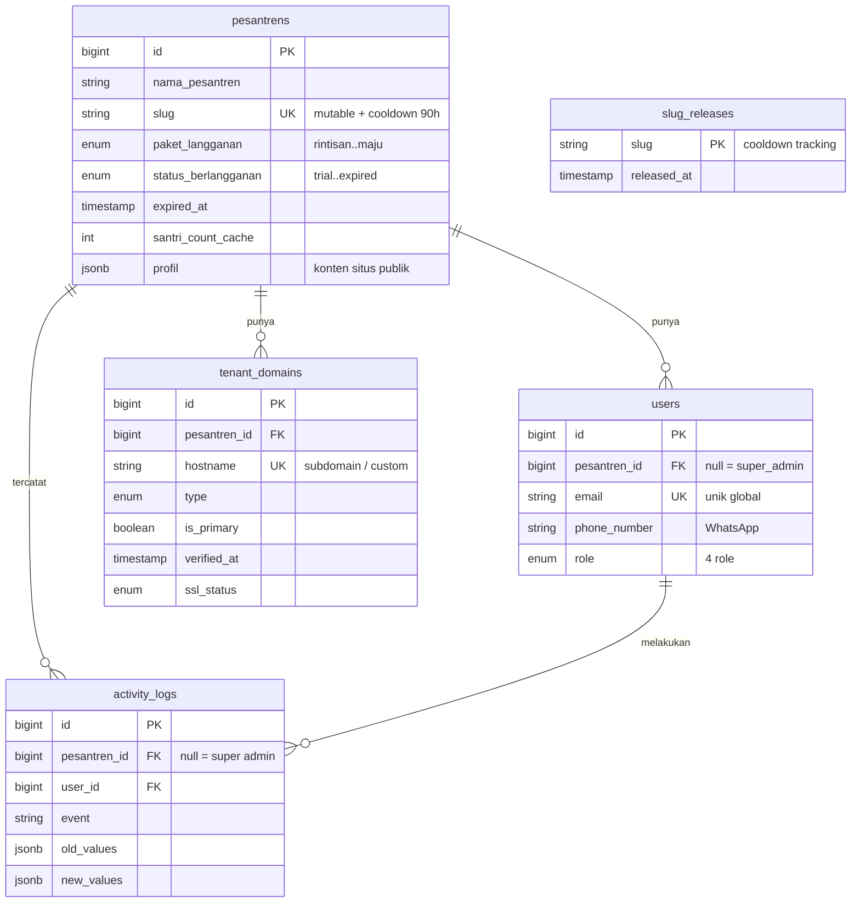

# PRODUCT REQUIREMENTS DOCUMENT (PRD)

**Project:** Walisantri.com (v1.0) — B2B Multi-Tenant SaaS (Hybrid: single-DB sekarang, schema/DB-per-tenant ready)
**Stack:** Laravel 13.11.1 (PHP 8.3+), Filament v5.6.3, Livewire v3, TailwindCSS, PostgreSQL 17, Redis, Cloudflare R2
**Dev/Deploy:** Laravel Herd (macOS) · GitHub Actions → VPS via SSH (deploy host-langsung, tanpa kontainer)
**Interface:** Mobile-first (Wali Santri), desktop-optimized (Admin/Ustadz)
**Last Updated:** Agustus 2026 — v4.20

**Changelog v4.20:** **Audit menyeluruh PRD ↔ kode.** v4.19 hanya merapikan §7/§8/§15/§17/§22; penyisiran seluruh dokumen (§1–§23) menemukan gap yang jauh lebih luas — termasuk dua kesalahan yang dibuat v4.19 sendiri. Tiga jenis temuan: **(a) klaim yang sudah salah** — tabel `tahfidz_ujian` masih didokumentasikan sebagai entitas terpisah padahal sudah dihapus dan dilebur ke `tahfidz_rapor` (paling fatal: query/migrasi berbasis PRD akan menargetkan tabel yang tidak ada); kolom `periode` di `kesantrian_karakter_rapor` yang NOT NULL tapi tidak pernah disebut; `kode_unik_fisik` yang masih ditulis unique global padahal sudah per-tenant; index `santri` yang diklaim ada tapi tidak; `pesantren_id` di dua tabel ekskul yang ternyata bukan FK; slug halaman di dalam cluster yang ditulis tanpa prefix cluster (`/admin/isi-harian` seharusnya `/admin/kesantrian/isi-harian`). **(b) spec yang tidak pernah dibangun** dan tidak ditandai demikian — §4.4 Queue Routing, §9.1 reset password & OTP WhatsApp, §11 job `DatabaseBackup` ke R2, §15 alur export asinkron, §6.2 disk `r2`, lima baris trigger WhatsApp di §12, UI Riwayat Aktivitas di §10.1; semuanya ditulis ulang jadi keadaan nyata dan dipindah ke daftar §22 "Di-skip". **(c) feature lock yang tidak mengunci apa pun** — kelima Gate paket di `AppServiceProvider` didefinisikan tapi nol kali dipanggil, sehingga paket Rintisan pun bisa memakai Inventaris yang menurut matriks §5.1 khusus Maju. Gate-nya **dihapus** daripada dibiarkan jadi fondasi yang menyesatkan; §5.1 kini menyatakan apa adanya bahwa yang membatasi hanya kuota santri, siklus langganan, dan role. Menegakkan matriks paket jadi keputusan bisnis yang eksplisit ditunda, bukan bug diam. Selain itu tiga bug terbuka dicatat di §22 sebagai cacat yang menunggu giliran — yang terpenting: **7 amalan default tidak pernah dibuat untuk pesantren yang mendaftar setelah migrasi `2026_06_23_000007`**, sehingga modul Mutaba'ah mereka kosong.

**Changelog v4.19:** Tujuh commit yang sebelumnya belum terdokumentasi, sekaligus koreksi §7/§8/§15/§17/§22 yang sudah tidak sesuai kode. (1) **Seluruh CRUD panel pindah ke modal form** — tidak ada lagi satu pun kelas `CreateX`/`EditX` di `app/Filament/Resources/**/Pages/`; semuanya diganti `CreateAction`/`EditAction` bermodal di tabel & header. Alasannya UX: admin pesantren mengisi data berulang (nilai, setoran, mutaba'ah) dan perpindahan halaman penuh memutus konteks daftar. Dikerjakan bertahap per cluster — Santri & Akademik, lalu Tahfidz/Mutabaah/Kesantrian, lalu Keuangan, lalu sisa panel (Pengguna, Pengumuman, Kupon, Pesantren, Rekening Bank). Dikunci tes per gelombang: `SantriModalCreateTest`, `AkademikModalFormTest`, `TahfidzModalFormTest`, `MutabaahModalFormTest`, `KesantrianModalFormTest`, `PanelModalTest`. (2) **Empat halaman rapor Filament jadi satu** — `Cluster Rapor` + `RaporAkademikPage`/`RaporTahfidzPage`/`RaporMutabaahPage`/`RaporKarakterPage` (dan 4 template PDF-nya) dihapus, diganti satu `App\Filament\Pages\RaporPage` top-level (slug `rapor`, sort 5) dengan checkbox modul `akademik · tahfidz · mutabaah · karakter` dan satu PDF gabungan `filament.pdf.rapor-gabungan`. Query tiap modul diekstrak jadi service `App\Services\Rapor\{RaporAkademikData,RaporTahfidzData,RaporMutabaahData,RaporKarakterData}::untuk($santriId, $tahunAjaran, $periode, $bulan)` supaya halaman dan PDF membaca sumber yang sama. Konsekuensi: Cluster Tahfidz menyusut dari 3 tab jadi 2 (Setoran · Ujian). (3) **Cluster Mutabaah dibubarkan, isinya masuk Cluster Kesantrian** — Mutaba'ah Harian dan Amal Master tidak lagi berdiri sendiri di sidebar; `MutabaahHarianPage` jadi halaman di dalam Kesantrian (slug `isi-harian`, tidak didaftarkan ke navigasi — dicapai dari tabel Mutabaah), Amal Master juga disembunyikan dari navigasi. Enam cluster top-level jadi lima. Dikunci `MutabaahNavigasiTest`. (4) **Cluster Pengaturan dibubarkan** — `BillingPage` dan `PesantrenSettingsPage` kembali jadi halaman lepas di grup Manajemen; slug `/admin/pengaturan` dipertahankan supaya tautan lama tidak putus. (5) **Halaman Input Nilai Massal** (`NilaiMassalPage`, slug `input-nilai-massal`, di Cluster Akademik tanpa entri navigasi) — grid satu layar untuk mengisi nilai sekelas sekaligus, dikunci `NilaiMassalPageTest`. (6) **Kolom "Link Wali" di daftar santri** — menyalin Magic Link tanpa membuka detail; disertai `filament.admin.clipboard-fallback` karena `navigator.clipboard` tidak tersedia di konteks non-HTTPS. (7) **Perbaikan bug halaman rapor wali** — lihat §8.

**Changelog v4.18:** **Staging dibubarkan — hanya ada satu environment (production).** Staging yang sempat berjalan sejak 2026-07-09 di VPS lama (`staging.walisantri.com`) dihentikan karena ongkos sewanya tidak sepadan dengan manfaat yang didapat. Job `deploy-staging` dihapus dari `.github/workflows/deploy.yml`; trigger push `dev` **tetap dipertahankan** supaya job `test` terus berjalan sebagai jeda pengaman sebelum PR ke `main` (alur `dev` → PR → `main` → auto-deploy production tidak berubah). §18 ditulis ulang dari "roadmap staging" jadi keputusan eksplisit satu-environment beserta tiga pagar penggantinya (job `test`, dump pra-deploy, maintenance mode). Uji-restore backup bulanan dipindah dari server staging ke DB uji di laptop — prosedur baru di `docs/backup-restore.md`, dan justru lebih dekat ke skenario "server hilang total, pulihkan di mesin lain". Catatan keamanan yang ikut terdokumentasi: DB staging lama membawa snapshot data production asli **berikut token Fonnte production** di `whatsapp_gateway_settings`, sehingga scheduler-nya berpotensi mengirim WA ke nomor wali sungguhan — kalau staging suatu saat dihidupkan lagi, kredensial terpisah & data non-produksi jadi syarat wajib.

**Changelog v4.17:** **Masa trial jadi 14 hari (sebelumnya 30) & dijadikan pengaturan, bukan hardcode** — `OnboardPesantren::execute()` sebelumnya hardcode `now()->addDays(30)`, sekarang baca `BillingSetting::get('trial_days', 14)` mengikuti pola persis `kuota_rintisan` yang sudah ada — super admin bisa ubah lewat halaman **Pengaturan Harga** (`BillingSettingsPage`, section baru "Masa Trial") tanpa perlu deploy. Teks halaman `/register` dan deskripsi halaman "Pengaturan Registrasi" ikut dibuat dinamis membaca nilai yang sama (sebelumnya keduanya juga hardcode "30 hari" terpisah, tidak sinkron dengan logika). Nilai awal di-seed 14 lewat migration baru.

**Changelog v4.17:** **Penugasan Ustadz** — menjawab kebutuhan membedakan ustadz pembimbing/pengampu/pencatat/penguji/pembina/wali kelas tanpa memecah `users.role`. Keputusan & alasannya didokumentasikan di §5.4 yang diperluas (dari "Aturan Pembimbing Ustadz"): keenam istilah itu penugasan, bukan tingkat hak akses, jadi disimpan sebagai FK di entitas yang ditugaskan — empat di antaranya memang sudah begitu sejak awal. (1) **Dua penugasan yang hilang dilengkapi** — `kelas.wali_kelas_id` (fondasi modul absensi, belum melebarkan cakupan apa pun hari ini) dan `ekskul_masters.pembina_id` (menggantikan ketergantungan pada teks bebas `pengajar`, yang tetap dipertahankan untuk pelatih luar tanpa akun; fallback dipusatkan di `EkskulMaster::namaPembina()`). (2) **`App\Support\PenugasanUstadz` baru** — satu sumber definisi "apa yang dipegang ustadz ini" (`santriIdsBimbingan`, `kelasIdsDiampu`, `kelasIdsPerwalian`, `mataPelajaranIdsDiampu`, `ekskulIdsDibina`). Sebelumnya definisi ini dihitung ad-hoc dan sudah mulai berbeda-beda antara `ScopesQueryToUstadzSantri`, `SantriResource`, dan dua method `SantriOptions` — docblock `SantriOptions` sendiri mengakuinya. Semua pemanggil dialihkan ke sana; `Santri::idsPembimbing()` jadi delegasi tipis ber-`@deprecated`. **Perilaku cakupan tidak berubah sama sekali** — 334 tes lama lulus tanpa disentuh. (3) **Daftar penugasan di halaman Pengguna** — `PenugasanUstadz::ringkasan()` menghasilkan badge "Pembimbing 12 santri · Wali Kelas 3A · Pengampu Fiqih 3A · Pembina Kaligrafi" di infolist & kolom tabel (toggleable), murni turunan FK tanpa kolom baru. (4) **Cakupan tetap terpisah per modul** — penugasan mengampu mapel tidak membuka modul tahfidz/mutaba'ah; dikunci tes eksplisit di `PenugasanUstadzTest` supaya pelebaran cakupan di masa depan harus jadi keputusan sadar, bukan efek samping refactor.

**Changelog v4.16:** (1) **Ringkasan Setoran Rapor Tahfidz: "Total Halaman" → "Total Juz"** — stat card di `RaporTahfidzPage` (Filament) dan PDF-nya sebelumnya menjumlah panjang range tiap setoran mentah-mentah (bisa dobel-hitung kalau ada overlap antar setoran); diganti jadi "Total Juz" pakai algoritma dedup yang sama dengan `TahfidzJuzCalculator` (halaman unik / 20). `TahfidzJuzCalculator::calculate()` sendiri menghitung akumulasi **sepanjang waktu** dari DB langsung, jadi tidak bisa dipakai langsung untuk scope periode terpilih — di-refactor, logika dedup-nya diekstrak jadi method baru `TahfidzJuzCalculator::juzFromRanges(iterable $ranges)` yang generik, dipanggil dari `calculate()` (semua data santri) maupun `RaporTahfidzPage::getSetoranStats()` (data yang sudah difilter periode). Metrik ini berbeda dari "Capaian Juz (Lulus)" yang sudah ada (dihitung dari `target_juz` ujian yang lulus, bukan dari halaman yang disetorkan). (2) **Margin PDF Rapor** — kelima dokumen PDF (Akademik, Karakter, Mutaba'ah, Tahfidz, Laporan gabungan wali) sebelumnya memakai margin default DomPDF (`1.2cm`, dari `vendor/dompdf/dompdf/lib/res/html.css`, tidak pernah di-override) sehingga konten terasa mepet; ditambahkan `@page { margin: 2.2cm 1.8cm; }` eksplisit di tiap template. (3) **Kop PDF Rapor disederhanakan** — teks "Walisantri.com" di bawah logo dihapus atas permintaan; nama pesantren dipromosikan jadi heading utama kop (18px, hijau, gaya yang tadinya dipakai teks "Walisantri.com").

**Changelog v4.15:** **Logo pesantren tampil di dokumen PDF Rapor & halaman login** — menyusul v4.14 (upload logo baru bisa dilakukan), dua tempat yang sudah lama menampilkan branding pesantren tapi belum/salah pakai logo kini diperbaiki. (1) **Header PDF Rapor** (Akademik, Karakter, Mutaba'ah, Tahfidz, dan Laporan gabungan wali — 5 template di `resources/views/filament/pdf/rapor-*.blade.php` & `resources/views/wali/pdf/laporan.blade.php`, semua sebelumnya text-only) kini menampilkan logo di atas nama aplikasi, jika ada. Karena `config/dompdf.php` punya `enable_remote => false` (DomPDF tak bisa fetch logo lewat URL), ditambahkan accessor baru `Pesantren::logo_path` (path filesystem absolut via `Storage::disk('public')->path()`, bukan URL) khusus untuk konteks render PDF — beda dari `logo_url` (v4.14) yang untuk konteks web. (2) **Bug fix halaman login** (`resources/views/auth/login.blade.php`) — logo pesantren selama ini dibaca langsung dari `profil['logo']` (path relatif disk, bukan URL), jadi ``-nya selalu rusak; diseragamkan pakai accessor `logo_url` sama seperti header profil publik.

**Changelog v4.14:** **Upload Logo & Galeri Pesantren** — §1.4 sejak awal mencantumkan logo & galeri sebagai bagian template MVP profil publik, tapi tidak pernah ada UI admin untuk mengunggahnya (selalu kosong, dikonfirmasi tak ada satupun seeder/factory yang pernah mengisi `profil['logo']`/`profil['galeri']`). Ditambahkan section baru "Logo & Galeri Pesantren" di `PesantrenSettingsPage` — `FileUpload` single untuk logo, `FileUpload` multi (maks 12 foto, reorderable) untuk galeri, keduanya ke disk `public` (R2 masih belum dikonfigurasi, lihat §22), mengikuti pola upload yang sudah established (`santri.foto_profil`, logo bank `PlatformBankAccountResource`). Berbeda dari kedua pola tersebut, `profil` adalah satu kolom JSON yang cuma ditulis dari halaman ini — cleanup file lama saat diganti/dihapus ditangani inline di `save()`, bukan lewat Observer terpisah. Path relatif disimpan di `profil` (bukan full URL), diresolve ke URL lewat accessor baru `Pesantren::logo_url` & `Pesantren::galeri_urls` (pola sama seperti `Santri::foto_profil_url`); blade profil publik (`public/partials/header.blade.php`, `public/profile.blade.php`) disesuaikan memakai accessor ini.

**Changelog v4.13:** Penyesuaian profil publik pesantren (`{slug}.walisantri.com`), sekaligus mengoreksi §1.4 yang sudah usang. (1) **Feed pengumuman publik dihapus** — pemilik produk memutuskan pengumuman tidak lagi cocok ditampilkan ke pengunjung publik; route `/pengumuman`, method controller, dan view terkait dibuang, nav & section "Pengumuman Terbaru" di beranda dihapus (data pengumuman tetap tampil di portal wali santri & dashboard admin — jalur kode terpisah total, tidak terdampak). (2) **Statistik ringkas & Program/Jenjang Pendidikan baru** — tiga kartu statistik (santri aktif, dihitung live dari relasi `santri()` karena kolom `santri_count_cache` ternyata tak pernah diupdate observer manapun; tahun berdiri; akreditasi) dan daftar program/jenjang (Repeater `nama` + `jenjang`) kini tampil di beranda profil, diisi admin pesantren lewat `PesantrenSettingsPage` (section baru "Program & Jenjang Pendidikan" dan "Statistik Ringkas"), disimpan di `profil` jsonb. (3) **Bug fix mismatch key kontak** — form pengaturan menyimpan nomor telepon sebagai `profil['telepon']`, tapi halaman publik selama ini membaca key `profil['kontak']` yang tidak pernah ditulis di mana pun sehingga telepon tidak pernah tampil; diseragamkan ke `telepon`. (4) **Roadmap: menu Kegiatan Pesantren & Artikel** — dua menu baru ditambah ke nav header profil publik; untuk saat ini keduanya mengarah ke halaman placeholder **"Segera Hadir"** (tanpa model/data baru), fitur penuhnya (CRUD kegiatan & artikel per-pesantren, kemungkinan CMS ringan) direncanakan pasca-MVP. Header profil publik diekstrak jadi partial `public.partials.header` agar konsisten dipakai beranda maupun halaman placeholder.

**Changelog v4.12:** (1) **Biodata: `jenis_kelamin`** — kolom `enum('laki_laki'/'perempuan') null` ditambahkan ke tabel `santri` (form & infolist di grup "Data Santri", kolom + filter di tabel daftar, ikut di-import Excel dengan parser toleran variasi teks "L"/"Laki-laki"/"P"/"Perempuan", dan ikut di export Data Santri + template import) — nullable karena data santri lama tidak punya nilai ini, sama seperti field biodata lain (lihat §3.2). (2) **Dashboard Admin Pesantren** — perbaikan actionability & kelengkapan widget yang sebelumnya belum pernah didokumentasikan di PRD (§4.6 selama ini hanya mencakup Dashboard Super Admin): widget **Tren Amalan 7 Hari** dikembalikan (sempat dihapus di window sebelum v4.9), **Status SPP** kini menampilkan total Rupiah tertunggak + tautan ke daftar tagihan, dua widget baru **Distribusi Nilai Setoran** & **Tren Setoran** (agregat seluruh pesantren, adaptasi dari widget dashboard ustadz), serta pesan empty-state untuk pesantren baru di seluruh widget chart — lihat §4.7 (baru).

**Changelog v4.11:** Rekening bank platform (untuk pembayaran manual upgrade/perpanjang langganan) dipindah dari hardcode `config('billing.bank_transfer')`/`.env` (2 slot tetap, tanpa logo, tanpa UI) ke tabel `platform_bank_accounts` (central) — jumlah bank jadi dinamis, tiap bank bisa punya `logo` (disk `public`, dibersihkan otomatis via Observer saat diganti/dihapus, pola sama `santri.foto_profil`), `urutan` tampil, dan toggle `aktif`. Resource Filament baru **Rekening Bank** (`PlatformBankAccountResource`, super_admin-only, grup navigasi Langganan) untuk CRUD-nya (lihat §3.1, §7). Halaman invoice (`OrderInvoicePage`, section "Cara Pembayaran") kini membaca dari tabel ini (hanya yang `aktif`, terurut), menampilkan logo bila ada, dan menambah tombol **"Salin"** per nomor rekening (vanilla JS clipboard, reuse pola dari modal Magic Link) — sekaligus dilengkapi varian dark-mode yang sebelumnya belum ada di section ini (lihat §16.1, baru — dokumentasi alur pembayaran manual Order/Invoice yang ternyata belum pernah ditulis di PRD).

**Changelog v4.10:** Bug fix — admin/ustadz pesantren expired/suspended tidak bisa membuka `/billing` (infinite redirect loop). Whitelist bebas-lock di `SaaSLifecycleLock` masih memakai path string hardcode `admin/billing-page`, tidak cocok lagi sejak `BillingPage` dipindah ke Cluster Pengaturan di v4.9 (URL asli `admin/pengaturan/billing-page`); diperbaiki ke pengecekan route name, dan `UpgradePage` (sebelumnya tidak pernah di-whitelist) ditambahkan. Sekaligus koreksi §5.5 — kolom Suspended untuk Admin/Ustadz seharusnya tertulis "redirect `/billing`" (tetap bisa bayar & reaktivasi mandiri), bukan "diblokir total" seperti yang tertulis sebelumnya; wali santri tetap diblokir total. Lihat §5.5.

**Changelog v4.9:** Dua modul baru, satu cluster navigasi baru, dan perubahan fundamental model data tahfidz. (1) **Tahfidz: migrasi juz-based → halaman-based** — kolom `ayat_mulai`/`ayat_selesai` pada `tahfidz_progress` diganti `halaman_mulai`/`halaman_selesai` smallint; `nama_surah` jadi nullable; `TahfidzJuzCalculator` kini menghitung `juz_hafal = min(total_halaman_unik / 20, 30)` — bukan lagi mapping ayat-per-surah presisi (lihat §3.2). (2) **Modul Ekstrakurikuler baru** — tabel `ekskul_masters` (master ekskul per-pesantren) & `santri_ekskuls` (partisipasi santri, level Pemula/Menengah/Mahir); Resource Filament masuk Cluster Akademik; tampil di Rapor Akademik & profil santri portal wali; tersedia semua paket, tanpa gate (lihat §3.2, §5.1, §7, §8). (3) **Modul Uang Saku Santri & Tarif SPP baru** — tabel `uang_saku_santri` (ledger setoran/pengambilan per santri) & `tarif_spp` (nominal SPP per kelas); Cluster **Keuangan** baru di grup Manajemen; portal wali dapat halaman `/wali/uang-saku` + tab baru di bottom nav; tersedia semua paket, tanpa gate (lihat §3.2, §5.1, §7, §8). (4) **Cluster Rapor baru** — cluster top-level menggabungkan 4 laporan (Akademik → Tahfidz → Mutabaah → Karakter) sebagai custom Page dengan filter & ekspor PDF seragam; Rapor Akademik dipindah keluar dari Cluster Akademik (lihat §7, §15). (5) **Restrukturisasi navigasi total** — grup top-level lama "Santri"/"Akademik"/"Keuangan" dibubarkan, semua jadi Filament Cluster (`Santri`, `Akademik`, `Tahfidz`, `Mutabaah`, `Kesantrian`, `Rapor` — semua top-level tanpa group; `Keuangan` & `Pengaturan` sebagai Cluster di dalam grup Manajemen bersama Pengguna & Pengumuman); `navigationGroups()` kini hanya mendaftarkan `Kesantrian, Langganan, Manajemen` (lihat §7). (6) **Business rule santri** — ustadz kini bisa mengedit santri di halaqahnya sendiri (sebelumnya create/edit admin-only, kini create tetap admin-only tapi edit admin + ustadz, lihat §5.4). (7) **Skema periode diseragamkan** — `nilai_akademik`, `kesantrian_karakter_rapor`, dan `tahfidz_rapor` sama-sama mendapat kolom `bulan`; unique constraint `nilai_akademik` bertambah `bulan` (lihat §3.2). (8) **`kesantrian_kesehatan`** bertambah `jenis_rekam` enum(`keluhan`/`rutin` — field keluhan jadi nullable saat `rutin`) & status pemulihan baru `Sembuh` + `tanggal_sembuh` (lihat §3.2). (9) **Selesai, pindah dari roadmap/di-skip:** Excel Importer massal santri (§22), foto profil santri `santri.foto_profil` (§3.2), Daftar Inventaris wali (§8/§22); `santri.wali_santri_id`/`pembimbing_ustadz_id` jadi nullable untuk mendukung import sebelum akun terkait dibuat (§3.2). (10) **Export & tiering diselaraskan ke kode aktual** — Export Rekam Medis kini didokumentasikan tanpa gate paket (sebelumnya tertulis "Berkembang+", kode tidak pernah menegakkannya — selaras v4.6 yang sudah memindahkan modul Kesehatan sendiri ke Rintisan+); koreksi §5.1 — Gate `access-modul-spp`/`access-modul-prestasi` yang sebelumnya disebut PRD ternyata tidak ada di `AppServiceProvider` (modul-modul ini memang tak pernah di-gate, hasil akhir tetap "tersedia semua paket"). (11) **Audit event** `magic_link.sent` dikoreksi jadi `magic_link.viewed` (dipicu saat modal Kirim Magic Link dibuka di Filament, bukan saat WhatsApp benar-benar terkirim — §10.2).

**Changelog v4.8:** Penyempurnaan modul Kesantrian & UX panel admin, tidak ada perubahan model bisnis. (1) **Amalan Mutaba'ah Dinamis** — kolom boolean hardcode (`jamaah_5_waktu`, `is_rawatib`, dll.) pada tabel `kesantrian_mutabaah` diganti satu kolom `amalan jsonb default '{}'`; konfigurasi amalan dikelola via tabel master baru `kesantrian_amal_master` (per-pesantren: kode, label, tipe `boolean`/`hitungan`, nilai_maks, satuan, icon, bobot, urutan, aktif) — setiap pesantren bisa menambah/menonaktifkan jenis amalan sendiri tanpa perubahan skema (lihat §3.2). (2) **Restrukturisasi navigasi Kesantrian** — "Kesantrian (group)" dipecah jadi dua **Filament Cluster** terpisah: **Cluster Mutabaah** (Mutaba'ah Harian + Amal Master) dan **Cluster Kesantrian** (Karakter Rapor + Kesehatan + Inventaris); keduanya `$navigationGroup = null` (top-level di sidebar, tidak dalam group) — lihat §7. (3) **Biodata: `tanggal_lahir`** — kolom `tanggal_lahir date null` ditambahkan ke tabel `santri` (form DatePicker, infolist, cast `date`) — lihat §3.2. (4) **UX panel admin** — sidebar Filament kini `sidebarFullyCollapsibleOnDesktop()`; tambah bottom navigation mobile di Filament admin panel via render hook `BODY_END` (view `filament.admin.bottom-nav`) — lihat §7. (5) **Dashboard wali: branching** — wali dengan tepat 1 anak aktif langsung tampil halaman detail penuh; wali dengan >1 anak tampil cards ringkasan per anak — lihat §8.

**Changelog v4.7:** Perubahan operasional & UX panel admin, tidak ada perubahan model bisnis. (1) **Git workflow** — branch `dev` ditambahkan sebagai branch kerja; CI (job `test`) jalan di push ke `dev` maupun `main`, tapi job `deploy` (SSH ke VPS) hanya jalan dari `main`; branch `main` diberi **branch protection** (wajib PR, wajib status check `Test` lolos & up-to-date, tanpa approval review wajib karena solo-dev) — lihat §6.4 & §18. (2) **Biodata Santri** — tambah kolom `nama_panggilan`, `nama_ayah`, `nama_ibu`, `alamat_lengkap`, `jumlah_saudara`, `ciri_fisik`, `cita_cita` pada tabel `santri` (lihat §3.2); tampil di form & halaman detail Filament. "Karakter dominan/Kelebihan/Kekurangan" sengaja tidak ditambahkan (tumpang tindih dengan modul Karakter Rapor yang sudah dinamis/periodik); "Suku" sengaja tidak ditambahkan (data sensitif, tanpa kebutuhan operasional jelas). (3) **Restrukturisasi navigasi Filament** — 3 resource Tahfidz (Setoran/Ujian/Nilai, sebelumnya flat di grup Akademik) digabung jadi satu **Filament Cluster "Tahfidz"** dengan navigasi tab (dipindah ke atas breadcrumbs via render hook, tampil konsisten desktop & mobile); halaman **Rapor Akademik** kini menampilkan section Nilai Akademik **dan** Nilai Tahfidz sekaligus (satu rekap + satu PDF gabungan, model data tetap terpisah); menu **Pengumuman** dipindah ke grup **Manajemen**; menu **Prestasi Santri** diberi label tampilan **Prestasi** (slug `prestasi-santris` → `prestasi`; nama tabel/model tidak berubah — URL penuhnya jadi `/admin/santri/prestasi` sejak resource ini masuk Cluster Santri di v4.9) — lihat §7. (4) **Bug fix** — field `tahun_ajaran` pada input Nilai Akademik & Rapor Tahfidz diubah dari teks bebas jadi dropdown standar (mencegah mismatch format yang menyebabkan nilai tidak muncul di rapor). (5) Landing page: hapus klaim "Tidak perlu kartu kredit · Setup 5 menit" (tidak relevan, sistem ini berbasis trial+konfirmasi manual, bukan kartu kredit otomatis).

**Changelog v4.6:** Revisi **model bisnis & harga** — (1) harga paket **Berkembang** diturunkan Rp 450.000 → **Rp 350.000**/bulan agar lompatan harga lebih gradual (rasio ×2,3 vs ×3 sebelumnya); (2) **paket Gratis dihapus** — diganti model **trial Rintisan 30 hari gratis** (kuota 100 santri, fitur penuh Rintisan) agar calon pelanggan merasakan nilai nyata sebelum berkomitmen; (3) **Modul Kesehatan** dipindah ke **Rintisan+** (sebelumnya Berkembang+) — rekam medis adalah kebutuhan keselamatan dasar boarding school, bukan fitur premium; (4) lifecycle baru: trial 30 hari → expired → **grace period 7 hari** (admin/ustadz redirect `/billing`, wali read-only) → **suspended**; (5) **paket Maju** izinkan X=0 — 1.000 santri = Rp 750.000/bulan (base price, tanpa add-on); (6) opsi durasi **6 bulan** ditambah ke §5.2 (bayar 5, aktif 6); (7) **§5.6 baru** — Kebijakan Retensi (jaminan harga terkunci, program referral); (8) simulasi bisnis & **target milestone klien** di §21 diperbarui; (9) landing page kini memiliki **seksi #harga** dengan toggle bulanan/tahunan dan 4 kartu paket; (10) **paket Tumbuh** ditambah — 250 santri, Rp 299.000/bulan, posisi "Paling Populer" (lihat §5.1); (11) **kebijakan minimum durasi upgrade** — sisa aktif > 6 bulan wajib minimum 6 bulan, sisa > 9 bulan wajib 12 bulan (lihat §16).

**Changelog v4.5:** Modul **Akademik Formal** — entitas baru `mata_pelajaran` (kelas + ustadz pengampu tetap, master data `admin_pesantren`) dan `nilai_akademik` (nilai tunggal per santri/mapel/periode, input `admin_pesantren` + `ustadz` pengampu, unique `(santri_id, mata_pelajaran_id, tahun_ajaran, periode)`); halaman **Rapor Akademik** agregasi nilai per santri dengan ekspor PDF (reuse `barryvdh/laravel-dompdf`). Grup navigasi Filament **Akademik** baru — menggabungkan Mata Pelajaran, Nilai Akademik, Rapor Akademik dengan 3 resource Tahfidz yang dipindah dari grup Kesantrian (selaras nama modul §3.2 & §5.1). Tersedia di semua paket (gate `access-modul-akademik` sudah ada sejak v4.x). Closes gap landing page yang sejak awal menjanjikan modul ini (lihat §22 — "akademik formal" kini bukan lagi item ditunda). **Selain itu:** halaman **Rapor** portal wali (`/wali/rapor` + ekspor PDF) — yang ternyata sudah lama dibangun penuh namun belum tertaut navigasi & masih tercatat keliru sebagai "roadmap/di-skip" di §8/§22 — kini ditautkan sebagai tab ke-5 bottom nav wali (Beranda · Santri · SPP · Pengumuman · **Rapor**) dan PRD diselaraskan ke status "selesai" (lihat §8); view duplikat mati `wali/pengumuman/index.blade.php` turut dibersihkan.

**Changelog v4.4:** Modul **SPP** (Sumbangan Pembinaan Pendidikan) — tagihan bulanan manual per santri, rekening bank pesantren disimpan di `profil` jsonb, konfirmasi transfer oleh wali (upload foto bukti → status `menunggu_konfirmasi`), verifikasi & tandai lunas oleh admin, notifikasi tunggakan di dashboard wali; tabel `tagihan_spp` + `pembayaran_spp` (tenant/). Modul **Prestasi Santri** — CRUD prestasi (judul, kategori, tingkat, posisi, tanggal, penyelenggara, sertifikat) dengan enum `TingkatPrestasi` (internal/kabupaten/provinsi/nasional/internasional); tabel `prestasi_santri` (tenant/); tampil di portal wali pada halaman detail santri. **Demo Request / Waiting List** — halaman `/demo` di landing page (form waiting list: nama pesantren, kontak, email, HP, jumlah santri, kota, catatan); tabel `demo_requests` (central/); `DemoRequestResource` di Filament hanya `super_admin` (list, view, tandai dihubungi). Grup navigasi **Keuangan** baru di panel Filament.

**Changelog v4.3:** `kelas` & `kamar` diangkat menjadi entitas master (tabel `kelas`, `kamar` per-tenant; kolom string di `santri` migrasi ke FK) · Resource Filament CRUD Kelas & Kamar hanya `admin_pesantren` · grup navigasi "Santri" berisi Santri, Kelas, Kamar · aturan bisnis baru: ustadz hanya bisa membimbing **maks 20 santri aktif** (validasi di form + query scope) · kebijakan **harga tahunan: bayar 10 bulan, aktif 12 bulan** (enum `DurasiLangganan` + `BillingCalculatorService`) · portal wali sudah selesai MVP: dashboard (sapaan + daftar santri + pengumuman), statistik tahfidz, statistik kesehatan, detail mutaba'ah harian per santri · billing upgrade flow selesai (pilih paket, invoice, konfirmasi admin).

**Changelog v4.2:** Super Admin dikonsolidasikan ke `app.walisantri.com/admin` — `dash.walisantri.com` & `DashPanelProvider` dihapus · satu panel Filament untuk semua role (`admin`, `admin_pesantren`, `ustadz`), visibilitas menu dikontrol `canAccess()`/`canView()` per role · widget Dashboard Central (SystemStatsWidget, ExpiringTenantsWidget, TenantListWidget) pindah ke admin panel dengan `canView()` hanya `super_admin` · IP-whitelist Nginx dialihkan ke path `/admin` di `app` · route `/admin/login` (Filament bawaan) dihapus — semua role wajib lewat `/login` terpusat (branded, `?tenant={slug}`) via `FilamentAuthenticate` middleware.

**Changelog v4.1:** Model deploy difinalkan ke **host-langsung** (bukan kontainer) demi efisiensi resource VPS 4GB — Coolify & Docker ditolak (overhead idle) · **§6.6 baru** observability ringan no-Coolify (`LOG_CHANNEL=daily` + Sentry, UptimeRobot, GoAccess on-demand, htop/ncdu, Laravel Pulse opsional) · Docker Compose dicatat di §22 sebagai keputusan tertunda dengan pemicu eksplisit.

**Changelog v4.0:** Login terpusat di `app.walisantri.com` (tenant di-resolve dari akun) · subdomain `{slug}.walisantri.com` jadi **website profil publik** (slug mutable) · custom domain di roadmap · hybrid tenancy · **PostgreSQL 17** (RLS native + pgvector untuk AI) · Cloudflare R2 · CI/CD GitHub Actions. *(v3.0: Filament v5, path-based routing, Dashboard Central. v2.0: row-level security, RBAC 4 role, modul Tahfidz & Kesantrian.)*

---

# Product Vision Statement

**Visi:** Menjadi standar digitalisasi pesantren Indonesia — platform pengasuhan & akademik terlengkap, terjangkau, dan dipercaya oleh setiap lembaga, dari rintisan hingga besar.

**Tagline:** Memberi setiap pesantren — berapapun ukurannya — kemampuan membuktikan kualitas pengasuhannya secara transparan, terukur, dan real-time.

| Pilar | Maksud | Implikasi Produk |
|---|---|---|
| Terlengkap | Satu platform: akademik, pengasuhan, kesehatan, inventaris, komunikasi | Tidak perlu sistem lain di samping Walisantri |
| Terjangkau | Mulai Rp 150.000/bulan | Paket Rintisan fungsional penuh, bukan fitur terpotong |
| Dipercaya | Data aman, terisolasi per lembaga, akuntabel | Isolasi tenant & audit log = fondasi, bukan fitur tambahan |

**Filter keputusan fitur** (jika >1 jawaban "tidak" → antrian rendah/ditolak): (1) Meningkatkan kredibilitas/akuntabilitas pesantren? (2) Bisa dirasakan paket Rintisan? (3) Mendekatkan ke posisi standar digitalisasi pesantren?

---

# 1. Architectural Foundation & Tenant Isolation

## 1.1 Row-Level Multi-Tenancy

Setiap tabel operasional wajib punya kolom `pesantren_id` (FK). Trait `Multitenantable` menyuntik `WHERE pesantren_id = auth()->user()->pesantren_id` otomatis pada SELECT/UPDATE/DELETE — kecuali `super_admin`. Model pakai PHP 8.3 Attributes:

```php
#[Table('santri')]
#[Fillable(['pesantren_id', 'wali_santri_id', 'nis', 'nama_lengkap', 'kelas_id', 'kamar_id', 'status_aktif'])]
#[Hidden(['pesantren_id'])]
class Santri extends Model {
    use BelongsToPesantren, HasFactory, HasUuids, Multitenantable, SoftDeletes;
    public function uniqueIds(): array { return ['uuid']; } // batasi HasUuids hanya ke kolom uuid
}
// Catatan: `uuid` sengaja TIDAK masuk Fillable — diisi HasUuids, bukan dari input.
```

> **PostgreSQL RLS (lapisan kedua):** selain Global Scope di aplikasi, PostgreSQL Row-Level Security dapat menegakkan isolasi di level database — `ENABLE ROW LEVEL SECURITY` + policy `pesantren_id = current_setting('app.current_pesantren')::bigint`. Konteks tenant di-set per request via `SET app.current_pesantren` (dari sesi login di `app`, lihat §1.3–1.4). Defense-in-depth: jika scope aplikasi bocor, DB tetap memblokir. Aktifkan setelah trait stabil; Super Admin pakai role `BYPASSRLS`.

## 1.2 Hybrid Tenancy Strategy

- **DB Central** (koneksi `central`): tabel `pesantrens`, `users`, `tenant_domains`, `activity_logs`, `master_pengumuman_central` — untuk autentikasi, lookup tenant dari akun, dan resolusi host publik. **Saat ini "central" hanya pemisahan logis:** koneksi `central` dan `tenant` menunjuk database yang sama (`config/database.php` — `CENTRAL_DB_DATABASE` jatuh ke `DB_DATABASE`), dan model tidak menyetel `$connection`. Pemisahan fisik baru relevan saat schema/DB-per-tenant dikerjakan.
- **DB Tenant** (koneksi `tenant`; saat ini single shared DB, roadmap schema-per-tenant): semua data operasional.
- `Multitenantable` Global Scope (+ RLS opsional) tetap aktif sebagai lapisan keamanan kedua selama single DB.
- Migrasi dipisah: `database/migrations/central/` & `database/migrations/tenant/`.
- Rencana saklar mode `single_database` ↔ `per_schema` (schema-per-tenant native PostgreSQL via `SET search_path`) **belum ada**: tidak ada `config/tenancy.php`, dan `TENANCY_MODE` di `.env.example` tidak dibaca kode mana pun. Saat ini hanya `single_database` yang berjalan, tanpa saklar.

## 1.3 Host Model, Login Terpusat & Resolusi Tenant

Empat jenis host dengan peran berbeda:

| Host | Sifat | Fungsi |
|---|---|---|
| `walisantri.com` | Publik | Landing + `/register` |
| `{slug}.walisantri.com` | Publik, tanpa auth (cacheable) | **Website profil pesantren** — subdomain **mutable** |
| `app.walisantri.com` | Terautentikasi | Login tunggal semua role → panel admin/ustadz/super_admin & portal wali |

**Login terpusat:** Semua role login di `app.walisantri.com` (satu host tetap). Tenant **di-resolve dari akun**, bukan dari host: lookup `users` by email → ambil `pesantren_id` → set konteks tenant (`app()->instance('current_pesantren', …)` + `SET app.current_pesantren` untuk RLS). Sejalan dengan model multi-tenancy native Filament v5 (satu panel, tenant dari user).

**Pintu masuk & branding wali:** Wali santri masuk **dari situs profil pesantren** — tombol "Portal Wali Santri" di `{slug}.walisantri.com` mengarah ke `app.walisantri.com/login?tenant={slug}`. Halaman login membaca `tenant` dari query dan **dirender penuh ber-brand pesantren** (logo, nama, warna) sehingga terasa seperti gerbang pesantren itu, bukan platform generik — meski host auth tetap `app`. Ini memberi keterikatan brand tanpa menduplikasi mekanisme auth atau mengikat sesi ke subdomain yang bisa berubah. **Magic Link WhatsApp (§4.3) tetap jalur utama wali** (klik langsung masuk read-only); form login adalah jalur sekunder bagi wali yang menyetel password. Tombol login admin/ustadz juga memakai `?tenant={slug}` agar branding konsisten.

> **Email unik global (keputusan sadar; sebagian dilonggarkan v4.9):** karena tenant di-resolve dari email, satu email tidak bisa dipakai di dua pesantren. **Sejak `central/2026_07_09_100001` kolom `email` nullable** — wali boleh dibuat tanpa email (identitasnya `phone_number` + Magic Link). Konsekuensinya wali tanpa email **tidak bisa login lewat form** (`WaliLoginController` mewajibkan email), hanya lewat Magic Link. Untuk MVP ini diterima — kasus wali dengan anak di pesantren berbeda memakai email sama tidak didukung. "Multi-Anak Logic" (§4.1) tetap jalan selama anak-anak di pesantren yang sama.

**Dua mode TenantResolver:**
- *Host publik* (`{slug}.walisantri.com` / custom domain): `PublicTenantResolver` cocokkan `$request->getHost()` ke tabel `tenant_domains` → `pesantren_id`. Read-only, hanya untuk render situs profil — **tidak pernah** mengakses data operasional santri.
- *App* (`app.walisantri.com`): konteks tenant dari sesi login. Host tidak dipakai untuk resolusi.

## 1.4 Website Profil Pesantren

Tiap pesantren **otomatis** mendapat situs profil publik di `{slug}.walisantri.com` segera setelah registrasi. MVP: template minimal (logo, deskripsi, alamat, kontak, galeri, statistik ringkas — santri aktif/tahun berdiri/akreditasi, program & jenjang pendidikan), dikelola dari panel admin (`PesantrenSettingsPage`). CMS/page-builder penuh = post-v1.0. Pemisahan ketat: situs publik tidak boleh membaca data santri.

**Roadmap — Kegiatan Pesantren & Artikel:** dua menu tersedia di nav header (`/kegiatan`, `/artikel`), tapi untuk saat ini keduanya hanya menampilkan halaman placeholder **"Segera Hadir"** — belum ada model/data, CRUD, atau editor konten. Fitur penuhnya (kemungkinan CMS ringan per-pesantren) direncanakan pasca-MVP (lihat Changelog v4.13).

**Feed pengumuman publik:** sempat ada di MVP awal, **dihapus** (Changelog v4.13) atas keputusan produk — pengumuman internal dinilai tidak cocok dibuka ke pengunjung publik. Pengumuman tetap berjalan normal di portal wali santri & dashboard admin.

**Slug rules:** huruf kecil/angka/tanda hubung, 3–30 char, tidak diawali/diakhiri hubung. Validasi real-time via `GET /check-slug/{slug}`. **Mutable** — bisa diubah kapanpun dari panel admin (aman karena tidak ada auth/magic-link yang bergantung pada subdomain; identitas kanonik = `pesantrens.id`). Tiap perubahan kena validasi reserved/format + dicatat audit (`pesantren.slug_changed`). Slug lama masuk **cooldown 90 hari** sebelum bisa diklaim tenant lain (cegah pembajakan brand). Reserved (Rule `SlugNotReserved`): `www app api admin central dash mail billing status docs blog support panel dashboard static cdn`.

**Custom domain (roadmap, add-on Maju):** pesantren pakai domain sendiri (mis. `www.pesantrenfulan.sch.id`). Butuh verifikasi kepemilikan DNS (CNAME/TXT) + SSL otomatis per domain (di luar wildcard `*.walisantri.com`). **Default: Cloudflare for SaaS / Custom Hostnames** (gratis ≤100 hostname, lalu berbayar per hostname; cert otomatis, ops paling ringan). **Fallback: Caddy on-demand TLS** (gratis penuh, untuk volume besar; wajib endpoint "ask" agar cert hanya terbit untuk hostname terverifikasi di `tenant_domains`). Subdomain bawaan tetap pakai wildcard cert yang sudah ada.

## 1.5 Infrastruktur Wildcard

Subdomain profil baru aktif otomatis tanpa sentuh DNS/config:
- Wildcard SSL `*.walisantri.com` via Certbot + Cloudflare DNS-01.
- Satu A record Cloudflare `* → IP VPS`; `app` sebagai host tetap.
- Satu server block `server_name *.walisantri.com` (Nginx; atau Caddy bila custom domain diaktifkan).

## 1.6 Routing System

| Host | Path | Pengguna |
|---|---|---|
| `walisantri.com` | `/` · `/register` · `/check-slug/{slug}` | Landing · onboarding · API cek slug (JSON) |
| `{slug}.walisantri.com` (+ custom domain) | `/` · `/kegiatan` · `/artikel` | Website profil publik (read-only, tanpa auth); `/kegiatan` & `/artikel` saat ini placeholder "Segera Hadir" |
| `app.walisantri.com` | `/login` · `/admin` | Login tunggal · panel Filament (Super Admin, Admin Pesantren, Ustadz) — menu per role via `canAccess()` |
| `app.walisantri.com` | `/wali/dashboard` · `/report/{uuid}` · `/admin/billing-page` | Portal wali · Magic Link read-only · billing (halaman Filament, bukan route `/billing`) |

## 1.7 Pola Penambahan Modul

Kontrak resmi untuk menambah modul baru — ubah pola tersirat jadi checklist eksplisit agar konsistensi terjaga lintas sesi/waktu:

1. **Tabel tenant** dengan kolom `pesantren_id` (FK) wajib + kolom domain modul.
2. **Trait `Multitenantable`** pada model (Global Scope + auto-assign `pesantren_id` saat `creating`).
3. **Composite index** `(pesantren_id, [entity_id], [tanggal])` sesuai pola query; unique constraint per-tenant bila relevan.
4. **Migrasi** di `database/migrations/tenant/` (atau `central/` bila entitas lintas-tenant). Index bernama eksplisit (batas 63 char).
5. **Gate** `access-modul-{x}` di `AppServiceProvider` + satu baris di matriks tiering (§5.1) bila modul berbayar/terkunci paket.
6. **Resource Filament** di grup navigasi yang sesuai (§7), dengan `canView()`/policy mengikuti Gate.
7. **RLS policy** per tabel (bila RLS aktif) — pola sama: `pesantren_id = current_setting('app.current_pesantren')`.
8. **Test isolasi tenant** di `tests/TenantIsolation/` + unit test business logic; wajib lulus sebelum deploy.
9. **Event audit** `{modul}.{aksi}` di `activity_logs` bila modul mengubah data sensitif.
10. **Enum yang bisa tumbuh** (kategori yang mungkin bertambah/berbeda antar-pesantren) → buat tabel referensi `master_{x}` per-tenant, **bukan** CHECK constraint hardcoded. Enum tetap (mis. `A/B/C/D`) boleh hardcoded.

> *Pola ini mulus untuk modul **per-santri** (mengikuti bentuk `santri` + modul tahfidz/kesantrian). Modul yang **bukan per-santri** (keuangan, SDM, akademik formal) menyimpang dari pola dan memicu keputusan di §22 "Batas yang Diketahui".*

---

# 2. Actors, RBAC & Login Flow

**Satu pintu login:** `app.walisantri.com/login` — semua role. Tenant di-resolve dari akun (email unik global, §1.3).

Setelah autentikasi, `role` dibaca lalu di-redirect — dilakukan di `WaliLoginController::redirectAfterLogin()` dan closure route `/`, **bukan** di middleware (`ResolveTenantFromAccount` hanya menyetel konteks tenant):

| Role | Redirect | Akses |
|---|---|---|
| `super_admin` | `app.../admin` | Kelola semua tenant, billing, kuota (lintas tenant via `withoutGlobalScope` / role `BYPASSRLS`) |
| `admin_pesantren` | `app.../admin` | Kontrol penuh data lembaga, user, impor, pemetaan kelas/kamar, profil publik, billing |
| `ustadz` | `app.../admin` | Input mutaba'ah, tahfidz, nilai mapel yang diampu, rekam medis santri binaan (§5.4). *Presensi belum ada modulnya* |
| `wali_santri` | `app.../wali/dashboard` | Portal read-only perkembangan santri |

---

# 3. Core Database Schema

PostgreSQL 17, FK constraints ketat, composite index `(pesantren_id, [entity_id], [tanggal])`. Tipe enum diimplementasikan sebagai `CHECK` constraint via Laravel migration (atau native `CREATE TYPE` bila perlu).

## 3.0 ERD

ERD dipecah dua sesuai batas hybrid-tenancy. Atribut diringkas ke kolom kunci (PK/FK/UK + pembeda); daftar kolom/index/constraint lengkap ada di §3.1–3.2. FK `santri` (`pesantren_id`, `wali_santri_id`, `pembimbing_ustadz_id`) menunjuk tabel di DB Central — FK fisik di MVP single-DB, jadi referensi logis (enforce aplikasi) saat pindah ke schema-per-tenant.

**DB Central:**


```mermaid
erDiagram
  pesantrens ||--o{ users : punya
  pesantrens ||--o{ tenant_domains : punya
  pesantrens ||--o{ activity_logs : tercatat
  users ||--o{ activity_logs : melakukan
  pesantrens {
    bigint id PK
    string nama_pesantren
    string slug UK "mutable + cooldown 90h"
    enum paket_langganan "rintisan..maju"
    enum status_berlangganan "trial..expired"
    timestamp expired_at
    int santri_count_cache
    jsonb profil "konten situs publik"
  }
  users {
    bigint id PK
    bigint pesantren_id FK "null = super_admin"
    string email UK "unik global"
    string phone_number "WhatsApp"
    enum role "4 role"
  }
  tenant_domains {
    bigint id PK
    bigint pesantren_id FK
    string hostname UK "subdomain / custom"
    enum type
    boolean is_primary
    timestamp verified_at
    enum ssl_status
  }
  activity_logs {
    bigint id PK
    bigint pesantren_id FK "null = super admin"
    bigint user_id FK
    string event
    jsonb old_values
    jsonb new_values
  }
  slug_releases {
    string slug PK "cooldown tracking"
    timestamp released_at
  }
```

**DB Tenant:**


```mermaid
erDiagram
  kelas ||--o{ santri : masuk
  kamar ||--o{ santri : tinggal
  santri ||--o{ tahfidz_progress : setoran
  santri ||--o{ tahfidz_rapor : rapor
  kelas ||--o{ mata_pelajaran : memuat
  mata_pelajaran ||--o{ nilai_akademik : dinilai
  santri ||--o{ nilai_akademik : memperoleh
  santri ||--o{ santri_ekskuls : ikut
  ekskul_masters ||--o{ santri_ekskuls : diikuti
  santri ||--o{ kesantrian_mutabaah : amalan
  santri ||--o{ kesantrian_karakter_rapor : karakter
  santri ||--o{ kesantrian_kesehatan : medis
  santri ||--o{ kesantrian_inventaris : barang
  santri ||--o{ tagihan_spp : tagihan
  santri ||--o{ uang_saku_santri : ledger
  kelas ||--o{ tarif_spp : tarif
  santri ||--o{ prestasi_santri : prestasi
  tagihan_spp ||--o{ pembayaran_spp : bayar
  kelas {
    bigint id PK
    bigint pesantren_id FK
    string nama_kelas UK "unik per pesantren"
  }
  kamar {
    bigint id PK
    bigint pesantren_id FK
    string nama_kamar UK "unik per pesantren"
  }
  santri {
    bigint id PK
    bigint pesantren_id FK "ke central"
    bigint wali_santri_id FK "ke users, null"
    bigint pembimbing_ustadz_id FK "ke users, null"
    bigint kelas_id FK "ke kelas"
    bigint kamar_id FK "ke kamar"
    uuid uuid UK "token Magic Link"
    string nis "unik per pesantren"
    string nama_lengkap
    enum jenis_kelamin "laki_laki/perempuan, null"
    string foto_profil "path file, null"
    boolean status_aktif
    timestamp deleted_at "SoftDeletes"
  }
  tahfidz_progress {
    bigint santri_id FK
    bigint ustadz_id FK
    date tanggal
    enum tipe_setoran "Sabaq/Sabqi/Manzil"
    smallint halaman_mulai "halaman mushaf"
    smallint halaman_selesai "halaman mushaf"
    enum nilai_kelancaran "Mumtaz..Maqbul"
  }
  tahfidz_rapor {
    bigint santri_id FK
    bigint penguji_id FK "null"
    date tanggal_ujian "null"
    tinyint target_juz "null"
    enum status_kelulusan "null, Lulus/Mengulang"
    string tahun_ajaran
    enum periode "Bulanan/Semester_Ganjil/Semester_Genap"
    string bulan "null, diisi saat periode Bulanan"
    enum nilai_tilawah "A/B/C/D"
  }
  mata_pelajaran {
    bigint id PK
    bigint pesantren_id FK
    bigint kelas_id FK "ke kelas"
    bigint ustadz_id FK "ke users — pengampu tetap"
    string nama_mapel
  }
  nilai_akademik {
    bigint id PK
    bigint pesantren_id FK
    bigint santri_id FK
    bigint mata_pelajaran_id FK
    string tahun_ajaran
    enum periode "Bulanan/Semester_Ganjil/Semester_Genap"
    string bulan "null, diisi saat periode Bulanan"
    smallint nilai "0-100"
  }
  ekskul_masters {
    bigint id PK
    bigint pesantren_id FK
    string nama
    boolean aktif
  }
  santri_ekskuls {
    bigint id PK
    bigint santri_id FK
    bigint ekskul_id FK "ke ekskul_masters"
    enum level "pemula/menengah/mahir"
    date tanggal_mulai
    boolean aktif
  }
  kesantrian_mutabaah {
    bigint santri_id FK
    date tanggal
    smallint jamaah_5_waktu
    boolean is_rawatib
    enum status_udzur "Tidak/Sakit/Haid.."
  }
  kesantrian_karakter_rapor {
    bigint santri_id FK
    date tanggal_input
    string tahun_ajaran "null"
    string bulan "null"
    enum adab "7 kolom A/B/C/D"
    enum kepribadian "9 kolom A/B/C/D"
    text log_kasus_khusus
  }
  kesantrian_kesehatan {
    bigint santri_id FK
    date tanggal_periksa
    enum jenis_rekam "keluhan/rutin"
    enum kategori_keluhan "null saat rutin"
    enum status_pemulihan "auto-udzur, + Sembuh"
    date tanggal_sembuh "null"
  }
  kesantrian_inventaris {
    bigint santri_id FK
    string kode_unik_fisik "unique per pesantren"
    smallint kuota_regulasi_maksimal
    enum kondisi_barang "Baik/Rusak/Hilang"
  }
  tagihan_spp {
    bigint id PK
    bigint pesantren_id FK
    bigint santri_id FK
    tinyint bulan "1–12"
    smallint tahun
    int nominal "rupiah"
    date jatuh_tempo
    enum status "belum_bayar/menunggu_konfirmasi/lunas"
    string bukti_transfer "path file"
    timestamp dikonfirmasi_wali_at
  }
  pembayaran_spp {
    bigint id PK
    bigint pesantren_id FK
    bigint tagihan_spp_id FK
    int jumlah
    date tanggal_bayar
    string metode_bayar "tunai/transfer_bank/lainnya"
    bigint dicatat_oleh "FK logis ke users"
  }
  tarif_spp {
    bigint id PK
    bigint pesantren_id FK
    bigint kelas_id FK "ke kelas"
    int nominal "rupiah"
  }
  uang_saku_santri {
    bigint id PK
    bigint pesantren_id FK
    bigint santri_id FK
    enum jenis "setoran/pengambilan"
    int nominal "rupiah"
    date tanggal
    bigint dicatat_oleh "FK logis ke users"
  }
  prestasi_santri {
    bigint id PK
    bigint pesantren_id FK
    bigint santri_id FK
    string judul
    string kategori
    enum tingkat "internal..internasional"
    string posisi
    date tanggal
    string penyelenggara
    string dokumen "path sertifikat"
  }
  master_pengumuman {
    bigint id PK
    bigint pesantren_id FK "scoped, bukan per-santri"
    string judul_maklumat
    text isi_maklumat
    enum target_audience "admin/wali/semua — filter visibilitas (panel & situs publik)"
  }
```

## 3.1 DB Central

**`pesantrens`** — `id` PK · `nama_pesantren` · `slug` (unique, **mutable** + cooldown 90 hari, sumber subdomain default) · `paket_langganan` enum(`rintisan`/`tumbuh`/`berkembang`/`maju`) · `max_santri_kuota` int · `status_berlangganan` enum(`trial`/`active`/`suspended`/`expired`) · `expired_at` ts null · `santri_count_cache` int default 0 · `onboarding_completed_steps` jsonb null · `profil` jsonb null (konten situs publik: deskripsi, alamat, kontak, galeri) · timestamps. *Index: `(status_berlangganan, expired_at)`.*

**`users`** — `id` PK · `pesantren_id` FK null (null = Super Admin) · `name` · `email` unique **tapi NULLABLE** (v4.9, `central/2026_07_09_100001`) · `email_verified_at` ts null · `phone_number` null (WhatsApp) · `foto_profil` string null (v4.9, `central/2026_07_08_000001`, dipakai `User::getFilamentAvatarUrl()`) · `password` · `role` enum(`super_admin`/`admin_pesantren`/`ustadz`/`wali_santri`) · `remember_token` · timestamps. *Index: `(pesantren_id, role)`.*

**`tenant_domains`** — `id` PK · `pesantren_id` FK · `hostname` unique (mis. `al-hidayah.walisantri.com` atau `www.pesantrenfulan.sch.id`) · `type` enum(`subdomain`/`custom`) · `is_primary` bool · `verified_at` ts null · `ssl_status` enum(`pending`/`active`/`failed`) · timestamps. *Sumber kebenaran resolusi host publik (`PublicTenantResolver`). MVP: baris `type=subdomain` diisi otomatis saat registrasi/ubah slug; baris `custom` tidur sampai fitur custom domain aktif.* · `slug_releases` (cooldown): `slug` · `released_at` — cek di validasi sebelum slug bisa diklaim ulang.

**`master_pengumuman_central`** — pengumuman dari platform ke seluruh tenant (`central/2026_05_21_000001`, model `MasterPengumumanCentral`), CRUD `super_admin`, ditampilkan `PengumumanCentralWidget` di dashboard admin pesantren. Berbeda dari `master_pengumuman` yang per-tenant (§3.2).

**`demo_requests`** — `id` PK · `nama_pesantren` · `nama_kontak` · `email` · `no_hp` · `jumlah_santri` null · `kota` null · `catatan` text null · `contacted_at` ts null (diisi admin saat pesantren dihubungi) · timestamps. *Tabel central, diisi dari halaman `/demo` di landing page; dikelola `DemoRequestResource` hanya `super_admin`.*

**`platform_bank_accounts`** *(v4.11)* — `id` PK · `bank` string · `nomor_rekening` string · `atas_nama` string · `logo` string null (path disk `public`, directory `bank-logos`) · `urutan` smallint default 0 · `aktif` bool default true · timestamps. Rekening bank **platform** Walisantri untuk pembayaran manual upgrade/perpanjang langganan (lihat §16.1) — berbeda dari `pesantrens.profil['rekening']` yang merupakan rekening **pesantren** untuk SPP wali santri. Dikelola `PlatformBankAccountResource` hanya `super_admin`; hanya baris `aktif=true` yang tampil di halaman invoice, terurut `urutan`. Menggantikan `config('billing.bank_transfer')` (dihapus di v4.11 — sebelumnya hardcode 2 slot dari `.env`, tanpa logo, tanpa UI pengelolaan).

## 3.2 DB Tenant

**`kelas`** — `id` PK · `pesantren_id` FK cascadeOnDelete · `nama_kelas` string · `wali_kelas_id` FK→users nullOnDelete, null (v4.17) · timestamps. *Unique: `(pesantren_id, nama_kelas)`; Index: `wali_kelas_id`.* Hanya `admin_pesantren` yang bisa CRUD. **v4.17:** `wali_kelas_id` ditambah sebagai penugasan wali kelas (§5.4) — satu kelas satu wali, satu ustadz boleh mewalikan beberapa kelas, tanpa batas kuota seperti aturan 20 santri pembimbing. Belum melebarkan cakupan data apa pun; disiapkan sebagai pijakan modul absensi masuk kelas (§22).

**`kamar`** — `id` PK · `pesantren_id` FK cascadeOnDelete · `nama_kamar` string · `kapasitas` unsignedSmallInteger default 0 · timestamps. *Unique: `(pesantren_id, nama_kamar)`.* Hanya `admin_pesantren` yang bisa CRUD.

**`santri`** — `id` PK · `pesantren_id` FK cascadeOnDelete · `wali_santri_id` FK→users restrictOnDelete, **nullable (v4.9)** · `pembimbing_ustadz_id` FK→users restrictOnDelete, **nullable (v4.9)** · `kelas_id` FK→kelas nullOnDelete · `kamar_id` FK→kamar nullOnDelete · `uuid` unique (token Magic Link) · `nis` (unique per pesantren) · `nama_lengkap` · `nama_panggilan` null · `tanggal_lahir` date null · `jenis_kelamin` enum(`laki_laki`/`perempuan`) null (v4.12) · `nama_ayah` null · `nama_ibu` null · `alamat_lengkap` text null · `jumlah_saudara` smallint null · `ciri_fisik` text null (ciri fisik yang mudah dikenali) · `cita_cita` null · `foto_profil` string null (path file, v4.9) · `status_aktif` bool default true · `deleted_at` (SoftDeletes) · timestamps. *Index: `(pesantren_id, status_aktif)`, `pembimbing_ustadz_id`, `wali_santri_id`; Unique: `(pesantren_id, nis)`.* Kolom `kelas`/`kamar` string dihapus (migrasi ke FK di v4.3). Kolom biodata (`nama_panggilan` s.d. `cita_cita`) ditambah di v4.7 — semua nullable, diisi opsional oleh admin/ustadz. `tanggal_lahir` ditambah di v4.8. **v4.9:** `wali_santri_id`/`pembimbing_ustadz_id` dibuat nullable agar bulk import Excel bisa membuat baris santri sebelum akun wali/ustadz terkait dibuat; `foto_profil` ditambah (FileUpload validasi magic-bytes, `SantriObserver` membersihkan file lama saat diganti/dihapus). **v4.12:** `jenis_kelamin` ditambah — enum PHP `App\Enums\JenisKelamin`, nullable (data lama tidak punya nilai), diisi opsional lewat form/import Excel (parser `SantriImport` toleran variasi teks "L"/"Laki-laki"/"P"/"Perempuan", case-insensitive).

### Modul Akademik & Tahfidz

**`tahfidz_progress`** — FK `pesantren_id`/`santri_id`/`ustadz_id` · `tanggal` · `tipe_setoran` enum(`Sabaq`/`Sabqi`/`Manzil`) · `nama_surah` string(100) null (v4.9: dibuat nullable) · `halaman_mulai`/`halaman_selesai` smallint null (v4.9: menggantikan `ayat_mulai`/`ayat_selesai`, satuan halaman mushaf) · `nilai_kelancaran` enum(`Mumtaz`/`Jayyid Jiddan`/`Jayyid`/`Maqbul`) · `catatan_evaluasi` text null. *Index: `(pesantren_id, santri_id, tanggal)`.* **v4.9 — migrasi juz-based → halaman-based:** kolom `ayat_mulai`/`ayat_selesai` dihapus; `TahfidzJuzCalculator::calculate()` kini menghitung `juz_hafal = min(count(halaman unik tercakup) / 20, 30)` dari seluruh setoran santri — bukan lagi mapping ayat-per-surah presisi via `QuranJuz` (kelas ini dihapus).

> **`tahfidz_ujian` sudah tidak ada (v4.9).** Tabel terpisah untuk ujian dihapus (`tenant/2026_06_23_000006_drop_tahfidz_ujian_table`); kolomnya dilebur ke `tahfidz_rapor` lewat `2026_06_23_000001`–`000004`. Model `App\Models\TahfidzUjian` masih bernama demikian tapi menunjuk `#[Table('tahfidz_rapor')]` — tidak ada model `TahfidzRapor`. Kolom `catatan_ujian` tidak ikut dipindah dan kini tidak ada di mana pun.

**`tahfidz_rapor`** — hasil peleburan dengan `tahfidz_ujian`: `penguji_id` FK→users nullable restrictOnDelete · `tanggal_ujian` date null · `target_juz` **`unsignedTinyInteger` null, tanpa CHECK** (v4.9 — sebelumnya dirancang enum 1/3/5/…/30, tapi diimplementasikan sebagai angka bebas) · `status_kelulusan` enum(`Lulus`/`Mengulang`) null · `tahun_ajaran` (`"2026/2027"`) · `periode` enum(`Bulanan`/`Semester_Ganjil`/`Semester_Genap`) · `bulan` string(10) null (v4.9, diisi saat `periode='Bulanan'`) · `nilai_hafalan` (auto) · `nilai_tilawah`/`makhraj`/`tajwid` enum A/B/C/D · `rekomendasi_pembimbing` text. *Index: `(pesantren_id, santri_id, tahun_ajaran, periode)`, `penguji_id`.* **Tidak ada unique** — unique `(santri_id, tahun_ajaran, periode)` yang semula ada dihapus migrasi `2026_06_23_000005_drop_unique_periode_on_tahfidz_rapor_table` supaya satu santri bisa punya lebih dari satu ujian dalam periode yang sama (mis. ujian ulang, atau beberapa bulan dalam periode Bulanan).

**`mata_pelajaran`** — `id` PK · `pesantren_id` FK cascadeOnDelete · `kelas_id` FK→kelas cascadeOnDelete · `ustadz_id` FK→users cascadeOnDelete null (pengampu tetap — satu mapel = satu ustadz, bukan pivot many-to-many) · `nama_mapel` string(100) · timestamps. *Unique: `(pesantren_id, kelas_id, nama_mapel)`; Index: `(pesantren_id, kelas_id)`.* Master data, hanya `admin_pesantren` yang bisa CRUD (pola sama `kelas`/`kamar`).

**`nilai_akademik`** — `id` PK · `pesantren_id` FK cascadeOnDelete · `santri_id` FK→santri cascadeOnDelete · `mata_pelajaran_id` FK→mata_pelajaran cascadeOnDelete · `tahun_ajaran` string(10) (`"2026/2027"`) · `periode` enum(`Bulanan`/`Semester_Ganjil`/`Semester_Genap`) · `bulan` string(10) null (v4.9, diisi saat `periode='Bulanan'`, tampil sebagai pilihan bulan di form) · `nilai` **`unsignedTinyInteger`** (0-100, maks 255 — bukan smallint; nilai tunggal — bukan komponen berbobot tugas/UTS/UAS, mengikuti kesederhanaan `tahfidz_rapor`) · `catatan` text null · timestamps. *Unique: `(santri_id, mata_pelajaran_id, tahun_ajaran, periode, bulan)` (v4.9, sebelumnya tanpa `bulan`); Index: `(pesantren_id, santri_id, tahun_ajaran, periode)`, `(pesantren_id, tahun_ajaran, created_at)` (v4.9, `tenant/2026_08_12_000001`).* Input oleh `admin_pesantren` + `ustadz` (ustadz dibatasi hanya mapel yang ia ampu, via `mata_pelajaran.ustadz_id`); validasi mencegah duplikasi periode yang sama. **Rapor Akademik** dihitung on-the-fly (agregasi rata-rata per mapel/periode) — tidak ada tabel `rapor_akademik` tersimpan, ekspor PDF via `RaporPage` (v4.19 — sebelumnya halaman khusus di Cluster Rapor; lihat §7). Query agregasinya hidup di `App\Services\Rapor\RaporAkademikData` dan dipakai bersama oleh halaman & PDF.

### Modul Ekstrakurikuler *(v4.9)*

**`ekskul_masters`** — `id` PK · `pesantren_id` **`unsignedBigInteger` polos + index, BUKAN FK** (menyimpang dari §1.7 poin 1; hapus pesantren tidak meng-cascade tabel ini) · `nama` string · `deskripsi` text null · `pembina_id` FK→users nullOnDelete, null (v4.17) · `pengajar` string null · `aktif` bool default true · timestamps. *Index: `pesantren_id`, `pembina_id`.* **v4.17:** `pembina_id` ditambah supaya pembina ekskul bisa tertaut akun ustadz (ikut muncul di daftar penugasan §5.4). Kolom `pengajar` sengaja **dipertahankan**, bukan diganti — pembina ekskul sering pelatih luar tanpa akun (silat, pramuka), dan data lama tetap terbaca. Logika fallback hidup di satu tempat: `EkskulMaster::namaPembina()` (`pembina?->name ?? pengajar`). Master data ekskul per-pesantren (mis. Silat, Kaligrafi), hanya `admin_pesantren` yang bisa CRUD. Masuk Cluster Akademik.

**`santri_ekskuls`** — `id` PK · `pesantren_id` **`unsignedBigInteger` polos + index, BUKAN FK** (sama seperti `ekskul_masters`) · `santri_id` FK→santri cascadeOnDelete · `ekskul_id` FK→ekskul_masters cascadeOnDelete · `level` enum(`pemula`/`menengah`/`mahir`) default `pemula` · `tanggal_mulai` date · `aktif` bool default true · timestamps. *Unique: `(santri_id, ekskul_id)`; Index: `pesantren_id`.* Partisipasi santri per ekskul, input `admin_pesantren` + `ustadz`. Tampil sebagai "Ekstrakurikuler Aktif" di Rapor Akademik (§7) dan di detail santri portal wali (§8). Tersedia semua paket, tanpa Gate.

### Modul Kesantrian & Logistik

**`kesantrian_amal_master`** *(v4.8)* — `id` PK · `pesantren_id` FK cascadeOnDelete · `kode` string(50) (slug amalan, mis. `jamaah_5_waktu`) · `label` string(100) (tampilan UI) · `tipe` enum(`boolean`/`hitungan`) — boolean = centang ya/tidak, hitungan = angka 0–`nilai_maks` · `nilai_maks` smallint null (untuk tipe hitungan; null = boolean) · `satuan` string(20) default `'hari'` (mis. `'waktu'` untuk berjamaah) · `icon` string(10) null (emoji) · `bobot` smallint default 7 (dipakai kalkulasi skor) · `urutan` smallint default 0 · `aktif` bool default true · timestamps. *Unique: `(pesantren_id, kode)`.* Master data per-pesantren. **Peringatan:** ketujuh amalan default hanya di-`insert` sekali di dalam migrasi `tenant/2026_06_23_000007` untuk tenant yang sudah ada saat migrasi jalan — `OnboardPesantren::execute()` tidak membuatnya, sehingga **pesantren yang mendaftar setelah itu punya 0 baris** dan modul Mutaba'ah tidak punya amalan untuk diinput (lihat §22). Hanya `admin_pesantren` yang bisa CRUD — sejak v4.19 di dalam Cluster Kesantrian, tanpa entri navigasi sendiri (dicapai dari tabel Mutabaah).

**`kesantrian_mutabaah`** — `tanggal` · `amalan` jsonb default `'{}'` (key = `kode` amalan dari `kesantrian_amal_master`, value = bool atau int sesuai tipe) · `status_udzur` enum(`Tidak`/`Sakit`/`Haid`/`Izin_Pulang`/`Tugas_Pondok`). *Unique: `(santri_id, tanggal)`; Index: `(pesantren_id, santri_id, tanggal)`.* Skema kolom boolean hardcode (`jamaah_5_waktu`, `is_rawatib`, dll.) diganti satu kolom `amalan jsonb` di v4.8 (migrasi `000008`); isi amalan mengikuti master per-pesantren.

**`kesantrian_karakter_rapor`** — `periode` enum **NOT NULL** (`Bulanan`/`Semester_Ganjil`/`Semester_Genap` — CHECK diperlebar `tenant/2026_07_25_000001`; insert tanpa kolom ini gagal 23502) · `tanggal_input` date · `tahun_ajaran` string(9) null (v4.9) · `bulan` string(10) null (v4.9, diisi saat periode bulanan) · 7 kolom Adab (`adab_ustadz`/`adab_tamu`/`adab_asrama`/`adab_kelas`/`adab_sholat`/`adab_quran`/`adab_minum`) + 9 kolom Kepribadian, semua enum A/B/C/D default B · `log_kasus_khusus` text null. *Index eksplisit `idx_karakter_ps_tgl` pada `(pesantren_id, santri_id, tanggal_input)` — nama eksplisit wajib (batas identifier PostgreSQL 63 char).* **v4.9:** `tahun_ajaran`/`bulan` ditambah sebagai identitas periode utama (selaras pola `nilai_akademik`/`tahfidz_rapor`); validasi mencegah satu santri diinput dua kali untuk periode yang sama.

**`kesantrian_kesehatan`** — `tanggal_periksa` · `jenis_rekam` **`string(10)` default `'keluhan'` tanpa CHECK** (nilai yang dipakai: `keluhan`/`rutin` — menyimpang dari aturan enum-berCHECK di §3) default `keluhan` (v4.9) · `berat_badan`/`tinggi_badan` float null · `kategori_keluhan` enum(`Demam`/`Batuk_Pilek`/`Sakit_Perut`/`Pusing`/`Kulit_Gatal`/`Luka_Fisik`/`Lainnya`), **nullable saat `jenis_rekam='rutin'`** (v4.9) · `detail_keluhan_teks` text null · `tindakan_dan_obat` text, nullable saat `rutin` (v4.9) · `status_pemulihan` enum(`Rawat_Mandiri`/`Istirahat_Total`/`Rujukan_Luar`/`Sembuh`), nullable saat `rutin` (v4.9) · `tanggal_sembuh` date null (v4.9). *Observer: `Istirahat_Total`/`Rujukan_Luar` → auto-set `status_udzur = Sakit` di mutaba'ah harian.* **v4.9:** rekam kesehatan kini bisa dicatat sebagai `rutin` (pemeriksaan berkala tanpa keluhan) selain `keluhan` (sakit) — form menyembunyikan section Keluhan otomatis saat `rutin`; nilai `Sembuh` ditambah ke `status_pemulihan` + kolom `tanggal_sembuh` untuk menandai pemulihan penuh.

**`kesantrian_inventaris`** — `nama_barang_umum` · `kode_unik_fisik` unique **per-tenant** `(pesantren_id, kode_unik_fisik)` (`[Inisial]-[Barang]-[Nomor]`, mis. `FZ-SRG-01`) — v4.9: `tenant/2026_07_22_000002` mengubahnya dari unique global, yang sempat bikin pesantren B gagal menyimpan kode yang sudah dipakai pesantren A (SQLSTATE 23505) · `kuota_regulasi_maksimal` smallint · `kondisi_barang` enum(`Baik`/`Layak_Rusak`/`Hilang`) · `tanggal_sidak_terakhir` date null.

**`master_pengumuman`** — `pesantren_id` FK **nullable** + `nullOnDelete` (`tenant/2026_05_21_000002`, null = pengumuman lintas-platform) · `judul_maklumat` · `isi_maklumat` text · `target_audience` enum(`admin`/`wali`/`semua`, default `semua`) — kontrol visibilitas feed dashboard wali; hanya `wali`/`semua` yang tampil. **Catatan:** feed pengumuman publik di `{slug}.walisantri.com` sudah dihapus (lihat §1.4) — `PublicProfileController` tidak membaca tabel ini sama sekali · timestamps. *Index: `(pesantren_id, created_at)`.*

### Modul Keuangan

**`tagihan_spp`** — FK `pesantren_id`/`santri_id` · `bulan` tinyint (1–12) · `tahun` smallint · `nominal` int (rupiah) · `jatuh_tempo` date null · `keterangan` string default `'SPP Bulanan'` · `status` enum(`belum_bayar`/`menunggu_konfirmasi`/`lunas`) default `belum_bayar` · `bukti_transfer` string null (path file foto) · `dikonfirmasi_wali_at` ts null. *Unique: `(pesantren_id, santri_id, bulan, tahun)` (nama pendek: `tagihan_spp_unik_per_bulan`); Index: `(pesantren_id, bulan, tahun)`, `(pesantren_id, santri_id)`.* Akses: hanya `admin_pesantren` + `super_admin` via Filament; wali baca-saja via portal `/wali/spp`.

**`pembayaran_spp`** — FK `pesantren_id`/`tagihan_spp_id` · `jumlah` int · `tanggal_bayar` date · `metode_bayar` string default `'tunai'` (`tunai`/`transfer_bank`/`lainnya`) · `catatan` text null · `dicatat_oleh` bigint null (FK logis ke `users.id` central — tidak di-enforce FK fisik). *Index: `(pesantren_id, tagihan_spp_id)`.*

**Alur konfirmasi transfer:** Wali tap "Saya Sudah Transfer" di `/wali/spp` → upload foto bukti → status tagihan berubah ke `menunggu_konfirmasi` + `dikonfirmasi_wali_at` diisi. Admin Filament lihat badge `!` pada aksi "Tandai Lunas" bila ada bukti masuk → review foto (ImageEntry di Infolist) → konfirmasi → status jadi `lunas` + insert baris `pembayaran_spp`.

**Rekening Bank Pesantren:** disimpan di `pesantrens.profil` jsonb sebagai array `rekening` (key: `nama_bank`, `nomor_rekening`, `atas_nama`). Dikelola via Repeater di `PesantrenSettingsPage`. Tampil di `/wali/spp` agar wali tahu ke mana mentransfer.

**`tarif_spp`** *(v4.9)* — `id` PK · `pesantren_id` FK→pesantrens cascadeOnDelete · `kelas_id` FK→kelas cascadeOnDelete · `nominal` unsignedInteger (rupiah) · `keterangan` string null · timestamps. *Unique: `(pesantren_id, kelas_id)`.* Nominal SPP standar per kelas, hanya `admin_pesantren` yang bisa CRUD, masuk Cluster Keuangan.

**`uang_saku_santri`** *(v4.9)* — `id` PK · `pesantren_id` FK cascadeOnDelete · `santri_id` FK→santri cascadeOnDelete · `jenis` string via enum `JenisUangSaku` (`setoran`/`pengambilan`) · `nominal` unsignedInteger (rupiah) · `tanggal` date · `keterangan` text null · `dicatat_oleh` bigint null (FK logis ke `users.id`) · timestamps. *Index: `(pesantren_id, santri_id)`, `(pesantren_id, tanggal)`.* Ledger transaksi uang saku santri (titipan orang tua, diambil bertahap), hanya `admin_pesantren` yang bisa CRUD via panel; wali baca-saja via `/wali/uang-saku` (saldo = akumulasi setoran − pengambilan). Tersedia semua paket, tanpa Gate.

### Modul Prestasi

**`prestasi_santri`** — FK `pesantren_id`/`santri_id` · `judul` string · `kategori` string (bebas teks, mis. "Hafalan Qur'an", "Olahraga", "Sains") · `tingkat` enum(`internal`/`kabupaten`/`provinsi`/`nasional`/`internasional`) · `posisi` string null (mis. "Juara 1") · `tanggal` date · `penyelenggara` string null · `keterangan` text null · `dokumen` string null (path sertifikat/piagam). *Index: `(pesantren_id, santri_id)`, `(pesantren_id, tingkat)`.*

---

# 4. System Flows & Automation

## 4.1 Onboarding & Registrasi

Via `walisantri.com/register`. Sistem otomatis: (1) validasi slug (format, unik, reserved, cooldown) real-time; (2) buat baris `pesantrens` di central; (3) buat baris `tenant_domains` (`type=subdomain`, `{slug}.walisantri.com`); (4) **aktifkan situs profil publik** di subdomain itu (template minimal); (5) buat user pertama role `admin_pesantren`; (6) aktifkan **trial Rintisan 14 hari** (`paket_langganan='rintisan'`, `status_berlangganan='trial'`, `max_santri_kuota=100`, `expired_at=+14 hari`, durasi dibaca dari `BillingSetting::trial_days`, diatur lewat halaman Pengaturan Harga) — fitur penuh Rintisan tersedia selama trial; (7) redirect ke `app.walisantri.com/admin`.

> **Zero-Self Registration:** Santri/Ustadz/Wali tidak bisa daftar mandiri. **Multi-Anak Logic:** jika nomor WhatsApp wali sudah terdaftar, santri baru dikaitkan ke `wali_santri_id` yang ada.

## 4.2 Grid Input Massal

UI grid Livewire untuk mengisi mutaba'ah banyak santri dalam satu layar — `App\Filament\Pages\MutabaahHarianPage` (slug `/admin/kesantrian/isi-harian`, di dalam Cluster Kesantrian tanpa entri navigasi; dicapai dari tabel Mutaba'ah).

Satu-satunya filter adalah **tanggal**. Barisnya seluruh santri aktif pesantren, atau santri bimbingan saja untuk ustadz (`getSantriQuery()`). *Rencana awal "filter visual per kamar" dan "toggle amalan kolektif" belum dibangun — lihat §22.*

Untuk akademik ada padanannya: `App\Filament\Pages\NilaiMassalPage` (slug `/admin/akademik/input-nilai-massal`, v4.19), grid nilai satu kelas sekaligus.

## 4.3 Magic Link (Passwordless, On-Demand)

Wali akses portal tanpa password. Dipicu **manual** oleh Admin/Ustadz (bukan scheduler):
1. Buka data santri di Filament → aksi **Link Wali** (`KirimMagicLinkAction`; namanya masih `KirimMagicLink…` karena warisan rancangan lama).
2. Aksi itu **membuka modal berisi URL untuk disalin** — `app.walisantri.com/report/{santri:uuid}` (host tetap, kebal perubahan subdomain) — lalu mencatat audit `magic_link.viewed`. Admin mengirimkannya sendiri lewat kanal apa pun. *Pengiriman otomatis via WhatsApp belum dibangun (§12, §22).*
3. Middleware `VerifyMagicToken` tangkap UUID → cocokkan ke `santri` → auto-login read-only.
4. Semua request non-GET dari sesi Magic Link → abort 403.
5. Tanpa expiry; berlaku selama UUID tidak di-regenerate manual oleh Admin.

> Konteks umum: rapor baru, santri masuk `Rujukan_Luar`, pengumuman penting.

## 4.4 Queue & Background Job

Tidak ada routing queue terpusat: **tidak ada satu pun `Queue::route()` atau `->onQueue()` di repo**, jadi semua job jatuh ke queue `default` pada koneksi `QUEUE_CONNECTION` (`.env.example` = `database`, bukan Redis). Job yang benar-benar ada di `app/Jobs/`:

| Job | Dipicu | Fungsi |
|---|---|---|
| `CheckExpiredTenants` | Scheduler 00:01 | Tandai tenant lewat tempo, lalu suspend setelah grace 7 hari |
| `WarnExpiringTenants` | Scheduler 09:00 | Peringatan H-7 & H-3 (notifikasi in-app) |
| `WarnExpiringTenantsWhatsApp` | Scheduler 09:05 | Peringatan H-3 & H-1 via WhatsApp |
| `KirimNotifikasiWhatsapp` | Dispatch dari 4 tempat (§12) | Pengirim WhatsApp; `$tries = 3`, `backoff [10,30,60]` |
| `PurgeAuditLogs` | Scheduler tanggal 1, 03:30 | Retensi audit (§10.3) |
| `WarmDashboardCache` | Scheduler tiap 25 menit | Isi cache `dashboard_wali:{uuid}` |
| `PruneStaleCache` | Scheduler 03:00 | Bersihkan cache santri non-aktif |

Impor santri berjalan **sinkron** (`App\Imports\SantriImport` memakai `ToCollection`, bukan queued import). Rancangan lama `ProsesImporSantri`/`KalkulasiRaporTahfidz` di queue Redis terpisah tidak pernah dibangun — lihat §22.

## 4.5 Cache Strategy

`WarmDashboardCache` mengisi `dashboard_wali:{santri_uuid}` (TTL 30 menit, `Cache::put`) tiap 25 menit; `PruneStaleCache` membersihkan entri santri non-aktif tiap 03:00. **Catatan jujur:** cache itu saat ini **belum dibaca** oleh controller portal wali mana pun — jadi manfaatnya belum terasa (§22).

Kolom `santri_count_cache` di `pesantrens` memang di-update Observer, tapi dashboard Super Admin **tidak memakainya**: `SuperAdminStatsOverview` menghitung `Santri::withoutGlobalScopes()->where('status_aktif', true)->count()` realtime, dan `TenantListWidget` tidak menampilkan kolom itu sama sekali.

## 4.6 Dashboard Central Super Admin (`app.walisantri.com/admin`)

Panel Filament yang sama dengan Admin/Ustadz; menu ditampilkan via `canAccess()`/`canView()` per role. Widget super admin: **SuperAdminStatsOverview** (pesantren aktif/trial, total santri, akan expired, bermasalah) · **SystemStatsWidget** (total user/ustadz/wali) · **ExpiringTenantsWidget** (tabel pesantren expired ≤7 hari) · **TenantListWidget** (tabel semua pesantren + aksi Suspend/Aktifkan). Semua `canView()` hanya `super_admin`, query `withoutGlobalScope('pesantren')`, angka agregat dari `santri_count_cache`.

## 4.7 Dashboard Admin Pesantren *(v4.12 — baru terdokumentasi)*

Widget yang tampil untuk `admin_pesantren` (semua `canView()` cek role ini, semua query di-scope `pesantren_id` milik user login):

- **AdminStatsOverview** — 6 stat card: Santri Aktif (vs kuota paket), Ustadz Terdaftar, Wali Santri, Santri Sakit Hari Ini, Amalan Minggu Ini (rata-rata), Langganan (status + sisa hari, tautan ke `BillingPage`).
- **AdminTrendAmalanChart** — line chart rata-rata persentase amalan seluruh santri, 7 hari terakhir. Pesan empty-state kalau belum ada data mutaba'ah.
- **AdminNilaiSetoranChart** & **AdminTrendSetoranChart** *(v4.12, baru)* — half-width berdampingan: distribusi nilai kelancaran setoran (Mumtaz/Jayyid Jiddan/Jayyid/Maqbul) dan tren jumlah setoran per hari, keduanya agregat seluruh santri pesantren 7 hari terakhir. Adaptasi dari widget dashboard ustadz (`UstadzNilaiSetoranChart`/`UstadzTrendSetoranChart`) yang aslinya di-scope per santri binaan — versi admin menghapus filter `pembimbing_ustadz_id` supaya mencakup semua ustadz. Sebelum v4.12 dashboard admin tidak punya widget Tahfidz sama sekali.
- **AdminSppStatusChart** & **AdminKesehatanTrendChart** — half-width berdampingan: doughnut status SPP bulan berjalan (kini menampilkan total Rupiah tertunggak + tautan ke daftar tagihan `belum_bayar` di `TagihanSppResource`, v4.12) dan line chart tren insiden kesehatan (filter periode 7/14/30 hari). Keduanya dilengkapi pesan empty-state untuk pesantren baru (v4.12).
- **PengumumanCentralWidget** — full-width, tampil hanya kalau ada pengumuman pusat aktif (hidden-when-empty).
- **OnboardingChecklistWidget** *(sort −2, paling atas)* — checklist setup 6 langkah (§14); `canView()` = `admin_pesantren` **dan** onboarding belum lengkap, jadi hilang sendiri setelah tuntas.
- **PengumumanWidget** *(sort −1)* — pengumuman internal pesantren; satu-satunya widget di dashboard ini yang juga tampil untuk `ustadz`.

> Dashboard `ustadz` punya widget analog (per santri binaan, bukan seluruh pesantren) — belum didokumentasikan penuh di PRD, di luar cakupan v4.12.

---

# 5. Business Logic & Feature Lock

## 5.1 Tiering & Gate

Matriks fitur — paket di kolom, fitur/kuota/modul di baris (✓ = termasuk, — = tidak, teks = detail):

| Fitur | Rintisan | Tumbuh | Berkembang | Maju |
|---|---|---|---|---|
| **Harga / bulan** | Rp 150.000 | Rp 299.000 | Rp 350.000 | Rp 750.000 |
| **Trial gratis** | ✓ 14 hari | — | — | — |
| **Posisi** | Starter | **Paling Populer** | Menengah | Enterprise |
| **Kuota santri** | ≤ 100 | ≤ 250 | ≤ 500 | ≤ 1.000 (+ add-on) |
| Website profil publik | ✓ | ✓ | ✓ | ✓ |
| Portal Wali + Magic Link | ✓ | ✓ | ✓ | ✓ |
| Pengumuman | ✓ | ✓ | ✓ | ✓ |
| Audit log | ✓ | ✓ | ✓ | ✓ |
| Modul Akademik & Tahfidz | ✓ | ✓ | ✓ | ✓ |
| Mutaba'ah harian | ✓ | ✓ | ✓ | ✓ |
| Karakter Rapor | ✓ | ✓ | ✓ | ✓ |
| Export Excel/PDF (termasuk rekam medis) | ✓ | ✓ | ✓ | ✓ |
| Modul SPP (tagihan bulanan) | ✓ | ✓ | ✓ | ✓ |
| Modul Prestasi Santri | ✓ | ✓ | ✓ | ✓ |
| Modul Kesehatan | ✓ | ✓ | ✓ | ✓ |
| Modul Ekstrakurikuler *(v4.9)* | ✓ | ✓ | ✓ | ✓ |
| Modul Uang Saku & Tarif SPP *(v4.9)* | ✓ | ✓ | ✓ | ✓ |
| Modul Inventaris *(niat: Maju saja — belum ditegakkan, lihat catatan)* | ✓ | ✓ | ✓ | ✓ |
| Fitur AI *(post v1.0 — belum ada kodenya)* | — | — | — | ✓ |
| Custom domain *(roadmap, add-on)* | — | — | — | ✓ (add-on) |
| Kuota custom (> 1.000, add-on per +100) | — | — | — | ✓ |

**Tidak ada feature lock berbasis paket (v4.20).** Kelima Gate (`access-modul-akademik`, `access-modul-kesehatan`, `access-modul-inventaris`, `access-modul-ai`, `access-billing`) pernah *didefinisikan* di `AppServiceProvider`, tapi **tidak pernah sekali pun dipanggil** — tidak ada `Gate::allows`/`->can()`/`@can`/`authorize()` di seluruh `app/` maupun `resources/views/`. Karena itu Gate-nya dihapus di v4.20 daripada dibiarkan sebagai fondasi yang menyesatkan.

Artinya **semua modul terbuka untuk semua paket**, termasuk Inventaris. Yang membatasi hanyalah:
- **Kuota santri** — ditegakkan `SantriObserver` (§5.5), nyata dan teruji.
- **Siklus langganan** — `SaaSLifecycleLock` mengunci tenant expired/suspended (§5.5), nyata dan teruji.
- **Role** — tiap Resource memakai `canViewAny()`/`canAccess()` berbasis `role`, bukan paket.

Menegakkan matriks paket adalah **keputusan bisnis yang belum diambil**, bukan bug: menyalakannya berarti mencabut akses pelanggan paket bawah yang selama ini memakai Inventaris. Baris "Modul Inventaris" dan "Fitur AI" di matriks atas karena itu harus dibaca sebagai *niat harga*, bukan perilaku sistem hari ini.

**Catatan (v4.9, koreksi):** modul Prestasi, SPP, Ekstrakurikuler, dan Uang Saku & Tarif SPP memang tidak pernah punya Gate — sejalan filosofi Product Vision "paket Rintisan fungsional penuh, bukan fitur terpotong". Export Rekam Medis sebelumnya tertulis dibatasi "Berkembang+" — dikoreksi karena `ExportController::rekamMedis()` hanya memvalidasi role.

> *Tidak ada paket Gratis — konversi didorong via trial Rintisan 14 hari gratis (fitur penuh, 100 santri). Paket **Tumbuh** (250 santri, Rp 299.000) adalah paket paling populer — sweet spot antara harga terjangkau dan kapasitas nyata untuk mayoritas pesantren. Setelah trial berakhir: grace period 7 hari → suspended.*

## 5.2 Kebijakan Harga Tahunan

Diskon berlangganan tahunan via enum `DurasiLangganan`:

| Durasi | Bulan Bayar | Bulan Aktif | Keterangan |
|---|---|---|---|
| Bulanan | 1 | 1 | Tanpa diskon |
| 3 Bulan | 3 | 3 | Tanpa diskon (bonus 0) |
| 6 Bulan | 5 | 6 | Bayar 5, gratis 1 bulan (~16,7%) |
| 12 Bulan | 10 | 12 | Bayar 10, gratis 2 bulan (~16,7%) |

Bonus bulan tidak hardcode — dibaca dari `BillingSetting` (`bonus_bulan_enam`, `bonus_bulan_tahunan`), jadi super admin bisa mengubahnya tanpa deploy. Kalkulasi memakai `bulanBayar()` (bukan `value`) untuk total harga dan `totalBulan()` untuk menambah `expired_at` — keduanya method di **`App\Enums\DurasiLangganan`** dan dipanggil dari `UpgradeOrderService` serta `UpgradePage`, bukan dari `BillingCalculatorService`. UI billing menampilkan "Durasi bayar: X bulan · Gratis: +Y bulan · Total aktif: Z bulan."

## 5.3 Formula Kuota Custom Maju (`BillingCalculatorService`)

Base paket Maju: 1.000 santri = Rp 750.000/bulan (X=0). Add-on per blok 100 santri di atas 1.000: `X = CEIL((N - 1000) / 100)` · `Total = Rp 750.000 + (X × Rp 100.000)` · `Kuota = 1000 + (X × 100)`.
Contoh: 1.200 santri → X=2 → kuota 1.200 → Rp 950.000/bulan. Contoh X=0: 1.000 santri → Rp 750.000/bulan, kuota 1.000.

## 5.4 Penugasan Ustadz

### Penugasan ≠ Role

Istilah pembimbing, pengampu, pencatat, penguji, pembina, dan wali kelas adalah **penugasan**, bukan tingkat hak akses. Semuanya disimpan sebagai FK di entitas yang ditugaskan — **bukan** sebagai nilai tambahan di `users.role`, yang tetap 4 nilai (§3.2).

| Penugasan | Sumber data |
|---|---|
| Pembimbing (halaqah) | `santri.pembimbing_ustadz_id` |
| Pengampu mapel | `mata_pelajaran.ustadz_id` |
| Pencatat setoran | `tahfidz_progress.ustadz_id` (jejak audit, terisi otomatis) |
| Penguji | `tahfidz_rapor.penguji_id` |
| Pembina ekskul | `ekskul_masters.pembina_id` (v4.17) — atau `pengajar` untuk pelatih luar tanpa akun |
| Wali kelas | `kelas.wali_kelas_id` (v4.17) — fondasi modul absensi |

Alasan `role` tidak dipecah jadi `ustadz_pengampu`, `ustadz_penguji`, dan seterusnya:

1. **Satu orang lazim merangkap** — pembimbing 12 santri + pengampu Fiqih 3A + wali kelas 3A sekaligus. Kolom bernilai tunggal tidak muat tanpa akun ganda.
2. **Permukaan hak aksesnya identik** — semua masuk panel & menu yang sama; yang berbeda hanya *record mana* yang terlihat, dan itu urusan scoping.
3. **`role` dicek di ~35 file** — tiap jenis baru akan memanjangkan setiap `in_array($role, [...])`.
4. **`role` itu struktural** — mengunci ERD (§3.2), index `(pesantren_id, role)`, rencana RLS, dan redirect pasca-login (§5.1).

**Cakupan sengaja terpisah per modul.** Pengampu hanya menjangkau nilai mapel yang ia ampu; pembimbing hanya santri binaannya (tahfidz/mutaba'ah/karakter/kesehatan); wali kelas hanya kelasnya. Penugasan di satu modul **tidak** membuka modul lain — dikunci tes `PenugasanUstadzTest::test_pengampu_mapel_tidak_bisa_melihat_mutabaah_santri_di_kelasnya`.

Definisi keenam jalur itu dipusatkan di `App\Support\PenugasanUstadz` (v4.17) supaya tidak lagi dihitung ad-hoc di tiap resource; `PenugasanUstadz::ringkasan()` menurunkan daftar penugasan per ustadz untuk ditampilkan di halaman Pengguna (dihitung, tidak disimpan).

### Aturan kuota pembimbing

Satu ustadz hanya dapat membimbing **maks 20 santri aktif** (`status_aktif = true`). Validasi dilakukan di dua lapisan:
- **Form Filament:** dropdown ustadz pembimbing menampilkan kuota `(X/20)` per ustadz; validasi mencegah simpan jika ustadz sudah mencapai 20.
- **Query scope Santri:** ustadz hanya melihat santri yang dia bimbing (`getEloquentQuery` filter `pembimbing_ustadz_id`); **create** santri hanya `admin_pesantren`, **edit** santri (v4.9) kini `admin_pesantren` + `ustadz` (ustadz dibatasi ke santri di halaqahnya sendiri via `pembimbing_ustadz_id` miliknya).

> *Aturan ini diterapkan di lapisan aplikasi (bukan DB constraint) agar fleksibel bila limit perlu disesuaikan per pesantren di masa depan.*

## 5.5 Middleware

- **Kuota santri — penegaknya `SantriObserver`, bukan middleware.** `SantriObserver::creating()` menghitung santri aktif dan melempar `SantriQuotaExceededException` bila `≥ max_santri_kuota`; `ListSantris` menangkapnya jadi notifikasi "Kuota Santri Penuh" (dites di `SantriModalCreateTest`). Middleware `CheckTenantQuota` masih terdaftar di panel dan mengembalikan JSON 422, tapi sejak CRUD pindah ke modal (v4.19) penyimpanan lewat endpoint Livewire yang **tidak melewati middleware panel** — jadi jalur itu praktis tidak lagi kena. Observer-lah yang benar-benar melindungi kuota.
- **`SaaSLifecycleLock`:**

| Status | Admin/Ustadz | Wali Santri |
|---|---|---|
| Trial (14 hari) | Akses penuh + banner sisa hari | Normal |
| Active | Akses penuh | Akses penuh |
| Expired (grace 7 hari) | **Admin:** redirect ke halaman Langganan, input diblokir · **Ustadz:** `abort(403)` "Hubungi admin pesantren Anda" | Read-only + banner "langganan berakhir" |
| Suspended (setelah 7 hari grace) | **Admin:** redirect ke halaman Langganan (v4.10, koreksi — tetap bisa bayar & reaktivasi mandiri, bukan diblokir total) · **Ustadz:** `abort(403)` | Diblokir total |
| Subdomain not found | 404 bertema Walisantri | 404 bertema Walisantri |

> *Grace period 7 hari setelah `expired_at` diimplementasikan di `CheckExpiredTenants` job (harian 00.01): step 1 — `trial`/`active` → `expired` saat `expired_at < now()`; step 2 — `expired` → `suspended` saat `expired_at < now() - 7 hari`.*

> **v4.10 — fix redirect-loop billing:** whitelist route bebas-lock di `SaaSLifecycleLock` sempat memakai path string hardcode `admin/billing-page`, yang berhenti cocok setelah `BillingPage` dipindah ke dalam Cluster `PengaturanPesantren` (v4.9, URL asli jadi `admin/pengaturan/billing-page`) — akibatnya admin/ustadz expired/suspended kena infinite redirect loop saat mencoba buka billing (bukan bisa diakses seperti seharusnya). Diperbaiki dengan mengecek route name alih-alih path string, sekaligus menambah `UpgradePage` yang sebelumnya belum pernah di-whitelist sama sekali. **v4.19:** nama route-nya tidak lagi ditulis literal — kode memanggil `BillingPage::getRouteName()` dkk secara dinamis, jadi kebal terhadap perpindahan cluster berikutnya. (Setelah Cluster Pengaturan dibubarkan, nama aktualnya kembali jadi `filament.admin.pages.billing-page`.) Baris `Suspended` di tabel atas juga dikoreksi — sebelumnya salah tertulis "diblokir total" untuk Admin/Ustadz, padahal kode (yang dipertahankan sengaja) tetap mengizinkan mereka ke `/billing` agar bisa bayar & reaktivasi tanpa menunggu Super Admin.

## 5.6 Kebijakan Retensi

**Jaminan harga terkunci:** Tenant yang aktif berlangganan berbayar tidak dikenai kenaikan harga selama masa aktif — harga terkunci pada saat pertama kali berlangganan. Kenaikan harga hanya berlaku untuk pelanggan baru atau setelah jeda berlangganan (status `expired`/`suspended`). *Kebijakan ini belum ditulis di mana pun di aplikasi — halaman Langganan tidak memuat teks jaminan harga maupun program referral, jadi keduanya masih murni komitmen manual Super Admin (§22).*

**Program Referral:** Admin pesantren yang berhasil mereferensikan 1 pesantren baru hingga berlangganan berbayar mendapatkan **1 bulan gratis** (dikreditkan ke tagihan bulan berikutnya). Dikelola manual oleh Super Admin via panel Filament — tidak ada otomasi tracking kode referral di MVP.

> *Kedua kebijakan ini tidak butuh perubahan skema DB di MVP — cukup dicatat di dashboard billing dan dieksekusi manual oleh Super Admin. Otomasi kode referral bisa dibangun saat volume klien sudah signifikan.*

---

# 6. Infrastruktur Production

## 6.1 Stack Server

VPS Debian 12 (~1GB RAM) · Nginx wildcard vhost `*.walisantri.com` · PHP 8.4-FPM · PostgreSQL 17 · Redis (≤512MB, Supervisor queue worker) · Let's Encrypt wildcard (Certbot + Cloudflare DNS-01) · Cloudflare Free (WAF/DDoS/wildcard A record) · Cloudflare R2 (zero egress) · UptimeRobot Free.

**Model deploy: host-langsung (bukan kontainer).** Nginx/PHP-FPM/PostgreSQL/Redis berjalan langsung di host — dipilih demi efisiensi resource di VPS ~1GB (Coolify & Docker ditolak karena overhead idle). Environment dijaga reproducible lewat PHP 8.4 di server (Herd lokal pin `^8.3` sesuai `composer.json`, kompatibel). *Rencana `setup-server.sh` idempotent yang di-version-control belum dibuat* — `scripts/` saat ini hanya berisi `backup.sh` dan `restore.sh`, jadi provisioning server masih manual (§22). Pemicu pindah ke Docker Compose dicatat di §22.

## 6.2 Object Storage & Backup Offsite

**Cloudflare R2 belum dikonfigurasi.** `config/filesystems.php` hanya punya disk `local`, `public`, dan `s3` — tidak ada disk `r2`, dan tidak ada kode yang menulis ke `exports/{pesantren_id}/` maupun `imports/{pesantren_id}/`. Export berjalan sinkron sebagai unduhan langsung (§15), jadi tidak butuh object storage sama sekali hari ini. Rencana dua bucket (`walisantri-storage` + `walisantri-backup`) tetap dicatat sebagai arah, lihat §22.

**Backup yang benar-benar berjalan** — bash + cron OS + rclone, bukan job Laravel dan bukan R2:

- `scripts/backup.sh` dipicu cron harian 02:00, `pg_dump -Fc` → gzip → simpan lokal.
- Salinan offsite via `rclone` ke `RCLONE_REMOTE` (production memakai remote terenkripsi OneDrive; contoh di skrip: `b2crypt:walisantri-backup`), disusun per folder `YYYY/MM`.
- Retensi **flat**: lokal 7 hari, offsite `OFFSITE_RETENTION_DAYS` default 30 hari (`rclone delete --min-age`). Tidak ada rotasi `daily/weekly/monthly` maupun Object Lifecycle Rules.
- Pemulihan: `scripts/restore.sh` (lihat §19). Dokumentasi operasional lengkap di `docs/backup-restore.md`.

## 6.3 PostgreSQL 17 — Penyesuaian

- Driver: `pgsql` (paket `doctrine/dbal` bila perlu alter kolom). Auth via `scram-sha-256` di `pg_hba.conf` (default modern).
- Tidak ada `unsigned` integer di PostgreSQL — kolom unsigned Laravel dipetakan ke signed `bigint`/`integer`; gunakan `bigInteger()`/`unsignedBigInteger()` (Laravel tetap buat signed). Cukup untuk skala proyek.
- JSON pakai tipe `jsonb` (indexable, lebih efisien dari `json`).
- Enum lewat `CHECK` constraint (default Laravel) agar mudah di-`ALTER` tanpa migrasi tipe native.
- RLS opsional sebagai lapisan isolasi kedua (lihat §1.1) — aktifkan per tabel tenant setelah trait stabil.
- Backup: `pg_dump -Fc` (custom format) → gzip → R2. Restore via `pg_restore`. Aktifkan ekstensi `pgcrypto`/`uuid-ossp` bila dibutuhkan, dan `vector` untuk fitur AI (§20).

## 6.4 CI/CD (GitHub Actions)

Push `main` **atau** `dev` → job `test`: checkout, setup PHP 8.4, `composer install`, **`vendor/bin/pint --test`** (format gagal = build gagal), `npm ci && npm run build`, lalu `php artisan test` terhadap service container PostgreSQL 17 (`walisantri_test`) — polos, tanpa `--parallel` (§17) → job `deploy` (SSH ke VPS, hanya jalan bila `test` sukses **dan** `github.ref == 'refs/heads/main'` — push ke `dev` tidak pernah deploy, v4.7): `git pull`, `composer install --no-dev`, `npm ci && npm run build`, lalu **maintenance mode berpagar**: `trap 'php artisan up' EXIT` dipasang lebih dulu → `php artisan down` → `scripts/backup.sh --db-only --no-offsite --tag pre-deploy` → `migrate --force` → `config/route/view:cache` + `filament:optimize` → `queue:restart` → `php artisan up`. Tiga pagar itu (trap, backup pra-migrasi, down/up) memastikan situs tidak pernah tertinggal dalam maintenance mode meski deploy gagal di tengah. Secrets: `VPS_HOST`, `VPS_USER`, `VPS_SSH_KEY`. Workflow aktif di `.github/workflows/deploy.yml`, sudah diverifikasi sukses end-to-end. Branch flow → §18.

**Branch protection `main` (v4.7):** wajib lewat Pull Request (push langsung diblokir, kecuali admin agar tidak terkunci); wajib status check `Test` lolos & branch up-to-date dengan `main` sebelum merge (`required_status_checks.strict`); **0 approval review wajib** (solo-dev, lihat §22); force-push & delete branch `main` diblokir.

## 6.5 Keamanan Super Admin Panel

`app.walisantri.com/admin` di-IP-whitelist di Nginx untuk membatasi akses fisik ke panel:

```nginx
location /admin { allow 182.x.x.x; deny all; }
```

## 6.6 Observability & Logging (ringan)

Tanpa Prometheus/Grafana/agen-exporter — disesuaikan skala solo-dev & VPS ~1GB. Host-langsung memberi akses proses & file log secara langsung, jadi tooling host-native sudah cukup tanpa lapisan yang memakan RAM:

> **Status implementasi (2026-06-07):** baru `LOG_CHANNEL` aplikasi yang aktif. Sentry, UptimeRobot, GoAccess, dan Laravel Pulse **belum dipasang** — masih rencana, belum ada paket/konfigurasi terkait di `composer.json`.

- **Log aplikasi:** `LOG_CHANNEL=daily` (rotasi harian, retensi terbatas). Rencana: error/eksepsi app diteruskan ke **Sentry** (free tier) untuk alerting & stack trace.
- **Uptime:** rencana pakai **UptimeRobot** Free (lihat §6.1) — ping `app`/situs profil, alert ke WhatsApp/email.
- **Trafik & akses:** rencana pakai **GoAccess** *on-demand* di log Nginx (`goaccess access.log …`) — laporan trafik tanpa daemon berjalan terus-menerus.
- **Resource host:** `htop` (CPU/RAM/proses) + `ncdu` (disk) untuk inspeksi langsung di host — sudah tersedia bawaan Debian.
- **In-app (opsional):** rencana **Laravel Pulse** — dashboard request lambat, queue, & slow query di dalam aplikasi tanpa stack eksternal; nyalakan hanya bila RAM lega.

---

# 7. Filament Panel Structure

Navigasi `app.walisantri.com/admin`:

```
Dashboard                        ← semua role
[Cluster Santri] Users ← top-level sidebar, tanpa group (v4.9, sort 0)
  Santri · Kelas AcademicCap [admin_pesantren] · Kamar Home [admin_pesantren]
  Prestasi Trophy ← admin_pesantren + ustadz (label "Prestasi Santri" → "Prestasi", URL /admin/santri/prestasi)
──
[Cluster Akademik] AcademicCap ← top-level sidebar, tanpa group (v4.9, sort 1)
  Pelajaran [admin_pesantren] · Nilai · Ekskul (Santri) [admin_pesantren + ustadz, v4.9]
  ┊ Ekskul Master [admin_pesantren only] & Input Nilai Massal (v4.19, URL /admin/akademik/input-nilai-massal)
  ┊ — keduanya di dalam cluster tapi tanpa entri navigasi, dicapai dari tabel induknya
──
[Cluster Tahfidz] BookOpen ← top-level sidebar, tanpa group (v4.7, sort 2) → tab: Setoran · Ujian
  (v4.19: tab "Nilai" hilang — Rapor Tahfidz melebur ke halaman Rapor gabungan)
──
[Cluster Kesantrian] ShieldCheck ← top-level sidebar, tanpa group (v4.8, sort 4)
  Mutabaah ClipboardDocumentList · Karakter Star · Kesehatan Heart [Rintisan+] · Inventaris ArchiveBox [Maju]
  ┊ Isi Harian (URL /admin/kesantrian/isi-harian) & Amal Master — di dalam cluster tanpa entri navigasi (v4.19)
  (v4.19: Cluster Mutabaah dibubarkan, isinya masuk ke sini — sort 3 kosong)
──
Rapor DocumentChartBar ← halaman top-level, BUKAN cluster (v4.19, slug /admin/rapor, sort 5)
  satu halaman, modul dipilih lewat checkbox: Akademik · Tahfidz · Mutabaah · Karakter
──
[Cluster Keuangan] Banknotes ← top-level sidebar, tanpa group (v4.9, sort 6)
  Tagihan SPP · Uang Saku Santri (SaldoUangSakuPage) [semua admin_pesantren only]
  ┊ Tarif SPP & Uang Saku (mutasi) — di dalam cluster tanpa entri navigasi
──
── Langganan (group) ── [super_admin only]
  Pesanan Upgrade ShoppingCart (1, + badge jumlah pesanan belum dikonfirmasi) · Kupon Diskon Ticket (2)
  Pengaturan Harga Cog6Tooth (10) · Pengaturan WhatsApp (11, v4.17) · Rekening Bank BuildingLibrary (11, v4.11)
  Pengaturan Analytics (12) · Pengaturan Registrasi (12) · Logo & Favicon (13)
──
── Manajemen (group) ──
  Pengguna UserGroup (1) [Admin+SuperAdmin]
  Langganan / BillingPage (2, slug /admin/billing-page)
  Pengumuman SpeakerWave (3)
  Pengaturan / PesantrenSettingsPage (4, slug /admin/pengaturan)
  Pengumuman Central (5) [super_admin only]
  (v4.19: Cluster Pengaturan dibubarkan — Billing & Pengaturan Pesantren jadi halaman lepas lagi)
──
Pesantren BuildingOffice2 [SuperAdmin only]
Antrean Demo [super_admin only] ← masuk di bawah Pesantren, + badge jumlah permintaan belum dikontak
```

> **URL halaman di dalam cluster selalu berprefix slug cluster.** Filament menggabungkan `Cluster::getSlug()` dengan `$slug` milik halaman, jadi `$slug = 'isi-harian'` di dalam Cluster Kesantrian menghasilkan `/admin/kesantrian/isi-harian`, bukan `/admin/isi-harian`. Hanya halaman **di luar** cluster yang memakai slug apa adanya (`/admin/rapor`, `/admin/pengaturan`, `/admin/billing-page`). Saat menulis URL di dokumen ini, ambil dari `php artisan route:list --path=admin` — jangan disimpulkan dari nilai `$slug` saja.


> **v4.9 — restrukturisasi navigasi total.** Grup top-level lama "Santri", "Akademik", dan "Keuangan" dibubarkan; semuanya jadi Filament Cluster. `AdminPanelProvider::navigationGroups()` kini hanya mendaftarkan `['Kesantrian', 'Langganan', 'Manajemen']` — nama `Kesantrian` di daftar ini adalah sisa registrasi lama yang sudah tidak dipakai cluster manapun (Cluster Kesantrian sendiri berjalan tanpa group, `$navigationGroup = null`) namun belum dibersihkan dari kode; ini observasi kecil, bukan gap fungsional. Enam Cluster kini top-level tanpa group — urutan render mengikuti `navigationSort` masing-masing: Santri(0) → Akademik(1) → Tahfidz(2) → Mutabaah(3) → Kesantrian(4) → Rapor(5). Grup **Manajemen** berisi campuran Resource biasa (Pengguna, Pengumuman) dan dua Cluster baru (Keuangan sort 2, Pengaturan sort 4). **Sudah berubah di v4.19** — lihat peta di atas: cluster top-level tinggal **lima** (Santri 0 → Akademik 1 → Tahfidz 2 → Kesantrian 4 → Keuangan 6; sort 3 kosong setelah Mutabaah dibubarkan, sort 5 tetap terpakai halaman Rapor yang kini bukan cluster), Keuangan naik jadi cluster top-level di luar grup Manajemen, dan Cluster Pengaturan tidak ada lagi.

> **Cluster Tahfidz (v4.7, menyusut v4.19):** 3 resource (Setoran/Ujian/Nilai — sebelumnya `Setoran Tahfidz`/`Ujian Tahfidz`/`Rapor Tahfidz` flat di grup Akademik) digabung jadi satu menu sidebar via `App\Filament\Clusters\Tahfidz`; navigasi antar-resource berupa tab. Filament default merender tab cluster (`SubNavigationPosition::Top`) di bawah header & sebagai dropdown di mobile — di-override via `renderHook(PanelsRenderHook::PAGE_START, …)` di `AdminPanelProvider` (render tab di atas breadcrumbs, ambil halaman aktif via `Livewire::current()`) + CSS (`width:fit-content` agar `margin-inline:auto` bawaan Filament benar-benar men-tengahkan tab, dan sembunyikan dropdown/tab versi default) supaya tampilan konsisten desktop & mobile.

> **Cluster Mutabaah & Kesantrian (v4.8):** "Kesantrian (group)" lama dipecah jadi dua Filament Cluster terpisah — `App\Filament\Clusters\Mutabaah` (Mutaba'ah Harian + Amal Master) dan `App\Filament\Clusters\Kesantrian` (Karakter Rapor + Kesehatan + Inventaris). Pola tab-cluster sama dengan Cluster Tahfidz (render hook + CSS). Pemisahan ini memungkinkan navigasi Amal Master tergabung natural dengan Mutaba'ah Harian tanpa merusak hierarki grup lain. **Dibatalkan sebagian di v4.19:** `Clusters\Mutabaah` dihapus dan kedua isinya pindah ke Cluster Kesantrian — dua cluster untuk satu domain kesantrian terasa berlebihan begitu Mutaba'ah Harian jadi halaman pendukung (tanpa entri navigasi), bukan menu utama.

> **UX panel admin (v4.8):** `sidebarFullyCollapsibleOnDesktop()` aktif — sidebar bisa diciutkan penuh di desktop untuk ruang kerja lebih luas. Bottom navigation mobile ditambahkan via render hook `BODY_END` → view `filament.admin.bottom-nav` (shortcut ke Dashboard, Santri, Mutabaah, dan halaman sering dipakai).

> **Cluster Santri, Akademik, Rapor, Keuangan, Pengaturan (v4.9):** perluasan pola cluster yang sama dipakai sejak Tahfidz (v4.7) dan Mutabaah/Kesantrian (v4.8) — render hook + CSS tab identik dipakai ulang tanpa modifikasi. `App\Filament\Clusters\Santri` & `App\Filament\Clusters\Akademik` mengangkat grup lama jadi cluster top-level (menambahkan Ekskul Master & Ekskul Santri ke Akademik). `App\Filament\Clusters\Rapor` menggabungkan 4 halaman laporan (Rapor Akademik dipindah keluar dari Cluster Akademik ke sini) sebagai custom Page dengan tab Akademik → Tahfidz → Mutabaah → Karakter. **Dibubarkan di v4.19** — keempat halaman itu melebur jadi satu `RaporPage` top-level dengan checkbox modul; empat tab yang tiap kali harus diisi ulang filter santri/tahun/periode ternyata cuma memindahkan pekerjaan ke pengguna. `App\Filament\Clusters\Keuangan` (dalam grup Manajemen) menaungi Tarif SPP, Tagihan SPP, Saldo Uang Saku, dan Uang Saku. `App\Filament\Clusters\PengaturanPesantren` (slug `/admin/pengaturan`, dalam grup Manajemen) menggabungkan `BillingPage` dan `PesantrenSettingsPage`.

> Kelas & Kamar hanya tampil untuk `admin_pesantren` (bukan ustadz). Ustadz hanya melihat data santri binaannya di semua menu Kesantrian; sejak v4.9 ustadz juga bisa create/edit Inventaris santri binaannya (sebelumnya hanya bisa melihat) dan create/edit Ekskul Santri. TarifSpp, TagihanSpp, SaldoUangSaku, dan UangSaku hanya `admin_pesantren` — bukan ustadz, dan **bukan super_admin juga** (keempatnya menolak super_admin di `canAccess()`/`canViewAny()`, karena data SPP milik tenant, bukan platform). Ekskul Master hanya `admin_pesantren`.

> **CRUD modal (v4.19):** seluruh panel tidak lagi punya halaman Create/Edit terpisah — `app/Filament/Resources/**/Pages/` hanya berisi halaman `List` (dan `View` di beberapa resource). Tambah/ubah dilakukan lewat `CreateAction`/`EditAction` bermodal, sehingga konteks daftar tidak hilang saat mengisi data berulang. Konsekuensi yang perlu diingat saat menambah resource baru: schema form yang dirender di modal `ListRecords` dipaksa 2 kolom kalau form tidak menentukan sendiri — form yang memakai `Section` harus memanggil `->columns(1)` di level schema agar tiap Section penuh selebar modal (lihat komentar di `KesantrianKarakterRaporForm`).

**Filament v5 notes:** Form/Infolist/Table di file terpisah · `Section` dari `Filament\Schemas\Components\Section` · `$navigationGroup` bertipe `string|UnitEnum|null` (bukan `?string`), `use UnitEnum;` wajib.

---

# 8. Portal Wali Santri

Blade + TailwindCSS murni (tanpa Flux UI), mobile-first. Akses via Magic Link (§4.3, jalur utama — klik langsung masuk read-only) atau login ber-brand `app.walisantri.com/login?tenant={slug}` yang dicapai dari tombol "Portal Wali Santri" di situs profil pesantren (§1.3).

**Bottom nav wali (v4.9):** Beranda · SPP · Pengumuman · Uang Saku · Rapor. Tidak ada tab "Santri" terpisah — "Beranda" merangkap fungsi navigasi ke detail santri (`wali.santri.show`).

**Fitur MVP (selesai v4.4):**
- **Dashboard:** sapaan + pengumuman pondok terkini; alert jika ada santri dalam kondisi Rujukan_Luar/Istirahat_Total; banner notifikasi tunggakan SPP (orange, tap ke halaman SPP). **Branching (v4.8):** jika wali memiliki tepat 1 anak aktif → langsung tampil halaman detail penuh (capaian juz, persentase amalan, status kesehatan, rapor terakhir via `SantriDetailPresenter`); jika >1 anak → tampil cards ringkasan per anak dengan tap ke detail masing-masing.
- **Statistik Tahfidz:** grafik perkembangan hafalan, riwayat setoran, nilai kelancaran.
- **Statistik Kesehatan:** tren berat/tinggi badan, riwayat rekam medis.
- **Detail Mutaba'ah Harian:** tabel amalan harian per santri dengan filter tanggal.
- **Detail Santri:** termasuk seksi Prestasi (daftar prestasi dengan badge medal tingkat) dan seksi **Ekstrakurikuler** (v4.9, daftar ekskul aktif santri + level).
- **Daftar Inventaris santri** (v4.9, selesai — sebelumnya roadmap): `InventarisController::show()` + view `wali/santri/inventaris.blade.php`, daftar barang & kondisi milik santri, baca-saja.
- **Halaman SPP (`/wali/spp`):** ringkasan tunggakan per santri (status, nominal, jatuh tempo); info rekening bank pesantren; tombol "Saya Sudah Transfer" → form upload foto bukti → status berubah ke `menunggu_konfirmasi`. Tab di bottom nav wali.
- **Halaman Uang Saku (`/wali/uang-saku` + `/wali/uang-saku/{santri}`)** *(v4.9)*: ringkasan saldo (akumulasi setoran − pengambilan) & riwayat transaksi uang saku per santri, baca-saja. Tab di bottom nav wali.
- **Halaman Rapor (`/wali/rapor`):** filter santri + tahun ajaran, **tiga tab** — "📖 Tahfidz" (nilai per periode & rekomendasi), "🌱 Karakter" (penilaian adab 7 item, kepribadian 9 item, catatan ustadz), dan "📚 Akademik" (nilai per mapel, dikelompokkan per periode + rata-rata); tombol ekspor PDF siap cetak (`LaporanController::exportPdf`, route `wali.laporan.pdf`, via `barryvdh/laravel-dompdf`). Tab di bottom nav wali.

  **Sengaja tanpa filter periode** (beda dari `RaporPage` panel admin): halaman ini menampilkan **satu tahun ajaran utuh**, dikelompokkan per periode, supaya wali tidak perlu menebak periode mana yang sudah diisi. PDF mengikuti cakupan yang sama. Modul Mutaba'ah tidak ditampilkan di sini — wali sudah punya halaman khusus `wali.santri.mutabaah`.

  **v4.19 — empat bug diperbaiki** (halaman ini tidak ikut disesuaikan saat skema periode berubah di v4.9 maupun saat halaman rapor Filament digabung):
  1. **Kebocoran data antar-wali.** `santri_id` dari query string dipakai mentah. Global scope `Multitenantable` hanya menyaring `pesantren_id`, **bukan** `wali_santri_id` — jadi wali bisa membaca nilai, rapor karakter, dan catatan khusus santri keluarga lain di pesantren yang sama hanya dengan mengubah URL. Kini `santri_id` divalidasi terhadap daftar anak wali, jatuh ke anak pertama bila tidak cocok (bukan 403 — wali bisa saja menyimpan tautan lama untuk anak yang sudah non-aktif). Pola ini menyamai `LaporanController` dan `RaporPage::getSantri()` yang sejak awal sudah benar.
  2. **Filter karakter salah kolom** — memakai `tanggal_input LIKE '2026%'`, mengabaikan `tahun_ajaran`/`periode`/`bulan` yang jadi identitas periode sejak v4.9. Akibatnya record paruh kedua tahun ajaran (Januari–Juni) hilang, dan `->first()` membuat rapor semester tertimpa rapor bulanan yang kebetulan lebih baru.
  3. **Rapor karakter di PDF selalu kosong** — periode dipetakan ke nilai `'Semester'`, yang sudah dihapus dari CHECK constraint oleh migrasi `2026_07_25_000001` dan tidak lagi ditulis form mana pun. Cakupan PDF sekaligus disamakan dengan halaman (satu tahun ajaran penuh), menghapus ketidakcocokan lama di mana halaman menampilkan semua periode tapi PDF hanya satu periode yang di-hardcode `currentPeriode()`.
  4. **Dropdown tahun ajaran** hanya bersumber dari `TahfidzUjian`, jadi santri yang punya nilai akademik/karakter tapi belum pernah ujian tahfidz tidak bisa menjangkau tahun lain. Kini digabung dari tiga sumber.

  Label adab/kepribadian di halaman & PDF wali kini diambil dari `RaporKarakterData::adabFields()`/`kepribadianFields()` — satu sumber dengan panel admin. Dikunci `tests/Feature/WaliRaporTest.php` (10 kasus); sebelumnya `Wali\RaporController` dan `Wali\LaporanController` sama sekali tidak punya tes.

**Fitur roadmap (post v1.0):**
- Kalender Amalan Harian (warna: hijau lengkap / kuning sebagian / abu udzur / merah alpa) — tampilan kalender interaktif.

---

# 9. Keamanan Aplikasi

## 9.1 Password Reset

**Belum ada sama sekali.** Panel Filament tidak mendaftarkan `->login()` maupun `->passwordReset()` (login semua role lewat `WaliLoginController` di `/login`), dan tidak ada route, controller, notifikasi, maupun jejak OTP di repo. Reset password saat ini dilakukan manual oleh admin lewat halaman Pengguna.

Rancangan yang belum dibangun — dicatat di §22:
- **Admin & Ustadz (email):** link reset token 60 menit single-use.
- **Wali Santri (WhatsApp OTP):** OTP 6 digit, cache `otp:{phone_number}` TTL 10 menit, rate limit 3/nomor/jam.

## 9.2 Rate Limit & Brute Force

| Endpoint | Limit | Lockout | Status |
|---|---|---|---|
| `app.../login` | 5 percobaan per kunci `email\|ip` | Blokir **60 detik** (`RateLimiter::hit($key, 60)`) | Aktif |
| `/check-slug/{slug}` | 30/menit/IP | HTTP 429 (JSON) | Aktif |
| `/register` | 5/jam/IP | HTTP 429 | Aktif |
| `/demo` (permintaan demo) | 5/jam/IP | HTTP 429 | Aktif |
| `app.../admin` | IP whitelist Nginx | Ditolak di server | Konfigurasi server, di luar repo |

> Kunci throttle login sengaja `email|ip`, bukan IP saja — supaya satu pesantren di balik satu IP publik tidak saling mengunci.

## 9.3 Custom Error Pages (`resources/views/errors/`)

Yang benar-benar ada: **`403`** (Magic Link mencoba non-GET, atau ustadz di tenant expired) · **`404`** (subdomain/halaman tidak ada) · **`423`** (tenant suspended — dipakai `SaaSLifecycleLock`) · **`500`** · **`minimal`** (layout fallback Laravel).

Kuota penuh **tidak** punya halaman error: `CheckTenantQuota` mengembalikan JSON 422, dan jalur yang benar-benar dipakai hari ini adalah notifikasi Filament dari `SantriObserver` (§5.5). Halaman `429` dan `503` bertema belum dibuat — rate limit dan maintenance mode masih memakai bawaan Laravel.

---

# 10. Audit Log & Activity Tracking

## 10.1 `activity_logs` (DB Central, append-only)

`id` PK · `pesantren_id` FK null (null = aksi Super Admin) · `user_id` FK→users · `event` · `auditable_type` · `auditable_id` · `old_values`/`new_values` jsonb null · `ip_address`/`user_agent` null · `created_at`. Append-only secara konvensi: model menyetel `public $timestamps = false` dan tidak ada kode yang meng-UPDATE/DELETE baris (kecuali job retensi §10.3) — tapi **tidak ada Observer penjaga** yang memaksakannya. *Tab "Riwayat Aktivitas" di detail Santri/User/Pesantren belum dibuat* — saat ini log hanya bisa dibaca langsung dari DB (§22).

## 10.2 Event Diaudit

Yang benar-benar ditulis kode (diverifikasi `grep "'event' =>"`):

| Event | Ditulis di |
|---|---|
| `santri.created` · `santri.deleted` · `santri.uuid_regenerated` | `SantriObserver`, `RegenerasiUuidAction` |
| `user.role_changed` · `user.password_reset` | `UserObserver` |
| `pesantren.created` | `OnboardPesantren` |
| `pesantren.suspended` · `pesantren.activated` · `pesantren.paket_changed` · `pesantren.slug_changed` | `PesantrenObserver` |
| `magic_link.viewed` | `KirimMagicLinkAction` (v4.9, koreksi dari `magic_link.sent` — dicatat saat modal dibuka, bukan saat pesan terkirim) |
| `wali_preview.viewed` | `Wali\ReportController` (admin melihat pratinjau portal wali) |
| `order.bukti_uploaded` · `order.confirmed` · `order.rejected` | `UpgradeOrderService` |

Event `export.generated` yang pernah didaftar di sini **tidak ada di kode** — `ExportController` tidak mencatat audit sama sekali.

## 10.3 Retention

Log operasional 2 tahun · log billing/paket 5 tahun · purge otomatis via `PurgeAuditLogs` tiap tanggal 1 pukul 03:30.

> **Celah yang diketahui:** `PurgeAuditLogs::BILLING_EVENTS` hanya memuat `pesantren.paket_changed`, `pesantren.activated`, `pesantren.suspended`. Ketiga event `order.*` — jejak pembayaran upgrade — **tidak** termasuk, jadi kena retensi operasional 2 tahun, bukan 5 tahun seperti yang dijanjikan di atas (§22).

---

# 11. Scheduled Tasks (Laravel Scheduler)

Didefinisikan dengan `Schedule::job(...)` di **`routes/console.php`** (Laravel 11+ — bukan `AppServiceProvider`, bukan `Kernel.php`). Notifikasi WhatsApp **secara umum tidak** dijadwalkan — selalu manual via Filament (§12), KECUALI reminder billing H-3/H-1 (`WarnExpiringTenantsWhatsApp`) dan notifikasi sekali saat status baru saja jadi expired (dikirim langsung dari `CheckExpiredTenants`), yang merupakan dua pengecualian sempit sebagai channel tambahan selain email.

| Job | Jadwal | Keterangan |
|---|---|---|
| `CheckExpiredTenants` | Harian 00.01 | Update `status_berlangganan` lewat `expired_at`; saat transisi trial/active → expired, kirim WA notifikasi sekali (channel tambahan, pengecualian sempit — lihat §12) |
| `WarnExpiringTenants` | Harian 09.00 | Email peringatan admin 7 & 3 hari sebelum expired |
| `WarnExpiringTenantsWhatsApp` | Harian 09.05 | WhatsApp peringatan admin 3 & 1 hari sebelum expired (channel tambahan, pengecualian sempit — lihat §12) |
| `PurgeAuditLogs` | Tanggal 1, 03.30 | Hapus log sesuai retention |
| `WarmDashboardCache` | Tiap 25 menit | Pre-generate cache dashboard wali (santri aktif) |
| `PruneStaleCache` | Harian 03.00 | Hapus cache Redis santri non-aktif |

> **Backup DB bukan job Laravel.** Backup harian 02:00 ditangani cron OS langsung ke `scripts/backup.sh` (§6.2) — job `DatabaseBackup` lama dihapus karena menulis ke disk `r2-backup` yang tidak pernah dikonfigurasi. Catatan itu ada persis di `routes/console.php` supaya tidak dijadwalkan ulang tanpa sengaja.

> `CheckExpiredTenants`, `WarnExpiringTenants` & `WarnExpiringTenantsWhatsApp` hanya query DB central, tidak melewati koneksi tenant — tidak boleh terpengaruh `SaaSLifecycleLock`.

---

# 12. Notifikasi WhatsApp

On-demand penuh — tidak ada pengiriman terjadwal otomatis, **KECUALI empat pengecualian sempit**:

1. Reminder billing H-3/H-1 sebelum langganan expired — `WarnExpiringTenantsWhatsApp` (terjadwal, §11).
2. Notifikasi sekali saat status baru bertransisi ke expired — `CheckExpiredTenants` (terjadwal, §11).
3. Notifikasi saat order upgrade/perpanjangan dikonfirmasi — `UpgradeOrderService::confirmOrder()` (terpicu aksi Super Admin).
4. Ucapan terima kasih + link grup support ke pendaftar demo — `DemoRequestObserver` (terpicu otomatis saat DemoRequest dibuat, v4.17).

Keempatnya channel tambahan selain email/alur manual, dan **hanya keempat tempat itulah** yang men-`dispatch` `KirimNotifikasiWhatsapp` di seluruh kode.

Gateway Fonnte via job generik `KirimNotifikasiWhatsapp` (`App\Services\FonnteWhatsAppService`); retry max 3× (`$tries = 3`, `backoff [10,30,60]`), gagal permanen → `failed_jobs`. **Job ini tidak menyetel queue**, jadi jalan di queue `default` pada koneksi `QUEUE_CONNECTION` (`database`) — bukan queue `whatsapp-notif` di Redis seperti rancangan awal (§4.4).

Token Fonnte diambil dari database (tabel `whatsapp_gateway_settings`, key `fonnte_token`, terenkripsi — `App\Models\WhatsAppGatewaySetting`) kalau sudah diatur Super Admin di halaman **Pengaturan WhatsApp** (section "Koneksi Gateway Fonnte"), fallback ke `.env FONNTE_TOKEN` kalau belum. Field token di form SELALU kosong saat dibuka (tidak pernah menampilkan token asli — hanya indikator 4 karakter terakhir) karena Livewire menyerialisasi public property ke HTML; isi field hanya untuk mengganti token, kosongkan untuk mempertahankan yang sudah tersimpan.

Reminder billing H-3/H-1 punya kill-switch dan template pesan yang bisa diatur di halaman **Pengaturan WhatsApp** Super Admin (`WhatsAppSettingsPage`, grup nav "Langganan"): toggle `reminder_expired_enabled` (tabel `whatsapp_settings`) untuk mematikan pengiriman tanpa deploy ulang, dan textarea template (tabel `whatsapp_message_templates`, key `reminder_expired`) dengan placeholder `{nama_pesantren}`, `{sisa_hari}`, `{tanggal_expired}`, `{link_billing}`.

Notifikasi expired (sekali saat transisi) punya kill-switch & template terpisah di halaman yang sama: toggle `notif_trial_habis_enabled` dan template key `notif_trial_habis` dengan placeholder `{nama_pesantren}`, `{tanggal_expired}`, `{link_billing}` (tanpa `{sisa_hari}` karena sudah expired).

Notifikasi order dikonfirmasi punya kill-switch & template terpisah di halaman yang sama: toggle `notif_order_dikonfirmasi_enabled` dan template key `notif_order_dikonfirmasi` dengan placeholder `{nama_pesantren}`, `{paket}`, `{durasi_bulan}`, `{tanggal_expired}`, `{nomor_order}`, `{total_dibayar}`, `{link_billing}`. Dikirim sekali per konfirmasi order oleh Super Admin, bukan dijadwalkan.

| Trigger | Aktor | Konten |
|---|---|---|
| Reminder billing H-3 & H-1 | System (scheduled, pengecualian §11) | Sisa hari, tanggal expired, link billing |
| Notifikasi langganan baru saja expired | System (scheduled, pengecualian §11) | Tanggal expired, link billing |
| Konfirmasi order upgrade/perpanjangan | Super Admin (aksi Filament, pengecualian §12) | Paket, durasi, tanggal expired baru, nomor order, total dibayar |
| Terima kasih pendaftar demo | System (observer, pengecualian §12) | Ucapan terima kasih + link grup support |

**Belum dibangun** (tidak ada dispatch WhatsApp untuk keempatnya — dicatat di §22): Magic Link per santri/massal per kamar (hari ini admin menyalin link dari modal dan mengirim sendiri, §4.3) · notifikasi rapor baru · notifikasi santri `Rujukan_Luar` · siaran pengumuman penting.

---

# 13. Kebijakan Data & Retensi

## 13.1 Retensi per Status Tenant

| Status | Data | Tindakan |
|---|---|---|
| Trial expired tanpa bayar | Tersimpan | Grace period 7 hari akses terbatas → suspended |
| Suspended ≤ 90 hari | Tersimpan, tak bisa diakses | Admin bisa reaktivasi kapanpun |
| Suspended > 90 hari | Dijadwalkan hapus | Email peringatan 30 hari sebelum hapus |
| Hapus permanen | Dihapus | Termasuk file R2 |

## 13.2 Data Sensitif Anak

Rekam medis & karakter hanya untuk pesantren + wali terkait, tidak pernah lintas tenant (dijamin `pesantren_id` + Global Scope + RLS). Audit log mencatat akses/perubahan. Backup R2 enkripsi at-rest otomatis.

## 13.3 Hak Penghapusan

Admin ajukan penghapusan permanen ke Super Admin via email → diproses ≤7 hari kerja → data dihapus dari DB & R2.

---

# 14. Onboarding UX & Empty State

**Setup checklist** — **6 langkah**, urutannya ditentukan `App\Enums\OnboardingStep` (status di `onboarding_completed_steps` jsonb, di-update Observer, ditampilkan `OnboardingChecklistWidget` yang hilang sendiri setelah tuntas): (1) lengkapi profil pesantren (alamat & logo); (2) tambah ustadz pertama; (3) **buat kelas pertama** (v4.18); (4) tambah santri pertama; (5) lihat/salin Magic Link wali pertama; (6) buat pengumuman perdana.

**Empty state:** Santri kosong → "tambah santri / import" · Tahfidz → "mulai input setoran" · Mutaba'ah → "gunakan halaman Isi Harian" · Portal Wali santri baru → "data sedang dipersiapkan, cek besok".

---

# 15. Export Data

| Modul | Format | Aktor | Catatan |
|---|---|---|---|
| Rekap Mutaba'ah Bulanan | Excel | Admin/Ustadz | Per santri/kamar, filter bulan |
| Rapor Akademik / Tahfidz / Mutabaah / Karakter | PDF | Admin/Ustadz | Satu dokumen gabungan per santri, modul dipilih lewat checkbox di `RaporPage` (v4.19, lihat §7) |
| Data Santri | Excel | Admin | **Semua santri** — aktif & non-aktif, dengan kolom status (tidak difilter `status_aktif`) |
| Rekam Medis Periode | Excel | Admin/Ustadz | Filter tanggal, semua paket (v4.9: batasan "Berkembang+" dikoreksi — tidak ada Gate paket di kode) |

**Alur (sinkron):** klik Export + filter → `Admin\ExportController` memanggil `Excel::download()` → berkas langsung terunduh di request yang sama. Tidak ada job, tidak ada queue, tidak ada penyimpanan di server, jadi tidak ada berkas yang perlu dibersihkan. Route: `admin.export.santri` · `admin.export.mutabaah` · `admin.export.rekam-medis`.

Untuk PDF rapor, `RaporPage` merender `filament.pdf.rapor-gabungan` lewat DomPDF, juga sinkron.

> Rancangan lama (job `ExportData` → queue `bulk-import` → simpan R2 → notifikasi + link, auto-hapus 24 jam) tidak dibangun; dengan volume data satu pesantren, unduhan sinkron sudah memadai. Dicatat di §22 kalau suatu saat perlu ditinjau — pemicunya: export mulai timeout.

Ekspor yang **belum ada**: Rekap Inventaris (pernah didaftar di tabel ini, tapi tidak ada kelas Export-nya).

---

# 16. Upgrade & Downgrade Paket

## 16.1 Alur Pembayaran Manual (Order & Invoice) *(v4.11 — sebelumnya belum terdokumentasi)*

Admin pilih paket & durasi di `UpgradePage` → `UpgradeOrderService::createOrder()` hitung harga via `BillingCalculatorService`, buat baris `orders` (status `pending_payment`) + `invoices` terkait → redirect ke `OrderInvoicePage` (`/admin/order-invoice-page?order={id}`). Halaman ini menampilkan detail order (tabel harga/kuota/durasi) dan section **"Cara Pembayaran"**: daftar rekening bank platform aktif dari `platform_bank_accounts` (§3.1), masing-masing dengan logo (bila diunggah) dan tombol **"Salin"** nomor rekening. Admin transfer manual lalu upload bukti transfer (disk `local`, validasi mime server-side) → status order berubah `awaiting_confirmation`. Super Admin review bukti di `OrderResource` → konfirmasi (`UpgradeOrderService::confirmOrder()`, update `pesantrens.paket_langganan`/`max_santri_kuota`/`expired_at`) atau tolak (`rejectOrder()`, dengan catatan). Tidak ada payment gateway otomatis — seluruh alur manual by design (konsisten dengan alur SPP wali santri di §3.2, sama-sama transfer manual + verifikasi admin).

**Upgrade:** Admin ajukan di `/billing` → Super Admin verifikasi bayar, update `paket_langganan` & `max_santri_kuota` di panel admin → Gate otomatis update, modul baru langsung aktif tanpa logout.

**Kebijakan durasi saat upgrade:** Sisa masa aktif lama **dipertahankan** sebagai titik awal (`expired_at` lama), durasi baru ditambahkan di atasnya — paket langsung berganti saat konfirmasi. Tidak ada proration. Contoh: Rintisan 12 bulan aktif + upgrade Tumbuh 12 bulan = tenant mendapat Tumbuh selama 24 bulan ke depan. Ini disengaja — mendorong upgrade lebih awal tanpa membuat tenant merasa kehilangan sisa langganan. Untuk mencegah pembelian durasi terlalu pendek saat sisa aktif masih panjang, berlaku batas minimum:

| Sisa masa aktif | Minimum durasi upgrade |
|---|---|
| ≤ 6 bulan | Bebas (1, 3, 6, atau 12 bulan) |
| > 6 bulan s.d. 9 bulan | Minimum 6 bulan |
| > 9 bulan | Hanya 12 bulan |

Validasi dilakukan di dua lapisan: opsi durasi yang tidak memenuhi syarat disembunyikan dari `UpgradePage`, dan `abort_if` di `prosesPembayaran()` sebagai lapisan kedua.

**Downgrade:** satu-satunya pagar yang benar-benar berjalan adalah **kuota** — santri aktif > kuota baru → downgrade diblokir (nonaktifkan santri dulu). Penguncian modul saat turun paket (Inventaris, AI, Kesehatan) **tidak ada di kode**: feature lock berbasis paket tidak ditegakkan sama sekali (§5.1), jadi turun paket tidak menutup modul apa pun.

---

# 17. Testing Strategy

Pendekatan **Feature test** sebagai tulang punggung, ditopang unit test untuk kalkulasi murni. Fokus lapisan kritis: isolasi tenant, business logic middleware, service layer, dan perilaku halaman Filament (via `Livewire::test`). Jalan lokal sebelum push + otomatis di GitHub Actions sebelum deploy. Deploy hanya jalan jika `php artisan test` sukses (job `test` di `deploy.yml`, terhadap PostgreSQL — `paratest`/`--parallel` tidak dipakai karena migrasi bergantung fitur khusus Postgres yang tidak aman dijalankan paralel pada DB bersama). Target coverage tidak per-persentase; wajib: semua test di `tests/TenantIsolation/` lulus 100%. (Tes middleware tidak berada di direktori sendiri — berupa berkas datar di `tests/Feature/`: `CheckTenantQuotaTest`, `SaaSLifecycleLockTest`, `MagicLinkReadOnlyTest`, `PublicTenantResolverTest`.)

**Prioritas wajib sebelum go-live:**
- *Tenant isolation:* santri/tahfidz/mutaba'ah/kesehatan/inventaris terisolasi per `pesantren_id`; Super Admin bisa lintas tenant via `withoutGlobalScope`; wali hanya akses anaknya. (Bila RLS aktif, tambahkan test policy di level DB.)
- *Middleware:* `CheckTenantQuota` (422 saat penuh) · `SaaSLifecycleLock` (redirect/blokir) · `VerifyMagicToken` (read-only UUID valid, 404 invalid, 403 non-GET) · `PublicTenantResolver` (resolve host ke `tenant_domains`, 404 invalid) · resolusi tenant dari akun saat login (email → `pesantren_id`).
- *Service & rules:* `BillingCalculatorService` (formula kuota custom Maju, X=0 di-cover) · `SlugNotReserved` · `ValidTenantSlug` (format/panjang/unik) · `OnboardPesantren` (buat pesantren+admin, paket rintisan, trial `BillingSetting::trial_days` hari, default 14).
- *Model & observer:* `HasUuids` isi `uuid` saja · `SoftDeletes` Santri · Observer Kesehatan auto-udzur · Multi-Anak Logic.

**Konfigurasi:** unit test pakai PostgreSQL ephemeral (mis. service container `postgres` di GitHub Actions) atau SQLite in-memory untuk test yang tidak bergantung fitur PostgreSQL; `CACHE_DRIVER=array`, `QUEUE_CONNECTION=sync`. Test isolasi tenant & RLS **wajib** pakai PostgreSQL (bukan SQLite) agar policy ikut teruji.

**Sebaran nyata (v4.19):** 354 tes / 1.072 asersi.

```
tests/Feature/                                47 berkas  ← tulang punggung: alur panel Filament,
                                                            controller portal wali, cakupan per role
tests/Unit/{Services,Rules}/                     3 berkas  ← kalkulasi & unit murni tanpa DB
                                                            (BillingCalculator, FonnteWhatsApp, SlugRules)
tests/TenantIsolation/                         2 berkas  ← DataIsolationTest + OnboardingIsolationTest,
                                                            wajib lulus sebelum go-live (PostgreSQL)
```

> Bobotnya condong ke Feature test karena sebagian besar risiko nyata di proyek ini bukan pada kalkulasi, melainkan pada **siapa boleh melihat apa** — dan itu hanya teruji lewat request/Livewire yang menjalankan global scope, middleware, dan `canAccess()` sekaligus. Pola yang berulang: satu berkas tes per gelombang perubahan (mis. `*ModalFormTest` per cluster), plus tes yang khusus mengunci batas cakupan agar pelebarannya harus jadi keputusan sadar (`PenugasanUstadzTest`, `WaliRaporTest`).

---

# 18. Environment

> ✅ **Keputusan (2026-07-31): hanya ada SATU environment — production.** Ini keputusan sadar, bukan pekerjaan tertunda. Staging sempat dibuat 2026-07-09 di VPS lama (`staging.walisantri.com`, 972MB) lalu **dibubarkan karena biaya sewa tidak sepadan dengan manfaatnya**. Jangan catat ulang staging sebagai roadmap tanpa keputusan baru.

| Komponen | Production |
|---|---|
| Domain | `walisantri.com` (landing) · `app.walisantri.com` (app) · `*.walisantri.com` (profil publik tenant) |
| VPS / DB | `157.20.159.70` (Debian 12, 4GB/3vCPU) · Postgres 15 `walisantri_db` |
| `APP_DEBUG` / Deploy | `false` / auto-deploy saat push ke `main` |

**Branch flow:** `dev` (kerja & push bebas — CI hanya menjalankan job `test`, tidak deploy ke mana pun) → buka PR ke `main` (wajib status check `Test` lolos + branch protection, lihat §6.4) → merge → auto-deploy production.

**Konsekuensi yang diterima sadar.** Tanpa environment kedua, bug yang hanya muncul di production — beda `FILESYSTEM_DISK`, beda driver queue/cache, beda perilaku Postgres vs data asli — baru ketahuan dari laporan pengguna. Tiga hal berikut menggantikan fungsi staging dan **tidak boleh dilepas** saat merapikan CI:

1. Job `test` di `.github/workflows/deploy.yml` — satu-satunya pagar otomatis sebelum kode menyentuh production.
2. Dump pra-deploy (`scripts/backup.sh --db-only --no-offsite --tag pre-deploy`) yang berjalan **sebelum** `migrate --force` — satu-satunya titik rollback bila migrasi merusak skema.
3. Maintenance mode `php artisan down` + `trap ... EXIT` di skrip deploy — supaya deploy yang gagal berakhir di halaman 503, bukan error acak.

Peredam tambahan: jaga `.env` lokal semirip mungkin dengan production untuk hal yang perilakunya berbeda antar-environment, dan perlakukan migrasi berat dengan ekstra hati-hati karena tidak ada gladi bersih.

> ⚠️ Kalau suatu saat staging dihidupkan lagi: **wajib** kredensial WhatsApp & email terpisah, dan DB-nya jangan diisi snapshot production mentah. Staging lama melanggar keduanya — tabel `whatsapp_gateway_settings` di sana ikut membawa token Fonnte production asli, sehingga scheduler-nya berpotensi mengirim WA sungguhan ke nomor wali.

---

# 19. Disaster Recovery

**Target restore:** app crash <5 menit (Supervisor restart) · deploy rusak <15 menit (`git checkout`) · data terhapus <1 jam (restore dari backup lokal/offsite) · VPS mati <4 jam (provisioning baru + restore).

**Runbook 1 — Rollback deploy:**
```bash
cd /var/www/walisantri && git log --oneline -5 && git checkout {commit_hash}
composer install --no-dev --optimize-autoloader
php artisan config:cache && php artisan route:cache && php artisan view:cache && php artisan queue:restart
```

**Runbook 2 — Restore DB.** Skripnya `scripts/restore.sh` di repo (bukan `/opt/scripts/restore-db.sh`), dan ia sudah menangani maintenance mode, snapshot pengaman kondisi sekarang, verifikasi checksum, serta prompt konfirmasi:

```bash
cd /var/www/walisantri
bash scripts/restore.sh --list                    # lihat backup yang tersedia
bash scripts/restore.sh --db-only latest          # backup lokal terbaru, database saja
bash scripts/restore.sh --from-offsite latest     # unduh dari rclone dulu, lalu restore
bash scripts/restore.sh 20260725-020000           # timestamp tertentu
```

Restore yang salah tetap bisa dibalik dari snapshot pengaman yang dibuat skrip sebelum menimpa apa pun. *Verifikasi manual sebelum umumkan normal.* Prosedur lengkap: `docs/backup-restore.md`.

**Runbook 3 — VPS mati total (~1 jam):** (1) provisioning VPS Debian 12 (~1GB RAM), catat IP; (2) update A record Cloudflare `*` & `@`; (3) pasang Nginx, PHP 8.4, PostgreSQL 17, Redis, Certbot, Supervisor — **manual, skrip provisioning belum ada** (§6.1); (4) clone repo, `.env.production`, `composer install`, `npm build`, `key:generate`; (5) `bash scripts/restore.sh --from-offsite latest`; (6) verifikasi login semua role + queue. Simpan `EMERGENCY.md` di GitHub, Google Drive, & Notes HP.

**Verifikasi backup bulanan (~30 menit):** `scripts/restore.sh --from-offsite latest` ke DB uji di laptop (bukan di server — lihat prosedur lengkap di `docs/backup-restore.md`) → cek jumlah pesantren/santri/record → catat di `BACKUP_LOG.md` → hapus DB uji.

**Eskalasi:** down <30mnt → restart via SSH · down >30mnt → Runbook 3 + info mitra · data korup → Runbook 2 + maintenance mode · breach → suspend semua tenant + ganti credential.

---

# 20. Fitur AI (Post v1.0)

Opsional, setelah MVP. Hanya paket Maju. Laravel 13 AI SDK (first-party). **Ringkasan Perkembangan Santri:** narasi otomatis dari mutaba'ah + tahfidz via `Ai::text()->generate()`. **Deteksi Pola Ketidakhadiran:** embeddings disimpan & dicari via ekstensi **pgvector** (`CREATE EXTENSION vector`; kolom `vector`, index HNSW/IVFFlat) untuk anomali pola udzur sebagai early warning — native di PostgreSQL, tanpa datastore vektor terpisah.

---

# 21. Model Bisnis & Bagi Hasil

**Anggaran operasional/bulan (MVP):** VPS Rp 250rb · WhatsApp Gateway Rp 150rb · Email Rp 60rb · Domain & SSL Rp 30rb · R2 Rp 0–15rb · Pemasaran Rp 350rb → **Total Rp 840–855rb**.

**Bagi hasil 50:50:** Faza (Developer — full-stack, server, keamanan, maintenance) · Mitra Bisnis (Marketing — penetrasi pasar, presentasi, support, feedback lapangan).

**Simulasi (ilustratif, 11 klien berbayar):** 3 Rintisan (3 × 150rb = 450rb) + 4 Tumbuh (4 × 299rb = 1.196rb) + 2 Berkembang (2 × 350rb = 700rb) + 2 Maju (2 × 750rb = 1.500rb) = **Gross Rp 3.846rb** − operasional 840rb = **Net Rp 3.006rb** → masing-masing Rp 1.503rb. *(Tidak ada tier Gratis — konversi digerakkan via trial 14 hari. Paket Tumbuh diasumsikan jadi mayoritas karena posisinya sebagai paket paling populer.)*

**Target milestone klien (anchor perencanaan):**

| Milestone | Klien berbayar | Asumsi mix rata-rata | Net/bulan |
|---|---|---|---|
| Break-even operasional | ~6 klien | Rp 300rb/klien rata-rata | Menutup biaya operasional |
| Bagi hasil layak (≥ UMR/orang) | ~35 klien | Rp 300rb/klien rata-rata | ~Rp 2,4jt/orang |
| Target 12 bulan pertama | **20 klien berbayar** | — | Anchor marketing mitra |

> *Target 20 klien berbayar di 12 bulan pertama adalah anchor perencanaan — bukan jaminan, tapi angka konkret untuk mengukur apakah strategi marketing berjalan. Revisi bersama mitra bisnis setiap kuartal.*

---

# 22. Catatan Implementasi Aktual

**PRD ini v4.20.** **Versi:** Laravel 13.11.1 · Filament v5.6.3 · PHP 8.3 (Herd, dev) / PHP 8.4-FPM (VPS produksi — `composer.json` tetap `^8.3`, kompatibel) · PostgreSQL 17 · R2 (belum dikonfigurasi, lihat §6.2) · SSL Wildcard DNS-01 · deploy GitHub Actions (terverifikasi sukses 2026-06-07) · subdomain aktif kembali. PRD ini adalah v4.17 (file: `docs/walisantri-prd-v4.md`). **Model bisnis terkini:** tidak ada paket Gratis — `PaketLangganan` enum `rintisan`/`tumbuh`/`berkembang`/`maju`; onboarding mulai dengan trial Rintisan 14 hari (dikelola via `BillingSetting::trial_days`, bisa diubah super admin tanpa deploy). Lifecycle: `trial` → `expired` → (+7 hari) `suspended`. Maju base price Rp 750k/bulan untuk 1.000 santri (X=0). Paket Tumbuh (250 santri, Rp 299k) adalah paket paling populer. Minimum durasi upgrade dibatasi berdasarkan sisa masa aktif (lihat §16).

**Bug & fix:** `HasUuids` isi `id` jika tak di-override → `uniqueIds(): ['uuid']` · `$navigationGroup` `?string` error → `string|UnitEnum|null` · index name >63 char (batas PostgreSQL) → nama eksplisit pendek · ingat PostgreSQL tak punya unsigned int (kolom unsigned → signed bigint) · (v4.7) `tahun_ajaran` di form Nilai Akademik/Rapor Tahfidz semula `TextInput` bebas → mismatch format antar input & filter rapor bikin data tidak muncul → diganti `Select` dropdown seragam (service `TahunAjaranOptions`) · (v4.7) Filament cluster default merender sub-navigation tab di bawah header & dropdown khusus mobile → di-override via render hook + CSS agar tab tampil di atas breadcrumbs, konsisten desktop/mobile (detail di §7).

**Di-skip (post v1.0):** PostgreSQL RLS policy per tabel · zero-downtime deploy · migrasi schema-per-tenant (setelah >50 tenant) · Kalender Amalan Harian interaktif (warna) · **Reset password mandiri** (email untuk admin/ustadz, OTP WhatsApp untuk wali — §9.1) · **Routing queue terpusat** ke queue terpisah di Redis, termasuk impor santri & kalkulasi rapor asinkron (§4.4) · **Export asinkron** ke object storage dengan notifikasi & auto-hapus (§15) · **Object storage R2** (§6.2) · **UI Riwayat Aktivitas** untuk `activity_logs` (§10.1) · **Notifikasi WhatsApp otomatis** untuk Magic Link, rapor baru, `Rujukan_Luar`, dan pengumuman (§12) · **Skrip provisioning server** idempotent (§6.1) · **Feature lock berbasis paket** (§5.1) · filter per kamar & toggle amalan kolektif di halaman Isi Harian (§4.2) · modul presensi/absensi (fondasi `kelas.wali_kelas_id` sudah ada, §5.4). *(v4.9: "Excel Importer massal" dan "Daftar Inventaris santri" dipindah keluar dari daftar ini — sudah selesai, lihat §3.2/§22 changelog dan §8. v4.19: **"WhatsApp Gateway + Queue Job"** dan **"Feature test isolasi & middleware"** juga dikeluarkan — keduanya sudah jalan sejak v4.17 (Fonnte + reminder H-3/H-1, §12) dan `tests/TenantIsolation/` + `tests/Feature/` (§17), tapi luput dihapus dari daftar ini.)*

**Catatan skema periode (v4.9, pelajaran v4.19):** kolom `bulan` kini konsisten ditambahkan ke tiga tabel berbasis periode — `nilai_akademik`, `kesantrian_karakter_rapor`, `tahfidz_rapor` — mendampingi `tahun_ajaran`/`periode` yang sudah ada. **Pelajaran v4.19:** menambah kolom identitas periode saja tidak cukup — setiap pembaca lama yang menebak periode dari tanggal harus ikut diubah. Halaman rapor wali luput dan baru ketahuan salah setahun kemudian (§8), dan seeder dummy juga tidak ikut diperbarui sehingga data demo tak terlihat di panel admin maupun portal wali. Saat menambah kolom identitas ke tabel yang sudah dipakai, telusuri dulu **semua** pembacanya, bukan hanya form penulisnya. Pola ini jadi referensi saat modul periode lain ditambah ke depan.

**Bug terbuka yang sudah diketahui (v4.20 — ditemukan saat audit PRD↔kode, sengaja belum diperbaiki):**

Ini **bukan** keputusan desain seperti tabel di bawahnya, melainkan cacat yang menunggu giliran. Dicatat di sini supaya tidak hilang.

| Bug | Dampak | Perbaikannya |
|---|---|---|
| **Amal master tidak ter-seed untuk tenant baru** | Ketujuh amalan default hanya di-`insert` sekali di dalam migrasi `tenant/2026_06_23_000007`, untuk pesantren yang sudah ada saat migrasi jalan. `OnboardPesantren::execute()` tidak membuatnya → **pesantren yang mendaftar setelah itu punya 0 amalan**, sehingga modul Mutaba'ah tidak bisa dipakai sama sekali. Menunggu pendaftar berikutnya untuk terlihat. | Pindahkan daftar 7 amalan default ke satu tempat (mis. `App\Support\AmalanDefault`), panggil dari `OnboardPesantren::execute()` **dan** dari migrasi lama. |
| **Index `(pesantren_id, kelas_id)` & `(pesantren_id, kamar_id)` hilang** | Composite index lama di-drop `tenant/2026_06_05_000003` saat `kelas`/`kamar` string diganti FK, tapi tidak pernah dibuat ulang pada kolom `_id` yang baru. Melanggar pola wajib §1.7 poin 3 yang ditulis PRD sendiri. Belum terasa di volume sekarang. | Satu migrasi tambahan. |
| **`order.*` tidak masuk retensi billing** | `PurgeAuditLogs::BILLING_EVENTS` hanya memuat tiga event `pesantren.*`. Jejak audit `order.bukti_uploaded`/`confirmed`/`rejected` kena retensi operasional **2 tahun**, padahal §10.3 menjanjikan 5 tahun untuk peristiwa billing. | Tambahkan ketiganya ke konstanta `BILLING_EVENTS`. |

**Batas yang Diketahui (keputusan sadar yang ditunda, dengan pemicu peninjauan):**

| Batas | Kondisi sekarang | Pemicu tinjau ulang |
|---|---|---|
| `users` mencampur staf & wali (dibedakan `role`) | Hemat untuk MVP; atribut staf vs wali belum dipisah | Saat **modul SDM/kepegawaian** masuk (gaji, jadwal mengajar, sertifikasi) → pertimbangkan pecah ke tabel profil `staff`/`wali` |
| `kelas` & `kamar` sudah jadi entitas master (v4.3) | Tabel `kelas` + `kamar` per-tenant, santri FK ke keduanya | Saat butuh atribut lebih lanjut per-kelas/kamar (kapasitas, PJ, jadwal) → tambah kolom ke tabel yang sudah ada |
| Sebagian enum di-hardcode (CHECK constraint) | Aman untuk nilai tetap (`A/B/C/D`, `tipe_setoran`) | Saat pesantren minta **menambah kategori** (mis. `kategori_keluhan`, jenis amalan) → migrasi ke tabel `master_{x}` per-tenant |
| Sebagian besar entitas tenant menggantung ke `santri` | Pola per-santri konsisten & teruji; SPP & **akademik formal** (`mata_pelajaran` — akar `kelas`, bukan `santri`, v4.5) sudah jadi contoh nyata "modul bukan-per-santri" yang ikut §1.7 | Saat modul bukan-per-santri lain masuk (mis. aset pondok, kepegawaian) → ikuti pola yang sama: entitas baru dengan akar selain `santri`, ikuti §1.7 |
| Email unik global | Wali tak bisa pakai email sama di dua pesantren | Bila kasus ini sering → pertimbangkan identitas wali lintas-tenant (kompleks; kemungkinan tetap ditolak) |
| Deploy host-langsung (tanpa Docker) | Ramping & cocok skala MVP solo-dev di VPS ~1GB; environment dijaga via PHP 8.4 di server + `setup-server.sh` idempotent | Saat (a) butuh service berat di-install native (mis. Meilisearch, runtime AI), (b) pindah multi-server / DB-per-tenant, atau (c) ada dev kedua (parity environment baru terbayar) → pindah ke **Docker Compose** (tanpa Coolify) |

> *Filosofi: batas-batas ini **sengaja** dipilih demi kesederhanaan MVP solo-dev. Yang penting bukan menghindarinya, tapi menamainya sekarang agar saat pemicunya datang, ia ditangani sebagai keputusan terencana — bukan kejutan.*

---

# 23. Instruction for Claude AI Development

1. Laravel 13 (PHP 8.3+) + Filament v5. Migrasi sesuai §3, FK + composite index wajib, SoftDeletes pada `Santri`, pisahkan ke `migrations/central/` & `migrations/tenant/`. DB driver `pgsql`.
2. Trait `Multitenantable`: Global Scope + auto-assign `pesantren_id` saat `creating`. Override `uniqueIds()` pada model `HasUuids` agar hanya isi `uuid`.
3. Filament v5: Form/Infolist/Table di file terpisah. `Section` dari `Filament\Schemas\Components\Section`. `$navigationGroup` bertipe `string|UnitEnum|null`.
4. Middleware `CheckTenantQuota`, `SaaSLifecycleLock`, `VerifyMagicToken`, `PublicTenantResolver` sesuai §1 & §5. Daftar alias di `bootstrap/app.php`.
5. Job dijadwalkan dengan `Schedule::job()` di `routes/console.php`. Tidak ada routing queue terpusat — semua job jalan di queue `default` koneksi `database` (§4.4). Jangan menambahkan `Queue::route()` tanpa lebih dulu menyiapkan worker untuk queue barunya.
6. Portal Wali: Blade + TailwindCSS murni, mobile-first. Akses via login terpusat `app.walisantri.com/login` (tenant dari akun) atau Magic Link via `VerifyMagicToken`. URL Magic Link pakai host tetap `app.walisantri.com/report/{uuid}`.
7. Dashboard Central: Filament Widgets di `app.walisantri.com/admin` (panel yang sama, menu difilter `canAccess()`/`canView()` per role), `canView()` hanya `super_admin`. Stats dari `santri_count_cache`, bukan `COUNT()` realtime.
8. Login terpusat di `app.walisantri.com`: resolve tenant dari akun (email unik global → `pesantren_id`), inject `current_pesantren` (+ `SET app.current_pesantren` bila RLS aktif). Host publik (`{slug}.walisantri.com`/custom domain): `PublicTenantResolver` cocokkan `getHost()` ke `tenant_domains` → `pesantren_id` (read-only, hanya situs profil). Slug **mutable** + cooldown 90 hari (tabel `slug_releases`); reserved via `SlugNotReserved`; tiap ubah → audit `pesantren.slug_changed`.
9. Object storage belum ada — disk yang tersedia hanya `local`, `public`, `s3`; tidak ada disk `r2`. Untuk upload gunakan `public` (ingat `->disk('public')` eksplisit di ImageColumn/ImageEntry). Backup PostgreSQL harian lewat cron OS → `scripts/backup.sh` + rclone (§6.2), bukan job Laravel dan bukan AWS CLI.
10. PostgreSQL 17: driver `pgsql`, auth `scram-sha-256`, JSON pakai `jsonb`, enum via `CHECK` constraint, ingat tak ada unsigned int. Backup `pg_dump -Fc`, restore `pg_restore`. Ekstensi `vector` untuk AI (§20), RLS opsional untuk isolasi tenant (§1.1).
11. Unit test isolasi tenant (`tests/TenantIsolation/DataIsolationTest.php`) wajib lulus sebelum deploy — pakai PostgreSQL (bukan SQLite) agar RLS/policy teruji. Seluruh suite (`Unit`, `Feature`, `TenantIsolation`) dijalankan terhadap PostgreSQL di CI (lihat §6.4); Deploy GitHub Actions hanya jika `php artisan test` sukses.
12. Hanya ada satu environment: production (§18 — staging sengaja dibubarkan). Konsekuensinya, job `test` di CI, dump pra-deploy sebelum `migrate --force`, dan maintenance mode saat deploy adalah pagar pengganti yang tidak boleh dilepas. Latihan restore dilakukan di laptop, bukan di server (`docs/backup-restore.md`).

---

*Confidential — Internal Document | Walisantri.com v4.20 | Agustus 2026*
